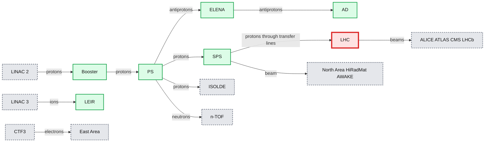
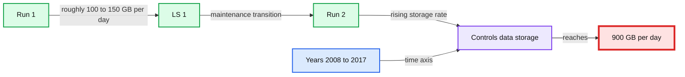

# The Architecture of the Next CERN Accelerator Logging Service

- Source: https://www.databricks.com/blog/2017/12/14/the-architecture-of-the-next-cern-accelerator-logging-service.html
- Published: 2017-12-14
- Authors: Jakub Wozniak
- Categories: solutions, engineering, open-source, data-engineering
- Images: 4 total, 3 extracted as architecture

*This is a community guest blog from [Jakub Wozniak](https://www.linkedin.com/in/jakub-wozniak-3a241b/), a software engineer and project technical lead at [CERN](https://home.cern/) physics laboratory, further expounding and complementing his [keynote at Spark Summit EU in Dublin](https://www.databricks.com/session/the-next-cern-accelerator-logging-service-a-road-to-big-data).*

[CERN](https://home.cern/) is a physics laboratory founded in 1954 focused on research, technology, and education in the domain of Fundamental Physics and Standard Model where its accelerators serve as giant microscopes and allow discovering the particularities of the basic building blocks of matter. Funded by 22 member states with approximately 2,500 employees and over 10,000 active users coming from all over the world, CERN is home to the largest and the most powerful particle accelerator in the world – the Large Hadron Collider (LHC). Up to now, it is the most complicated scientific experiment that led to the discovery of the [Higgs boson](https://home.cern/science/physics/higgs-boson) (the particle predicted by the Standard Model) in 2012 as announced by the [ATLAS and CMS experiments](https://home.cern/news/news/accelerators/atlas-and-cms-experiments-shed-light-higgs-properties).

As complex and interconnected particle accelerators, collectively they generate massive amounts of data per day. In this blog, I want to share our architecture for logging service and how we collect and process data at massive scale with [Apache Spark](https://spark.apache.org/).

But first, a bit of background on the family of CERN accelerators.

## Particle Accelerators Chain at CERN

The LHC accelerator itself consists of a 27-kilometer ring of superconducting magnets with a number of accelerating cavities to increase the energy of the particles circulating inside its rings. But CERN itself is not only the LHC. In reality, it is a complex of interconnected particle accelerators arranged in a chain with each successive machine able to further increase the energy of the particles. The beam production starts with a simple hydrogen bottle at the Linac 2, the first accelerator in the chain that accelerates protons to the energy of 50 MeV. The beams later on get injected into the Proton Synchrotron Booster where the proton bunches are formed and accelerated further to 1.4 GeV. The next accelerator in the chain is called the Proton Synchrotron which forms the final shape of the beam bunches and kicks the beam up to 25 GeV.

The particles are later sent to the Super Proton Synchrotron where they are accelerated to 450 GeV, from which they are injected using two transfer lines into two pipes of the LHC. This is where the beams go in opposite directions to be collided at the experimental sites. It takes around 25 minutes to fill the LHC with the desired particle bunches and accelerate them to their final energy of 6.5 TeV.

**Summary:** CERN’s accelerator complex shows particle sources, accelerator rings, transfer lines, collision sites, and experimental areas.

**Components:**

- LHC, 2008, 27 km. Technology not specified.
- SPS, 1976, 7 km. Technology not specified.
- PS, 1959, 628 m. Technology not specified.
- Booster, 1972, 157 m. Technology not specified.
- LEIR, 2005, 78 m. Technology not specified.
- LINAC 2. Technology not specified.
- LINAC 3. Technology not specified.
- AD, 1999, 182 m. Technology not specified.
- ELENA, 2016, 31 m. Technology not specified.
- ISOLDE, 1989. Technology not specified.
- HiRadMat, 2011. Technology not specified.
- n-TOF, 2001. Technology not specified.
- AWAKE, 2016. Technology not specified.
- ALICE, ATLAS, CMS, and LHCb experimental sites. Technology not specified.
- North Area and East Area. Technology not specified.
- CTF3. Technology not specified.

**Flows:**

- LINAC 2 -> Booster: protons.
- LINAC 3 -> LEIR: ions.
- Booster -> PS: protons.
- PS -> SPS: protons.
- PS -> ELENA: antiprotons.
- ELENA -> AD: antiprotons.
- AD -> ELENA: antiprotons.
- SPS -> LHC: protons through transfer lines.
- LHC -> ALICE: circulating beams.
- LHC -> ATLAS: circulating beams.
- LHC -> CMS: circulating beams.
- LHC -> LHCb: circulating beams.
- SPS -> North Area: beam.
- SPS -> HiRadMat: beam.
- SPS -> AWAKE: beam.
- PS -> ISOLDE: protons.
- PS -> n-TOF: neutrons.
- CTF3 -> East Area: electrons.

**Numbers:** 2008, 27 km, 1976, 7 km, 2011, 2016, 31 m, 1999, 182 m, 1972, 157 m, 1989, 1959, 628 m, 2005, 78 m, 2001, TT2, TT10, TT12, TT20, TT40, TT41, TT60, TI2, TI8, 2, 3.

source image: https://www.databricks.com/wp-content/uploads/2017/12/image2.png

The energy per proton corresponds to approximately that of a flying mosquito; however, the total accumulated energy coming from all the 116e09 protons per bunch and 2800 bunches in the beam gives an enormous energy, equivalent to that of an aircraft carrier cruising at 5 knots. Huge detectors in the experimental sites observe the collisions producing around **1PB of events per second** that is filtered to around **30-50 PB** of usable physics data per year.

## Particles’ Journey, Devices, and Data Collectors

While the LHC is surely CERN’s flagship experiment, the laboratory engineers, accelerator operators, and beam physicists work hard to deliver various types of beams to other experiments located at the smaller accelerators around the complex. Before the users (i.e. experimental physicists) can analyze the data from the collisions, an enormous effort is put to make the whole complex work in a highly synchronized and coordinated manner. The typical accelerator is composed of the multitude of devices starting from various types of magnets like dipoles used to bend the particles, the quadruples to focus them or the kickers to inject/extract beam from/to other accelerators. The acceleration of the beam is carried out using radio-frequency cavities, and precise beam diagnostics instrumentation is used to measure the characteristics of the produced particle bunches. There are also many other systems involved in the beam production like orbit feedbacks, timing, synchronization, interlocks, security, radiation protection, etc.

For high-energy accelerators like the LHC, cryogenics plays a very important role as well. All of them will of course also need vacuum, electricity, and ventilation. In order to control all of the related devices, Operations teams require Control System(s) to monitor and operate the machine. At CERN even the smallest accelerators are usually composed of thousands of devices with hundreds of different properties.

All those devices are programmed with various settings and produce a number of observable outputs. Such output values need to be presented to the operators to help them understand the current state of the machine and allow them to respond to the events that happen every second in the accelerator chain. The data can be used in a form of online monitoring or offline queries. Software applications are used for everyday operations and present the current state of the devices, alarms, failures, beam properties, etc. Offline queries are required to perform various studies on controls data that are targeted at improving machine performance, beam quality, provide new beam types, design new experiments or even future accelerators.

### Data Analytics and Storage Requirements per Day

Until now all of the acquired Controls data has been stored in a system based on two Oracle databases, which is called the “CERN Accelerator Logging Service” **(CALS)**. The system subscribes to **20,000 different devices** and logs data for some **1.5 million different signals** in total. It has around 1000 users all over CERN, which generate **5 million queries per day** (coming mainly from automated applications). CALS stores **71 billion records/day** that occupy around **2TB / day** of unfiltered data. Since this amount is quite significant for storage, heavy filtering is actively applied and 95% of data is filtered out after 3 months. That leaves the long-term storage with around **1PB** of important data stored long term since 2003.

## Limitations and Latencies of the Old System

Being a system that has been in production since a long time (development started in 2001) some design principles that looked very good a decade ago do show some signs of ageing, especially under current data loads. For instance, the Oracle DB is difficult to scale horizontally and it is not a particularly performing solution for Big Data analysis when it comes to data structures different from simple scalars. One of the biggest problems is that in order to do the analysis, one has to extract the data and this might be a lengthy process. For some analysis use cases, it is shown to take half a day to extract a days-worth of data. Moreover, the data rates are not likely to go down, or even stay constant.

The [CERN Council](https://council.web.cern.ch/en) has approved the High-Luminosity LHC (HL-LHC) project to upgrade the LHC to produce much higher luminosities (luminosity is a measure of the rate of collisions and is a figure of merit for accelerators that collide particles such as LHC). This will lead to much higher data taking frequencies from 1Hz to 100Hz, much bigger vector data and a desire for limited filtering that inevitably is linked with increased equipment testing and operational tuning during early stages of this project. Even bigger accelerators are being actively discussed like the [Future Circular Collider](https://home.cern/science/accelerators/future-circular-collider) (FCC) with a tunnel design of approximately 100km in circumference, stretching between the Jura Mountains and the Alps going under the Geneva Lake.

Future challenges aside, the current Oracle-based CALS system faced a challenging reality from the beginning of 2014 when the LHC entered into so-called “run 2” phase (see diagram below) following 2 years of planned maintenance.

In the 3 years of LHC operation that followed, the data logging rates increased from a stable flat rate of **150 GB/day** observed in “run 1” to the linear increase currently reaching **900 GB/day** stored long-term. Suddenly, the system has been confronted with a situation it was completely not prepared for.

**Summary:** The chart shows CERN controls data storage increasing from Run 1 levels to 900 GB/day during Run 2.

**Components:**

- Controls data storage
- Run 1
- LS 1
- Run 2
- GB/day axis
- Year axis

**Flows:**

- Run 1 -> LS 1: Data storage period at roughly 100 to 150 GB/day
- LS 1 -> Run 2: Transition after the maintenance period
- Run 2 -> Controls data storage: Increasing stored data rate toward 900 GB/day

**Numbers:** 0, 100, 200, 300, 400, 500, 600, 700, 800, 900, 1000, 2008, 2009, 2010, 2011, 2012, 2013, 2014, 2015, 2016, 2017, 900 GB/day, 18

source image: https://www.databricks.com/wp-content/uploads/2017/12/image1.png

## The Next Generation Scalable Big Data Architecture with Apache Spark

These problems forced the responsible team to look into the domain of Big Data solutions and a new project was started called “Next CALS” **(NXCALS).** An initial feasibility study aimed at selecting the right tools for the job at hand from the far too rich Apache Hadoop ecosystem. After 3 months of prototyping with various tools and techniques, **Apache Spark** was selected (preferred over Apache Impala and Oracle) as the best tool for **extraction and analysis** for Controls data backed up by the synergy of Apache HBase and Apache Parquet files based storage in Hadoop.

For the visualization, it was hard to neglect the emerging adoption of Python and Jupyter notebooks that was happening at CERN and other institutes involved with data science and scientific computing. This study truly set the scene, showing directions for how the Controls data could be presented to its users. The scalability of the new system relied on the CERN on-premise cloud services based on OpenStack with **250,000** cores available.

**Summary:** NXCALS routes data sources through APIs, Kafka, ETL, Hadoop storage, Spark, and client-facing tools.

**Components:**

- Datasources
- NXCALS
- API
- Kafka
- ETL
- Hadoop
- HBase
- HDFS with Avro and Parquet
- API
- Spark
- Jupyter
- Old API
- Meta-data service
- DB
- Clients
- Scientists
- Programmers
- Applications

**Flows:**

- Datasources -> API: data
- API -> Kafka: ingested data
- Kafka -> ETL: streaming data
- ETL -> Hadoop: transformed data
- Hadoop -> API: stored data access
- API -> Spark: data access
- Spark -> Jupyter: analytics output
- Spark -> Old API: compatibility access
- Jupyter -> Scientists: notebooks and results
- Spark -> Programmers: processing results
- Old API -> Applications: legacy access
- Meta-data service -> API: metadata
- Meta-data service -> Hadoop: metadata
- Meta-data service -> Old API: metadata
- Meta-data service -> DB: metadata persistence

**Numbers:** 2017, 23

```mermaid
%% NXCALS data ingestion, storage, processing, and client access
flowchart LR
    DS[Datasources] -->|data| API1[API]
    API1 -->|ingested data| K[Kafka]
    K -->|streaming data| ETL[ETL]
    ETL -->|transformed data| H[Hadoop]
    H -->|stored data access| API2[API]
    API2 -->|data access| S[Spark]
    S -->|analytics output| J[Jupyter]
    S -->|processing results| P[Programmers]
    J -->|notebooks and results| SCI[Scientists]
    S -->|compatibility access| OA[Old API]
    OA -->|legacy access| APP[Applications]
    META[Meta-data service] -->|metadata| API2
    META -->|metadata| H
    META -->|metadata| OA
    META -->|metadata persistence| DB[DB]

    %% Legend
    %% client = clients, edge, gateway, or load balancer
    %% service = stateless compute
    %% store = databases or durable storage
    %% cache = losable cache
    %% queue = Kafka, streams, or asynchronous pipes
    %% critical = bottleneck or single point of failure
    %% external = third-party
    %% decision = trade-off point

    classDef client fill:#dbeafe,stroke:#2563eb,stroke-width:2px,color:#111
    classDef service fill:#dcfce7,stroke:#16a34a,stroke-width:2px,color:#111
    classDef store fill:#ede9fe,stroke:#7c3aed,stroke-width:2px,color:#111
    classDef cache fill:#fef3c7,stroke:#d97706,stroke-width:2px,color:#111
    classDef queue fill:#cffafe,stroke:#0891b2,stroke-width:2px,color:#111
    classDef critical fill:#fee2e2,stroke:#dc2626,stroke-width:4px,color:#111
    classDef external fill:#e5e7eb,stroke:#6b7280,stroke-width:2px,color:#111,stroke-dasharray:4 3
    classDef decision fill:#fce7f3,stroke:#db2777,stroke-width:2px,color:#111

    class DS,SCI,P,APP client
    class API1,ETL,API2,S,J,OA,META service
    class H,DB store
    class K queue
```

source image: https://www.databricks.com/wp-content/uploads/2017/12/image3.png

After 18 months of development, the new NXCALS system architecture is comprised of distributed [Apache Kafka](https://kafka.apache.org/) brokers pumping the data to Hadoop and using [Apache Spark](https://spark.apache.org/) enhanced with NXCALS' DataSource API to present the data to its clients.

## Final Thoughts

A lot more is coming, the visualization is shaping its way through a new project at CERN that is called **S**ervice for **W**eb-based **A**nalysis (SWAN) based on Jupyter notebooks & Python forming a truly Unified Software Platform—something akin to [Unified Analytics Platform](https://www.databricks.com/product/data-lakehouse)—for interactive data analysis in the cloud with [Apache Spark](https://spark.apache.org/) as a first-class citizen there. The potential in this synergy is high, and the first version of NXCALS on SWAN will be available as early as Q1 2018, helping CERN scientists in their daily analysis work.

## Read More

To read more about CERN projects, I recommend the following resources:

1. Visit our [CERN Home Page](https://home.cern/)
2. [Presentation of this talk at Spark Summit EU in Dublin](https://www.databricks.com/session/the-architecture-of-the-next-cern-accelerator-logging-service)
3. [Presentation of Apache Spark Performance Troubleshooting at Scale, Challenges, Tools, and Methodologies at Spark Summit in Dublin](https://www.databricks.com/session/apache-spark-performance-troubleshooting-at-scale-challenges-tools-and-methodologies)
4. View [NXCALS code](https://gitlab.cern.ch/acc-logging-team/nxcals)
