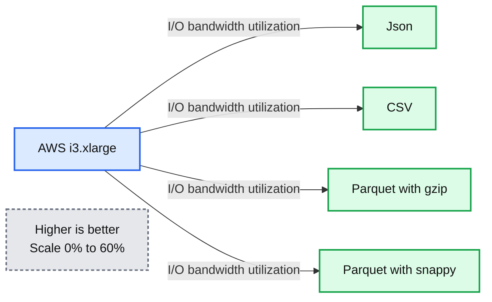
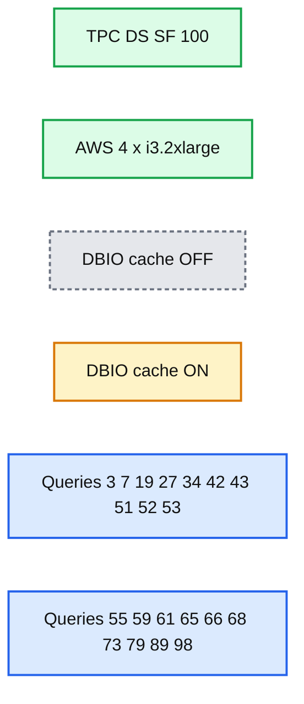
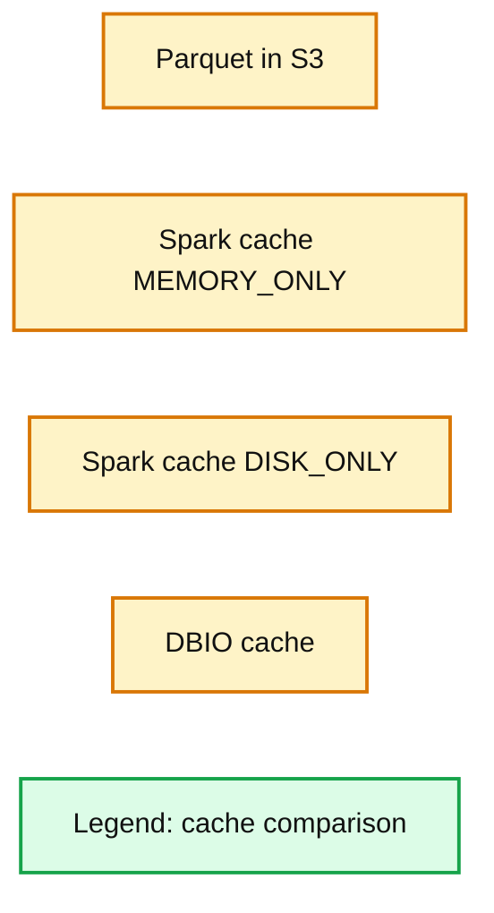

# Databricks Cache Boosts Apache Spark Performance

- Source: https://www.databricks.com/blog/2018/01/09/databricks-cache-boosts-apache-spark-performance.html
- Published: 2018-01-09
- Authors: Alicja Luszczak, Michał Szafrański, Michał Switakowski, Reynold Xin
- Categories: engineering, open-source, company
- Images: 4 total, 4 extracted as architecture

We are excited to announce the general availability of Databricks Cache, a [Databricks Runtime](https://docs.databricks.com/runtime/index.html) feature as part of the [Unified Analytics Platform](https://www.databricks.com/product/data-lakehouse) that can improve the scan speed of your Apache Spark workloads up to **10x**, without any application code change.

In this blog, we introduce the two primary focuses of this new feature: ease-of-use and performance.

1. Contrary to Spark’s explicit in-memory cache, Databricks cache automatically caches hot input data for a user and load balances across a cluster.
2. It leverages the advances in [NVMe SSD](https://en.wikipedia.org/wiki/NVM_Express) hardware with state-of-the-art columnar compression techniques and can improve interactive and reporting workloads performance by up to 10 times. What’s more, it can cache 30 times more data than Spark’s in-memory cache.

## Explicit Caching in Apache Spark

One of the key features in Spark is its explicit in-memory cache. It is a versatile tool, as it can be used to store the results of an arbitrary computation (including inputs and intermediate results), so that they can be reused multiple times. For example, the implementation of an iterative machine learning algorithm may choose to cache the featurized data and each iteration may then read the data from memory.

A particularly important and widespread use case is caching the results of scan operations. This allows the users to eliminate the low throughput associated with reading remote data. For this reason, many users who intend to run the same or similar workload repeatedly decide to invest extra development time into manually optimizing their application, by instructing Spark exactly what files to cache and when to do it, and thus “explicit caching.”

For all its utility, Spark cache also has a number of shortcomings. First, when the data is cached in the main memory, it takes up space that could be better used for other purposes during query execution, for example, for shuffles or hash tables. Second, when the data is cached on the disk, it has to be deserialized when read — a process that is too slow to adequately utilize the high read bandwidths commonly offered by the NVMe SSDs. As a result, occasionally [Spark applications](https://www.databricks.com/glossary/what-are-spark-applications) actually find their performance regressing when turning on Spark caching.

Third, having to plan ahead and explicitly declare which data should be cached is challenging for the users who want to interactively explore the data or build reports. While Spark cache gives data engineers all the knobs to tune, data scientist often find it difficult to reason about the cache, especially in a multi-tenant setting, where engineers still require the results to be returned as quickly as possible in order to keep the iteration time short.

## The Challenge with NVMe SSDs

Solid state drives, or SSDs, have become the standard storage technology. While initially known for its low random seek latency, over the past few years, SSDs have also substantially increased their read and write throughput.

The NVMe interface was created to overcome the design limitations of SATA and AHCI, and to allow unrestrained access to the excellent performance provided by the modern SSDs. This includes the ability to utilize the internal parallelism and the extremely low read latency of flash-based storage devices. NVMe’s use of multiple long command queues, as well as other enhancements, allow the drives to efficiently handle huge number of concurrent requests. This parallelism-oriented architecture perfectly complements the parallelism of modern multi-core CPUs, and data processing systems like Spark.

With the NVMe interface, the SSDs are much closer in their properties and performance to the main memory than to the slow magnetic drives. As such, they are a perfect place to store the cached data.

Yet in order to fully leverage the potential of NVMe SSDs, it is not enough to simply copy the remote data into the local storage. Our experiments with AWS i3 instances showed that while reading commonly used file formats from local SSDs, it’s only possible to utilize a fraction of available I/O bandwidth.

**Summary:** The chart compares I/O bandwidth utilization on an AWS i3.xlarge instance for four file formats.

**Components:**

- Json: JSON file format
- CSV: CSV file format
- Parquet with gzip: Parquet with gzip compression
- Parquet with snappy: Parquet with Snappy compression
- AWS i3.xlarge: AWS EC2 instance type

**Flows:**

- AWS i3.xlarge -> Json: measures I/O bandwidth utilization
- AWS i3.xlarge -> CSV: measures I/O bandwidth utilization
- AWS i3.xlarge -> Parquet with gzip: measures I/O bandwidth utilization
- AWS i3.xlarge -> Parquet with snappy: measures I/O bandwidth utilization

**Numbers:** 60%, 50%, 40%, 30%, 20%, 10%, 0%, AWS i3.xlarge

source image: https://www.databricks.com/wp-content/uploads/2018/01/image4-1.png

The above graph shows the I/O bandwidth utilization for Spark against the local NVMe SSDs on EC2 i3 instance types. As shown, none of the existing formats can saturate the I/O bandwidth. The CPU-intensive decoding is simply too slow to keep up with the fast SSDs!

## “It Just Works”

When designing Databricks Cache, we focused not only on achieving optimal read performance, but also on creating a solution which “just works,” with no added effort from the user required. The cache takes care of:

- **Choosing which data to cache** - whenever a remote file is accessed, the transcoded copy of the data is immediately placed in the cache
- **Evicting long unused data** - the cache automatically drops the least recently used entries when its allotted disk space is running out
- **Load balancing** - the cached data is distributed evenly across all the nodes in the cluster, and the placement is adjusted in case of auto-scaling and/or uneven utilization of the different nodes
- **Data security** - the data in the cache remains encrypted in the same way as other temporary files, e.g., shuffle files
- **Data updates** - the cache automatically detects when a file is added or deleted in remote location, and presents the up-to-date state of the data

Since Databricks Runtime 3.3, Databricks Cache is pre-configured and enabled by default on all clusters with AWS **i3 instance types**. Thanks to the high write throughput on this type of instances, the data can be transcoded and placed in the cache without slowing down the queries performing the initial remote read. Users who prefer to choose another type of worker nodes can enable caching using Spark configs (see the [documentation page](https://docs.databricks.com/delta/optimizations/delta-cache.html) for more details).

For the clients who would rather explicitly pre-cache all the necessary data ahead of time, we implemented [CACHE SELECT](https://docs.databricks.com/spark/latest/spark-sql/language-manual/delta-cache.html) command. It eagerly loads the chosen portion of data into the cache. Users can specify a vertical (i.e., selected columns) and a horizontal (i.e., rows required to evaluate given predicate) slice of data to be cached.

## Performance

To leverage the NVMe SSDs, rather than caching directly the “raw bytes” of the input, this new feature automatically transcodes data in a new ephemeral, on-disk caching format that is highly optimized, which offers superior decoding speed and thus better I/O bandwidth utilization. The transcoding is performed asynchronously to minimize the overhead for queries that load the data into the cache.

**Summary:** Benchmark chart comparing local-storage read speeds on an AWS i3.xlarge instance across five data formats and caching.

**Components:**

- Json
- CSV
- Parquet with gzip
- Parquet with snappy
- DBIO cache
- AWS i3.xlarge local storage

**Flows:**

- none

**Numbers:**

- 80 M values read per core per second
- 60 M values read per core per second
- 40 M values read per core per second
- 20 M values read per core per second
- 0 M values read per core per second
- AWS i3.xlarge

source image: https://www.databricks.com/wp-content/uploads/2018/01/image3.png

The enhanced reading performance (on top of the ability to avoid high latency normally associated with access to remote data) results in a substantial speed-up in a wide variety of queries. For example, for the following subset of TPC-DS queries, we see consistent improvement in every single query when compared to reading [Parquet](https://www.databricks.com/glossary/what-is-parquet) data stored in AWS S3, with as much as **5.7x** speed-up in query 53.

**Summary:** Benchmark chart comparing TPC-DS query times with DBIO cache off versus on.

**Components:**

- TPC-DS SF 100 benchmark
- AWS 4 x i3.2xlarge environment
- DBIO cache OFF
- DBIO cache ON
- Queries 3, 7, 19, 27, 34, 42, 43, 51, 52, 53, 55, 59, 61, 65, 66, 68, 73, 79, 89, 98

**Flows:**

- none

**Numbers:** 100, 4, i3.2xlarge, 25s, 20s, 15s, 10s, 5s, 0s, query 3, query 7, query 19, query 27, query 34, query 42, query 43, query 51, query 52, query 53, query 55, query 59, query 61, query 65, query 66, query 68, query 73, query 79, query 89, query 98

source image: https://www.databricks.com/wp-content/uploads/2018/01/image7.png

In some customer workloads from our private beta program, we’ve seen performance improvements of up to **10x**!

## Combining Spark Cache and the Databricks Cache

Both Spark cache and Databricks Cache can be used alongside each other without an issue. In fact, they complement each other rather well: Spark cache provides the ability to store the results of arbitrary intermediate computation, whereas Databricks Cache provides automatic, superior performance on input data.

**Summary:** Benchmark chart comparing values read per core per second for Parquet in S3, Spark cache modes, and DBIO cache.

**Components:**

- Parquet in S3 - Amazon S3 object storage
- Spark cache MEMORY_ONLY - Apache Spark memory cache
- Spark cache DISK_ONLY - Apache Spark disk cache
- DBIO cache - Databricks IO cache

**Flows:**

- none

**Numbers:** 80 M, 60 M, 40 M, 20 M, 0 M

source image: https://www.databricks.com/wp-content/uploads/2018/01/image1-1.png

In our experiments, Databricks Cache achieves **4x** faster reading speed than the Spark cache in DISK_ONLY mode. When compared with MEMORY_ONLY mode, Databricks Cache still provides **3x** speed-up, while at the same time managing to keep a small memory footprint.

## Databricks Cache Configuration

For all AWS **i3 instance types** while running Databricks Runtime **3.3+**, the cache option is enabled by default for all Parquet files, and this cache feature also works seamlessly with [Databricks Delta Lake](https://www.databricks.com/product/delta-lake-on-databricks).

To use the new cache for other Azure or AWS instance types, set the [following configuration parameters](https://docs.databricks.com/delta/optimizations/delta-cache.html) in your cluster configuration:

## Conclusion

Databricks Cache provides substantial benefits to Databricks users - both in terms of ease-of-use and query performance. It can be combined with Spark cache in a mix-and-match fashion, to use the best tool for task at hand. With the upcoming further performance enhancements and support for additional data formats, the use of Databricks Cache should become a staple for a wide variety of workloads.

In the future, we will be releasing more performance improvements as well as extend the feature to support additional file formats.

To try this new feature, choose an **i3** instance type cluster in our [Unified Analytics Platform today](https://www.databricks.com/try-databricks).
