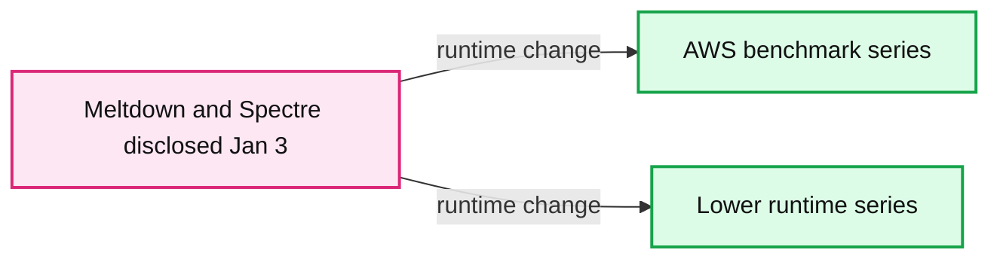
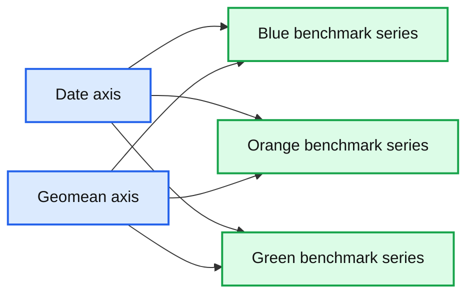
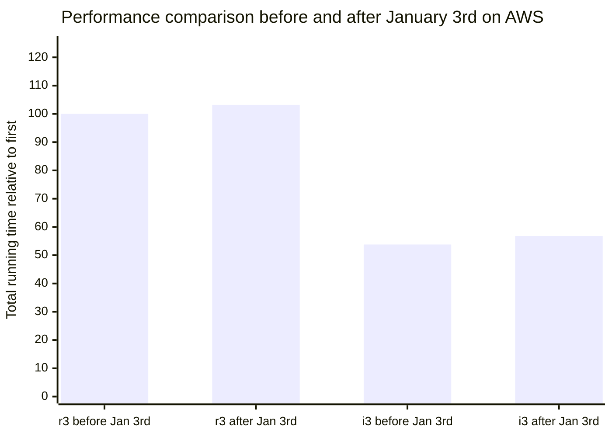

# Meltdown and Spectre's Performance Impact on Big Data Workloads in the Cloud

- Source: https://www.databricks.com/blog/2018/01/13/meltdown-and-spectre-performance-impact-on-big-data-workloads-in-the-cloud.html
- Published: 2018-01-13
- Authors: Chris Stevens, Nicolas Poggi, Thomas Desrosiers, Reynold Xin
- Categories: engineering, open-source
- Images: 5 total, 3 extracted as architecture

Last week, the details of two industry-wide security vulnerabilities, known as [Meltdown and Spectre](https://www.kb.cert.org/vuls/id/584653), were released. These exploits enable cross-VM and cross-process attacks by allowing untrusted programs to scan other programs’ memory.

On Databricks, the only place where users can execute arbitrary code is in the virtual machines that run Apache Spark clusters. There, cross-customer isolation is handled at the VM level. The cloud providers that Databricks runs on, [Azure](https://docs.microsoft.com/en-us/azure/virtual-machines/mitigate-se) and [AWS](https://aws.amazon.com/security/security-bulletins/AWS-2018-013/), have both announced that they have patched their hypervisors to prevent cross-VM attacks. Databricks depends on our cloud providers’ hypervisors to provide security isolation across VMs and the applied hypervisor updates should be sufficient to protect against the [demonstrated cross-tenant attack](https://googleprojectzero.blogspot.com/2018/01/reading-privileged-memory-with-side.html).

Aside from the security impacts, our users probably care the most about the degree of performance degradation introduced by the mitigation strategies. In our nightly performance benchmarks, we noticed some changes on January 3, when the exploits were disclosed. Our preliminary assessment is that we have observed a small degradation in AWS of 3% in most instances and up to 5% in a particular case, from the hypervisor updates.  We have not included a preliminary assessment on Azure because we do not have the historical data that we would need to feel confident regarding such an assessment.

*A snapshot of Databricks’ internal AWS performance dashboard (Y-axis is the geometric mean of runtime for some collection of workloads; different series indicate different configurations)*

**Summary:** AWS benchmark dashboard showing geometric mean runtimes across multiple configurations before and after the Meltdown and Spectre disclosure on January 3.

**Components:**

- AWS performance benchmark series using multiple configurations
- Geometric mean runtime axis
- Meltdown and Spectre disclosure marker for January 3

**Flows:**

- Meltdown and Spectre disclosure -> AWS benchmark series: observed runtime changes after disclosure

**Numbers:** 18, 20, 22, 24, 26, 28, 30, 32, 34, 36, 38; 2017-12-21; 2017-12-25; 2017-12-29; 2018-01-02; January 3

source image: https://www.databricks.com/wp-content/uploads/2018/01/image4-2.png

A snapshot of Databricks’ internal AWS performance dashboard (Y-axis is the geometric mean of runtime for some collection of workloads; different series indicate different configurations)

In this blog post, we analyze the potential performance impacts caused by the hypervisor mitigations for Meltdown and Spectre, using our nightly performance benchmarks. In a [subsequent blog post](https://www.databricks.com/blog/2018/01/16/meltdown-and-spectre-exploits-and-mitigation-strategies.html), we also provide an overview of the exploits and mitigation strategies available.

## Introduction

Big data applications are among the most resource-demanding cloud computing workloads. For some of our customers, a small slowdown in their systems might lead to millions of dollars increase in IT budget. With these exploits, the immediate question after the concern for security is this: how much will big data workloads slow down after the hypervisor mitigation patches are applied by cloud providers?

As mentioned earlier, we noticed a small spike after January 3rd on our internal performance dashboard. Spikes are occasionally caused by sources of random variability, so we had to wait until we had more data in order to draw firmer conclusions. Now that we have more data points, it has become more apparent that the hypervisor updates have performance implications on big data workloads.

The mitigation strategies for Meltdown and Spectre impact code paths that perform virtual function calls and context switches (such as thread switches, system calls, disk I/O, and network I/O interrupts).

To the best of our knowledge, no reports exist for workloads on big data systems running in the cloud, which typically exercise very different code paths from desktop or server applications. While there have been plenty of reports ranging from “[negligible impact on performance](https://security.googleblog.com/2018/01/more-details-about-mitigations-for-cpu_4.html)” to [63% slowdown in FS-Mark](https://www.phoronix.com/scan.php?page=article&item=linux-415-x86pti&num=2), the closest example we have seen is the [7% to 23% degradation of Postgres](https://www.postgresql.org/message-id/20180102222354.qikjmf7dvnjgbkxe@alap3.anarazel.de), and some of our customers worry they will observe a similar performance hit for Apache Spark.

However, even though both are data systems, Spark’s data plane (executor) looks nothing like Postgres. One of the major goals of Project Tungsten in Spark 2.0 was to eliminate as many virtual function dispatches as possible through [code generation](https://www.databricks.com/blog/2016/05/23/apache-spark-as-a-compiler-joining-a-billion-rows-per-second-on-a-laptop.html). This, has the fortunate side effect of reducing the effect of Meltdown and Spectre’s current mitigations on Spark’s execution.

Spark’s control plane (driver) triggers operations that can be impacted more by the mitigations. For example, network RPCs trigger context switches, and the control plane code tends to perform more virtual function dispatches (due to the use of object-oriented programming and functions becoming megamorphic). The good news is that the driver is only responsible for scheduling and coordination, and has in general low CPU utilization. Consequently, we expect less performance degradation in Spark than transactional database systems like Postgres.

## Methodology

Before presenting the benchmark results, we’ll first share how we conducted this analysis which leverages our nightly performance benchmarks.

**Workloads**: Our nightly benchmarks consist of hundreds of queries, including all 99 TPC-DS queries, running on two of the most popular instance types on AWS for big data workloads (r3 and i3). These queries cover different Spark use cases, ranging from interactive queries that scan small amounts of data to deep analytics queries that scan large amounts. In aggregate, they represent big data workloads in the cloud.

**Going back in time**: Part of the reason public benchmarks measuring the impact of these hypervisor fixes are so sparse is that the cloud providers applied their hypervisor changes soon after the exploits were disclosed, and there is now no way to go back in time and perform controlled experiments on unpatched machines. The most scientific measurement would require us to run the same set of workloads against an unpatched datacenter and against a patched datacenter. Absent of that, we leverage our nightly performance benchmark to analyze the degradation.

**Noise**: An additional challenge is that the cloud is inherently noisy, as are any shared resources and distributed systems. Network or storage performance might vary from time to time due to varying resource utilization. The following chart shows the runtime of a benchmark configuration last year, before any hypervisor fixes. As shown in the graph, even without any known major updates, we can see substantial variations in performance from run to run.

*Variance and spikes exist in the cloud, even without security patches*

**Summary:** The chart shows nightly benchmark geomean variation across dates, with three colored performance series and substantial run-to-run spikes.

**Components:**

- Blue benchmark series
- Orange benchmark series
- Green benchmark series
- Date axis
- Geomean axis

**Flows:**

- none

**Numbers:** 36, 38, 40, 42, 44, 46, 48, 50, 52, 54, 56, 58, 2017-12-16, 2017-12-19, 2017-12-22, 2017-12-25, 2017-12-28, 2017-12-31

source image: https://www.databricks.com/wp-content/uploads/2018/01/image2-2.png

Variance and spikes exist in the cloud, even without security patches

As a result, we need a sufficient number of runs to remove the impact of noise. Therefore we cannot use a single run, or even two runs, to conclude the performance of a configuration.

Fortunately, we do have performance benchmarks that are run nightly, and we have accumulated 7 days of data before and after January 3 (the date it appears AWS applied the patch to our systems). For each day, hundreds of queries are run in multiple cluster configurations and versions, so in aggregate we have tens of thousands of query runs.

**Isolating effect of software changes**: While these benchmarks are used primarily to track performance regressions for the purpose of software development, we also run old versions of Spark to establish performance baselines. Using these old versions, we can isolate the effect of software improvements.

We also have additional release smoke tests that exercise a more comprehensive matrix of configurations and instance types, but they are not run as frequently. We do not report numbers for those tests because we feel that do not have enough data points to establish strong conclusions.

## Degradation on Amazon Web Services

On AWS, we have observed a small performance degradation up to 5% since January 4th. On i3-series instance types, where we cache data on the local NVMe SSDs ([Databricks Cache](https://www.databricks.com/blog/2018/01/09/databricks-cache-boosts-apache-spark-performance.html)), we have observed a degradation up to 5%. On r3-series instance types, in which the benchmark jobs read data exclusively from remote storage (S3), we have observed a smaller increase of up to 3%. The greater percentage slowdown for the i3 instance type is explained by the larger number of syscalls performed when reading from the local SSD cache.

The chart below shows before and after January 3rd in AWS for a r3-series (memory optimized) and i3-series (storage optimized) based cluster.  Both tests fixed to the same runtime version and cluster size. The data represents the average of the full benchmark’s runtime per day, for a total of 7 days prior to January 3 (before is in blue) and 7 days after January 3 (after is in red). We exclude January 3rd to prevent partial results.  As mentioned, the i3-series has the [Databricks Cache](https://www.databricks.com/blog/2018/01/09/databricks-cache-boosts-apache-spark-performance.html) enabled on the local SSDs, resulting in roughly half of the total execution time (faster) compared to the r3-series results.

*Runtimes of each instance type are normalized to the runtime on the original r3 series configuration (first) reflecting data collected both 7 days before and 7 days after January 3rd.*

**Summary:** AWS r3 and i3 instance runtimes are compared before and after January 3rd, normalized to the original r3 runtime.

**Components:**

- r3 AWS instance series
- i3 AWS instance series
- Before Jan 3rd measurement series
- After Jan 3rd measurement series
- Total running time relative to first metric

**Flows:**

- none

**Numbers:** January 3rd; r3 before 100.0; r3 after 103.2; i3 before 53.8; i3 after 56.8; x-axis values 0.0, 25.0, 50.0, 75.0, 100.0, 125.0

source image: https://www.databricks.com/wp-content/uploads/2018/01/image5-1.png

Runtimes of each instance type are normalized to the runtime on the original r3 series configuration (first) reflecting data collected both 7 days before and 7 days after January 3rd.

Given the above data, one might wonder whether the difference in degradation of the i-series v.s the r-series was due to the different instance configurations (and architecture generation), or due to Databricks Cache. As we cannot go back in time to repeat the tests without the patch in the cloud, to isolate the effect of Databricks Cache, we have compared the performance of the first run of the first query on both r3 and i3, and found that the two performed comparably. That is to say, the additional degradation was due to caching. With NVMe SSD caching, the CPU utilization is much higher and Spark is processing much more data per second, and triggers much more I/O, than without the cache.  Nevertheless, the newer and storage optimized i3-series with caching on complete the same benchmark in about half the time.

## What’s Next?

While it’s difficult to be conclusive given the lack of controlled experiments, we have observed a small performance degradation (2 to 5%) from the hypervisor updates on AWS.  We expect this impact to decrease as the patch implementations improve over time.

We, however, are not done yet. The whole incident is still unfolding. The hypervisor updates applied by cloud vendors only mitigate cross-VM attacks. The industry as a whole is also working on mitigation strategies at the kernel and process level to prevent user applications from scanning memory they should not be allowed to.

Our cloud vendors’ rapid response to this problem reaffirms Databricks' core tenet that moving data processing to the cloud enables security issues to be rapidly detected, mitigated, and fixed.

Even though our [security architecture](https://www.databricks.com/product/databricks-enterprise-security-culture) does not depend on kernel or process level isolation, out of an abundance of caution we are also taking prompt steps to patch the vulnerabilities at these levels. We are performing controlled experiments on their performance impact, but we do not yet feel we have collected sufficiently data to report. We will post updates as soon as possible.
