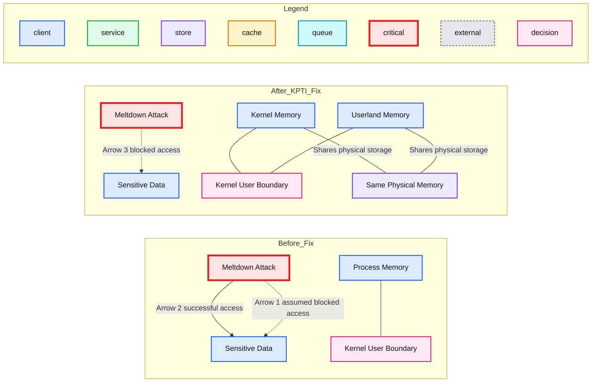
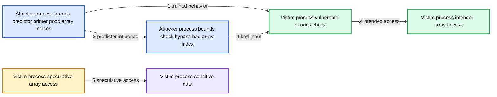

# Meltdown and Spectre: Exploits and Mitigation Strategies

- Source: https://www.databricks.com/blog/2018/01/16/meltdown-and-spectre-exploits-and-mitigation-strategies.html
- Published: 2018-01-16
- Authors: Chris Stevens, Nicolas Poggi, Thomas Desrosiers, Reynold Xin
- Categories: engineering, open-source
- Images: 5 total, 3 extracted as architecture

In an [earlier blog post](https://www.databricks.com/blog/2018/01/13/meltdown-and-spectre-performance-impact-on-big-data-workloads-in-the-cloud.html), we analyzed the performance impact of Meltdown and Spectre on big data workloads in the cloud. In this blog post, we explain these exploits, their mitigation strategies and how they impact Databricks from a security and performance perspective.

## Meltdown

Meltdown breaks a fundamental assumption in operating system security: an application running in user space cannot access kernel memory. This is important because kernel memory can contain sensitive information from another application, like a password. To enforce this access restriction, operating systems use page tables to divide virtual memory into two sections - one for the kernel and another for untrusted user mode applications. The kernel then depends on the processor to allow the more privileged kernel to access both sections while restricting user applications to the user portion.

It turns out that certain processors don’t uphold this restriction. Meltdown demonstrates that out-of-order execution can leak kernel memory into user mode long enough for it to be captured by a side-channel cache attack. That’s a mouthful, so let’s unpack that last sentence with an example:

1. Invalidate the cache for all addresses in UserModeAttackBuffer.
2. Read a byte from kernel memory into variable KernelData.
3. Read from a UserModeAttackBuffer at the offset of KernelData.

When executed by a user application, the kernel memory access in Line 2 will trigger a segmentation fault due access restrictions. Meltdown, however, shows that a processor will blindly read the kernel memory *before* evaluating any access permissions and additionally execute Line 3 before the permission check. This happens due to a performance optimization knows as out-of-order execution.

If a processor only executed code line by line, it would have to wait until Line 2, which is slow due to the memory access, completes before looking at Line 3. To avoid this, the processor assumes Line 3 will eventually need to run and starts to execute it in parallel. While it depends on the result of Line 2 to finish, it can actually do useful work while waiting, like calculating the starting address of the UserModeAttackBuffer.

With Line 3 already sitting half-executed in the processor, as soon as the KernelData is read, a race begins between Line 3 finishing and the realization that Line 2’s memory access should fault. It turns out Line 3 often wins this race and that even though the forthcoming fault erases the processor’s results from all lines executed out-of-order, it does not erase any cache effects.

Side-channel attacks exploit these leftover cache effects. The example above is open to attack because Line 3’s seemingly innocuous read of UserModeAttackBuffer created a cache entry for the UserModeAttackBuffer + KernelData address. From a different user mode application, an attacker can time how long it takes to read each address within the buffer in order to figure out which address was cached - Line 1 ensures that there is only one such address. The buffer offset of the address read the fastest reveals the value of KernelData.

Malicious code has now gained one byte of kernel memory. Repeated execution of this attack on different addresses has shown that [kernel memory is readable at speeds of 500 KB/s](https://meltdownattack.com/meltdown.pdf). This means that the sensitive data we thought was protected by the operating system can be read in a matter of hours.

Despite how scary this sounds, our customers should breathe easy. Databricks’ security architecture does not depend on this kernel/user space isolation as we never run multiple customers’ workloads on a single operating system instance. It is therefore unlikely that the currently disclosed Meltdown exploit weakens the security of our customers’ data.

### Fixing Meltdown

Even though we do not think Meltdown is a threat to Databricks due to our architecture, there are now readily available fixes for Meltdown and we are actively updating our systems. The Linux patch is known as kernel page-table isolation (KPTI). We briefly explain KPTI here and how it may impact Databricks performance.

**Summary:** The diagram shows how Meltdown accesses sensitive kernel data before KPTI and how separating kernel and userland page tables prevents the attack.

**Components:**

- Process Memory: shared kernel and user memory address space before KPTI
- Kernel Memory: isolated kernel page table after KPTI
- Userland Memory: userland page table after KPTI
- Sensitive Data: protected kernel data
- Meltdown Attack: user mode attack attempting to read sensitive data
- Same Physical Memory: shared underlying physical memory
- Kernel User Boundary: privilege boundary between kernel and user modes

**Flows:**

- Meltdown Attack -> Sensitive Data: arrow 1 shows the assumed blocked access before Meltdown
- Meltdown Attack -> Sensitive Data: arrow 2 shows the successful speculative access
- Meltdown Attack -> Sensitive Data: arrow 3 shows the blocked access after KPTI

**Numbers:** 1, 2, 3



<sub>source image: https://www.databricks.com/wp-content/uploads/2018/01/image1-2.png</sub>

***Figure 1:** Before Meltdown, it was assumed that user mode code could not access sensitive kernel data (arrow 1), but this turns out not to be true (arrow 2). The KPTI fix does not include kernel data in the page tables used by user mode, preventing the Meltdown attack (arrow 3).*

To stop Meltdown, KPTI restores our fundamental security assumption about kernel/user memory isolation. It gives each application two sets of pages tables rather than one and switches between them on every kernel-to-user and user-to-kernel transition. The set of page tables in place during user mode execution no longer includes mappings for kernel data. This protects against the Meltdown exploit because when the malicious user mode code executes Line 2 in the example above, the page tables in the processor no longer have a mapping for the kernel memory address. This prevents the processor from blindly reading anything sensitive before faulting.

The potential performance impact comes from two additional page table swaps on every system call, interrupt, and exception. Even though this only amounts to a few extra instructions per transition, these instructions clear the translation lookaside buffer (TLB), which can have a noticeable impact on performance. The TLB is a cache that stores virtual address to physical address pairs. When a virtual memory access is made, the processor converts the request’s virtual address into a physical address and retrieves the data from RAM. This conversion is fast if the virtual address is stored in the TLB (~1 CPU clock cycle), but slow if it’s not and the processor is forced to walk the page tables to find the physical address (~10-100 clock cycles). That’s a 10-100x slow down per TLB miss!

The TLB used to be preserved across system calls, but now it’s cleared of all entries. This may have a noticeable performance impact on system call intensive applications. In the context of big data, we will likely observe small slowdowns from these new context switches, which will happen on operations that trigger network or disk I/O.

Alas, it’s not all doom and gloom for KPTI. Newer processors actually have a Process-Context Identifiers (PCIDs) feature that uniquely associates each TLB entry with a set of page tables. When enabled, page table swaps don’t clear the TLB, reducing the performance impact of KPTI while still maintaining the security it provides.

## Spectre

Spectre is a class of exploits, of which two have been discovered, where an attacking application primes a branch predictor cache in order to cause a victim application to speculatively execute a malicious code path. Speculative execution is a special type of out-of-order execution making Spectre similar to Meltdown. The malicious code path’s execution gets rolled back, but it leaves metadata behind in a cache open to a possible side-channel attack. Let’s take a deeper look at both Spectre exploits individually.

### Bounds Check Bypass

This version of Spectre takes advantage of array accesses being speculatively executed despite a prior index out of bounds check. In some sense, this breaks another fundamental assumption made by software engineers: code protected by a conditional statement should only be executed if the condition is true. Let’s look at an example:

1. If Array1Index is less than Array1Length, then:
  1. Read the value from Array1 at offset Array1Index into Array2Index
  2. Read the value from Array2 at offset Array2Index

The expectation is that Lines 1a and 1b only execute if Array1Index is less than Array1Length, but Spectre proves that this is not always the case. Hoping to do some useful work while waiting for Line 1 to check the condition, the processor guesses what to do next. This guess is based on Line 1’s recent history, so if it has more recently been true, the processor will speculatively execute Lines 1a and 1b out-of-order.

To exploit this vulnerable code, attackers must find it in a victim application that they can continuously invoke from their own application with different Array1Index values. If such a setup is found, the attacker can train the branch predictor by repeatedly supplying the victim Array1Index values that are less than Array1Length. This convinces the processor that the next supplied index will also be less, causing it to speculatively execute Lines 1a and 1b before completing the bounds check no matter the Array1Index value supplied.

The attacker then invokes the victim application with an array index greater than the array length. What happens in lines 1a and 1b now? The first reads beyond the bounds of Array1, freely grabbing data from any location in the victim’s address space. The second uses the read value to affect the cache, just like in the Meltdown attack. This opens a side-channel for the attacking application to determine what was read from the victim’s memory by examining the cache.

**Summary:** The diagram shows how a Spectre bounds-check bypass trains a CPU branch predictor to access sensitive victim data speculatively.

**Components:**

- Attacker process using a branch predictor primer with good array indices
- Attacker process using a bounds check bypass with a bad array index
- Victim process containing sensitive data
- Victim process intended array access
- Victim process vulnerable bounds check
- Victim process speculative array access

**Flows:**

- Attacker branch predictor primer -> Victim vulnerable bounds check: trained branch prediction behavior
- Victim vulnerable bounds check -> Victim intended array access: valid input follows the intended path
- Attacker branch predictor primer -> Attacker bounds check bypass: influences future branch predictor behavior
- Attacker bounds check bypass -> Victim vulnerable bounds check: bad array index
- Victim speculative array access -> Victim sensitive data: speculative out of bounds access

**Numbers:** 1, 2, 3, 4, 5



<sub>source image: https://www.databricks.com/wp-content/uploads/2018/01/image2-3.png</sub>

***Figure 2:** The attacker repeatedly provides well-behaved input to the victim (arrow 1). This only accesses the intended array (arrow 2), but it influences future behavior of the branch predictor (arrow 3). When the attacker provides bad input (arrow 4), it uses the trained behavior of the branch predictor (arrow 3) in order to access sensitive data (arrow 5).*

### Bounds Check Bypass Mitigation

The bad news is that there is no blanket fix for the Spectre bounds check bypass. The good news is that the attack surface against Databricks is small in practice. Each of our customer’s workloads run on different virtual machines, preventing one malicious customer’s Apache Spark job from directly invoking that of another customer and stealing sensitive data.

The only way the bounds check bypass exploit could affect a customer is if a malicious VM directly attacked the hypervisor on which the customer’s VM was also running. This, of course, requires the attacker to find a vulnerable code path in the hypervisor. Luckily, vulnerable code paths like this with the perfect recipe of a bounds check followed by two array accesses are uncommon. Intel statically analyzed Linux and only found a handful of them. For those that have been discovered, there is a solution. A special instruction - *LFENCE* - can be inserted after the bounds check to stop speculative execution until the check completes. We’re confident that the hypervisor communities are working hard to identify and patch such vulnerabilities. None have been reported to date.

As a result of these code paths being so rare, the performance impact of any *LFENCE* usage on Databricks workloads is likely to be negligible.

### Branch Target Injection

This flavor of Spectre exploits speculative execution triggered by the indirect branch predictor. An indirect branch is a software instruction that can jump to more than one possible location - function tables and virtual functions are good examples. The research shows that an attacker can cause these jumps to land at a location of his or her choosing. For Databricks customers, the risk is that this can be used to read one VM’s private data from another VM by attacking the hypervisor they are both running on. Fortunately, the hypervisor patch discussed in the next section mitigates this risk.

But before we discuss the patch, let’s discuss an example of the exploit. Here’s simplified, hypothetical code for a guest VM and a hypervisor. Imagine a hypercall that looks like this:

1. Save an argument from the guest VM to GuestArgument
2. Read the address of a line from function table Y and jump to it.

...

1. Read Array1 at offset GuestArgument and save it in Array2Index
2. Read Array2 at offset Array2Index

 

And guest VM code like this:

1. Store the address of Line 5 in function table X
2. Read the address of a line from function table X and jump to it.

...

1.   Jump back to line 1.

Once the guest VM code is run repeatedly, the indirect branch predictor cache will assume that it should jump to Line 5 from Line 2. With the predictor primed, the guest VM invokes the hypervisor code, passing in a GuestArgument of its choosing. While the processor is busy reading from function table Y at Line 2, its maliciously primed branch predictor causes the speculative execution of Lines 5 and 6 (these should look familiar by now).

Hold on. The branch predictor cache was primed to jump from Guest Line 2 to Guest Line 5, not Hypervisor Line 2 to Hypervisor Line 5. Doesn’t that matter? The short answer is no. The branch predictor has a limited amount of space so it aliases similar lines into the same slot. The attacking guest only needs to run its priming code from an address that shares the same cache slot as Hypervisor Line 2. The [Google Project Zero blog post](https://googleprojectzero.blogspot.com/2018/01/reading-privileged-memory-with-side.html) discusses at length how an attacker can find such an address.

Pulling all of this together, branch target injection combined with a side channel attack can read all of the memory available to the hypervisor.

**Summary:** The diagram shows branch target injection training an indirect branch predictor in an attacker VM, causing a hypervisor hypercall to execute an injected branch that accesses victim data through a side channel.

**Components:**

- Attacker VM
- Fake Hypercall
- Exploit Start
- Intended Branch
- Injected Branch
- Hypervisor
- Hypercall
- Victim VM
- Sensitive Data
- Victim Data
- Side channel
- Branch predictor
- Speculative execution

**Flows:**

- Exploit Start -> Hypercall: invokes the real hypercall
- Fake Hypercall -> Intended Branch: arrow A, intended prediction training path
- Fake Hypercall -> Injected Branch: arrow B, predictor training with the injected target
- Hypercall -> Intended Branch: arrow A prime, programmed destination
- Hypercall -> Injected Branch: arrow B prime, mispredicted destination
- Victim VM -> Victim Data: exposes sensitive data through speculative execution
- Injected Branch -> Victim Data: accesses victim data
- Victim Data -> Attacker VM: leaks information through a side channel

**Numbers:** none

```text
%% mermaid failed to render; kept as text
%% Branch target injection from an attacker VM through a hypervisor to victim data
flowchart LR
    ES[Exploit Start] -->|invokes real hypercall| HC[Hypercall]
    FH[Fake Hypercall] -->|A intended path| IB[ intended branch]
    FH -->|B injected prediction| JB[Injected Branch]
    HC -->|A prime programmed path| IB
    HC -->|B prime mispredicted path| JB
    VM[Victim VM] -->|contains| SD[Sensitive Data]
    JB -->|accesses through speculative execution| VD[Victim Data]
    SD -->|side channel leakage| VD

    classDef client fill:#dbeafe,stroke:#2563eb,stroke-width:2px,color:#111
    classDef service fill:#dcfce7,stroke:#16a34a,stroke-width:2px,color:#111
    classDef store fill:#ede9fe,stroke:#7c3aed,stroke-width:2px,color:#111
    classDef cache fill:#fef3c7,stroke:#d97706,stroke-width:2px,color:#111
    classDef queue fill:#cffafe,stroke:#0891b2,stroke-width:2px,color:#111
    classDef critical fill:#fee2e2,stroke:#dc2626,stroke-width:4px,color:#111
    classDef external fill:#e5e7eb,stroke:#6b7280,stroke-width:2px,color:#111,stroke-dasharray:4 3
    classDef decision fill:#fce7f3,stroke:#db2777,stroke-width:2px,color:#111
    client = clients edge gateway LB
    service = stateless compute
    store = databases durable storage
    cache = Redis CDN or anything losable
    queue = Kafka streams or async pipes
    critical = bottleneck or SPOF
    external = third party
    decision = trade off point

    class ES,FH,HC client
    class IB service
    class JB,VD critical
    class VM external
    class SD store
```

<sub>source image: https://www.databricks.com/wp-content/uploads/2018/01/image3-1.png</sub>

***Figure 3:** The attacking code trains the processor’s indirect branch predictor in its own context with a fake hypercall that only takes the injected branch (arrow B). It then invokes the real hypercall that is programmed to go to the intended branch (arrow A’), but instead takes the injected branch (arrow B’) which allows it to access the victim’s data via a side-channel attack.*

### Fixing Branch Target Injection

There are currently two techniques to help protect against Spectre’s indirect branch target injections. The first is a set of microcode updates from Intel that enable software to manage the branch predictor state. The second is a compiler technique to prevent indirect branches from being influenced by the branch predictor.

The Xen hypervisor used by AWS has implemented a patch that uses Intel’s microcode updates. The patch mainly works by adding indirect branch prediction barriers (IBPB) to all hypervisor entry points. These barriers ensure that previously executed guest code cannot affect the branch decisions of the hypervisor code that follows it. As a result, the hypervisor will not speculatively execute exploitable code. This change prevents the hypervisor attack discussed in the previous section, protecting our customers’ VMs from data leaks.

The compiler mitigation implemented by both LLVM and GCC is known as a *return trampoline* or “[retpoline](https://support.google.com/faqs/answer/7625886)”. In essence, rather than using a jump instruction for indirect branches, it pushes the branch target address onto the stack and calls return. The difference is that return branches make use of a special predictor cache - the return stack buffer (RSB) - whose state can be easily modified right before the return in order to nullify any malicious priming done by an attacker.

These two mitigations affect performance in the same way. For the most part, they make it as if the patched code were running without indirect branch prediction, meaning that the processor has to wait until the true branch target address is read from memory until it can proceed with any useful work. If the branch target is in main memory, that could be up to 100 nanoseconds of halted execution. How many of these halts occur depends on the number of hypercalls guest VMs make.

### What’s Next?

The discoveries of Meltdown and Spectre open up a whole new area of exploit research and mitigation development that the security industry is only beginning to fully understand. While only three exploits were initially demonstrated, this is now an area of very active research. It is likely the current situation will continue to change in the coming weeks and months. We’ll continue to monitor the situation as events unfold.

If you are interested in some of the performance impacts these mitigations may cause to large scale data systems, read our [earlier blog post](https://www.databricks.com/blog/2018/01/13/meltdown-and-spectre-performance-impact-on-big-data-workloads-in-the-cloud.html).
