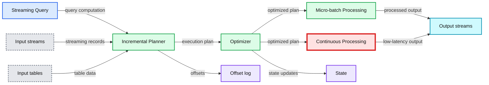
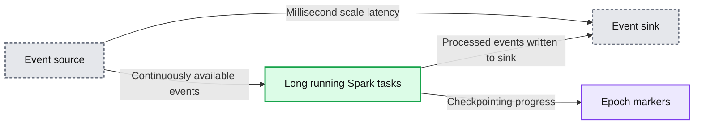
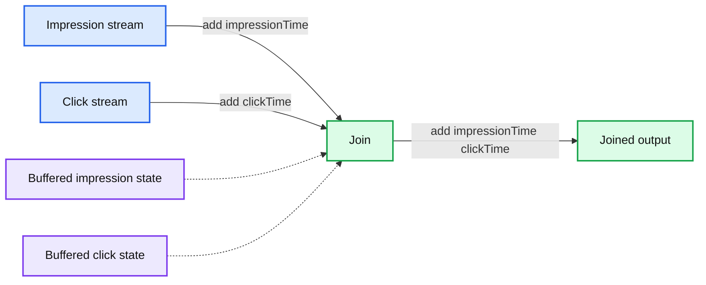
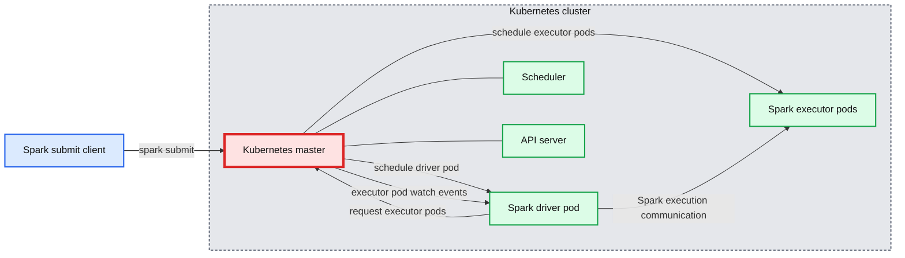
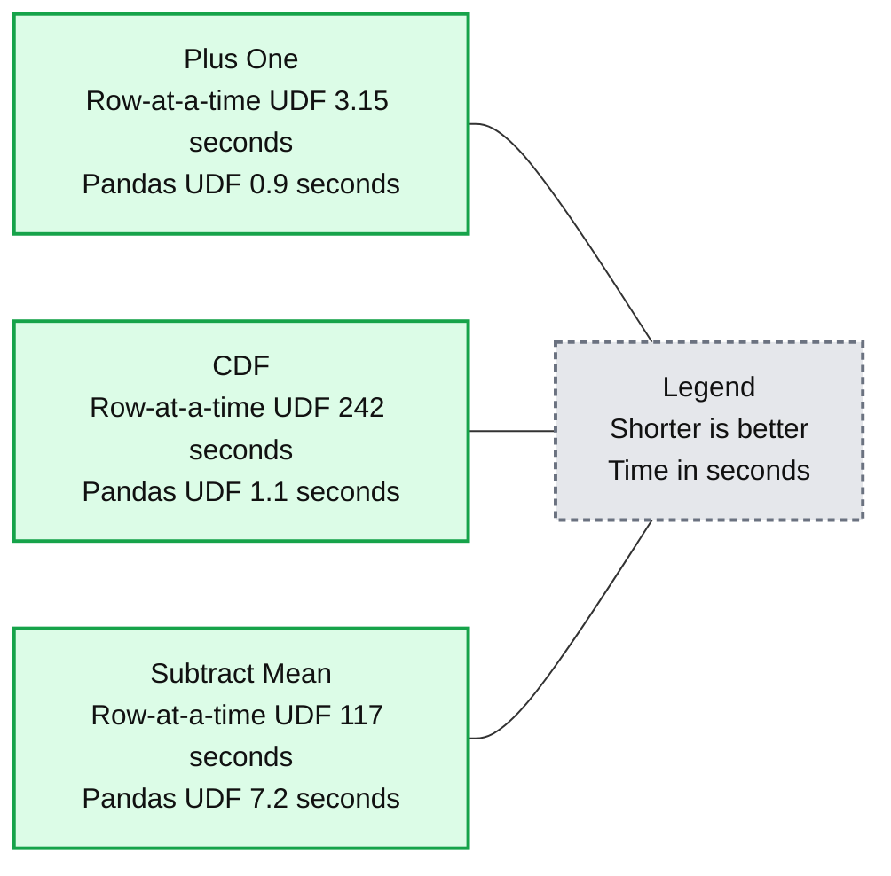

# Introducing Apache Spark 2.3

- Source: https://www.databricks.com/blog/2018/02/28/introducing-apache-spark-2-3.html
- Published: 2018-02-28
- Authors: Sameer Agarwal, Xiao Li, Reynold Xin, Jules Damji
- Categories: engineering, open-source, data-science-machine-learning, data-engineering
- Images: 7 total, 6 extracted as architecture

Today we are happy to announce the availability of [Apache Spark 2.3.0](https://spark.apache.org/news/spark-2-3-0-released.html) on Databricks as part of its [Databricks Runtime](https://docs.databricks.com/runtime/index.html) 4.0. We want to thank the Apache Spark community for all their valuable contributions to Spark 2.3 release.

Continuing with the objectives to make Spark faster, easier, and smarter, Spark 2.3 marks a major milestone for Structured Streaming by introducing low-latency continuous processing and stream-to-stream joins; boosts PySpark by improving performance with pandas UDFs; and runs on Kubernetes clusters by providing native support for Apache Spark applications.

In addition to extending new functionality to SparkR, Python, MLlib, and GraphX, the release focuses on usability, stability, and refinement, resolving over 1400 tickets. Other salient features from Spark contributors include:

- DataSource v2 APIs [[SPARK-15689](https://issues.apache.org/jira/browse/SPARK-15689), [SPARK-20928](https://issues.apache.org/jira/browse/SPARK-20928)]
- Vectorized ORC reader [[SPARK-16060](https://issues.apache.org/jira/browse/SPARK-16060)]
- Spark History Server v2 with K-V store [[SPARK-18085](https://issues.apache.org/jira/browse/SPARK-18085)]
- Machine Learning Pipeline API model scoring with Structured Streaming [[SPARK-13030](https://issues.apache.org/jira/browse/SPARK-13030), [SPARK-22346](https://issues.apache.org/jira/browse/SPARK-22346), [SPARK-23037](https://issues.apache.org/jira/browse/SPARK-23037)]
- MLlib Enhancements Highlights [[SPARK-21866](https://issues.apache.org/jira/browse/SPARK-21866), [SPARK-3181](https://issues.apache.org/jira/browse/SPARK-3181), [SPARK-21087](https://issues.apache.org/jira/browse/SPARK-21087), [SPARK-20199](https://issues.apache.org/jira/browse/SPARK-20199)]
- Spark SQL Enhancements [[SPARK-21485](https://issues.apache.org/jira/browse/SPARK-21485), [SPARK-21975](https://issues.apache.org/jira/browse/SPARK-21975), [SPARK-20331](https://issues.apache.org/jira/browse/SPARK-20331), [SPARK-22510](https://issues.apache.org/jira/browse/SPARK-22510), [SPARK-20236](https://issues.apache.org/jira/browse/SPARK-20236)]

In this blog post, we briefly summarize some of the high-level features and improvements, and in the coming days, we will publish in-depth blogs for these features. For a comprehensive list of major features across all Spark components and JIRAs resolved, read the [Apache Spark 2.3.0 release notes](https://spark.apache.org/releases/spark-release-2-3-0.html).

## Continuous Stream Processing at Millisecond Latencies

[Structured Streaming](https://www.databricks.com/blog/2016/07/28/structured-streaming-in-apache-spark.html) in Apache Spark 2.0 decoupled micro-batch processing from its high-level APIs for a couple of reasons. First, it made developer’s experience with the APIs simpler: the APIs did not have to account for micro-batches. Second, it allowed developers to treat a stream as an infinite table to which they could issue queries as they would a static table.

However, to provide developers with different modes of stream processing, we introduce a new ***millisecond low-latency*** mode of streaming: ***continuous mode***.

Under the hood, the structured streaming engine incrementally executed query computations in micro-batches, dictated by a trigger interval, with tolerable latencies suitable for most real-world streaming applications.

**Summary:** Structured Streaming transforms input streams and tables through an incremental planner and optimizer into micro-batch or continuous processing, while persisting offsets and state and producing output streams.

**Components:**

- Streaming Query using DataFrame, Datasets, and SQL
- Input streams
- Input tables
- Incremental Planner
- Optimizer
- Micro-batch Processing
- Continuous Processing
- Offset log
- State
- Output streams

**Flows:**

- Streaming Query -> Incremental Planner: streaming query computation
- Input streams -> Incremental Planner: streaming records
- Input tables -> Incremental Planner: table data
- Incremental Planner -> Optimizer: incremental execution plan
- Optimizer -> Micro-batch Processing: optimized plan
- Optimizer -> Continuous Processing: optimized plan
- Micro-batch Processing -> Output streams: processed output
- Continuous Processing -> Output streams: low-latency processed output
- Incremental Planner -> Offset log: offsets
- Optimizer -> State: processing state

**Numbers:** 30 seconds

source image: https://www.databricks.com/wp-content/uploads/2018/02/image7.png

For *continuous mode*, instead of micro-batch execution, the streaming readers continuously poll source and process data rather than read a batch of data at a specified trigger interval. By continuously polling the sources and processing data, new records are processed immediately upon arrival, as shown in the timeline figure below, reducing latencies to ***milliseconds*** and satisfying low-level latency requirements.

**Summary:** The diagram shows Spark continuous processing, where events are processed from source to sink with millisecond-scale end-to-end latency and epoch markers for checkpointing.

**Components:**

- Event source - unspecified streaming source
- Long-running Spark tasks - Apache Spark continuous processing
- Event sink - unspecified output sink
- Epoch markers - checkpointing progress

**Flows:**

- Event source -> Long-running Spark tasks: continuously available events
- Long-running Spark tasks -> Event sink: processed events written to the sink
- Long-running Spark tasks -> Epoch markers: checkpointing progress
- Event source -> Event sink: millisecond-scale end-to-end latency

**Numbers:** milliseconds

source image: https://www.databricks.com/wp-content/uploads/2018/02/image2.png

As for operations, it currently supports map-like Dataset operations such as projections or selections and SQL functions, with the exception of `current_timestamp()`, `current_date()` and aggregate functions. As well as supporting Apache Kafka as a source and sink, *continuous mode* currently supports console and memory as sinks, too.

Now developers can elect either mode—continuous or micro-batching—depending on their latency requirements to build real-time streaming applications at scale while benefiting from the fault-tolerance and reliability guarantees that Structured Streaming engine affords.

In short, the *continuous mode* in Spark 2.3 is experimental and it offers the following:

- end-to-end millisecond low latencies
- provides at-least-once guarantees.
- supports map-like Dataset operations

In this technical blog on [Continuous Processing](https://www.databricks.com/blog/2018/03/20/low-latency-continuous-processing-mode-in-structured-streaming-in-apache-spark-2-3-0.html) mode, we illustrate how to use it, its merits, and
 how developers can write continuous streaming applications with millisecond low-latency requirements.

## Stream-to-Stream Joins

While Structured Streaming in Spark 2.0 has supported joins between a streaming DataFrame/Dataset and a static one, this release introduces the much awaited stream-to-stream joins, both inner and outer joins for numerous real-time use cases.

The canonical use case of joining two streams is that of ad-monetization. For instance, an impression stream and an ad-click stream share a common key (say, *adId*) and relevant data on which you wish to conduct streaming analytics, such as, which *adId* led to a click.

**Summary:** Stream-stream join combines ad impressions and clicks by ad identifier to produce matched events.

**Components:**

- Impression stream with add and impressionTime, technology not specified
- Click stream with add and clickTime, technology not specified
- Join component, technology not specified
- Buffered impression state, technology not specified
- Buffered click state, technology not specified
- Joined output with add, impressionTime, and clickTime

**Flows:**

- Impression stream -> Join: add and impressionTime events
- Click stream -> Join: add and clickTime events
- Join -> Joined output: matched add, impressionTime, and clickTime events

**Numbers:** none

source image: https://www.databricks.com/wp-content/uploads/2018/02/image5.png

While conceptually the idea is simple, stream-to-stream joins resolve a few technical challenges. For example, they:

- handle delayed data by buffering late events as streaming “state” until matching event is found from the other stream
- limit the buffer from growing and consuming memory with watermarking, which allows tracking of event-time and accordingly clearing of old state
- allow a user to control the tradeoff between the resources consumed by state and the maximum delay handled by the query
- maintain consistent SQL join semantics between static joins and streaming joins

In this [technical blog](https://www.databricks.com/blog/2018/03/13/introducing-stream-stream-joins-in-apache-spark-2-3.html), we dive deeper into streams-to-stream joins.

## Apache Spark and Kubernetes

No surprise that two popular open source projects [Apache Spark](https://spark.apache.org) and [Kubernetes](https://kubernetes.io/) combine their functionality and utility to provide distributed data processing and [orchestration](https://www.databricks.com/glossary/orchestration) at scale. In Spark 2.3, users can launch Spark workloads natively on a Kubernetes cluster leveraging the new Kubernetes scheduler backend. This helps achieve better resource utilization and multi-tenancy by enabling Spark workloads to share Kubernetes clusters with other types of workloads.

**Summary:** Apache Spark 2.3 is shown as Spark Core supporting higher-level components and multiple cluster deployment options, including Kubernetes.

**Components:**

- Spark SQL + DataFrames
- Structured Streaming
- MLlib, machine learning
- GraphX, graph computation
- Spark Core
- Standalone
- YARN
- Mesos
- Kubernetes
- Apache Spark meets Kubernetes

**Flows:**

- none

**Numbers:** none

source image: https://www.databricks.com/wp-content/uploads/2018/02/image3.png

```mermaid
%% Shows Apache Spark components, core, and cluster deployment options
flowchart TD
    SQL[Spark SQL + DataFrames]
    Streaming[Structured Streaming]
    MLlib[MLlib<br/>Machine Learning]
    GraphX[GraphX<br/>Graph Computation]
    Core[Spark Core]
    Standalone[Standalone]
    YARN[YARN]
    Mesos[Mesos]
    Kubernetes[Kubernetes]
    Title[Apache Spark meets Kubernetes]

    class SQL,Streaming,MLlib,GraphX external
    class Core client
    class Standalone,YARN,Mesos,Kubernetes service
    class Title critical

    classDef client fill:#dbeafe,stroke:#2563eb,stroke-width:2px,color:#111
    classDef service fill:#dcfce7,stroke:#16a34a,stroke-width:2px,color:#111
    classDef store fill:#ede9fe,stroke:#7c3aed,stroke-width:2px,color:#111
    classDef cache fill:#fef3c7,stroke:#d97706,stroke-width:2px,color:#111
    classDef queue fill:#cffafe,stroke:#0891b2,stroke-width:2px,color:#111
    classDef critical fill:#fee2e2,stroke:#dc2626,stroke-width:4px,color:#111
    classDef external fill:#e5e7eb,stroke:#6b7280,stroke-width:2px,color:#111,stroke-dasharray:4 3
    classDef decision fill:#fce7f3,stroke:#db2777,stroke-width:2px,color:#111
```

Also, Spark can employ all the administrative features such as [Resource Quotas](https://kubernetes.io/docs/concepts/policy/resource-quotas/), [Pluggable Authorization](https://kubernetes.io/docs/reference/access-authn-authz/authorization/), and [Logging](https://kubernetes.io/docs/concepts/cluster-administration/logging/). What’s more, it’s as simple as creating a docker image and setting up the RBAC to start employing your existing Kubernetes cluster for your Spark workloads.

**Summary:** The diagram shows Apache Spark running natively in a Kubernetes cluster, with Kubernetes scheduling a Spark driver pod and executor pods.

**Components:**

- Kubernetes cluster
- Kubernetes master
- Scheduler
- API server
- Spark driver pod
- Spark executor pods
- Spark submit client

**Flows:**

- Spark submit client -> Kubernetes master: submits Spark application
- Kubernetes master -> Spark driver pod: schedules driver pod
- Spark driver pod -> Kubernetes master: requests executor pods
- Kubernetes master -> Spark executor pods: schedules executor pods
- Kubernetes master -> Spark driver pod: sends executor pod watch events
- Spark driver pod -> Spark executor pods: communicates with executors

**Numbers:** none

source image: https://www.databricks.com/wp-content/uploads/2018/02/image6.png

This [technical blog](https://www.databricks.com/blog/2018/03/06/apache-spark-2-3-with-native-kubernetes-support.html) explains how you can use Spark natively with Kubernetes and how to get involved in this community endeavor.

## Pandas UDFs for PySpark

Pandas UDFs, also called Vectorized UDFs, is a major boost to PySpark performance. Built on top of [Apache Arrow](https://arrow.apache.org/), they afford you the best of both worlds—the ability to define low-overhead, high-performance UDFs and write entirely in Python.

In Spark 2.3, there are two types of Pandas UDFs: scalar and grouped map. Both are now available in Spark 2.3. Li Jin of Two Sigma had penned an [earlier blog](https://www.databricks.com/blog/2017/10/30/introducing-vectorized-udfs-for-pyspark.html), explaining their usage through four examples: Plus One, Cumulative Probability, Subtract Mean, Ordinary Least Squares Linear Regression.

Running some micro benchmarks, Pandas UDFs demonstrate orders of magnitude better performance than row-at-time UDFs.

**Summary:** Performance comparison of row-at-a-time UDFs and Pandas UDFs across three benchmark operations, measured in seconds.

**Components:**

- Plus One benchmark using row-at-a-time UDF and Pandas UDF
- CDF benchmark using row-at-a-time UDF and Pandas UDF
- Subtract Mean benchmark using row-at-a-time UDF and Pandas UDF
- Time measurement in seconds

**Flows:**

- Plus One -> Row-at-a-time UDF: 3.15 seconds
- Plus One -> Pandas UDF: 0.9 seconds
- CDF -> Row-at-a-time UDF: 242 seconds
- CDF -> Pandas UDF: 1.1 seconds
- Subtract Mean -> Row-at-a-time UDF: 117 seconds
- Subtract Mean -> Pandas UDF: 7.2 seconds

**Numbers:** 300, 250, 200, 150, 100, 50, 0, 3.15, 0.9, 242, 1.1, 117, 7.2; unit: seconds

source image: https://www.databricks.com/wp-content/uploads/2018/02/image1.png

According to Li Jin and other contributors, they plan to introduce support for Pandas UDFs in aggregations and window functions, and its related work can be tracked in [SPARK-22216](https://issues.apache.org/jira/browse/SPARK-22216).

## MLlib Improvements

Spark 2.3 includes many MLlib improvements for algorithms and features, performance and scalability, and usability. We mention three highlights.

First, for moving MLlib models and Pipelines to production, fitted models and Pipelines now work within Structured Streaming jobs. Some existing Pipelines will require modifications to make predictions in streaming jobs, so look for upcoming blog posts on migration tips.

Second, to enable many Deep Learning image analysis use cases, Spark 2.3 introduces an ImageSchema [[SPARK-21866]](https://issues.apache.org/jira/browse/SPARK-21866) for representing images in Spark DataFrames, plus utilities for loading images from common formats.

And finally, for developers, Spark 2.3 introduces improved APIs in Python for writing custom algorithms, including a `UnaryTransformer` for writing simple custom feature transformers and utilities for automating ML persistence for saving and loading algorithms. See this [blog post](https://www.databricks.com/blog/2017/08/30/developing-custom-machine-learning-algorithms-in-pyspark.html) for details.

## What's Next?

Once again, we want to thank all the contributions from the Spark community!

While this blog post only summarized some of the salient features in this release, you can read the official [release notes](https://spark.apache.org/releases/spark-release-2-3-0.html) to see the complete list of changes. Stay tuned as we will be publishing technical blogs explaining some of these features.

If you want to try Apache Spark 2.3 in Databricks Runtime 4.0. Sign up for a free [trial account here](https://www.databricks.com/try-databricks)
