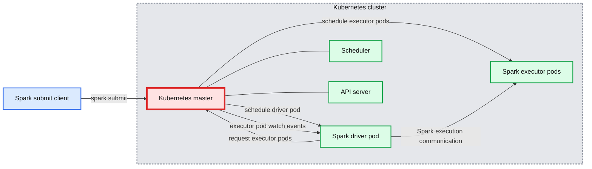

# Apache Spark 2.3 with Native Kubernetes Support

- Source: https://www.databricks.com/blog/2018/03/06/apache-spark-2-3-with-native-kubernetes-support.html
- Published: 2018-03-06
- Authors: Anirudh Ramanathan, Palak Bhatia
- Categories: solutions, engineering, open-source
- Images: 1 total, 1 extracted as architecture

*This is a community blog from [Anirudh Ramanathan](https://www.linkedin.com/in/anirudhrx/) and [Palak Bhatia](https://www.linkedin.com/in/palakdalal/), software engineer and product manager respectively at Google, working in the Kubernetes team. They are part of the group of companies that contributed to native Kubernetes support for the Apache Spark 2.3. This post is cross-posted on [blog.kubernetes.io](https://kubernetes.io/blog/)*

## Kubernetes and Big Data

The open source community has been working over the past year to enable first-class support for data processing, data analytics and machine learning workloads in [Kubernetes](https://kubernetes.io/). New extensibility features in Kubernetes, such as [custom resources](https://kubernetes.io/docs/concepts/extend-kubernetes/api-extension/custom-resources/) and [custom controllers](https://kubernetes.io/docs/concepts/extend-kubernetes/api-extension/custom-resources/#custom-controllers), can be used to create deep integrations with individual applications and frameworks.

Traditionally, data processing workloads have been run in dedicated setups like the YARN/[Hadoop](https://www.databricks.com/glossary/hadoop) stack. However, unifying the control plane for all workloads on Kubernetes simplifies cluster management and can improve resource utilization.

**Summary:** The diagram shows Apache Spark running natively in a Kubernetes cluster, with Kubernetes scheduling a Spark driver pod and executor pods.

**Components:**

- Kubernetes cluster
- Kubernetes master
- Scheduler
- API server
- Spark driver pod
- Spark executor pods
- Spark submit client

**Flows:**

- Spark submit client -> Kubernetes master: submits Spark application
- Kubernetes master -> Spark driver pod: schedules driver pod
- Spark driver pod -> Kubernetes master: requests executor pods
- Kubernetes master -> Spark executor pods: schedules executor pods
- Kubernetes master -> Spark driver pod: sends executor pod watch events
- Spark driver pod -> Spark executor pods: communicates with executors

**Numbers:** none

source image: https://www.databricks.com/wp-content/uploads/2018/02/image6.png

[Apache Spark 2.3](https://spark.apache.org/releases/spark-release-2-3-0.html) with native [Kubernetes](https://kubernetes.io/) support combines the best of the two prominent open source projects — Apache Spark, a framework for large-scale data processing; and Kubernetes.

Apache Spark is an essential tool for data scientists, offering a robust platform for a variety of applications ranging from large scale data transformation to analytics to machine learning. Data scientists are adopting containers en masse to improve their workflows by realizing benefits such as packaging of dependencies and creating reproducible artifacts. Given that Kubernetes is the de facto standard for managing containerized environments, it is a natural fit to have support for Kubernetes APIs within Spark.

Starting with Spark 2.3, users can run Spark workloads in an existing Kubernetes 1.7+ cluster and take advantage of Apache Spark’s ability to manage distributed data processing tasks. Apache Spark workloads can make direct use of Kubernetes clusters for multi-tenancy and sharing through [Namespaces](https://kubernetes.io/docs/concepts/overview/working-with-objects/namespaces/) and [Quotas](https://kubernetes.io/docs/concepts/policy/resource-quotas/), as well as administrative features such as [Pluggable Authorization](https://kubernetes.io/docs/reference/access-authn-authz/authorization/) and [Logging](https://kubernetes.io/docs/concepts/cluster-administration/logging/). Best of all, it requires no changes or new installations on your Kubernetes cluster; simply [create a container image](https://spark.apache.org/docs/latest/running-on-kubernetes.html#docker-images) and set up the right [RBAC roles](https://spark.apache.org/docs/latest/running-on-kubernetes.html#rbac) for your Spark Application and you’re all set.

Concretely, a native Spark Application in Kubernetes acts as a [custom controller](https://kubernetes.io/docs/concepts/extend-kubernetes/api-extension/custom-resources/#custom-controllers), which creates Kubernetes resources in response to requests made by the Spark scheduler. In contrast with deploying Apache Spark in Standalone Mode in Kubernetes, the native approach offers fine-grained management of Spark Applications, improved elasticity, and seamless integration with logging and monitoring solutions. The community is also exploring advanced use cases such as managing streaming workloads and leveraging service meshes like [Istio](https://istio.io/).

To try this yourself on a Kubernetes cluster, simply download the binaries for the official [Apache Spark 2.3 release](https://spark.apache.org/downloads.html). For example, below, we describe running a simple Spark application to compute the mathematical constant Pi across three Spark executors, each running in a separate pod. Please note that this requires a cluster running Kubernetes 1.7 or above, a [kubectl](https://kubernetes.io/docs/tasks/tools/) client that is configured to access it, the necessary [RBAC rules](https://spark.apache.org/docs/latest/running-on-kubernetes.html#rbac) for the default namespace and service account.

To watch Spark resources that are created on the cluster, you can use the following `kubectl` command in a separate terminal window.

The results can be streamed during job execution by running:

`$ kubectl logs -f spark-pi-driver`

When the application completes, you should see the computed value of Pi in the driver logs.

In Spark 2.3, we’re starting with support for Spark applications written in Java and Scala with support for resource localization from a variety of data sources including HTTP, GCS, HDFS, and more. We have also paid close attention to failure and recovery semantics for Spark executors to provide a strong foundation to build upon in the future. Get started with the [open-source documentation](https://spark.apache.org/docs/latest/running-on-kubernetes.html) today.

## Get Involved

There’s lots of exciting work to be done in the near future. We’re actively working on features such as dynamic resource allocation, in-cluster staging of dependencies, support for PySpark & SparkR, support for Kerberized HDFS clusters, as well as client-mode and popular notebooks’ interactive execution environments. For people who fell in love with the Kubernetes way of managing applications declaratively, we’ve also been working on a [Kubernetes Operator](https://cloud.redhat.com/learn/topics/operators) for spark-submit, which allows users to declaratively specify and submit Spark Applications.

And we’re just getting started! We would love for you to get involved and help us evolve the project further.

- Join the spark-dev and spark-user [mailing lists](https://spark.apache.org/community.html).
- File an issue in [Apache Spark JIRA](https://issues.apache.org/jira/issues/?jql=project+%3D+SPARK+AND+component+%3D+Kubernetes) under the Kubernetes component.

Huge thanks to the Apache Spark and Kubernetes contributors spread across multiple organizations (Google, Databricks, Red Hat, Palantir, Bloomberg, Cloudera, PepperData, Datalayer, HyperPilot and others) who spent many hundreds of hours working on this effort. We look forward to seeing more of you contribute to the project and help it evolve further.
