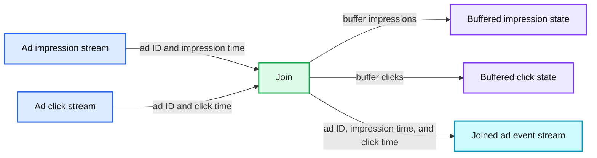
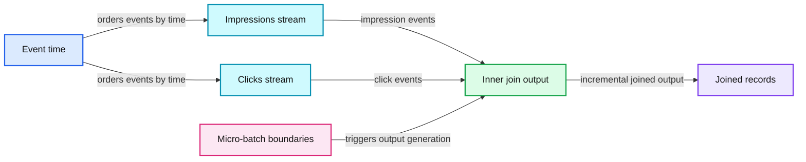
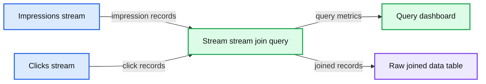

# Introducing Stream-Stream Joins in Apache Spark 2.3

*Now Available on Databricks Runtime 4.0*

- Source: https://www.databricks.com/blog/2018/03/13/introducing-stream-stream-joins-in-apache-spark-2-3.html
- Published: 2018-03-13
- Authors: Tathagata Das, Joseph Torres
- Categories: engineering, open-source, data-engineering, data-streaming
- Images: 3 total, 3 extracted as architecture

Since we introduced [Structured Streaming](https://www.databricks.com/blog/2016/07/28/structured-streaming-in-apache-spark.html) in [Apache Spark 2.0](https://www.databricks.com/blog/2016/07/26/introducing-apache-spark-2-0.html), it has supported joins (inner join and some type of outer joins) between a streaming and a static DataFrame/Dataset. With the release of [Apache Spark 2.3.0](https://www.databricks.com/blog/2018/02/28/introducing-apache-spark-2-3.html), now available in [Databricks Runtime 4.0](https://docs.databricks.com/release-notes/runtime/4.0.html) as part of Databricks [Unified Analytics Platform](https://www.databricks.com/product/data-lakehouse), we now support stream-stream joins. In this post, we will explore a canonical case of how to use stream-stream joins, what challenges we resolved, and what type of workloads they enable. Let’s start with the canonical use case for stream-stream joins - ad monetization.

## The Case for Stream-Stream Joins: Ad Monetization

Imagine you have two streams - one stream of ad impressions (i.e., when an advertisement was displayed to a user) and another stream of ad clicks (i.e., when the displayed ad was clicked by the user). To monetize the ads, you have to match which ad impression led to a click. In other words, you need to join these streams based on a common key, the unique identifier of each ad that is present in events of both streams. At a high-level, the problem looks like as follows.

**Summary:** Stream-stream join matches ad impressions with ad clicks using buffered state and emits combined events.

**Components:**

- Ad impression stream - technology unspecified
- Ad click stream - technology unspecified
- Buffered impression state - technology unspecified
- Buffered click state - technology unspecified
- Join - technology unspecified
- Joined ad event stream - technology unspecified

**Flows:**

- Ad impression stream -> Join: ad ID and impression time
- Ad click stream -> Join: ad ID and click time
- Join -> Buffered impression state: buffer impressions
- Join -> Buffered click state: buffer clicks
- Join -> Joined ad event stream: ad ID, impression time, and click time

**Numbers:** none

source image: https://www.databricks.com/wp-content/uploads/2018/03/image5.png

While this is conceptually a simple idea, there are a few core technical challenges to overcome.

1. **Handling of late/delayed data with buffering:** An impression event and its corresponding click event may arrive out-of-order with arbitrary delays between them. Hence, a stream processing engine must account for such delays by appropriately buffering them until they are matched. Even though all joins (static or streaming) may use buffers, the real challenge is to avoid the buffer from growing without limits.
2.

**Limiting buffer size:** The only way to limit the size of a streaming join buffer is by dropping delayed data beyond a certain threshold. This maximum-delay threshold should be configurable by the user depending on the balance between the business requirements and systems’ resource limitations.

3.

**Well defined semantics:** Maintain consistent SQL join semantics between static joins and streaming joins, with or without the aforementioned thresholds.

We have solved all these challenges in our stream-stream joins. As a result, you can express your computation using the clear semantics of SQL joins, as well as control the delay to tolerate between the associated events. Let’s see how.

First let’s assume these streams are two different Kafka topics. You would define the streaming DataFrames as follows:

Then all you need to do inner equi-join them is as follows.

As with all Structured Streaming queries, this code is the exactly the same as you would have written if the DataFrames `impressions` and `clicks` were defined on static data. When this query is executed, the Structured Streaming engine will buffer clicks and impressions as the streaming state as needed. For a particular advertisement, the joined output will be generated as soon as both related events are received (that is, as soon as the second event is received). As data arrives, the joined output will be generated incrementally and written to the query sink (e.g. another Kafka topic).

**Summary:** The timeline shows a stream-stream inner join between ad impressions and clicks, producing matches as related events arrive across micro-batches.

**Components:**

- Event time timeline
- Impressions stream
- Clicks stream
- Inner join output
- Micro-batch boundaries

**Flows:**

- Impressions -> Inner join output: Impression events with impression time
- Clicks -> Inner join output: Click events with click time
- Inner join output -> Sink: Joined records generated incrementally

**Numbers:** 12:00, 12:01, 12:03, 12:04, 12:05, 12:06, 12:09, 12:10, 12:13, 12:15

source image: https://www.databricks.com/wp-content/uploads/2018/03/image4.png

Finally, the cumulative result of the join will be no different had the join query been applied on two static datasets (that is, same semantics as SQL joins). In fact, it would be the same even if one was presented as a stream and the other as a static dataset. However, in this query, we have not given any indication on how long the engine should buffer an event to find a match. Therefore, the engine may buffer an event forever and accumulate an unbounded amount of streaming state. Let’s see how we can provide additional information in the query to limit the state.

## Managing the Streaming State for Stream-Stream Joins

To limit the streaming state maintained by stream-stream joins, you need to know the following information about your use case:

1. What is the time range between the generation of the two events at their respective sources? In the context of our use case, let’s assume that a click can occur within 0 seconds to 1 hour after the corresponding impression.
2.

What is the maximum duration an event can be delayed in transit between the source and the processing engine? For example, ad clicks from a browser may get delayed due to intermittent connectivity and arrive much later and out-of-order than expected. Let’s say, that impressions and clicks can be delayed by at most 2 and 3 hours, respectively.

With these time constraints for each event, the processing engine can automatically calculate how long events need to be buffered for generating correct results. For example, it will evaluate the following.

1. Impressions need to be buffered for at most 4 hours (in event-time) as a 3-hour-late click may match with an impression made 4 hours ago (i.e., 3-hour-late + upto 1 hour delay between the impression and click).
2.

Conversely, clicks need to be buffered for at most 2 hours (in event-time) as a 2-hour-late impression may match with click received 2 hours ago.

Accordingly, the engine can drop old impressions and clicks from streams when it determines that any of the buffered event is not expected to get any matches in the future.

At high-level this animation illustrates how the watermark is updated with event time and how state is cleanup.

These time constraints can be encoded in the query as watermarks and time range join conditions.

- **Watermarks:** Watermarking in Structured Streaming is a way to limit state in all stateful streaming operations by specifying how much late data to consider. Specifically, a watermark is a moving threshold in event-time that trails behind the maximum event-time seen by the query in the processed data. The trailing gap (aka watermark delay) defines how long should the engine wait for late data to arrive and is specified in the query using `withWatermark`. Read about it in more detail in our previous blog post on [streaming aggregations](https://www.databricks.com/blog/2017/05/08/event-time-aggregation-watermarking-apache-sparks-structured-streaming.html). For our stream-stream inner joins, you can optionally specify the watermark delay but you must specify to limit all state on both streams.
-

**Time range condition:** It’s a join condition that limits the time range of other events that each event can join against. This can be specified one of the two ways:

  - Time range join condition (e.g. … JOIN ON leftTime BETWEEN rightTime AND rightTime + INTERVAL 1 HOUR),
  - Join on event-time windows (e.g. … JOIN ON leftTimeWindow = rightTimeWindow).

Together, our inner join for ad monetization will look like this.

With this, the engine will automatically calculate state limits mentioned earlier and drop old events accordingly. And as with all things stateful in Structured Streaming, checkpointing ensures that you get exactly-once fault-tolerance guarantees.

Here is a screenshot of the query running in the Databricks notebook linked with this post. Note the third graph, the number of the records in query state, flattens out after a while indicating the state cleanup by watermark is cleaning up old data.

**Summary:** A Databricks Structured Streaming Python notebook demonstrates a stream-stream join with watermarking, monitoring query performance and joined records.

**Components:**

- Databricks notebook using Python
- Impressions stream with watermark
- Clicks stream with watermark
- Stream-stream join query
- Query dashboard
- Aggregation state monitor
- Raw joined-data table

**Flows:**

- Impressions stream -> Stream-stream join query: impression records
- Clicks stream -> Stream-stream join query: click records
- Stream-stream join query -> Query dashboard: input rate, processing rate, batch duration, and aggregation state
- Stream-stream join query -> Raw joined-data table: matched impression and click records

**Numbers:** 4.0, 1, 14, 15, 10, 5, 16, 25, 36, 51, 60, 71, 86, 95, 11 rec/s, 13.6 rec/s, 2.4 s, 1.8 s, 426 distinct keys, 0, 100, 200, 300, 400, 08:04:00, 08:05:00, 08:05:30, 1 minute, 2018-03-06T04:03:50.266+0000, 2018-03-06T04:03:52.466+0000, 2018-03-06T04:03:54.266+0000, 2018-03-06T04:03:56.466+0000, 2018-03-06T04:03:59.466+0000, 2018-03-06T04:04:01.266+0000, 2018-03-06T04:04:03.466+0000, 2018-03-06T04:04:06.466+0000, 2018-03-06T04:04:08.266+0000, 2018-03-06T04:04:01.613+0000, 2018-03-06T04:03:13.813+0000, 2018-03-06T04:05:01.613+0000, 2018-03-06T04:04:07.813+0000, 2018-03-06T04:04:10.813+0000, 2018-03-06T04:12:613+0000, 2018-03-06T04:14:813+0000, 2018-03-06T04:04:17.813+0000, 2018-03-06T04:04:19.613+0000

source image: https://www.databricks.com/wp-content/uploads/2018/03/image1.png

## Using Stream-Stream Outer Joins

The earlier inner join will output only those ads for which both events have been received. In other words, ads that received no click would not be reported at all. Instead you may want *all* ad impressions to be reported, with or without the associated click data, to enable additional analysis later (e.g. click through rates). This brings us to stream-stream outer joins. All you need to do is specify the join type.

As expected of outer joins, this query will start generating output for every impression, with or without (i.e., using NULLS) the click data. However, outer joins have a few additional points to note.

- Unlike inner joins, the watermarks and event-time constraints are not optional for outer joins. This is because for generating the NULL results, the engine must know when an event is not going to match with anything else in future. Hence, the watermarks and event-time constraints must be specified for enabling state expiration and generating correct outer join results.
- Consequently, the outer NULL results will be generated with a delay as the engine has to wait for a while to ensure that there neither were nor would be any matches. This delay is the maximum buffering time (wrt to event-time) calculated by the engine for each event as discussed in the earlier section (i.e., 4 hours for impressions and 2 hours for clicks).

## Further Reading

For full details on supported types of joins and other query limits take a look at the [Structured Streaming programming guide](https://spark.apache.org/docs/latest/structured-streaming-programming-guide.html#join-operations). For more information on other stateful operations in Structured Streaming, take a look at the following:

- **Notebook:** Try [stream-stream join notebook](https://docs.databricks.com/spark/latest/structured-streaming/examples.html#id1) on Databricks
- **Blog post:** [Arbitrary Stateful Processing in Apache Spark’s Structured Streaming](https://www.databricks.com/blog/2017/10/17/arbitrary-stateful-processing-in-apache-sparks-structured-streaming.html)
- **Spark Summit Europe 2017 talk:** [Deep Dive into Stateful Stream Processing in Structured Streaming](https://www.databricks.com/session/deep-dive-into-stateful-stream-processing-in-structured-streaming)
