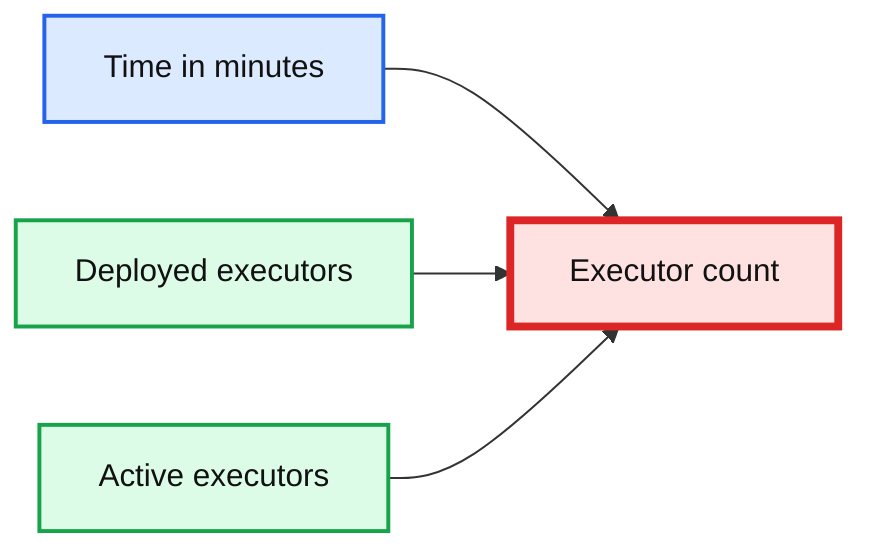
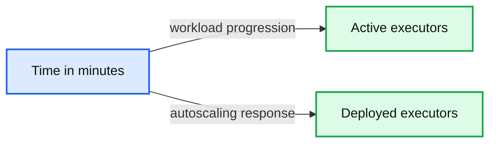

# Introducing Databricks Optimized Autoscaling on Apache Spark™

*Reduce cloud costs by up to 30%*

- Source: https://www.databricks.com/blog/2018/05/02/introducing-databricks-optimized-auto-scaling.html
- Published: 2018-05-02
- Authors: Prakash Chockalingam, Eric Liang, Tathagata Das, Jean-Yves Stephan
- Categories: product, announcements, engineering, company
- Images: 2 total, 2 extracted as architecture

Databricks is thrilled to announce our new optimized autoscaling feature. The new Apache Spark™-aware resource manager leverages Spark shuffle and executor statistics to resize a cluster intelligently, improving resource utilization. When we tested long-running big data workloads, we observed cloud cost savings of up to 30%.

#### **What’s the problem with current state-of-the-art autoscaling approaches?**

Today, every big data tool can auto-scale compute to lower costs. But most of these tools expect a static resource size allocated for a single job, which doesn't take advantage of the elasticity of the cloud. Resource schedulers like YARN then take care of “coarse-grained” autoscaling between different jobs, releasing resources back only after a Spark job finishes.

./bin/spark-submit **\**
 --class org.apache.spark.examples.SparkPi **\**
 --master yarn **\**
 --deploy-mode cluster **\ ***# can be client for client mode*
** --num-executors 50 \**
 /path/to/examples.jar

*An example spark-submit command that takes the number of executors required for the Spark job as a parameter.*

This introduces two major problems:

1. **Identifying the right number of executors required for a single job:** How much compute resource does my job require to finish within an acceptable SLA? There is significant trial and error here to decide the right number of executors.
2. **Sub-optimal resource utilization**, which typically stems from over-provisioning. Users over-provision resources because:
  - Production Spark jobs typically have multiple Spark stages. Some stages might require huge compute resources compared to other stages. Users provide a number of executors based on the stage that requires maximum resources. Having such a static size allocated to an entire Spark job with multiple stages results in suboptimal utilization of resources.
  - The amount of data processed by [ETL](https://www.databricks.com/glossary/extract-transform-load) jobs fluctuates based on time of day, day of week, and other seasonalities like Black Friday. Typically resources are provisioned for the Spark job in expectation of maximum load. This is highly inefficient when the ETL job is processing small amounts of data.

To overcome the above problems, Apache Spark has a Dynamic Allocation option, as described [here](https://spark.apache.org/docs/latest/job-scheduling.html#dynamic-resource-allocation). But this requires setting up a shuffle service external to the executor on each worker node in the same cluster to allow executors to be removed without deleting the shuffle files that they write. And while the executor can be removed, the worker node is still kept alive so the external shuffle service can continue serving files. This makes it impossible to resize down the cluster to take advantage of the elasticity of the cloud.

#### **Introducing Databricks Optimized AutoScaling**

The new optimized autoscaling service for compute resources allows clusters to scale up and down more aggressively in response to load and improves the utilization of cluster resources automatically without the need for any complex setup from users.

Traditional coarse-grained autoscaling algorithms do not fully scale down cluster resources allocated to a Spark job while the job is running. The main reason is the lack of information on executor usage. Removing workers with active tasks or in-use shuffle files would trigger re-attempts and  recomputation of intermediate data, which leads to poorer performance, lower effective utilization and therefore higher costs for the user. However in cases where there are only a few active tasks running on a cluster, such as when the Spark job exhibits skew or when a particular stage of the job has lower resource requirements, the inability to scale down leads to poorer utilization and therefore higher costs for users. This is a massive missed opportunity for traditional autoscaling.

Databricks’ optimized autoscaling solves this problem by periodically reporting detailed statistics on idle executors and the location of intermediate files within the cluster. The Databricks service uses this information to more precisely target workers to scale down when utilization is low. In particular the service can scale down and remove idle workers on an under-utilized cluster even when there are tasks running on other executors for the same Spark job. This behavior is different from traditional autoscaling, which requires the entire Spark job to be finished to begin scale-down. During scale-down, the Databricks service removes a worker only if it is idle and does not contain any shuffle data that is being used by running queries. Therefore running jobs and queries are not affected during down-scaling.

Since Databricks can precisely target workers for scale-down under low utilization, clusters can be resized much more aggressively in response to load. In particular, under low utilization, Databricks clusters can be scaled down aggressively *without* killing tasks or recomputing intermediate results. This keeps wasted compute resources to a minimum while also maintaining the responsiveness of the cluster. And since Databricks can scale a cluster down aggressively, it also scales the cluster *up* aggressively in response to demand to keep responsiveness high without sacrificing efficiency.

The following section illustrates the behavior and benefits of the new autoscaling feature when used to run a job in Databricks.

#### **Illustration**

We have a genomics data pipeline that is periodically scheduled to run as a Databricks job on its own cluster. That is, each instance of the pipeline periodically spins up a cluster in Databricks, runs the pipeline, and shuts down the cluster after it is completed.

We ran identical instances of this pipeline on two separate clusters with identical compute configurations. In both instances the clusters were running Databricks Runtime 4.0 and configured to scale between 1 and 24 eight core instances. The first cluster was set up to scale up and down in the traditional manner, and in the second we enabled the new Databricks optimized autoscaling.

The following figure plots the number of executors deployed and the number of executors actually in use as the job progresses (x axis is time in minutes).

*Figure 1. Traditional autoscaling: Active executors vs total executors*

**Summary:** The chart compares active executors with deployed executors over time during traditional autoscaling.

**Components:**

- Deployed executors
- Active executors
- Time in minutes
- Executor count

**Flows:**

- Time progression -> Executor count: workload progress measured in minutes
- Deployed executors -> Chart: total deployed executor count
- Active executors -> Chart: executors actually in use

**Numbers:** 0, 5, 10, 15, 20, 50, 100, 150

source image: https://www.databricks.com/wp-content/uploads/2018/05/Traditional-Auto-Scaling-1024x247.png

Figure 1. Traditional autoscaling: Active executors vs total executors

Clearly, the number of deployed workers just goes up to 24 and never reduces for the duration of the workload. That is, for a single Spark job, traditional autoscaling is not much better than simply allocating a fixed number of resources.

*Figure 2. Databricks’ optimized autoscaling: Active executors vs total executors*

**Summary:** The chart compares active executors with deployed executors over workload time under Databricks’ optimized autoscaling.

**Components:**

- Active executors metric
- Deployed executors metric
- Time axis in minutes

**Flows:**

- Time -> Active executors: workload activity over time
- Time -> Deployed executors: executor deployment over time

**Numbers:** 0, 5, 10, 15, 20, 50, 100, 150, 24, 25%, 25%

source image: https://www.databricks.com/wp-content/uploads/2018/05/Databricks-Optimized-Auto-Scaling-1024x293.png

Figure 2. Databricks’ optimized autoscaling: Active executors vs total executors

With Databricks’ optimized autoscaling, the number of deployed workers tracks the workload usage more closely. In this case, optimized autoscaling results in 25% fewer resources being deployed over the lifetime of the workload, meaning a 25% cost savings for the user. The end-to-end runtime of the workload was only slightly higher (193 minutes with optimized autoscaling vs. 185 minutes).

#### **What’s next?**

You’ll get the new optimized autoscaling algorithm when you run Databricks jobs on Databricks Runtime 3.4+ clusters that have the “Enable autoscaling” flag selected. See Cluster Size and Autoscaling for [AWS](https://docs.databricks.com/clusters/configure.html) and [Azure](https://docs.microsoft.com/en-us/azure/databricks/clusters/configure#autoscaling) in the Databricks documentation for more information.

Start running your Spark jobs on the Databricks Unified Analytics Platform and start saving on your cloud costs by signing up for a free trial.

 

If you have any questions, you can [contact us with your questions](https://www.databricks.com/).
