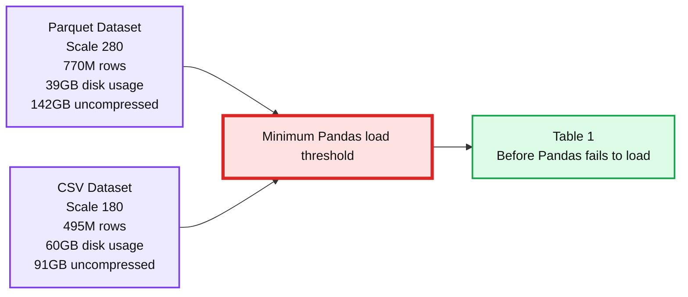
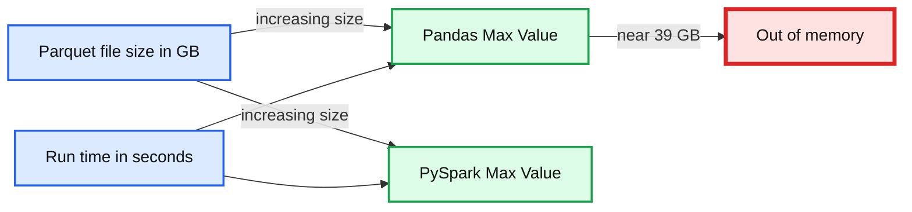
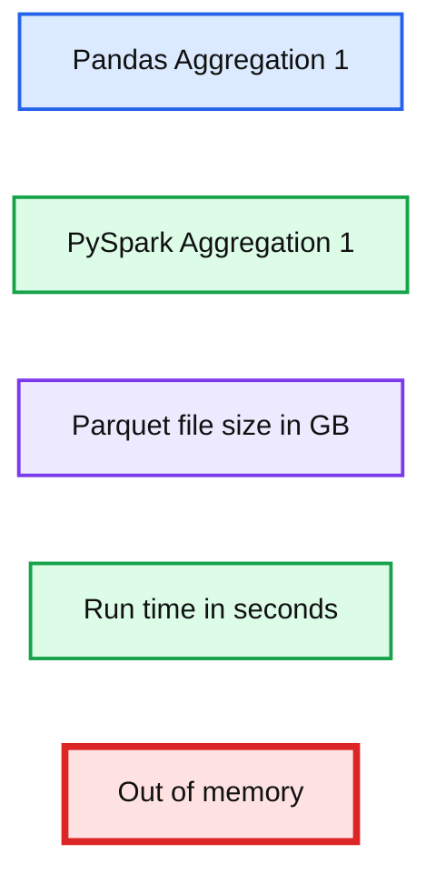
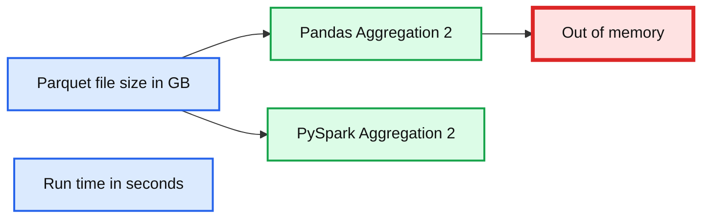
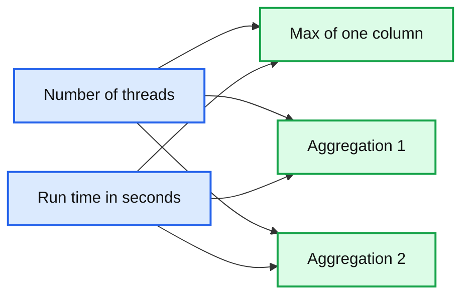
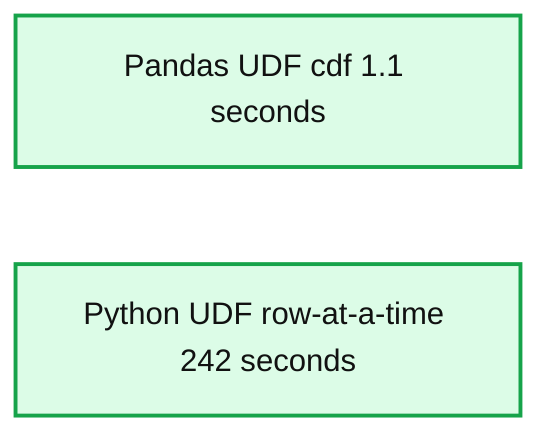

# Benchmarking Apache Spark on a Single Node Machine

- Source: https://www.databricks.com/blog/2018/05/03/benchmarking-apache-spark-on-a-single-node-machine.html
- Published: 2018-05-03
- Authors: Gengliang Wang, Reynold Xin, Jules Damji
- Categories: solutions, engineering, open-source
- Images: 7 total, 7 extracted as architecture

[Apache Spark](https://www.databricks.com/spark/about) has become the de facto [unified analytics engine](https://cacm.acm.org/magazines/2016/11/209116-apache-spark/fulltext) for big data processing in a distributed environment. Yet we are seeing more users choosing to run Spark on a single machine, often their laptops, to process small to large data sets, than electing a large Spark cluster. This choice is primarily because of the following reasons:

1. A single, unified API that scales from “small data” on a laptop to “‘big data” on a cluster
2. Polyglot programming mode, with support for Python, R, Scala, and Java
 ANSI SQL support
3. Tight integration with PyData tools, e.g., Pandas through [Pandas user-defined functions](https://www.databricks.com/blog/2017/10/30/introducing-vectorized-udfs-for-pyspark.html)

While the above might be obvious, users are often surprised to discover that:

- Spark installation on a single node requires no configuration (just download and run it).
- Spark can often be faster, due to parallelism, than single-node PyData tools.
- Spark can have lower memory consumption and can process more data than laptop ’s memory size, as it does not require loading the entire data set into memory before processing.

PyData tooling and plumbing have contributed to Apache Spark’s ease of use and performance. For instance, Pandas’ data frame API inspired Spark’s. Another example is that [Pandas UDFs in Spark 2.3](https://www.databricks.com/blog/2017/10/30/introducing-vectorized-udfs-for-pyspark.html) significantly boosted PySpark performance by combining Spark and Pandas.

In this blog, we will demonstrate the merits of single node computation using PySpark and share our observations. Through experimentation, we’ll show why you may want to use PySpark instead of Pandas for large datasets that exceed single-node machine’s memory.

## Setting Up Apache Spark on a Laptop

Even though Spark is designed originally for distributed data processing, a lot of effort has been put into making it easier to install for local development, giving developers new to Spark an easy platform to experiment: just need to download the tarball, untar it, and can immediately start using it without any setup. For example, the following command will download the Spark tarball and launch PySpark:

Even better, Spark is also available on [PyPI](https://pypi.org/), Homebrew, and Conda, and can be installed using one command:

## Single-node Performance

It’s been a few years since Intel was able to push CPU clock rate higher. Rather than making a single core more powerful with higher frequency, the latest chips are scaling in terms of core count. Hence, it is not uncommon for laptops or workstations to have 16 cores, and servers to have 64 or even 128 cores. In this manner, these multi-core single-node machines’ work resemble a distributed system more than a traditional single core machine.

We often hear that distributed systems are slower than single-node systems when data fits in a single machine’s memory. By comparing memory usage and performance between Spark and Pandas using common SQL queries, we observed that is not always the case. We used three common SQL queries to show single-node comparison of Spark and Pandas:

Query 1. `SELECT max(ss_list_price) FROM store_sales`

Query 2. `SELECT count(distinct ss_customer_sk) FROM store_sales`

Query 3. `SELECT sum(ss_net_profit) FROM store_sales GROUP BY ss_store_sk`

To demonstrate the above, we measure the maximum data size (both Parquet and CSV) Pandas can load on a single node with 244 GB of memory, and compare the performance of three queries.

## Setup and Configuration

### Hardware

We used a virtual machine with the following setup:
 * CPU core count: 32 virtual cores (16 physical cores), Intel Xeon CPU E5-2686 v4 @ 2.30GHz
 * System memory: 244 GB
 * Total local disk space for shuffle: 4 x 1900 GB NVMe SSD

### Software

- OS: Ubuntu 16.04
- Spark: Apache Spark 2.3.0 in local cluster mode
- Pandas version: 0.20.3
- Python version: 2.7.12

## PySpark and Pandas

The input dataset for our benchmark is table “store_sales” from TPC-DS, which has 23 columns and the data types are Long/Double.

### Scalability

Pandas requires a lot of memory resource to load data files. The following test loads table “store_sales” with scales 10 to 270 using Pandas and Pyarrow and records the maximum resident set size of a Python process. As the graph below suggests that as the data size linearly increases so does the resident set size (RSS) on the single node machine.

**Summary:** The chart shows Pandas maximum memory usage increasing with Parquet file size until the process runs out of memory.

**Components:**

- Parquet file size, measured in GB
- Pandas process
- Maximum memory usage, measured in GB
- Out of memory failure marker

**Flows:**

- Parquet file size -> Pandas process: larger input files
- Pandas process -> Maximum memory usage: increasing resident memory consumption
- Maximum memory usage -> Out of memory failure marker: memory exhaustion

**Numbers:** 0, 5, 10, 15, 20, 25, 30, 35, 50, 100, 150, 200, 250, GB

source image: https://www.databricks.com/wp-content/uploads/2018/05/image3.png

We also tested the minimal file size that Pandas will fail to load on the i3.8xlarge instance.

**Summary:** Table 1 compares Parquet and CSV datasets by scale, row count, disk usage, and uncompressed data size before Pandas fails to load them.

**Components:**

- Parquet Dataset
- CSV Dataset
- Scale
- Number of rows
- Disk usage
- Uncompressed data size

**Flows:**

- none

**Numbers:**

- Table 1
- Scale 280
- 770M rows
- 39GB disk usage
- 142GB uncompressed data size
- Scale 180
- 495M rows
- 60GB disk usage
- 91GB uncompressed data size

source image: https://www.databricks.com/wp-content/uploads/2018/05/Screen-Shot-2018-05-02-at-1.39.14-PM.png

For Spark, it is easy to scale from small data set on a laptop to "big data" on a cluster with one single API. Even on a single node, Spark’s operators spill data to disk if it does not fit in memory, allowing it to run well on any sized data.

### Performance

The benchmark involves running the SQL queries over the table “store_sales” (scale 10 to 260) in Parquet file format.

PySpark ran in local cluster mode with **10GB** memory and 16 threads.

We observed that as the input data size increased, PySpark achieved the better performance result with limited resources, while Pandas crashed and failed to handle parquet files larger than 39GB.

**Summary:** Benchmark chart comparing Pandas and PySpark maximum run times as Parquet file size increases, with Pandas reaching an out-of-memory condition.

**Components:**

- Pandas Max Value
- PySpark Max Value
- Parquet file size in GB
- Run time in seconds
- Out of memory

**Flows:**

- Parquet file size in GB -> Pandas Max Value: increasing input size
- Parquet file size in GB -> PySpark Max Value: increasing input size
- Pandas Max Value -> Out of memory: fails near 39 GB

**Numbers:** 0, 2, 4, 6, 8 seconds; 10, 20, 30, 40, 50, 60, 70 GB; approximately 39 GB

source image: https://www.databricks.com/wp-content/uploads/2018/05/image2.png

**Summary:** Benchmark chart comparing Pandas and PySpark aggregation query runtime as Parquet file size increases.

**Components:**

- Pandas Aggregation 1
- PySpark Aggregation 1
- Parquet file size axis in GB
- Run time axis in seconds
- Out of memory annotation

**Flows:**

- None shown.

**Numbers:** 0, 5, 10, 15, 20, 30, 40, 50, 60, 70, 1

source image: https://www.databricks.com/wp-content/uploads/2018/05/image1.png

**Summary:** Benchmark chart comparing Pandas and PySpark aggregation runtime as Parquet file size increases.

**Components:**

- Pandas Aggregation 2 using Pandas
- PySpark Aggregation 2 using PySpark
- Parquet file size measured in GB
- Run time measured in seconds
- Out of memory marker for Pandas

**Flows:**

- Parquet file size -> Pandas Aggregation 2: increasing input size
- Parquet file size -> PySpark Aggregation 2: increasing input size
- Pandas Aggregation 2 -> Out of memory: failure at larger input size

**Numbers:** Query 2; run time ticks 0, 5, 10, 15, 20, 25 seconds; Parquet file size ticks 10, 20, 30, 40, 50, 60, 70 GB.

source image: https://www.databricks.com/wp-content/uploads/2018/05/image4.png

Because of parallel execution on all the cores, PySpark is faster than Pandas in the test, even when PySpark didn’t cache data into memory before running queries. To demonstrate that, we also ran the benchmark on PySpark with different number of threads, with the input data scale as 250 (about 35GB on disk).

**Summary:** Spark runtime decreases as the number of threads increases for all three workloads.

**Components:**

- Number of threads axis
- Run time axis in seconds
- Max of one column workload
- Aggregation 1 workload
- Aggregation 2 workload

**Flows:**

- Number of threads -> Max of one column: runtime trend
- Number of threads -> Aggregation 1: runtime trend
- Number of threads -> Aggregation 2: runtime trend

**Numbers:** 100, 75, 50, 25, 0 seconds; thread counts 2, 4, 6, 8, 10, 12, 14, 16; workload labels 1 and 2

source image: https://www.databricks.com/wp-content/uploads/2018/05/image6-1.png

## PySpark and Pandas UDF

On the other hand, [Pandas UDF](https://www.databricks.com/blog/2017/10/30/introducing-vectorized-udfs-for-pyspark.html) built atop [Apache Arrow](https://arrow.apache.org/) accords high-performance to Python developers, whether you use Pandas UDFs on a single-node machine or distributed cluster. Introduced in [Apache Spark 2.3](https://www.databricks.com/blog/2018/02/28/introducing-apache-spark-2-3.html), Li Jin of Two Sigma demonstrates Pandas UDF’s tight integration with PySpark. Using Pandas UDFs with Spark, he compares the benchmark results of computing [Cumulative Probability](https://en.wikipedia.org/wiki/Cumulative_distribution_function), along with other computing functions, between standard Python UDF row-at-time and Pandas UDFs.

Pandas UDFs are used for vectorizing scalar operations. Consider the use of the scalar Pandas UDF in PySpark to compute cumulative probability of a value in a normal distribution N(0,1) using [scipy](https://scipy.org/) package.

As a Pandas UDF, this code is much faster than regular Python UDF. The chart below indicates that Pandas UDFs perform much better than Python UDFs row-at-a-time, in all computing functions employed.

**Summary:** Benchmark chart comparing execution time for Pandas UDFs and Python UDF row-at-a-time processing, where shorter is better.

**Components:**

- Pandas UDF using cdf
- Python UDF row-at-a-time
- Time axis measured in seconds

**Flows:**

- none

**Numbers:** 250, 200, 150, 100, 50, 0 seconds; Pandas UDF 1.1 seconds; Python UDF row-at-a-time 242 seconds.

source image: https://www.databricks.com/wp-content/uploads/2018/05/image4-1.png

*[Partial Chart](https://www.databricks.com/wp-content/uploads/2017/10/image1-4.png) for cdf extracted from [Pandas UDF Blog](https://www.databricks.com/blog/2017/10/30/introducing-vectorized-udfs-for-pyspark.html)*

## Conclusion

In summation, we outlined why some users choose to run Spark on a single machine. Over few Spark releases, Pandas has contributed and integrated well with Spark. One huge win has been [Pandas UDFs](https://www.databricks.com/blog/2017/10/30/introducing-vectorized-udfs-for-pyspark.html). In fact, because of Pandas API similarity with Spark DataFrames, many developers often combine both, as it’s [convenient to interoperate between them](https://www.databricks.com/session/data-wrangling-with-pyspark-for-data-scientists-who-know-pandas).

For single-node analytics with large datasets that exceed single-node’s memory, Spark offers faster runtime and greater scalability from multi-core parallelism and better-pipelined execution engine.

You can access the source code used for this benchmark at [https://github.com/databricks/benchmarks/tree/master/pandas](https://github.com/databricks/benchmarks/tree/master/pandas)
