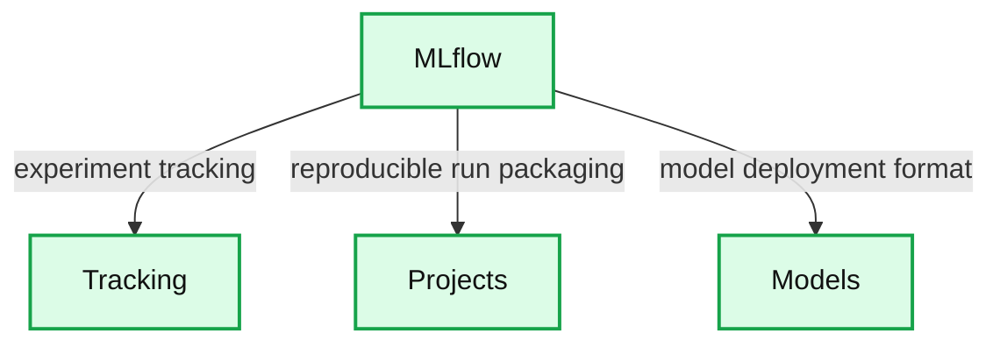

# Introducing MLflow: an Open Source Machine Learning Platform

- Source: https://www.databricks.com/blog/2018/06/05/introducing-mlflow-an-open-source-machine-learning-platform.html
- Published: 2018-06-05
- Authors: Matei Zaharia, Cyrielle Simeone
- Categories: announcements, product, solutions, engineering, data-science-machine-learning, company
- Images: 2 total, 1 extracted as architecture

> [Learn more about Managed MLflow on Databricks](https://www.databricks.com/product/managed-mlflow)

Everyone who has tried to do machine learning development knows that it is complex. Beyond the usual concerns in the software development, machine learning (ML) development comes with multiple new challenges. At Databricks, we work with hundreds of companies using ML, and we have repeatedly heard the same concerns:

1. **There are a myriad tools.** Hundreds of open source tools cover each phase of the ML lifecycle, from data preparation to model training. However, unlike traditional software development, where teams select one tool for each phase, in ML you usually want to *try every available tool* (e.g. algorithm) to see whether it improves results. ML developers thus need to use and productionize dozens of libraries.
2. **It's hard to track experiments.** Machine learning algorithms have dozens of configurable parameters, and whether you work alone or on a team, it is difficult to track which parameters, code, and data went into each experiment to produce a model.
3. **It's hard to reproduce results.** Without detailed tracking, teams often have trouble getting the same code to work again. Whether you are a data scientist passing your training code to an engineer for use in production, or you are going back to your past work to debug a problem, reproducing steps of the ML workflow is critical.
4. **It's hard to deploy ML.** Moving a model to production can be challenging due to the plethora of deployment tools and environments it needs to run in (e.g. REST serving, batch inference, or mobile apps). There is no standard way to move models from any library to any of these tools, creating a new risk with each new deployment.

Because of these challenges, it is clear that ML development has to evolve a lot to become as robust, predictable and wide-spread as traditional software development. To this end, many organizations have started to build internal *machine learning platforms* to manage the ML lifecycle. For example, Facebook, Google and Uber have built [FBLearner Flow](https://engineering.fb.com/2016/05/09/core-data/introducing-fblearner-flow-facebook-s-ai-backbone/), [TFX](http://www.kdd.org/kdd2017/papers/view/tfx-a-tensorflow-based-production-scale-machine-learning-platform), and Michelangelo to manage data preparation, model training and deployment. However, even these internal platforms are limited: typical ML platforms only support a small set of built-in algorithms, or a single ML library, and they are tied to each company's infrastructure. Users cannot easily leverage new ML libraries, or share their work with a wider community.

At Databricks, we believe there should be a better way to manage the ML lifecycle, so we are excited to announce [**MLflow: an open source machine learning platform**](http://www.mlflow.org/), which we are releasing today as [alpha](https://github.com/databricks/mlflow).

## MLflow: an Open Machine Learning Platform

MLflow is inspired by existing ML platforms, but it is designed to be *open* in two senses:

1. **Open interface:** MLflow is designed to work with any ML library, algorithm, deployment tool or language. It's built around REST APIs and simple data formats (e.g., a model can be viewed as a lambda function) that can be used from a variety of tools, instead of only providing a small set of built-in functionality. This also makes it easy to add MLflow to your *existing* ML code so you can benefit from it immediately, and to share code using any ML library that others in your organization can run.
2. **Open source:** We're releasing MLflow as an [open source project](https://github.com/databricks/mlflow) that users and library developers can extend. In addition, MLflow's open format makes it very easy to share workflow steps and models *across* organizations if you wish to open source your code.

Mlflow is still currently in alpha, but we believe that it already offers a useful framework to work with ML code, and we would love to hear your feedback. In this post, we'll introduce MLflow in detail and explain its components.

### MLflow Alpha Release Components

This first, alpha release of MLflow has three components:

**Summary:** MLflow connects its central platform to three components: Tracking, Projects, and Models.

**Components:**

- MLflow - technology not specified
- Tracking - records and queries experiment code, data, configuration, and results
- Projects - packages reproducible runs for any platform
- Models - provides a general format for sending models to diverse deployment tools

**Flows:**

- MLflow -> Tracking: experiment tracking
- MLflow -> Projects: reproducible run packaging
- MLflow -> Models: model deployment format

**Numbers:** none

source image: https://www.databricks.com/wp-content/uploads/2018/06/mlflow.png

### MLflow Tracking

MLflow Tracking is an API and UI for logging parameters, code versions, metrics and output files when running your machine learning code to later visualize them. With a few simple lines of code, you can track parameters, metrics, and artifacts:

You can use MLflow Tracking in any environment (for example, a standalone script or a notebook) to log results to local files or to a server, then compare multiple runs. Using the web UI, you can view and compare the output of multiple runs. Teams can also use the tools to compare results from different users:

MLflow Tracking UI

### MLflow Projects

MLflow Projects provide a standard format for packaging reusable data science code. Each project is simply a directory with code or a Git repository, and uses a descriptor file to specify its dependencies and how to run the code. A MLflow Project is defined by a simple YAML file called `MLproject`.

Projects can specify their dependencies through a Conda environment. A project may also have multiple entry points for invoking runs, with named parameters. You can run projects using the `mlflow run` command-line tool, either from local files or from a Git repository:

MLflow will automatically set up the right environment for the project and run it. In addition, if you use the MLflow Tracking API in a Project, MLflow will remember the project version executed (that is, the Git commit) and any parameters. You can then easily rerun the exact same code.

The project format makes it easy to share reproducible data science code, whether within your company or in the open source community. Coupled with MLflow Tracking, MLflow Projects provides great tools for reproducibility, extensibility, and experimentation.

### MLflow Models

MLflow Models is a convention for packaging machine learning models in multiple formats called "flavors". MLflow offers a variety of tools to help you deploy different flavors of models. Each MLflow Model is saved as a directory containing arbitrary files and an `MLmodel` descriptor file that lists the flavors it can be used in.

In this example, the model can be used with tools that support either the `sklearn` or `python_function` model flavors.

MLflow provides tools to deploy many common model types to diverse platforms. For example, any model supporting the `python_function` flavor can be deployed to a Docker-based REST server, to cloud platforms such as Azure ML and Amazon SageMaker, and as a user-defined function in Apache [Spark](https://www.databricks.com/spark/about) for batch and streaming inference. If you output MLflow Models as artifacts using the Tracking API, MLflow will also automatically remember which Project and run they came from.

## Getting Started with MLflow

To get started with MLflow, follow the instructions at [mlflow.org](http://www.mlflow.org) or check out the alpha release code on [Github](https://github.com/databricks/mlflow). We are excited to hear your feedback on the concepts and code!

## Hosted MLflow on Databricks

If you would like to run a hosted version of MLflow, we are also now accepting signups at [databricks.com/product/managed-mlflow](https://www.databricks.com/product/managed-mlflow). MLflow on Databricks integrates with the complete Databricks Unified Analytics Platform, including Notebooks, Jobs, [Databricks Delta](https://www.databricks.com/product/delta-lake-on-databricks), and the Databricks security model, enabling you to run your existing MLflow jobs at scale in a secure, production-ready manner.

## What’s Next?

We are just getting started with MLflow, so there is a lot more to come. Apart from updates to the project, we plan to introduce major new components (e.g., Monitoring), library integrations, and extensions to what we've already released (e.g., support for more environment types). Stay tuned on [our blog](https://www.databricks.com/blog) for more information.

[*View the MLflow Spark+AI Summit keynote*](https://vimeo.com/274266886#t=33s)
