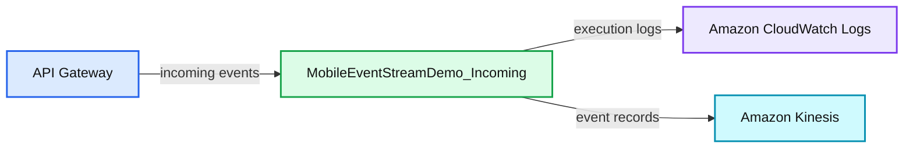
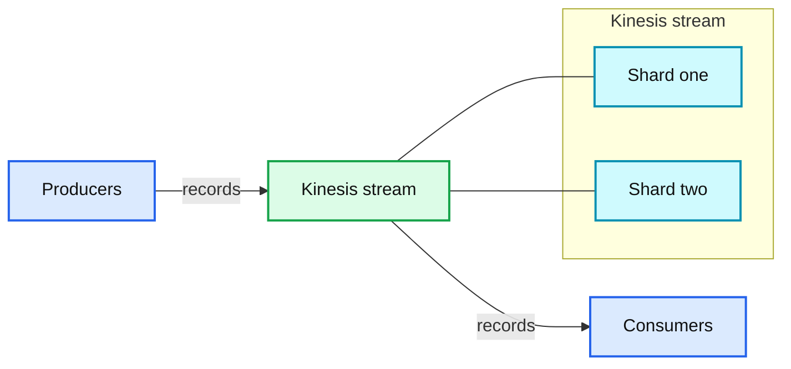
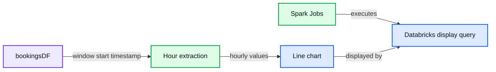
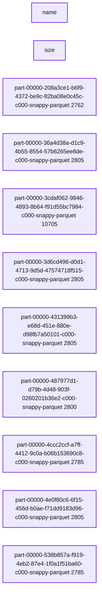
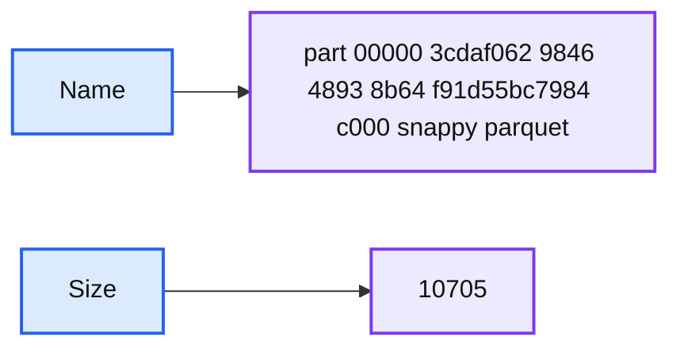

# Build a Mobile Gaming Events Data Pipeline with Databricks Delta

- Source: https://www.databricks.com/blog/2018/07/02/build-a-mobile-gaming-events-data-pipeline-with-databricks-delta.html
- Published: 2018-07-02
- Authors: Steven Yu, Denny Lee
- Categories: platform, product, engineering, open-source, data-science-machine-learning, data-engineering, data-streaming, news
- Images: 9 total, 8 extracted as architecture

How to build an end-to-end data pipeline with Structured Streaming
[Try this notebook in Databricks](https://docs.databricks.com/_static/notebooks/mobile-event-stream-etl.html)

**Summary:** Mobile users send gaming events through AWS services into Databricks Structured Streaming and Delta for real-time analytics.

**Components:**

- Mobile Users
- API Gateway
- Lambda Functions
- Kinesis Streams
- Databricks Structured Streaming
- Databricks Notebooks
- Databricks Delta
- Real-time Analytics
- Real-time KPIs
- Real-time Visualization
- Elastic Scalability
- Reliant and Performant Data Lakes
- Integrated Workspace
- Databricks Unified Analytics Platform

**Flows:**

- Mobile Users -> API Gateway: mobile gaming events
- API Gateway -> Lambda Functions: API requests
- Lambda Functions -> Kinesis Streams: streaming events
- Kinesis Streams -> Structured Streaming: event stream
- Structured Streaming -> Databricks Delta: processed streaming data
- Databricks Delta -> Real-time Analytics: analytics data
- Databricks Delta -> Real-time KPIs: KPI data
- Databricks Delta -> Real-time Visualization: visualization data
- Databricks Notebooks -> Structured Streaming: notebook-driven processing
- Databricks Notebooks -> Databricks Delta: notebook-driven data lake operations
- Databricks Notebooks -> Integrated Workspace: notebook integration

**Numbers:** none

source image: https://www.databricks.com/wp-content/uploads/2018/06/Mobile-Gaming-Events-Data-Pipeline.png

```mermaid
%% Mobile gaming events flow through AWS into Databricks Delta and real-time analytics
flowchart LR
    U[Mobile Users] -->|gaming events| G[API Gateway]
    G -->|API requests| L[Lambda Functions]
    L -->|streaming events| K[Kinesis Streams]
    K -->|event stream| S[Structured Streaming]
    S -->|processed data| D[Databricks Delta]
    D -->|analytics data| A[Real-time Analytics]
    D -->|KPI data| P[Real-time KPIs]
    D -->|visualization data| V[Real-time Visualization]
    N[Databricks Notebooks] -->|processing| S
    N -->|data lake operations| D
    N -->|integration| W[Integrated Workspace]

    classDef client fill:#dbeafe,stroke:#2563eb,stroke-width:2px,color:#111
    classDef service fill:#dcfce7,stroke:#16a34a,stroke-width:2px,color:#111
    classDef store fill:#ede9fe,stroke:#7c3aed,stroke-width:2px,color:#111
    classDef cache fill:#fef3c7,stroke:#d97706,stroke-width:2px,color:#111
    classDef queue fill:#cffafe,stroke:#0891b2,stroke-width:2px,color:#111
    classDef critical fill:#fee2e2,stroke:#dc2626,stroke-width:4px,color:#111
    classDef external fill:#e5e7eb,stroke:#6b7280,stroke-width:2px,color:#111,stroke-dasharray:4 3
    classDef decision fill:#fce7f3,stroke:#db2777,stroke-width:2px,color:#111

    class U client
    class G,L service
    class K queue
    class S service
    class D store
    class A,P,V,W service
    class N client
```

The world of mobile gaming is fast paced and requires the ability to scale quickly.  With millions of users around the world generating millions of events per second by means of game play, you will need to calculate key metrics (score adjustments, in-game purchases, in-game actions, etc.) in *real-time*.  Just as important, a popular game launch or feature will increase event traffics by orders of magnitude and you will need infrastructure to handle this rapid scale.

With complexities of low-latency insights and rapidly scalable infrastructure, building data pipelines for high volume streaming use cases like mobile game analytics can be complex and confusing.  Developers who are tasked with this endeavor will encounter a number architectural questions.

- First, what set of technologies they should consider that will reduce their learning curve and that integrate well?
- Second, how scalable will the architecture be when built?
- And finally, how will different personas in an organization collaborate?

Ultimately, they will need to build an end-to-end data pipeline comprises of these three functional components: data ingestion/streaming; data transformation (ETL); and data analytics and visualization.

One approach to address these questions is by selecting a unified platform that offers these capabilities. Databricks provides a [Unified Analytics Platform](https://www.databricks.com/product/data-lakehouse) that brings together big data and AI and allows the different personas of your organization to come together and collaborate in a single workspace.

In this blog, we will explore how to:

- Build a mobile gaming data pipeline using AWS services such as API Gateway, Lambda, and Kinesis Streams
- Build a stream ingestion service using Spark Structured Streaming
- Use [Databricks Delta Lake](https://www.databricks.com/product/delta-lake-on-databricks) as a sink for our streaming operations
- Explore how analytics can be performed directly on this table, minimizing data latency
- Illustrate how Databricks Delta solves traditional issues with streaming data

## High Level Infrastructure Components

Building mobile gaming data pipelines is complicated by the fact that you need rapidly scalable infrastructure to handle millions of events by millions of users and gain actionable insights in real-time. That’s where the beauty of building a data pipeline with AWS and Databricks comes into play.  Kinesis shards can be dynamically re-provisioned to handle increased loads, and Databricks automatically scales out your cluster to handle the increase in data.

In our example, we simulate game play events from mobile users with an event generator.  These events are pushed to a REST endpoint and follow our data pipeline through ingestion into our Databricks Delta table.  The code for this event generator can be found [here](https://docs.databricks.com/_static/notebooks/mobile-event-generator.html).

 

## Amazon API Gateway, Lambda, and Kinesis Streams

For this example, we build a REST endpoint using Amazon API Gateway.  Events that arrive at this endpoint automatically trigger a serverless lambda function, which pipes these events into a Kinesis stream for our consumption.  You will want to setup lambda integration with your endpoint to automatically trigger, and invoke a function that will write these events to kinesis.

**Summary:** The diagram shows an Amazon API Gateway POST endpoint invoking an AWS Lambda function and returning a proxied response to the client.

**Components:**

- Client test interface
- Method Request in API Gateway
- Integration Request using Lambda proxy
- Lambda function MobileEventStreamDemo Incoming
- Integration Response
- Method Response

**Flows:**

- Client -> Method Request: POST request
- Method Request -> Integration Request: Request forwarded through API Gateway
- Integration Request -> Lambda MobileEventStreamDemo Incoming: Lambda proxy invocation
- Lambda MobileEventStreamDemo Incoming -> Integration Response: Lambda result
- Integration Response -> Method Response: Proxied response
- Method Response -> Client: HTTP response

**Numbers:** 997819012307, us-west-2

```mermaid
%% Shows an API Gateway POST request flowing through Lambda and back to the client
flowchart LR
    A[Client test] -->|POST request| B[Method Request]
    B -->|Forward request| C[Integration Request]
    C -->|Lambda proxy invocation| D[Lambda MobileEventStreamDemo Incoming]
    D -->|Lambda result| E[Integration Response]
    E -->|Proxied response| F[Method Response]
    F -->|HTTP response| A

    classDef client   fill:#dbeafe,stroke:#2563eb,stroke-width:2px,color:#111
    classDef service  fill:#dcfce7,stroke:#16a34a,stroke-width:2px,color:#111
    classDef store    fill:#ede9fe,stroke:#7c3aed,stroke-width:2px,color:#111
    classDef cache    fill:#fef3c7,stroke:#d97706,stroke-width:2px,color:#111
    classDef queue    fill:#cffafe,stroke:#0891b2,stroke-width:2px,color:#111
    classDef critical fill:#fee2e2,stroke:#dc2626,stroke-width:4px,color:#111
    classDef external fill:#e5e7eb,stroke:#6b7280,stroke-width:2px,color:#111,stroke-dasharray:4 3
    classDef decision fill:#fce7f3,stroke:#db2777,stroke-width:2px,color:#111

    class A client
    class B,F service
    class C,D,E external
```

source image: https://www.databricks.com/wp-content/uploads/2018/07/image2.png

**Summary:** AWS Lambda receives events through API Gateway, writes logs to CloudWatch Logs, and sends events to Amazon Kinesis.

**Components:**

- API Gateway: REST endpoint and Lambda trigger
- MobileEventStreamDemo_Incoming: AWS Lambda function
- Amazon CloudWatch Logs: Lambda logging destination
- Amazon Kinesis: Event streaming service

**Flows:**

- API Gateway -> MobileEventStreamDemo_Incoming: incoming events
- MobileEventStreamDemo_Incoming -> Amazon CloudWatch Logs: execution logs
- MobileEventStreamDemo_Incoming -> Amazon Kinesis: event records

**Numbers:** none

source image: https://www.databricks.com/wp-content/uploads/2018/07/image1.png

Setup a Python lambda function like so:

Kinesis streams are provisioned by throughput, so you can provision as many shards as necessary to handle your expected data throughput.  Each shard provides a throughput of 1 MB/sec for writes and 2MB/sec for reads, or up to 1000 records per second. For more information regarding Kinesis streams throughput, check out the [documentation](https://docs.aws.amazon.com/streams/latest/dev/key-concepts.html#shard).  Random [PartitionKeys](https://docs.aws.amazon.com/streams/latest/dev/key-concepts.html#partition-key) are important for even distribution if you have more than one shard.

**Summary:** Producers send records to a Kinesis stream containing shards, which delivers them to consumers.

**Components:**

- Producers using AWS Kinesis producers
- Kinesis stream using Amazon Kinesis Data Streams
- Shards using Kinesis stream shards
- Consumers using Kinesis consumers

**Flows:**

- Producers -> Kinesis stream: records
- Kinesis stream -> Consumers: records

**Numbers:** 1 shard entered; up to 479 more shards; account limit of 500 shards; 1 MB per second write capacity; 1000 records per second write capacity; 2 MB per second read capacity

source image: https://www.databricks.com/wp-content/uploads/2018/07/image3.png

## Ingesting from Kinesis using Structured Streaming

Ingesting data from a Kinesis stream is straight forward.  In a production environment, you will want to setup the [appropriate IAM role policies](https://docs.aws.amazon.com/service-authorization/latest/reference/list_amazonkinesis.html) to make sure your cluster has access to your Kinesis Stream.  The minimum permissions for this look like this:

Alternatively, you can also use[AWS access keys](https://docs.aws.amazon.com/IAM/latest/UserGuide/id_credentials_access-keys.html#Using_CreateAccessKey) and [pass them in as options](https://docs.databricks.com/spark/latest/structured-streaming/kinesis.html#authenticate-with-amazon-kinesis), however, IAM roles are best practice method for production use cases.  In this example, let’s assume the cluster has the appropriate IAM role setup.

Start by creating a DataFrame like this:

You’ll want to also define the schema of your incoming data. Kinesis data gets wrapped like so:

For this demo, we’re really only interested in the body of the `kinesisSchema`, which will contain data that we describe in our `eventSchema`.

## Real-time Data Pipelines Using Databricks Delta

Now that we have our streaming dataframe defined, let’s go ahead and do some simple transformations. Event data is usually time-series based, so it’s best to partition on something like an event date. Our incoming stream does not have an event date parameter, however, so we’ll make our own by transforming the `eventTime` column. We’ll also throw in a check to make sure the `eventTime` is not null:

Let’s also take this opportunity to define our table location.

## Real-time Analytics, KPIs, and Visualization

Now that we have data streaming live into our Databricks Delta table, we can go ahead and look at some KPIs. Traditionally, companies would only look at these on a daily basis, but with Structured Streaming and Databricks Delta, you have the capability to visualize these in real time all within your Databricks notebooks.

Let’s start with a simple one. How many events have I seen in the last hour?

We can then visualize this in our notebook as say, a bar graph:

Maybe we can make things a little more interesting. How much money have I made in the last hour? Let’s examine bookings. Understanding bookings per hour is an important metric because it can be indicative of how our application/production systems are doing. If there was a sudden drop in bookings right after a new game patch was deployed, for example, we immediately know something is wrong.

We can take the same dataframe, but filter on all `purchaseEvents`, grouping by a window of 60 minutes.

Let’s pick a line graph to visualize this one:

**Summary:** Databricks displays a Spark-derived line chart of summed event parameters by hour.

**Components:**

- Databricks display query
- Spark Jobs
- `bookingsDF` DataFrame
- Hour extraction from `window.start`
- Line chart of summed event parameters

**Flows:**

- `bookingsDF` -> Hour extraction: reads the window start timestamp
- Hour extraction -> Line chart: groups values by hour
- Spark Jobs -> Databricks display query: executes the visualization

**Numbers:** 2 Spark Jobs; query 3; chart values 272, 273, 274, 353, 354, 372; hours 3, 1, 23, 2, 0; y-axis range 270 to 380 in increments of 10; UUID `b6e5cb56-482f-4107-a000-886cd074f5bf`

source image: https://www.databricks.com/wp-content/uploads/2018/07/image8.png

For the SQL enthusiasts, you can query the Databricks Delta table directly. Let’s take a look at a simple query to show the current daily active users (DAU). I know we’re actually looking at device id because our sample set doesn’t contain a user id, so for the sake of example, let’s assume that there is a 1-1 mapping between users and devices (although, in the real world, this is not always the case).

## Solving the Traditional Streaming “Small Files” Problem with Databricks Delta

A common challenge that many face with streaming is the classic “small files” problem. Depending on how frequently your writes are being triggered and the volume of the traffic that you are ingesting, you may end up with a lot of files that are of varying sizes, many of them too small to be operationally efficient.

**Summary:** A file listing shows nine Snappy Parquet data files and their sizes.

**Components:**

- Name column
- Size column
- Nine Snappy Parquet files

**Flows:**

- none

**Numbers:**

- Sizes: 2805, 2805, 2805, 2800, 2805, 2805, 2805, 2800, 2805
- File identifiers: 00000, 06bbd7f2, 420a, 9e3e, 8f65d539d313, 16866c2c, 1bf0, 41a2, 9fd6, 7ef751f5082, 17ea3461, 4992, 4472, 913a, 69da61b3c144, 18ff2a50, be74, 4c85, 8957, 2bddd755b5a3, 36a4d38a, d1c9, 4b55, 8554, 57b6265ee8de, 3d6cd496, d0d1, 4713, 9d5d, 47574718f515, 431399b3, e68d, 451e, 880e, d98fb7a50101, 487977d1, d79b, 4d48, 903f, 0260201b36e2, 4e0f80c6, 6f15, 456d, b0ae, f71dd9183d96, 000, 2805, 2800

```mermaid
%% Shows a table of Parquet files and their sizes
flowchart LR
    H1[Name]
    H2[Size]
    F1[part 00000 06bbd7f2 ... snappy parquet]
    F2[part 00000 16866c2c ... snappy parquet]
    F3[part 00000 17ea3461 ... snappy parquet]
    F4[part 00000 18ff2a50 ... snappy parquet]
    F5[part 00000 36a4d38a ... snappy parquet]
    F6[part 00000 3d6cd496 ... snappy parquet]
    F7[part 00000 431399b3 ... snappy parquet]
    F8[part 00000 487977d1 ... snappy parquet]
    F9[part 00000 4e0f80c6 ... snappy parquet]
    S1[2805]
    S2[2805]
    S3[2805]
    S4[2800]
    S5[2805]
    S6[2805]
    S7[2805]
    S8[2800]
    S9[2805]

    classDef client fill:#dbeafe,stroke:#2563eb,stroke-width:2px,color:#111
    classDef service fill:#dcfce7,stroke:#16a34a,stroke-width:2px,color:#111
    classDef store fill:#ede9fe,stroke:#7c3aed,stroke-width:2px,color:#111
    classDef cache fill:#fef3c7,stroke:#d97706,stroke-width:2px,color:#111
    classDef queue fill:#cffafe,stroke:#0891b2,stroke-width:2px,color:#111
    classDef critical fill:#fee2e2,stroke:#dc2626,stroke-width:4px,color:#111
    classDef external fill:#e5e7eb,stroke:#6b7280,stroke-width:2px,color:#111,stroke-dasharray:4 3
    classDef decision fill:#fce7f3,stroke:#db2777,stroke-width:2px,color:#111
    class H1,H2,F1,F2,F3,F4,F5,F6,F7,F8,F9,S1,S2,S3,S4,S5,S6,S7,S8,S9 store
```

source image: https://www.databricks.com/wp-content/uploads/2018/07/image4.png

Databricks Delta solves this issue by introducing the `OPTIMIZE` command. This command effectively performs compaction on these files so that you have larger (up to 1GiB) files.

**Summary:** The table shows multiple Snappy Parquet data files and their individual sizes.

**Components:**

- `name`: Parquet file names
- `size`: File sizes
- Nine Snappy Parquet files

**Flows:**

- none

**Numbers:**

- 2762
- 2805
- 10705
- 2805
- 2805
- 2800
- 2785
- 2805
- 2785
- Numeric identifiers visible in each file name

source image: https://www.databricks.com/wp-content/uploads/2018/07/image6.png

You’ll notice, however, that there are still a bunch of small files. That’s because Databricks Delta manages transactions. You might have queries or longer running processes that are still accessing your older files, after your compaction completes. Any new queries or jobs submitted at this time end up accessing the newer, larger files, but any existing jobs would still query the older files.

You can clean these up periodically by calling the `VACUUM` command.

Which results simply with:

**Summary:** A storage listing shows one Snappy Parquet part file and its size.

**Components:**

- Name column
- Size column
- Snappy Parquet file

**Flows:**

- none

**Numbers:** 00000, 3, 062, 9846, 4893, 8, 64, 91, 55, 7984, 4, 000, 10705

source image: https://www.databricks.com/wp-content/uploads/2018/07/image7.png

By default `VACUUM` removes files that are older than 7 days. But you can manually set your own retention by specifying a `RETENTION` clause like so:

It’s highly recommended that you do not set the retention to zero hours, unless you are absolutely certain that no other processes are writing to or reading from your table.

## Summary

In closing, we demonstrated how to build a data pipeline’s three functional components using the [Databricks Unified Analytics Platform](https://www.databricks.com/product/data-lakehouse): Spark Structured Streaming,  and Databricks Delta, and Databricks Notebooks.  We’ve illustrated different ways that you can extrapolate key performance metrics from this real-time streaming data, as well as solve issues that are traditionally associated with streaming.  The combination of Spark Structured Streaming and Databricks Delta reduces the overall end-to-end latency and availability of data, enabling data engineering, data analytics, and data science teams to respond quickly to events like a sudden drop in bookings, or an increased error-message events, that have direct impact on revenue.  Additionally, by removing the data engineering complexities commonly associated with such pipelines with the [Databricks Unified Analytics Platform](https://www.databricks.com/product/data-lakehouse), this enables data engineering teams to focus on higher-value projects.

To understand more about this specific example, I’ve included some resources below, as well as a notebook for you to try on your own.

## Read More

For more information on Databricks Delta, Structured Streaming, and notebooks, read these sources

- [Databricks Delta Guide](https://docs.databricks.com/delta/index.html)
- [Databricks Guide: Structured Streaming](https://docs.databricks.com/spark/latest/structured-streaming/index.html#)
- [An Anthology of Technical Assets on Apache Spark’s Structured Streaming](https://www.databricks.com/blog/2017/08/24/anthology-of-technical-assets-on-apache-sparks-structured-streaming.html)
- [Streaming Mobile Game Events Notebook](https://docs.databricks.com/_static/notebooks/mobile-event-stream-etl.html)

 

**Interested in the open source Delta Lake?**
[Visit the Delta Lake online hub](https://delta.io?utm_source=delta-blog) to learn more, download the latest code and join the Delta Lake community.
