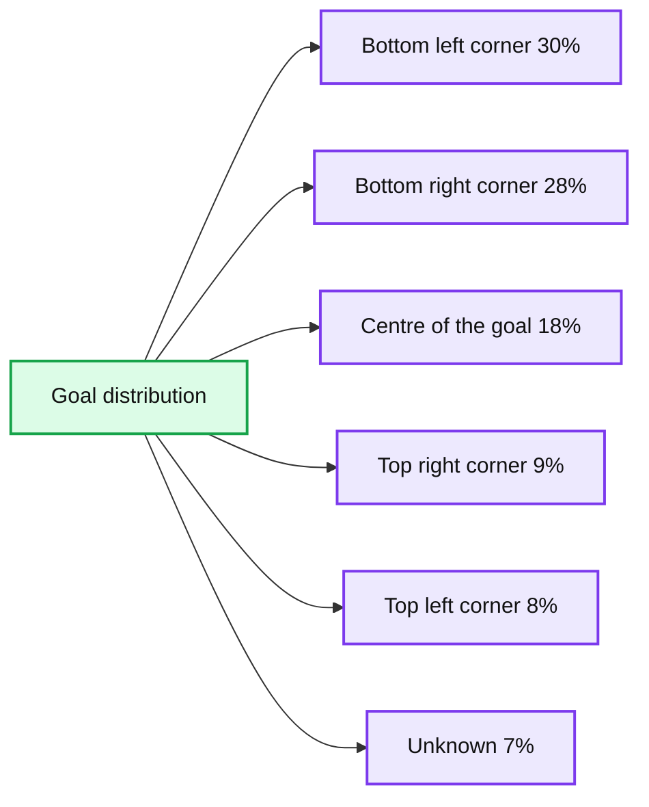
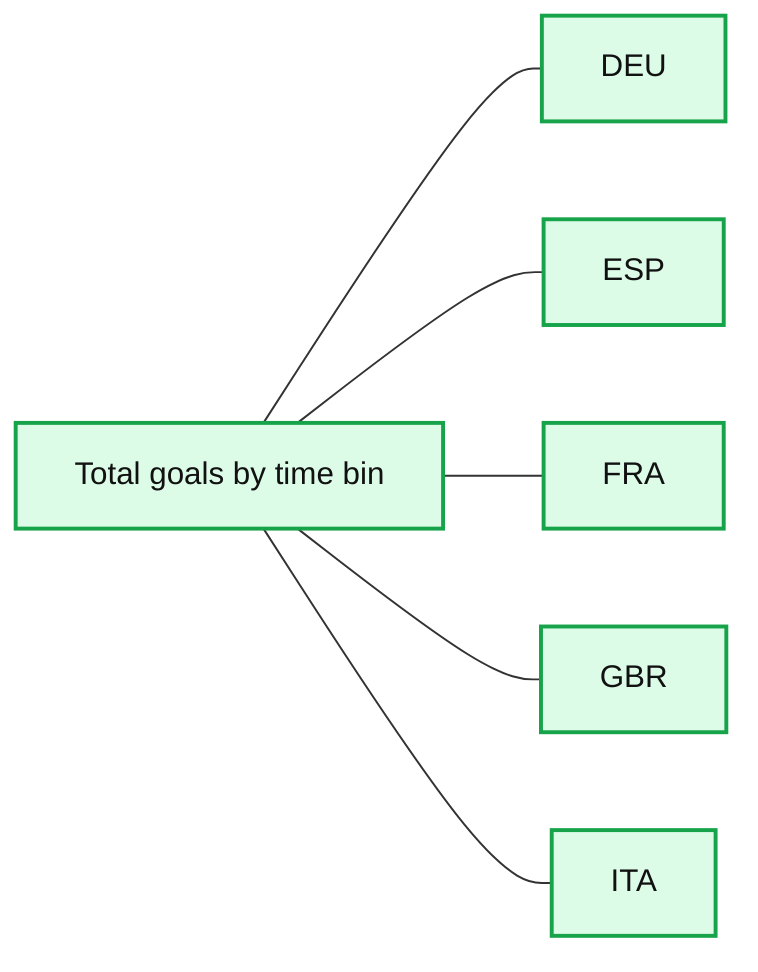

# Analyze Games from European Soccer Leagues with Apache Spark and Databricks

- Source: https://www.databricks.com/blog/2018/07/09/analyze-games-from-european-soccer-leagues-with-apache-spark-and-databricks.html
- Published: 2018-07-09
- Authors: Abhinav Garg, Denny Lee
- Categories: platform, product, engineering, open-source, data-science-machine-learning, news
- Images: 8 total, 3 extracted as architecture

[Try this notebook series in Databricks](https://pages.databricks.com/rs/094-YMS-629/images/european_soccer_events.dbc.zip)

## Introduction

The global sports market is huge, comprised of players, teams, leagues, fan clubs, sponsors, etc., and all of these entities interact in myriad ways generating an enormous amount of data. Some of that data is used internally to help make better decisions, and there are a number of use cases within the media industry that use the same data to create better products and attract/retain viewers.

A few ways that the sports and media industries have started utilizing big data are:

- Analyze on-field conditions and events (passes, player positions, etc.) that lead to soccer goals, football touchdowns, or baseball home runs etc.
- Assess the win-loss percentage with different combinations of players in different on-field positions.
- Track a sportsperson's or team’s performance graph over the years/seasons.

Ultimately, these industries need to build an end-to-end data pipeline comprised of these three functional components: data engineering, data analysis, and machine learning. To extract these insights from their big data, sports and media companies need to build end-to-end data pipelines, our approach to addressing these questions is by selecting a unified platform that offers these capabilities. Databricks provides a [Unified Analytics Platform](https://www.databricks.com/product/data-lakehouse) that brings together big data and AI and allows the different personas of your organization to come together and collaborate in a single workspace.

**Summary:** Databricks Unified Analytics Platform connects soccer data sources to notebook-based data engineering, analytics, and machine learning workflows.

**Components:**

- Databricks Unified Analytics Platform - unified analytics platform
- Databricks Notebooks - notebook-based development environment
- Data Engineering - ETL and pipeline processing
- Data Analytics - data analysis and visualization
- Machine Learning - predictive modeling
- Integration with Data Sources - external data ingestion
- Integrated Workspace - shared collaborative workspace
- Data Democratization - organizational access to data

**Flows:**

- Soccer data -> Data Engineering: soccer game data
- Data Engineering -> Data Analytics: engineered data
- Data Analytics -> Machine Learning: analyzed data and features

**Numbers:** none

```mermaid
%% Shows soccer data flowing through Databricks analytics stages
flowchart LR
    S[Soccer Data] -->|game data| E[Data Engineering]
    E -->|engineered data| A[Data Analytics]
    A -->|analyzed data and features| M[Machine Learning]
    N[Databricks Notebooks] -.->|supports workflows| E
    N -.->|supports workflows| A
    N -.->|supports workflows| M
    W[Integrated Workspace] -.->|shared collaboration| N
    D[Data Democratization] -.->|broad data access| W
    P[Databricks Unified Analytics Platform] -.->|unifies capabilities| W

    %% Legend
    %% client = clients, edge, gateway, or load balancer
    %% service = stateless compute
    %% store = databases or durable storage
    %% cache = losable cache
    %% queue = asynchronous pipes or streams
    %% critical = bottleneck or single point of failure
    %% external = third party
    %% decision = trade off point

    classDef client fill:#dbeafe,stroke:#2563eb,stroke-width:2px,color:#111
    classDef service fill:#dcfce7,stroke:#16a34a,stroke-width:2px,color:#111
    classDef store fill:#ede9fe,stroke:#7c3aed,stroke-width:2px,color:#111
    classDef cache fill:#fef3c7,stroke:#d97706,stroke-width:2px,color:#111
    classDef queue fill:#cffafe,stroke:#0891b2,stroke-width:2px,color:#111
    classDef critical fill:#fee2e2,stroke:#dc2626,stroke-width:4px,color:#111
    classDef external fill:#e5e7eb,stroke:#6b7280,stroke-width:2px,stroke-dasharray:4 3,color:#111
    classDef decision fill:#fce7f3,stroke:#db2777,stroke-width:2px,color:#111

    class S external
    class E,A,M,N,W,P,D service
```

source image: https://www.databricks.com/wp-content/uploads/2018/07/European-Soccer-Events-Analysis-Diagram.png

In this blog, we explore how to:

- Use Databricks notebooks to simplify your ETL (data engineering).
- Use built-in and third-party visualizations with a notebook to simplify your data analysis.
- Execute ML pipelines in a notebook to predict the number of goals.

## European Soccer Leagues Data

We all have a favorite sport, and mine is soccer for its global appeal, an amazing combination of skills and strategy, and the extreme fans that add an extra element to the game.

In this article, we’ll see how you could use Databricks to create an end-to-end data pipeline with European Soccer games data - including facets from data engineering, data analysis, and machine learning, to help answer business questions. We’ll use a dataset from [Kaggle](https://www.kaggle.com/secareanualin/football-events), that provides a granular view of 9,074 games, from the biggest 5 European soccer leagues: England, Spain, Germany, Italy, and France, for the 2011 to 2016 seasons.

The primary dataset is specific events from the games in chronological order, including key information like:

- id_odsp - unique identifier of game
- time - minute of the game
- event_type - primary event
- event_team - the team that produced the event
- player - name of the player involved in the main event
- shot_place - placement of the shot, 13 possible placement locations
- shot_outcome - 4 possible outcomes
- location - location on the pitch where the event happened, 19 possible locations
- is_goal - binary variable if the shot resulted in a goal (own goals included)
- And more..

The second smaller dataset includes high-level information and advanced stats with one record per game. Key attributes are “League”, “Season”, “Country”, “Home Team”, “Away Team” and various market odds.

## Data Engineering

We start out by creating an ETL notebook, where the two CSV datasets are transformed and joined into a single Parquet data layer, which enables us to utilize [DBIO caching](https://docs.databricks.com/delta/optimizations/delta-cache.html) feature for high-performance big data queries.

### Extraction

The first task is to create a DataFrame schema for the larger game events dataset, so the read operation doesn’t spend time inferring it from the data. Once extracted, we’ll replace “null” values for interesting fields with data-type specific constants as noted in the code snippet below.

This is what the raw data (with some NULLs replaced) looks like:

We also read the second dataset into a DataFrame, as it includes the country name which we’ll use later during analysis.

### Transformation

The next step is to transform and join the DataFrames into one. Many fields of interest in the game events DataFrame have numeric IDs, so we define a generic [UDF](https://docs.databricks.com/spark/latest/spark-sql/udf-python.html) that could use look-up tables for mapping IDs to descriptions.

The mapped descriptions are stored in new columns in the DataFrame. So once the two DataFrames are joined, we’ll filter out the original numeric columns to keep it as sparse as possible. We’ll also use QuantileDiscretizer to add a categorical “time_bin” column based on “time” field.

This next code snippet performs a lookup using UDFs and joining DataFrames.

### Loading

Once the data is in the desired shape, we’ll load it as Parquet into a Spark table that would reside in a domain-specific database. The database and table will be registered with internal Databricks metastore, and the data will be stored in [DBFS](https://docs.databricks.com/data/databricks-file-system.html). We’ll partition the Parquet data by “country_code” during write.

## Data Analysis

Now that the data shape and format is all set, it’s time to dig in and try and find answers to a few business questions. We’ll use plain-old super-strong SQL (Spark SQL) for that purpose, and create a second notebook from the perspective of data analysts.

For example, if one wants to see the distribution of goals by shot placement, then it could look like this simple query and resulting pie-chart (or alternatively viewable as a data-grid).

**Summary:** Donut chart showing the distribution of goals by shot placement.

**Components:**

- Bottom left corner shot placement: 30%
- Bottom right corner shot placement: 28%
- Centre of the goal shot placement: 18%
- Top right corner shot placement: 9%
- Top left corner shot placement: 8%
- Unknown shot placement: 7%

**Flows:**

- none

**Numbers:** 30%, 28%, 18%, 9%, 8%, 7%

source image: https://www.databricks.com/wp-content/uploads/2018/07/European-Soccer-Events-Analysis-shotplacement.png

Or, if the requirement is to see the distribution of goals by countries/leagues, it could look like this map visualization (which needs ISO country codes, or US state codes as a column).

Once we observe that Spanish league has had most goals over the term of this data, we could find the top 3 goals locations per shot place from the games in Spain, by writing a more involved query using [Window functions](https://docs.databricks.com/spark/latest/spark-sql/language-manual/sql-ref-syntax-qry-select.html#window-functions) in Spark SQL. It would be a stepwise nested query:

**Summary:** Line chart showing total goals by time bin for five European soccer countries.

**Components:**

- DEU series, technology not shown
- ESP series, technology not shown
- FRA series, technology not shown
- GBR series, technology not shown
- ITA series, technology not shown
- TOT_GOALS y-axis
- Time-bin x-axis
- COUNTRY_C legend

**Flows:**

- none

**Numbers:** 0, 1, 2, 3, 4, 5, 6, 7, 8, 9; 250, 300, 350, 400, 450, 500, 550, 600, 650

source image: https://www.databricks.com/wp-content/uploads/2018/07/European-Soccer-Events-Analysis-Goals-per-timebin-per-country.png

## Machine Learning

As we saw, doing descriptive analysis on big data (like above) has been made super easy with Spark SQL and Databricks. But what if you’re a data scientist who’s looking at the same data to find combinations of on-field playing conditions that lead to “goals”?

We’ll now create a third notebook from that perspective, and see how one could fit a GBT classifier Spark ML model on the game events training dataset. In this case, our binary classification label will be field “is_goal”, and we’ll use a mix of categorical features like "event_type_str", "event_team", "shot_place_str", "location_str", "assist_method_str", "situation_str" and "country_code".

First, we need to do the necessary imports from Spark ML:

Then the following three-step process is required to convert our categorical feature columns to a single binary vector:

- Convert string features to indices using [StringIndexer](https://spark.apache.org/docs/latest/ml-features.html#stringindexer)
- Transform feature indices to binary vectors using [OneHotEncoder](https://spark.apache.org/docs/latest/ml-features.html#onehotencoder)
- Assemble different binary vector columns into a single vector using [VectorAssembler](https://spark.apache.org/docs/latest/ml-features.html#vectorassembler)

Finally, we’ll create a Spark ML [Pipeline](https://spark.apache.org/docs/latest/ml-pipeline.html#pipeline) using the above transformers and the GBT classifier. We’ll divide the game events data into training and test datasets, and fit the pipeline to the former.

Now we can validate our classification model by running inference on the test dataset. We could compare the predicted label with actual label one by one, but that could be a painful process for lots of test data. For scalable model evaluation in this case, we can use BinaryClassificationEvaluator with [area under ROC](https://en.wikipedia.org/wiki/Receiver_operating_characteristic) metric. One could also use the [Precision-Recall Curve](https://en.wikipedia.org/wiki/Precision_and_recall) as an evaluation metric. If it was a multi-classification problem, we could’ve used the MulticlassClassificationEvaluator.

## Summary

We demonstrated how to build the three functional components of data engineering, data analysis, and machine learning using the [Databricks Unified Analytics Platform](https://www.databricks.com/product/data-lakehouse).  We’ve illustrated how you can run your ETL, analysis, and visualization, and machine learning pipelines all within a single Databricks notebook. By removing the data engineering complexities commonly associated with such data pipelines with the Databricks Unified Analytics Platform, this allows different sets of users i.e. data engineers, data analysts, and data scientists to easily work together to find hidden value in big data from any sports.

But this is just the first step. A sports or media organization could do more by running model-based inference on real-time streaming data processed using [Structured Streaming](https://docs.databricks.com/spark/latest/structured-streaming/index.html), in order to provide targeted content to its users. And then there are many other ways to combine different Spark/Databricks technologies, to solve different big data problems in sport and media industries.

## Read More

Download our [European Soccer Events Notebook](https://pages.databricks.com/rs/094-YMS-629/images/european_soccer_events.dbc.zip) to begin modeling this data yourself
