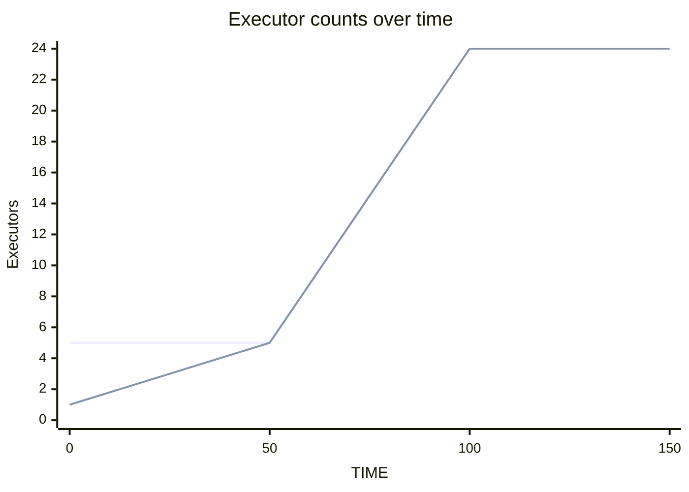
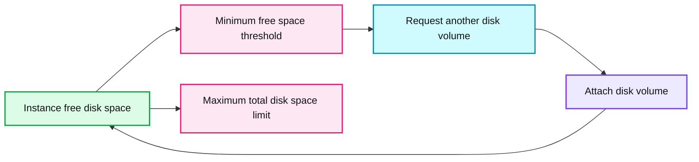
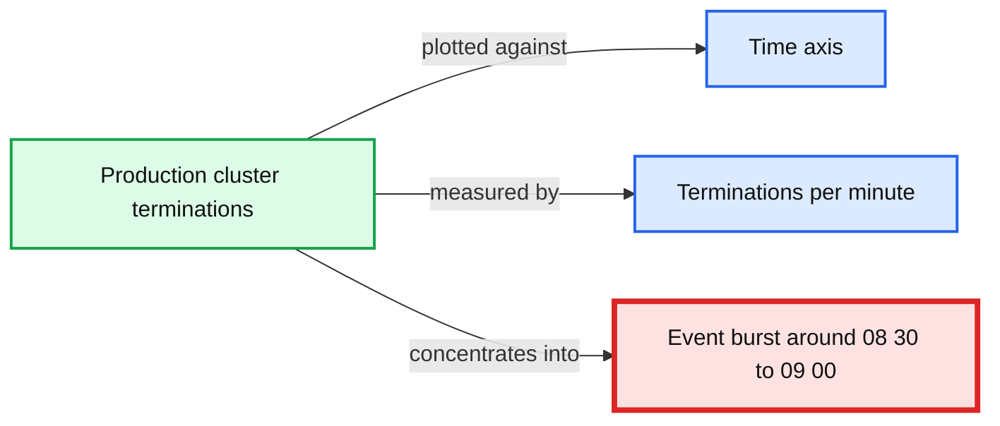

# Apache Spark™ Clusters in Autopilot Mode

- Source: https://www.databricks.com/blog/2018/07/17/apache-spark-clusters-in-autopilot-mode.html
- Published: 2018-07-17
- Authors: Haogang Chen, Prakash Chockalingam
- Categories: engineering, open-source
- Images: 7 total, 5 extracted as architecture

Apache Spark™ is a unified analytics engine that helps users use a single distributed computing framework for various use cases. With the advent of cloud computing, setting up your own platform using Apache Spark is relatively easy. There are also tools / services that cloud providers provide to make setup easier. However, the real hard problems where devops and platform engineers spend a lot of time in building and maintaining such a platform are:

- **High availability: **In the cloud, all the workloads are running on low-cost commodity machines. Being able to easily recover from failures is critical. Also, ensuring high availability of the clusters during software updates of the side car services in the cluster is also very essential.
- **Optimizing for cost:** Clusters need to be set up in such a way that they autoscale efficiently, they are terminated when not being used, and leverage spot market and use those instances in such a way that to lower costs but also not affect the workloads' stability when there are fluctuations in spot price.
- **Optimizing for performance: **Different workloads have different resource requirements and they need to run fast and efficiently utilizing all the resources.
- **Fault isolation while handling user code: **Clusters also need to be set up in such a way that different users do not bring down the clusters because of their user code.

Typically, solutions to these class of problems not only require an enormous amount of time in implementation, but they also introduce complexity in configuration and frequently require manual intervention to address them. This blog summarizes all the major capabilities Databricks provides you out of the box that put Databricks clusters in an "autopilot mode" so that devops need not worry about these platform problems anymore.

### **Automatic scaling of compute**

Autoscaling compute is a basic capability that many big data platforms provide today. But most of these tools expect a static resource size allocated for a single job, which doesn't take advantage of the elasticity of the cloud. Resource schedulers like YARN then take care of "coarse-grained" autoscaling between different jobs, releasing resources back only after a Spark job finishes. This suffers from two problems:

- Estimating a good size for the job requires a lot of trial and error.
- Users typically over-provision the resources for the maximum load based on time of day, the day of the week or some special occasions like black Friday.

Databricks autoscaling is more dynamic and based on fine-grained Spark tasks that are queued on the Spark scheduler. This allows clusters to scale up and down more aggressively in response to load and improves the utilization of cluster resources automatically without the need for any complex setup from users. Databricks autoscaling helps you save up to 30% of the cloud costs based on your workloads. See the [optimized autoscaling blog](https://www.databricks.com/blog/2018/05/02/introducing-databricks-optimized-auto-scaling.html) to learn more on how you save cloud costs by using Databricks autoscaling.

*Figure 1. With Databricks' optimized resource management, the number of deployed executors tracks the usage by the workload more closely. As a result, in this case aggressive autoscaling results in 25% fewer resources being deployed over the lifetime of the workload, meaning a 25% cost savings for the user.*

**Summary:** The chart compares deployed and active executor counts over time, showing deployed resources generally tracking workload activity.

**Components:**

- Deployed executor count series
- Active executor count series
- Time axis

**Flows:**

- Time -> Deployed executor count: deployed executor levels over time
- Time -> Active executor count: active executor levels over time

**Numbers:** 0, 5, 10, 15, 20, 25%, 30%, 50, 100, 150

source image: https://www.databricks.com/sites/default/files/inline-images/imgs-1.png

Figure 1. With Databricks' optimized resource management, the number of deployed executors tracks the usage by the workload more closely. As a result, in this case aggressive autoscaling results in 25% fewer resources being deployed over the lifetime of the workload, meaning a 25% cost savings for the user.

### **Automatic scaling of local storage**

Big data workloads require access to disk space for a variety of operations, generally when intermediate results will not fit in memory. When the required disk space is not available, the jobs fail. To avoid job failures, data engineers and scientists typically waste time trying to estimate the necessary amount of disk via trial and error: allocate a fixed amount of local storage, run the job, and look at system metrics to see if the job is likely to run out of disk. This experimentation – which becomes especially complicated when multiple jobs are running on a single cluster – is expensive and distracts these professionals from their real goals.

Databricks clusters allows instance storage to transparently autoscale independently from compute resources so that data scientists and engineers can improve their productivity tremendously while moving their ETL jobs from development to production.

Learn more from the [transparent autoscaling of instance storage blog](https://www.databricks.com/blog/2017/12/01/transparent-autoscaling-of-instance-storage.html) on how we optimally autoscale the instance storage and its benefits.

*Figure 2. Graph showing the free disk space for an instance with autoscaling local storage turned on. Whenever the free disk space drops below our minimum threshold, we request another disk volume and attach it to the instance. Subsequent requests allocate ever-larger disk volumes until we hit a pre-configured maximum total disk space.*

**Summary:** Free disk space per instance decreases over time and resets upward whenever autoscaling local storage attaches an additional disk volume.

**Components:**

- Instance free disk space, measured in GB
- Autoscaling local storage
- Disk volume attachment
- Minimum free-space threshold
- Maximum total disk-space limit
- Time axis

**Flows:**

- Instance -> Minimum free-space threshold: free disk space declines during operation
- Minimum free-space threshold -> Disk volume attachment: low-space event requests another volume
- Disk volume attachment -> Instance: additional capacity raises free disk space
- Instance -> Maximum total disk-space limit: successive allocations grow until the configured maximum

**Numbers:** 0, 200, 400, 600, 800, 1K, 1.2K, 1.4K GB; 18:00, 20:00, 22:00, 00:00, 02:00, 04:00, 06:00, 08:00, 10:00, 12:00, 14:00, 16:00, 18:00, 20:00, 22:00, 00:00

source image: https://www.databricks.com/sites/default/files/inline-images/imgs-2.png

Figure 2. Graph showing the free disk space for an instance with autoscaling local storage turned on. Whenever the free disk space drops below our minimum threshold, we request another disk volume and attach it to the instance. Subsequent requests allocate ever-larger disk volumes until we hit a pre-configured maximum total disk space.

### **Automatic termination**

Databricks clusters can be set to terminate automatically after a set idle time to save on your cloud costs.

Figure 3. Auto termination option that can be configured in the cluster UI

### **Automatic start**

Databricks clusters also start automatically! Whenever a cluster receives a command from Jobs scheduler or JDBC/ODBC interface, the cluster automatically wakes up and then executes them. This is tremendously useful in the following scenarios:

- **Scheduled production jobs:** When you have a series of scheduled Databricks jobs on a single cluster and if there are idle periods when you want to shut down the cluster and save cost, you can now do that easily. When a scheduled job is submitted to a terminated cluster, it will automatically wake up the cluster and run the job.
-  
- **BI use cases: **If you are connecting BI tools like Tableau to a Databricks cluster, before the availability of this feature, your data analysts need to login to Databricks and start the cluster. Now they no longer need to login to Databricks. They can just run commands from Tableau. If the cluster is in terminated state, it will automatically start. This will allow platform teams to roll out a serverless big data platform for internal data analysts to slice and dice big data without having to worry about any concept of clusters.
-  
- **Warm up cluster:** You have a situation when you step into the office tomorrow at 9am, you want to have a cluster up and running with certain analysis done and certain data cached so that you can be more productive and continue your work as soon as you step into the office. You can now schedule a job at early in the morning that would automatically wake up the cluster and run the analysis and have everything ready by the time you step into the office. You no longer need to write custom scripts that uses Databricks REST APIs for this purpose.

Together with auto-termination, auto-start is a powerful feature that allows users to just set the cluster configuration once and then let Databricks take care of automatically starting and terminating clusters based on usage.

### **Automatic recovery and resilience to spot price fluctuations**

In a cloud environment, computing resources can fail for various reasons:

- Cost-efficient nodes such as spot instances or low priority VMs may be reclaimed by the cloud provider at anytime
- A node can get stuck in an unresponsive state due to software bugs
- Transient network failures can also cause instance malfunctioning

Detecting and recovering from various failures is a key challenge in a distributed computing environment. With built-in support for automatic recovery, Databricks ensures that the Spark workloads running on its clusters are resilient to such failures. The Databricks cluster manager periodically checks the health of all nodes in a Spark cluster. Depending on the nature of the failure, it smartly recovers the cluster with the minimal cost. For example, when an executor crashes or gets stuck, Databricks simply restarts the process to avoid strangling the entire workload; when an underlying instance is fully unresponsive, Databricks acquires a new instance from the cloud provider to replace the malfunctioning one.

Automatic recovery also helps Databricks clusters gain the upside of high availability while maintaining low cost. Take AWS as an example, customers can configure their clusters to use spot instances with fallback to on-demand instances. With this setting, Databricks will first try to use spot instances at user-specified bidding ratio at a much lower price. When that fails, it automatically switches to on-demand instances so that your workloads run smoothly even during spot price fluctuation.

Figure 4. UI options to configure spot/on-demand composition and fallback mechanism.

### **Automatic monitoring instrumentation**

Databricks services stream hundreds of metrics to our internal monitoring system every minute. Those metrics include cluster launch duration, cluster and node terminations, worker disk usage hikes, network connectivity issues, and Spark configuration errors. The monitoring system automatically categorizes the metrics and visualizes them on dashboards. The metrics help Databricks determine and guard the health of clusters on behalf of our customers. In the case where failure recovery is impossible, such as the Spark master node going down or prolonged cloud-provider outage, Databricks collects diagnosis information and reports the cluster termination reason to customers for better visibility.

Databricks also get alerts for spikes of correlated incidents. For instance, when the rate of abnormal cluster terminations exceeds a threshold, the monitoring system automatically sends alerts to our first responders so that they can drill down the root cause. Given the large volume of instances that Databricks manages for our customers, sometimes Databricks even detects large-scale cloud outages before the cloud provider reports them. Once the root cause is confirmed, Databricks proactively sets up a banner to affected customers to inform them about the outage and the root cause.

*Figure 5. A burst of cluster terminations from anonymized customers during a regional S3 outage in us-east-1 on March 20th, 2018. Databricks detected the outage 15 minutes before AWS reported it on their service status page.*

**Summary:** Scatter plot showing a burst of abnormal production cluster terminations concentrated between approximately 08:25 and 09:00.

**Components:**

- Production cluster termination events, technology not specified
- Time axis
- Cluster terminations per minute axis

**Flows:**

- none

**Numbers:** 07:00, 07:30, 08:00, 08:30, 09:00, 09:30

source image: https://www.databricks.com/sites/default/files/inline-images/imgs-5.png

Figure 5. A burst of cluster terminations from anonymized customers during a regional S3 outage in us-east-1 on March 20th, 2018. Databricks detected the outage 15 minutes before AWS reported it on their service status page.

### **Automatic software updates**

As a SaaS platform, Databricks releases new features and bug fixes to our customers in a regular cadence. Many updates affect side-car services running in the cluster along with Spark workers. A key challenge is how to deploy updates on tens of thousands of worker instances without interrupting or interfering with the customers' running workloads.

Databricks update manager monitors the version of side-car services running on existing Spark workers, and gradually brings them up-to-date with the latest release. The updates are carefully throttled so that they do not cause performance degradation on Spark workloads. New clusters are always launched with the latest software. In this way, updates are usually deployed to all Spark clusters transparently within an hour of release while incurring zero downtime on customers' production workloads.

**Summary:** The chart shows Spark worker processes transitioning from an old software version to a new version during a throttled software update window.

**Components:**

- Old worker services version, represented by the green process line
- New worker services version, represented by the yellow process line
- Software update window
- Worker process count metric

**Flows:**

- Old worker version -> Software update window: Old-version processes are gradually reduced
- Software update window -> New worker version: New-version processes are gradually increased
- Old worker version -> New worker version: Version dominance shifts during the update

**Numbers:** 17:00, 17:10, 17:20, 17:30, 17:40, 17:50, 18:00, 18:10, 18:20, 18:30, 18:40, 0; legend IDs `0670ea57774eb51146842917d7163d03518ca0df2910e3324fb7a5618776282` and `ad24c36a4f88c498ba0392ed0101bc522586e2b5852e4d88de9b9bbfa7efdfe`

source image: https://www.databricks.com/wp-content/uploads/2018/07/image1-2-1024x430.png

### **Automatic preemption**

When multiple users are sharing a cluster, it is very common to have a single job from a user monopolize all the cluster resources, thereby slowing all other jobs on the cluster. Apache Spark's fair scheduler pool can help address such issues for a small number of users with similar workloads. As the number of users on a cluster increases, however, it becomes more and more likely that a large Spark job will monopolize all the cluster resources. The problem can be aggravated when multiple data personas are running different types of workloads on the same cluster. For example, a data engineer running a large ETL job will often prevent a data analyst from running short, interactive queries.

To combat such problems, Databricks clusters proactively preempt Spark tasks from over-committed users to ensure all users get their fair share of cluster time. This gives each user a highly interactive experience while still minimizing overall resource costs. See the documentation on [task preemption](https://docs.databricks.com/clusters/preemption.html) to know more.

### **Automatic killing of rogue jobs**

In a multi-user scenario, sometimes it is also possible that a user's job is going rogue causing it to consume all the resources. Even with task preemption, the job could still saturate cluster resources and stall everyone's job. One example would be a user job that does an unintentional cross join of two large datasets resulting in a large amount of intermediate data. In such cases, Databricks clusters has a simple process, [Query Watchdog](https://www.databricks.com/blog/2017/04/17/query-watchdog-handling-disruptive-queries-spark-sql.html), that periodically checks if the job is creating too many output rows for the number of input rows at a task level and kills any rogue job that produces too many output rows.

### **Automatic caching**

During interactive analysis, users typically run ad-hoc queries / jobs that repeatedly read the same set of data. In such cases, caching repeatedly used data is very useful. Typically, users need to worry about which data to cache, how to evict unused data, how to load balance the cached data and handle updates to cached data.

In Databricks, if you choose certain instance types with SSDs, Databricks transparently transcodes the data into an on-disk caching format and caches it in the instance's SSD whenever a remote file is accessed. We also take care of evicting long unused data and load balancing the cached data across all nodes in the cluster. The cache also automatically detects when a file is added or deleted in the original source location and presents the up-to-date state of the data. Read the blog about [DBIO Cache](https://www.databricks.com/blog/2018/01/09/databricks-cache-boosts-apache-spark-performance.html) to know more about our caching feature.

**Summary:** Benchmark chart comparing local-storage read speeds on an AWS i3.xlarge instance across five data formats and caching.

**Components:**

- Json
- CSV
- Parquet with gzip
- Parquet with snappy
- DBIO cache
- AWS i3.xlarge local storage

**Flows:**

- none

**Numbers:**

- 80 M values read per core per second
- 60 M values read per core per second
- 40 M values read per core per second
- 20 M values read per core per second
- 0 M values read per core per second
- AWS i3.xlarge

source image: https://www.databricks.com/wp-content/uploads/2018/07/image6-2.png

### **Conclusion**

We walked through a series of "automatic" features in Databricks clusters that lets users not worry about the platform anymore and just focus on the data. These features also illustrate how our unified analytics platform reduces time to value for the big data projects.

If you are interested in trying out all these "automatic" features, sign up for a free trial on AWS [here](https://accounts.cloud.databricks.com/registration.html#signup). If you are on Azure, you can login to your Azure subscription and start using Databricks.

If you are passionate about building and solving these problems for thousands of enterprise users, [we are hiring](https://www.databricks.com/company/careers)!
