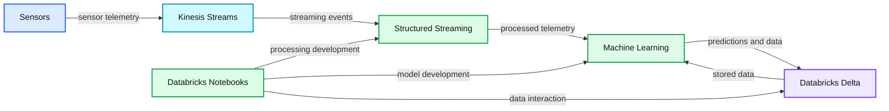
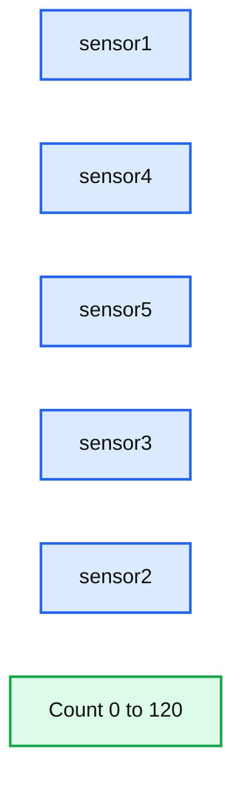
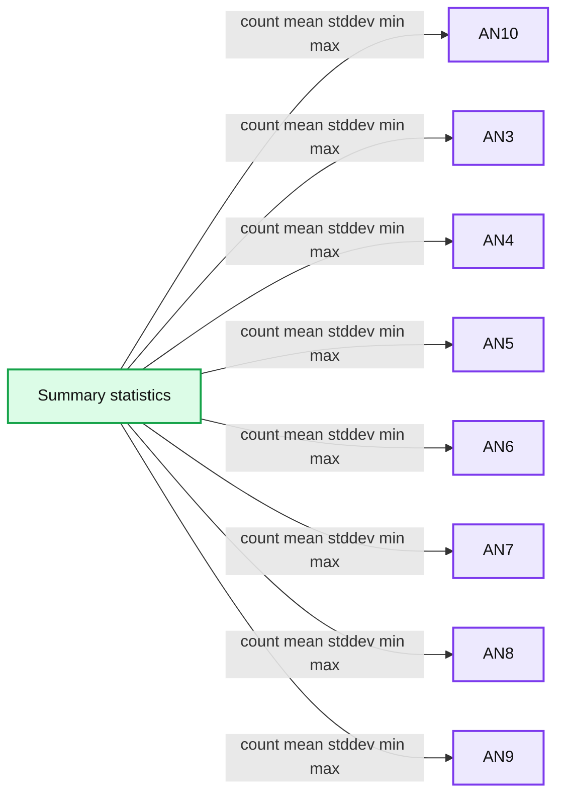

# Make Your Oil and Gas Assets Smarter by Implementing Predictive Maintenance with Databricks

- Source: https://www.databricks.com/blog/2018/07/19/make-your-oil-and-gas-assets-smarter-by-implementing-predictive-maintenance-with-databricks.html
- Published: 2018-07-19
- Authors: Don Hillborn, Denny Lee
- Categories: platform, solutions, product, engineering, solution-accelerators, open-source, data-science-machine-learning, data-engineering, data-streaming, news
- Images: 5 total, 4 extracted as architecture

How to build an end-to-end predictive data pipeline with Databricks Delta and Spark Streaming

Maintaining assets such as compressors is an extremely complex endeavor: they are used in everything from small drilling rigs to deep-water platforms, the assets are located across the globe, and they generate terabytes of data daily.  A failure for just one of these compressors costs millions of dollars of lost production per day. An important way to save time and money is to use machine learning to predict outages and issue maintenance work orders *before* the failure occurs.

Ultimately, you need to build an end-to-end predictive data pipeline that can provide a real-time database to maintain asset parts and sensor mappings, support a continuous application that processes a massive amount of telemetry, and allows you to predict compressor failures against these datasets.

**Summary:** The diagram shows Databricks Unified Analytics Platform processing sensor data through Kinesis Streams and Structured Streaming, applying machine learning, and storing results in Databricks Delta.

**Components:**

- Sensors: asset telemetry sources
- Kinesis Streams: streaming data ingestion
- Structured Streaming: continuous stream processing
- Databricks Notebooks: collaborative analytics and development
- Machine learning: predictive modeling
- Databricks Delta: reliable data lake storage
- Elastic Scalability: scalable platform capability
- Data Democratization: shared access to analytics
- Reliant and Performant Data Lakes: durable and performant storage layer
- Databricks Unified Analytics Platform: integrated analytics environment

**Flows:**

- Sensors -> Kinesis Streams: sensor telemetry
- Kinesis Streams -> Structured Streaming: streaming events
- Structured Streaming -> Machine Learning: processed telemetry
- Machine Learning -> Databricks Delta: predictions and analytical data
- Databricks Delta -> Machine Learning: stored data for model use
- Databricks Notebooks -> Structured Streaming: processing development
- Databricks Notebooks -> Machine Learning: model development
- Databricks Notebooks -> Databricks Delta: data lake interaction

**Numbers:** none

source image: https://www.databricks.com/wp-content/uploads/2018/07/Predicting-Compressor-Failure-using-Streaming-K-Means.png

Our approach to addressing these issues is by selecting a unified platform that offers these capabilities. Databricks provides a [Unified Analytics Platform](https://www.databricks.com/product/data-lakehouse) that brings together big data and AI and allows the different personas of your organization to come together and collaborate in a single workspace.  Other important advantages of the Databricks Unified Analytics Platform include the ability to:

- Spin up the necessary resources and have your data scientists, data engineers, and data analysts making sense of their data quickly.
- Have a multi-cloud strategy allowing everyone to use the same collaborative workspace in [Azure](https://portal.azure.com/#create/hub) or [AWS](https://accounts.cloud.databricks.com/login#plans).
- Stand up a diverse set of instance type combinations to optimally run your workloads
- Schedule commands (including [REST API commands](https://docs.databricks.com/dev-tools/api/latest/index.html)) that allows you to auto-create and auto-terminate your clusters.
- Quickly and easily enable access control to assign permissions as well as enable access tokens for secure REST API calls when productionizing your solution.

In this blog post, we will show how you can make your oil and gas assets smarter by:

- Using Spark Streaming in Databricks to process the immense amount of sensor telemetry.
- Building and deploying your machine learning models to predict asset failures before they happen.
- Creating a real-time database using Databricks Delta to store and stream sensor parts and assets.

## Establishing your Kinesis Stream

To predict catastrophic failures, we need to combine the asset sensors continuous stream of data from Kinesis, Spark Streaming, and our Streaming K-Means model.  Let’s start by configuring our Kinesis stream using the code snippet below. To dive deeper, refer to [Databricks - Amazon Kinesis Integration](https://docs.databricks.com/spark/latest/structured-streaming/kinesis.html).

With your credentials established, you can run a Spark Streaming query that reads words from Kinesis and counts them up with the following code snippet.

**Summary:** Bar chart showing event counts for five Kinesis sensors.

**Components:**

- sensor1
- sensor4
- sensor5
- sensor3
- sensor2
- Count axis

**Flows:**

- none

**Numbers:** 0, 20, 40, 60, 80, 100, 120

source image: https://www.databricks.com/wp-content/uploads/2018/07/Kinesis-Sensor-Count.png

To configure your own Kinesis stream, write those words to your Kinesis Stream by creating a low-level Kinesis client such as the following code snippet that loops every 5s.

## Explore your Sensor Data

Before we can build our model to predict healthy vs. damaged compressors, let’s start by doing a little data exploration.  First, we need to import our healthy and damaged compressor data; the following code snippet imports the healthy compressor data that is in CSV format into a Spark SQL DataFrame.

We also save the data as a Spark SQL table so we can query it using Spark SQL.  For example, we can use the Databricks `display` command to view the table statistics of our damaged compressor table.

**Summary:** The table shows summary statistics for damaged compressor sensor columns AN10 through AN9.

**Components:**

- Summary statistics table
- AN10 sensor data
- AN3 sensor data
- AN4 sensor data
- AN5 sensor data
- AN6 sensor data
- AN7 sensor data
- AN8 sensor data
- AN9 sensor data

**Flows:**

- none

**Numbers:**

- Count: 4800000 for every column
- AN10: mean -0.030449921150882166, stddev 2.8419374826204247, min -12.055, max 11.819
- AN3: mean -0.01944659790363063, stddev 2.81618648590337, min -13.122, max 14.954
- AN4: mean -0.13164195612634808, stddev 3.9206750512927946, min -19.942, max 22.368
- AN5: mean -0.04307932211098549, stddev 4.2441952599627975, min -20.795, max 20.879
- AN6: mean -0.0583161913047627, stddev 3.9058248278300307, min -20.448, max 19.181
- AN7: mean -0.041862647287631255, stddev 7.960295568414721, min -41.889, max 40.393
- AN8: mean -0.08345774076873583, stddev 7.207558296151166, min -33.073, max 33.998
- AN9: mean -0.017155095, stddev 4.0145141768, min -22.513, max 18.188

source image: https://www.databricks.com/wp-content/uploads/2018/07/Damaged-Compressor-Table-Statistics.png

After taking a random sample of healthy and damaged data using the following code snippet:

we can use the Databricks `display` command to visualize our random sample of data using a scatter plot.

## Building our Model

The next steps for implementing our predictive maintenance model is to create a K-Means model to cluster our datasets to predict damaged vs. healthy compressors. In addition to K-Means being a popular and well-understood clustering algorithm, there is also the benefit of using a streaming k-means model allowing us to easily execute the same model in batch and in streaming scenarios.

The first thing we want to do is to determine the optimal k value (i.e. optimal number of clusters). As we are currently identifying the difference between healthy and damaged, intuitively the value of k is 2 but let’s validate. As noted in the following code snippet, we will build an ML pipeline so we can easily re-use the model for our new dataset (i.e. the streaming dataset upstream). Our ML pipeline is relatively straightforward using VectorAssembler to define our features involving the Air and Noise columns (i.e. columns preceding with AN) and scaling it using MinMaxScaler.

Now that we have identified the optimal k value, we can now build our model with 2 clusters. The code snippet below creates our KMeans model (`bestModel`) against our healthy compressor data (`prepData`) and calculates the WSSSE (`wssse`).

We can quickly observe the difference between the healthy vs. damaged compressors via the WSSSE values by applying the damaged compressor data to the same ML pipeline and model.

## Deploying the model using Streaming K-Means

While we have a potentially viable model to predict compressor failure, executing this model in real-time (vs. batch) allows us to build a *continuous application* that constantly receives asset sensor streams. We can now potentially predict compressor failure even earlier thus providing us more time to fix or replace the compressor prior to a catastrophic failure.

The following code snippet creates our Streaming KMeans model using the same `bestK` value for the `setK` property (i.e. 2 clusters). To dive deeper into the Streaming K-Means algorithm, refer to the [MLlib Programming Guide > MLlib Clustering > Streaming K-Means](https://spark.apache.org/docs/latest/mllib-clustering.html#streaming-k-means).

Next we create our streaming function using the `StreamingContext` to calculate the WSSSE for each mini-batch.

With Streaming K-Means model and Spark Streaming function created, the following code snippet now starts our Spark Streaming context.

To persist our data, as noted in the Spark Streaming function, we have saved the timestamp and WSSSE values as JSON to DBFS (in this example, within `/tmp/compressors`). Files in [DBFS](https://docs.databricks.com/data/databricks-file-system.html) persist to blob storage, so you won’t lose data even after you terminate a cluster. The following code snippet allows you to view the stream of WSSSE calculations by timestamp thus allowing you to predict the failure rate of your compressors as the sensor data is being received.

**Summary:** The chart shows WSSSE over successive timestamps, rising from approximately 193.5 to 203.

**Components:**

- WSSSE metric
- Timestamp observations

**Flows:**

- 1517620380 -> 1517620390: WSSSE increases
- 1517620390 -> 1517620400: WSSSE remains nearly constant
- 1517620400 -> 1517620410: WSSSE increases

**Numbers:** 193.5 approximately, 194, 196, 198, 200, 202, 204, 1517620380, 1517620390, 1517620400, 1517620410, 198.9 approximately, 199 approximately, 203 approximately

```mermaid
%% WSSSE values across successive timestamps
flowchart LR
    A[Timestamp 1517620380 WSSSE 193.5] -->|increases| B[Timestamp 1517620390 WSSSE 198.9]
    B -->|nearly constant| C[Timestamp 1517620400 WSSSE 199]
    C -->|increases| D[Timestamp 1517620410 WSSSE 203]

    classDef client fill:#dbeafe,stroke:#2563eb,stroke-width:2px,color:#111
    classDef service fill:#dcfce7,stroke:#16a34a,stroke-width:2px,color:#111
    classDef store fill:#ede9fe,stroke:#7c3aed,stroke-width:2px,color:#111
    classDef cache fill:#fef3c7,stroke:#d97706,stroke-width:2px,color:#111
    classDef queue fill:#cffafe,stroke:#0891b2,stroke-width:2px,color:#111
    classDef critical fill:#fee2e2,stroke:#dc2626,stroke-width:4px,color:#111
    classDef external fill:#e5e7eb,stroke:#6b7280,stroke-width:2px,color:#111,stroke-dasharray:4 3
    classDef decision fill:#fce7f3,stroke:#db2777,stroke-width:2px,color:#111

    class A,B,C,D service
```

source image: https://www.databricks.com/wp-content/uploads/2018/07/Streaming-K-Means.png

We can rely on Apache Spark Streaming to process all of our asset telemetries because it provides strong guarantees about system state: at any time, the output of the application is equivalent to executing a batch job on a prefix of the data. This consistency rule makes it easy to reason about past streaming challenges. Spark Streaming in Databricks provides the power of easily creating continuous applications, simplifying the maintenance of your streaming applications, and the power of the Databricks integrated workspace.

## Re-train your model using a real-time database using Databricks Delta

While we have a viable Streaming K-Means model, it is very common to re-train our model as new rows and/or new attributes of data are received. A powerful option would be to create a real-time database that has the ability to store both your legacy (e.g. healthy and damaged compressor data) and new transactions as they are streaming in a consistent manner. To do this, we can use Databricks Delta which provides the performance and reliability of a data warehouse (for the large volumes of legacy compressor data) and the ability to allow for ‘real-time’ updates (for asset telemetry).

In the previous section, we created the table using `saveAsTable` instead we can use the `USING DELTA` option such as the following code snippet.

This Spark SQL statement creates a Databricks Delta table on which you can train and retrain your model that also provides:

- Ensure data integrity with transactional guarantees.
- Enable the most consistent view of your streaming writes.
- Accelerate query speeds through indexing and caching.

## Summary

In this blog post, we demonstrated how you can implement predictive maintenance with the [Databricks Unified Analytics Platform](https://www.databricks.com/product/data-lakehouse) by combining Spark Streaming, machine learning, and Databricks Delta.   Within a single notebook, you can read and write to a Kinesis stream, build a K-Means model within a ML pipeline, and apply a model to Spark Streaming so you can predict compressor failures as the data is received.  With the Databricks Unified Analytics Platform you can remove the data engineering complexities commonly associated with such data pipelines and easily work with three different data paradigms - streaming, SQL, and machine learning - to potentially prevent failures for any of your assets.

## Read More

For more information on Databricks Delta and Structured Streaming read these sources:

- [Case Study: Shell Improves Maintenance with Machine Learning on Databricks](https://www.databricks.com/customers/shell)
- [Databricks Guide: Structured Streaming](https://docs.databricks.com/spark/latest/structured-streaming/index.html#)
- [An Anthology of Technical Assets on Apache Spark’s Structured Streaming](https://www.databricks.com/blog/2017/08/24/anthology-of-technical-assets-on-apache-sparks-structured-streaming.html)
- [Databricks Delta Guide](https://docs.databricks.com/delta/index.html)
