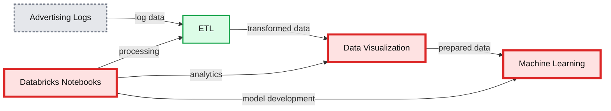
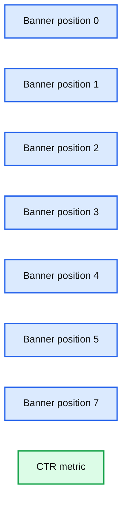

# Simplify Advertising Analytics Click Prediction with Databricks Unified Analytics Platform

- Source: https://www.databricks.com/blog/2018/07/19/simplify-advertising-analytics-click-prediction-with-databricks-unified-analytics-platform.html
- Published: 2018-07-19
- Authors: Tony Cruz, Denny Lee
- Categories: platform, product, solutions, open-source, data-engineering, data-science-machine-learning, news
- Images: 5 total, 4 extracted as architecture

[Read Rise of the Data Lakehouse](https://www.databricks.com/resources/ebook/rise-data-lakehouse?itm_data=simplifyadvertisinganalyticsclickprediction-blog-riselakehousebook) to explore why lakehouses are the data architecture of the future with the father of the data warehouse, Bill Inmon.

---

Advertising teams want to analyze their immense stores and varieties of data requiring a scalable, extensible, and elastic platform.  Advanced analytics, including but not limited to classification, clustering, recognition, prediction, and recommendations allow these organizations to gain deeper insights from their data and drive business outcomes. As data of various types grow in volume, Apache Spark provides an API and distributed compute engine to process data easily and in parallel, thereby decreasing time to value.  The [Databricks Lakehouse Platform](https://www.databricks.com/product/data-lakehouse) provides an optimized, managed cloud service around Spark, and allows for self-service provisioning of computing resources and a collaborative workspace.

**Summary:** The diagram shows an advertising click-prediction workflow within the Databricks Unified Analytics Platform.

**Components:**

- Advertising Logs - source advertising impression and click data
- ETL - data extraction, transformation, and loading
- Databricks Notebooks - collaborative analytics and machine learning workspace
- Data visualization - analytics and reporting
- Machine learning - click-prediction modeling
- Elastic Scalability - scalable compute capability
- Data Democratization - shared access to data and analytics
- Integrated Workspace - unified development environment
- Databricks Unified Analytics Platform - overarching platform

**Flows:**

- Advertising Logs -> ETL: advertising log data
- ETL -> Data visualization: transformed analytics data
- Data visualization -> Machine learning: prepared data for model development
- Databricks Notebooks -> ETL: notebook-driven data processing
- Databricks Notebooks -> Data visualization: notebook-driven analytics
- Databricks Notebooks -> Machine learning: notebook-driven model development

**Numbers:** none

source image: https://www.databricks.com/wp-content/uploads/2018/07/1-Architecture.png

Let's look at a concrete example with the [Click-Through Rate Prediction dataset](https://www.kaggle.com/c/avazu-ctr-prediction/data) of ad impressions and clicks from the data science website Kaggle.  The goal of this workflow is to create a machine learning model that, given a new ad impression, predicts whether or not there will be a click.

To build our advanced analytics workflow, let’s focus on the three main steps:

- ETL
- Data Exploration, for example, using SQL
- Advanced Analytics / Machine Learning

## Building the ETL process for the advertising logs

First, we download the dataset to our blob storage, either [AWS S3](https://docs.databricks.com/data/data.html) or [Microsoft Azure Blob storage](https://docs.microsoft.com/en-us/azure/databricks/data/data).  Once we have the data in blob storage, we can read it into Spark.

This creates a Spark DataFrame - an immutable, tabular, distributed data structure on our Spark cluster. The inferred schema can be seen using `.printSchema()`.

To optimize the query performance from [DBFS](https://docs.databricks.com/data/databricks-file-system.html), we can convert the CSV files into Parquet format.  Parquet is a columnar file format that allows for efficient querying of big data with Spark SQL or most MPP query engines.  For more information on how Spark is optimized for Parquet, refer to [How Apache Spark performs a fast count using the Parquet metadata](https://github.com/dennyglee/databricks/blob/master/misc/parquet-count-metadata-explanation.md#how-apache-spark-performs-a-fast-count-using-the-parquet-metadata).

## Explore Advertising Logs with Spark SQL

Now we can create a Spark SQL temporary view called `impression` on our Parquet files.  To showcase the flexibility of Databricks notebooks, we can specify to use Python (instead of Scala) in another cell within our notebook.

We can now explore our data with the familiar and ubiquitous SQL language. Databricks and Spark support Scala, Python, R, and SQL. The following code snippets calculates the click through rate (CTR) by banner position and hour of day.

**Summary:** Bar chart showing click-through rate by banner position.

**Components:**

- Banner position categories: 0, 1, 2, 3, 4, 5, and 7
- CTR metric: click-through rate scale

**Flows:**

- none

**Numbers:** Banner positions 0, 1, 2, 3, 4, 5, 7; CTR axis values 0, 0.05, 0.1, 0.15, 0.2, 0.25, 0.3, 0.35

source image: https://www.databricks.com/wp-content/uploads/2018/07/2-CTR-by-banner-position.png

**Summary:** The chart shows click-through rate varying by hour of day from 00 through 23.

**Components:**

- CTR, the measured metric
- Hour of day, the horizontal category from 00 to 23
- Line series, the hourly CTR trend

**Flows:**

- none

**Numbers:** 00, 01, 02, 03, 04, 05, 06, 07, 08, 09, 10, 11, 12, 13, 14, 15, 16, 17, 18, 19, 20, 21, 22, 23, 0.16, 0.165, 0.17, 0.175, 0.18, 0.185

source image: https://www.databricks.com/wp-content/uploads/2018/07/3-CTR-by-hour.png

## Predict the Clicks

Once we have familiarized ourselves with our data, we can proceed to the machine learning phase, where we convert our data into features for input to a machine learning algorithm and produce a trained model with which we can predict.  Because Spark MLlib algorithms take a column of feature vectors of doubles as input, a typical feature engineering workflow includes:

- Identifying numeric and categorical features
- String indexing
- Assembling them all into a sparse vector

The following code snippet is an example of a feature engineering workflow.

> In our use of GBTClassifer, you may have noticed that while we use string indexer but we are not applying One Hot Encoder (OHE). When using StringIndexer, categorical features are kept as k-ary categorical features. A tree node will test if feature X has a value in {subset of categories}. With both StringIndexer + OHE: Your categorical features are turned into a bunch of binary features. A tree node will test if feature X = category a vs. all the other categories (one vs. rest test). When using only StringIndexer, the benefits include: There are fewer features to choose Each node's test is more expressive than with binary 1-vs-rest features Therefore, for because for tree based methods, it is preferable to not use OHE as it is a less expressive test and it takes up more space. But for non-tree-based algorithms such as like linear regression, you must use OHE or else the model will impose a false and misleading ordering on categories. Thanks to Brooke Wenig and Joseph Bradley for contributing to this post!

With our workflow created, we can create our ML pipeline.

Using `display(featurizedImpressions.select('features', 'label'))`, we can visualize our featurized dataset.

Next, we will split our featurized dataset into training and test datasets via `.randomSplit()`.

Next, we will train, predict, and evaluate our model using the GBTClassifier.  As a side note, a good primer on solving binary classification problems with Spark MLlib is Susan Li’s Machine Learning with PySpark and MLlib — Solving a Binary Classification Problem.

With our predictions, we can evaluate the model according to some evaluation metric, for example, `area under the ROC curve`, and view features by importance.  We can also see the AUC value which in this case is `0.7112027059`.

## Summary

We demonstrated how you can simplify your advertising analytics - including click prediction - using the Databricks [Unified Analytics Platform](https://www.databricks.com/product/data-lakehouse) (UAP). With Databricks UAP, we were quickly able to execute our three components for click prediction: ETL, data exploration, and machine learning.  We’ve illustrated how you can run our advanced analytics workflow of ETL, analysis, and machine learning pipelines all within a few Databricks notebook.

**Summary:** The diagram shows an end-to-end machine learning workflow from raw data through preprocessing, modeling, tuning, and evaluation in one pipeline.

**Components:**

- Raw Data: Structured APIs
- Pre-processing cleaning and feature engineering
- Clean and Structured: Transformers and Estimators
- Modeling and Analytical Techniques: Estimators and Models
- Tuning: Pipelines and Cross-Validations
- Evaluation: Evaluators and Metrics
- All in one pipeline

**Flows:**

- Raw Data -> Pre-processing cleaning and feature engineering: raw data
- Pre-processing cleaning and feature engineering -> Clean and Structured: cleaned and engineered data
- Clean and Structured -> Estimators and Models: structured data
- Clean and Structured -> Estimators and Models: structured data
- Clean and Structured -> Estimators and Models: structured data
- Estimators and Models -> Pipelines and Cross-Validations: models
- Pipelines and Cross-Validations -> Evaluators and Metrics: tuned models

**Numbers:** none

source image: https://www.databricks.com/wp-content/uploads/2018/07/5-ML-workflow.png

```mermaid
%% End-to-end machine learning workflow from raw data to evaluation
flowchart LR
    A[Raw Data] -->|raw data| B[Pre-processing cleaning and feature engineering]
    B -->|cleaned and engineered data| C[Clean and Structured]
    C -->|structured data| D[Estimators and Models]
    C -->|structured data| D
    C -->|structured data| D
    D -->|models| E[Pipelines and Cross-Validations]
    E -->|tuned models| F[Evaluators and Metrics]
    G[All in one pipeline] -.-> A
    G -.-> F

    classDef client fill:#dbeafe,stroke:#2563eb,stroke-width:2px,color:#111
    classDef service fill:#dcfce7,stroke:#16a34a,stroke-width:2px,color:#111
    classDef store fill:#ede9fe,stroke:#7c3aed,stroke-width:2px,color:#111
    classDef cache fill:#fef3c7,stroke:#d97706,stroke-width:2px,color:#111
    classDef queue fill:#cffafe,stroke:#0891b2,stroke-width:2px,color:#111
    classDef critical fill:#fee2e2,stroke:#dc2626,stroke-width:4px,color:#111
    classDef external fill:#e5e7eb,stroke:#6b7280,stroke-width:2px,color:#111,stroke-dasharray:4 3
    classDef decision fill:#fce7f3,stroke:#db2777,stroke-width:2px,color:#111

    class A external
    class B,C,D,E,F service
    class G critical
```

By removing the data engineering complexities commonly associated with such data pipelines with the Databricks Unified Analytics Platform, this allows different sets of users i.e. data engineers, data analysts, and data scientists to easily work together.
