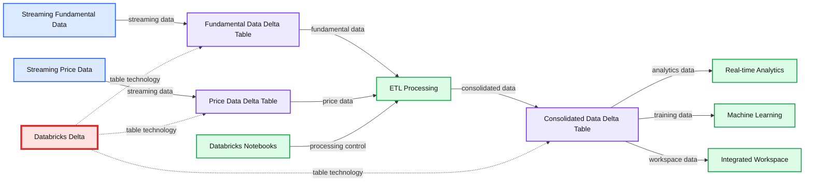
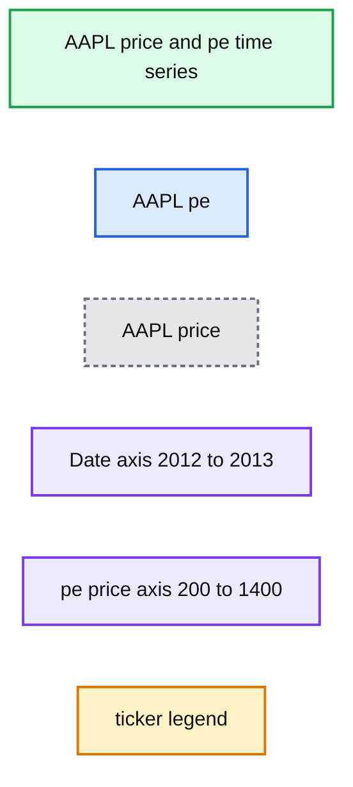
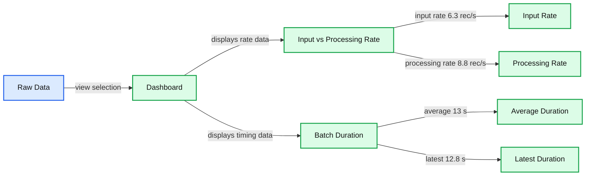
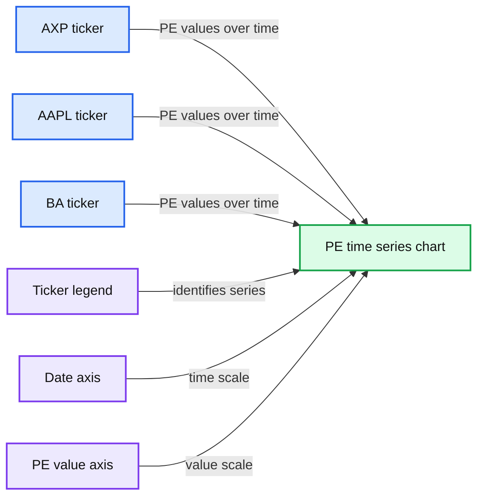

# Simplify Streaming Stock Data Analysis Using Databricks Delta

- Source: https://www.databricks.com/blog/2018/07/19/simplify-streaming-stock-data-analysis-using-databricks-delta.html
- Published: 2018-07-19
- Authors: John O'Dwyer, Denny Lee
- Categories: platform, solutions, product, open-source, data-science-machine-learning, data-engineering, data-streaming, news
- Images: 5 total, 5 extracted as architecture

Traditionally, real-time analysis of stock data was a complicated endeavor due to the complexities of maintaining a streaming system and ensuring transactional consistency of legacy and streaming data concurrently.  [Databricks Delta Lake](https://www.databricks.com/product/delta-lake-on-databricks) helps solve many of the pain points of building a streaming system to analyze stock data in real-time.

In the following diagram, we provide a high-level architecture to simplify this problem.  We start by ingesting two different sets of data into two Databricks Delta tables. The two datasets are stocks prices and fundamentals. After ingesting the data into their respective tables, we then join the data in an ETL process and write the data out into a third Databricks Delta table for downstream analysis.

**Summary:** Databricks Unified Analytics Platform ingests streaming fundamental and price data into Delta tables, consolidates them through ETL, and supports downstream analytics.

**Components:**

- Streaming Fundamental Data
- Streaming Price Data
- Databricks Notebooks
- Fundamental Data Databricks Delta Table
- Price Data Databricks Delta Table
- ETL processing
- Consolidated Data Databricks Delta Table
- Real-time Analytics
- Machine Learning
- Integrated Workspace
- Databricks Delta

**Flows:**

- Streaming Fundamental Data -> Fundamental Data Databricks Delta Table: streaming fundamental data
- Streaming Price Data -> Price Data Databricks Delta Table: streaming price data
- Fundamental Data Databricks Delta Table -> ETL processing: fundamental data
- Price Data Databricks Delta Table -> ETL processing: price data
- ETL processing -> Consolidated Data Databricks Delta Table: consolidated data
- Consolidated Data Databricks Delta Table -> Real-time Analytics: consolidated data
- Consolidated Data Databricks Delta Table -> Machine Learning: consolidated data
- Consolidated Data Databricks Delta Table -> Integrated Workspace: consolidated data
- Databricks Notebooks -> ETL processing: notebook-driven processing

**Numbers:** none

source image: https://www.databricks.com/wp-content/uploads/2018/07/01-steaming-stock-data-using-databricks-delta.png

In this blog post we will review:

- The current problems of running such a system
- How Databricks Delta addresses these problems
- How to implement the system in Databricks

Databricks Delta helps solve these problems by combining the scalability, streaming, and access to advanced analytics of Apache Spark with the performance and ACID compliance of a data warehouse.

## Traditional pain points prior to Databricks Delta

The pain points of a traditional streaming and data warehousing solution can be broken into two groups: [data lake](https://www.databricks.com/discover/data-lakes/introduction) and data warehouse pains.

### Data Lake Pain Points

While data lakes allow you to flexibly store an immense amount of data in a file system, there are many pain points including (but not limited to):

- Consolidation of streaming data from many disparate systems is difficult.
- *Updating* data in a Data Lake is nearly impossible and much of the *streaming data* needs to be updated as changes are made. This is especially important in scenarios involving financial reconciliation and subsequent adjustments.
- Query speeds for a data lake are typically very slow.
- Optimizing storage and file sizes is very difficult and often require complicated logic.

### Data Warehouse Pain Points

The power of a data warehouse is that you have a persistent performant store of your data.  But the pain points for building *modern [continuous applications](https://www.databricks.com/glossary/what-are-continuous-applications)* include (but not limited to):

- Constrained to SQL queries; i.e. no machine learning or advanced analytics.
- Accessing streaming data and stored data together is very difficult if at all possible.
- Data warehouses do not scale very well.
- Tying compute and storage together makes using a warehouse very expensive.

## How Databricks Delta Solves These Issues

Databricks Delta ([Databricks Delta Guide](https://docs.databricks.com/delta/index.html)) is a unified data management system that brings data reliability and performance optimizations to cloud data lakes.  More succinctly, Databricks Delta takes the advantages of data lakes and data warehouses together with Apache Spark to allow you to do incredible things!

- Databricks Delta, along with Structured Streaming, makes it possible to analyze streaming and historical data together at data warehouse speeds.
- Using Databricks Delta tables as sources and destinations of streaming big data make it easy to consolidate disparate data sources.
- Upserts are supported on Databricks Delta tables.
- Your streaming/data lake/warehousing solution has ACID compliance.
- Easily include machine learning scoring and advanced analytics into ETL and queries.
- Decouples compute and storage for a completely scalable solution.

## Implement your streaming stock analysis solution with Databricks Delta

Databricks Delta and Apache Spark do most of the work for our solution; you can try out the full notebook and follow along with the code samples below.   Let’s start by enabling Databricks Delta; as of this writing, Databricks Delta is in private preview so sign up at [https://www.databricks.com/product/delta-lake-on-databricks](https://www.databricks.com/product/delta-lake-on-databricks).

As noted in the preceding diagram, we have two datasets to process - one for fundamentals and one for price data.  To create our two Databricks Delta tables, we specify the .format(“delta”) against our [DBFS](https://docs.databricks.com/data/databricks-file-system.html) locations.

While we’re updating the `stockFundamentals` and `stocksDailyPrices`, we will consolidate this data through a series of ETL jobs into a consolidated view (`stocksDailyPricesWFund`).    With the following code snippet, we can determine the start and end date of available data and then combine the price and fundamentals data for that date range into DBFS.

Now we have a stream of consolidated fundamentals and price data that is being pushed into [DBFS](https://docs.databricks.com/data/databricks-file-system.html) in the `/delta/stocksDailyPricesWFund` location.  We can build a Databricks Delta table by specifying .format(“delta”) against that DBFS location.

Now that we have created our initial Databricks Delta table, let’s create a view that will allow us to calculate the price/earnings ratio in real time (because of the underlying streaming data updating our Databricks Delta table).

## Analyze streaming stock data in real time

With our view in place, we can quickly analyze our data using Spark SQL.

**Summary:** Line chart comparing AAPL price and AAPL price-to-earnings values over time.

**Components:**

- AAPL pe series, shown in blue
- AAPL price series, shown in orange
- Date axis, spanning 2012 to 2013
- pe price axis, ranging from 200 to 1,400
- ticker legend

**Flows:**

- none

**Numbers:**

- Y-axis: 200, 400, 600, 800, 1,000, 1,200, 1,400
- X-axis dates: 2012-01-03, 2012-03-08, 2012-05-11, 2012-07-17, 2012-09-19, 2012-11-26, 2013-01-31, 2013-04-08, 2013-06-11
- Years visible: 2012, 2013

source image: https://www.databricks.com/wp-content/uploads/2018/07/02-Query-AAPL-PE.png

As the underlying source of this consolidated dataset is a Databricks Delta table, this view isn’t just showing the batch data but also any new streams of data that are coming in as per the following streaming dashboard.

**Summary:** Streaming dashboard showing input and processing rates alongside batch-duration metrics for stock-data analysis.

**Components:**

- Dashboard view
- Raw Data view
- Input vs. Processing Rate chart
- Input rate metric
- Processing rate metric
- Batch Duration chart
- Average batch duration metric
- Latest batch duration metric

**Flows:**

- Dashboard -> Input vs. Processing Rate: displays streaming rate measurements
- Dashboard -> Batch Duration: displays batch timing measurements

**Numbers:** 6.3 rec/s, 8.8 rec/s, 13 s, 12.8 s, 0, 10, 20, 30, 40, 50, 60, 09:40, 09:45, 09:50, 09:55, May 18

source image: https://www.databricks.com/wp-content/uploads/2018/07/03-Query-AAPL-PE-Streaming-Dashboard.png

Underneath the covers, Structured Streaming isn’t just writing the data to Databricks Delta tables but also keeping the state of the distinct number of keys (in this case ticker symbols) that need to be tracked.

**Summary:** Bar chart showing average closing prices for 30 stock ticker symbols.

**Components:**

- Average_Close axis showing the average closing price metric.
- Stock ticker categories: CSCO, GE, INTC, PFE, MSFT, MRK, JPM, VZ, DD, DIS, KO, UNH, AXP, HD, PG, WMT, TRV, JNJ, BA, NKE, UTX, XOM, CAT, MCD, MMM, CVX, GS, V, IBM, AAPL.
- Blue bars showing each ticker’s average closing price.

**Flows:**

- Stock ticker -> Blue bar: average closing price value.

**Numbers:** 0, 50, 100, 150, 200, 250, 300, 350, 400, 450, 500, 550

```mermaid
%% Shows average closing prices by stock ticker
flowchart LR
    Tickers[Stock ticker symbols] -->|average closing price| Bars[Blue price bars]
    Bars -->|scaled from 0 to 550| Axis[Average_Close axis]

    classDef client fill:#dbeafe,stroke:#2563eb,stroke-width:2px,color:#111
    classDef service fill:#dcfce7,stroke:#16a34a,stroke-width:2px,color:#111
    classDef store fill:#ede9fe,stroke:#7c3aed,stroke-width:2px,color:#111
    classDef cache fill:#fef3c7,stroke:#d97706,stroke-width:2px,color:#111
    classDef queue fill:#cffafe,stroke:#0891b2,stroke-width:2px,color:#111
    classDef critical fill:#fee2e2,stroke:#dc2626,stroke-width:4px,color:#111
    classDef external fill:#e5e7eb,stroke:#6b7280,stroke-width:2px,color:#111,stroke-dasharray:4 3
    classDef decision fill:#fce7f3,stroke:#db2777,stroke-width:2px,color:#111

    class Tickers client
    class Bars service
    class Axis store
```

source image: https://www.databricks.com/wp-content/uploads/2018/07/04-Average-Close.png

Because you are using Spark SQL, you can execute aggregate queries *at scale* and *in real-time*.

**Summary:** The chart shows price-to-earnings ratios over time for AXP, AAPL, and BA ticker symbols.

**Components:**

- PE time-series chart
- AXP ticker series
- AAPL ticker series
- BA ticker series
- Date axis
- PE value axis

**Flows:**

- AXP ticker -> PE time-series chart: PE values over time
- AAPL ticker -> PE time-series chart: PE values over time
- BA ticker -> PE time-series chart: PE values over time

**Numbers:** 1,100; 1,000; 900; 800; 700; 600; 500; 400; 300; 200; 100; 0; 2012-01-03; 2012-02-10; 2012-03-21; 2012-04-30; 2012-06-07; 2012-07-17; 2012-08-23; 2012-10-02; 2012-11-12; 2012-12-20

source image: https://www.databricks.com/wp-content/uploads/2018/07/05-Multiple-Stock-PE.png

## Summary

In closing, we demonstrated how to simplify streaming stock data analysis using [Databricks Delta Lake](https://www.databricks.com/product/delta-lake-on-databricks).  By combining Spark Structured Streaming and Databricks Delta, we can use the Databricks integrated workspace to create a performant, scalable solution that has the advantages of both data lakes and data warehouses.  The [Databricks Unified Analytics Platform](https://www.databricks.com/product/data-lakehouse) removes the data engineering complexities commonly associated with streaming and transactional consistency enabling data engineering and data science teams to focus on understanding the trends in their stock data.

**Interested in the open source Delta Lake?**
[Visit the Delta Lake online hub](https://delta.io?utm_source=delta-blog) to learn more, download the latest code and join the Delta Lake community.
