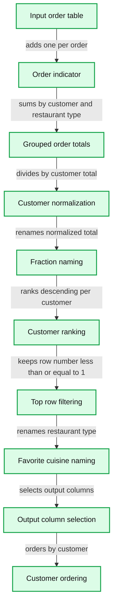

# rquery: Practical Big Data Transforms for R-Spark Users

- Source: https://www.databricks.com/blog/2018/07/26/rquery-practical-big-data-transforms-for-r-spark-users.html
- Published: 2018-07-26
- Authors: Nina Zumel, John Mount
- Categories: engineering, data-science-machine-learning
- Images: 2 total, 2 extracted as architecture

*This is a guest community blog from [Nina Zumel](https://win-vector.com/nina-zumel/) and [John Mount](https://win-vector.com/john-mount/), data scientists and consultants at [Win-Vector](http://www.win-vector.com/site/). They share how to use rquery with Apache Spark on Databricks*

[Try this notebook in Databricks](https://databricks-prod-cloudfront.cloud.databricks.com/public/4027ec902e239c93eaaa8714f173bcfc/3208320140103456/1810586888854627/6945696802502720/latest.html)

## Introduction

In this blog, we will introduce [rquery](https://winvector.github.io/rquery/), a powerful query tool that allows R users to implement powerful data [transformations](https://www.databricks.com/glossary/what-are-transformations) using [Apache Spark](https://www.databricks.com/spark/about) on Databricks. *rquery* is based on [Edgar F. Codd’s relational algebra](https://en.wikipedia.org/wiki/Relational_algebra), informed by our experiences using SQL and R packages such as *dplyr* at big data scale.

## Data Transformation and Codd's Relational Algebra

*rquery* is based on an appreciation of [Codds' relational algebra](https://en.wikipedia.org/wiki/Relational_algebra). Codd's relational algebra is a formal algebra that describes the semantics of data transformations and queries. Previous, hierarchical, databases required associations to be represented as functions or maps. Codd relaxed this requirement from functions to relations, allowing tables that represent more powerful associations (allowing, for instance, two-way multimaps).

Codd's work allows most significant data transformations to be decomposed into sequences made up from a smaller set of fundamental operations:

- select (row selection)
- project (column selection/aggregation)
- Cartesian product (table joins, row binding, and set difference)
- extend (derived columns, keyword was in Tutorial-D).

One of the earliest and still most common implementation of Codd's algebra is SQL. Formally Codd's algebra assumes that all rows in a table are unique; SQL further relaxes this restriction to allow multisets.

*rquery* is another realization of the Codd algebra that implements the above operators, some higher-order operators, and emphasizes a right to left pipe notation. This gives the Spark user an additional way to work effectively.

## SQL vs pipelines for data transformation

Without a pipe-line based operator notation, the common ways to control Spark include SQL or sequencing SparkR data transforms. rquery is a complementary approach that can be combined with these other methodologies.

One issue with SQL, especially for the novice SQL programmer, is that it can be somewhat unintuitive.

- SQL expresses data transformations as nested function composition
- SQL uses some relational concepts as steps, others as modifiers and predicates.

For example, suppose you have a table of information about irises, and you want to find the species with the widest petal on average. In R the steps would be as follows:

1. Group the table into Species
2. Calculate the mean petal width for each Species
3. Find the widest mean petal width
4. Return the appropriate species

We can do this in R using `rqdatatable`, an in-memory implementation of rquery:

Of course, we could also do the same operation using *dplyr*, another R package with Codd-style operators. rquery has some advantages we will discuss later. In rquery, the original table (iris) is at the beginning of the query, with successive operations applied to the results of the preceding line. To perform the equivalent operation in SQL, you must write down the operation essentially backwards:

In SQL the original table is in the last or inner-most SELECT statement, with successive results nested up from there. In addition, column selection directives are at the beginning of a SELECT statement, while row selection criteria (WHERE, LIMIT) and modifiers (GROUP_BY, ORDER_BY) are at the end of the statement, with the table in between. So the data transformation goes from the inside of the query to the outside, which can be hard to read -- not to mention hard to write.

*rquery* represents an attempt to make data transformation in a relational database more intuitive by expressing data transformations as a sequential operator pipeline instead of nested queries or functions.

## rquery for Spark/R developers

For developers working with Spark and R, *rquery* offers a number of advantages. First, R developers can run analyses and perform data transformations in Spark using an easier to read (and to write) sequential pipeline notation instead of nested SQL queries. As we mentioned above, *dplyr* also supplies this capability, but *dplyr* is not compatible with SparkR -- only with *sparklyr*. *rquery* is compatible with both SparkR and sparklyr, as well as with Postgres and other large data stores. In addition, *dplyr's* lazy evaluation can complicate the running and debugging of large, complex queries (more on this below).

The design of rquery is *database-first*, meaning it was developed specifically to address issues that arise when working with big data in remote data stores via R. rquery maintains *complete separation between the query specification and query execution phases*, which allows useful error-checking and some optimization before the query is run. This can be valuable when running complex queries on large volumes of data; you don't want to run a long query only to discover that there was an obvious error on the last step.

*rquery* checks column names at query specification time to ensure that they are available for use. It also keeps track of which columns from a table are involved with a given query, and proactively issues the appropriate SELECT statements to narrow the tables being manipulated.

This may not seem important on Spark due to its columnar orientation and lazy evaluation semantics, but can be a key on other data store and is [critical on Spark if you have to cache intermediate results](https://github.com/WinVector/rquery/blob/master/extras/NarrowEffectSpark.md) for any reason (such as attempting to break calculation lineage) and is [useful when working traditional row-oriented systems](https://github.com/WinVector/rquery/blob/master/extras/NarrowEffect.md). Also, the effect shows up on even on Spark once we work at scale. This can help speed up queries that involve excessively wide tables where only a few columns are needed. rquery also offers well-formatted textual as well as a graphical presentation of query plans. In addition, you can inspect the generated SQL query before execution.

## Example

For our next example let's imagine that we run a food delivery business, and we are interested in what types of cuisines ('Mexican', 'Chinese', etc) our customers prefer. We want to sum up the number of orders of each cuisine type (or restaurant_type) by customer and compute which cuisine appears to be their favorite, based on what they order the most. We also want to see how strong that preference is, based on what fraction of their orders is of their favorite cuisine.

We'll start with a table of orders, which records order id, customer id, and restaurant type.

| Cust ID | Resturant_type | order_id |
|---|---|---|
| cust_1 | Indian | 1 |
| cust_1 | Mexican | 2 |
| cust_8 | Indian | 3 |
| cust_5 | American | 4 |
| cust_9 | Mexican | 5 |
| cust_9 | Indian | 6 |

To work with the data using rquery, we need a *rquery* handle to the Spark cluster. Since rquery interfaces with many different types of SQL-dialect data stores, it needs an adapter to translate rquery functions into the appropriate SQL dialect. The default handler assumes a DBI-adapted database. Since SparkR is not DBI-adapted, we must define the handler explicitly, using the function `rquery::rquery_db_info()`. The code for the adapter is [here](https://github.com/WinVector/rquery/blob/master/extras/SparkR.Rmd). Let's assume that we have created the handler as db_hdl.

Let's assume that we already have the data in Spark, as order_table. To work with the table in rquery, we must generate a table description, using the function db_td(). A table description is a record of the table's name and columns; db_td() queries the database to get the description.

Now we can compose the necessary processing pipeline (or operator tree), using *rquery's* Codd-style steps and the pipe notation:

Before executing the pipeline, you can inspect it, either as text or as a operator diagram (using the package DiagrammeR). This is especially useful for complex queries that involve multiple tables.

**Summary:** An rquery Codd-style operator pipeline calculates each customer’s most common restaurant type and its order fraction.

**Components:**

- Input order table using rquery table
- Order indicator using rquery extend
- Grouped order totals using rquery project
- Customer-level normalization using rquery extend
- Fraction naming using rquery rename
- Customer ranking using rquery extend
- Top-row filtering using rquery select_rows
- Favorite cuisine naming using rquery rename
- Output column selection using rquery select_columns
- Customer ordering using rquery orderby

**Flows:**

- Input order table -> Order indicator: adds one per order
- Order indicator -> Grouped order totals: sums orders by customer and restaurant type
- Grouped order totals -> Customer-level normalization: divides type totals by customer totals
- Customer-level normalization -> Fraction naming: renames the normalized total
- Fraction naming -> Customer ranking: ranks restaurant types by descending order fraction per customer
- Customer ranking -> Top-row filtering: keeps rows with row number less than or equal to 1
- Top-row filtering -> Favorite cuisine naming: renames restaurant type as favorite cuisine
- Favorite cuisine naming -> Output column selection: selects customer, cuisine, and fraction columns
- Output column selection -> Customer ordering: orders results by customer

**Numbers:** 1, 1

source image: https://www.databricks.com/wp-content/uploads/2018/07/image2-5.png

Notice that the normalize_cols and pick_top_k steps were decomposed into more basic Codd operators (for example, the extend and select_rows nodes).

We can also look at Spark’s query plan through the Databricks user interface.

**Summary:** Spark’s DAG visualization shows execution stages composed of Exchange, WholeStageCodegen, Window, map, parallelize, and mapPartitions operators.

**Components:**

- Stage 5 skipped: Spark stage containing parallelize, mapPartitions, WholeStageCodegen, and Exchange.
- Stage 6 skipped: Spark stage containing Exchange, WholeStageCodegen, and Exchange.
- Stage 7: Spark stage containing Exchange, WholeStageCodegen, Window, WholeStageCodegen, and Exchange.
- Stage 8: Spark stage containing Exchange, WholeStageCodegen, and map.
- parallelize: Spark data creation operator.
- mapPartitions: Spark partition-level transformation.
- WholeStageCodegen: Spark whole-stage code generation operator.
- Exchange: Spark data redistribution operator.
- Window: Spark window operation.
- map: Spark mapping transformation.

**Flows:**

- parallelize -> mapPartitions: partitioned data
- mapPartitions -> WholeStageCodegen: transformed data
- WholeStageCodegen -> Exchange: stage output
- Exchange in Stage 5 -> Exchange in Stage 6: redistributed data
- Exchange in Stage 6 -> WholeStageCodegen in Stage 6: exchanged data
- WholeStageCodegen in Stage 6 -> Exchange in Stage 6: processed data
- Exchange in Stage 6 -> Exchange in Stage 7: redistributed data
- Exchange in Stage 7 -> WholeStageCodegen in Stage 7: exchanged data
- WholeStageCodegen in Stage 7 -> Window: processed data
- Window -> WholeStageCodegen in Stage 7: window output
- WholeStageCodegen in Stage 7 -> Exchange in Stage 7: processed data
- Exchange in Stage 7 -> Exchange in Stage 8: redistributed data
- Exchange in Stage 8 -> WholeStageCodegen in Stage 8: exchanged data
- WholeStageCodegen in Stage 8 -> map: processed data

**Numbers:** Stage 5, Stage 6, Stage 7, Stage 8

```mermaid
%% Shows Spark execution stages and operator data flows
flowchart LR
    S5[Stage 5 skipped]
    P[parallelize]
    MP[mapPartitions]
    W1[WholeStageCodegen]
    E5[Exchange]
    S6[Stage 6 skipped]
    E6a[Exchange]
    W2[WholeStageCodegen]
    E6b[Exchange]
    S7[Stage 7]
    E7a[Exchange]
    W3[WholeStageCodegen]
    WIN[Window]
    W4[WholeStageCodegen]
    E7b[Exchange]
    S8[Stage 8]
    E8[Exchange]
    W5[WholeStageCodegen]
    MAP[map]

    P -->|partitioned data| MP
    MP -->|transformed data| W1
    W1 -->|stage output| E5
    E5 -->|redistributed data| E6a
    E6a -->|exchanged data| W2
    W2 -->|processed data| E6b
    E6b -->|redistributed data| E7a
    E7a -->|exchanged data| W3
    W3 -->|processed data| WIN
    WIN -->|window output| W4
    W4 -->|processed data| E7b
    E7b -->|redistributed data| E8
    E8 -->|exchanged data| W5
    W5 -->|processed data| MAP

    classDef client fill:#dbeafe,stroke:#2563eb,stroke-width:2px,color:#111
    classDef service fill:#dcfce7,stroke:#16a34a,stroke-width:2px,color:#111
    classDef store fill:#ede9fe,stroke:#7c3aed,stroke-width:2px,color:#111
    classDef cache fill:#fef3c7,stroke:#d97706,stroke-width:2px,color:#111
    classDef queue fill:#cffafe,stroke:#0891b2,stroke-width:2px,color:#111
    classDef critical fill:#fee2e2,stroke:#dc2626,stroke-width:4px,color:#111
    classDef external fill:#e5e7eb,stroke:#6b7280,stroke-width:2px,color:#111,stroke-dasharray:4 3
    classDef decision fill:#fce7f3,stroke:#db2777,stroke-width:2px,color:#111

    class S5,S6,S7,S8 critical
    class P,MP,W1,E5,E6a,W2,E6b,E7a,W3,WIN,W4,E7b,E8,W5,MAP service

    %% Legend
    %% client = clients edge gateway LB
    %% service = stateless compute
    %% store = databases durable storage
    %% cache = Redis CDN anything losable
    %% queue = Kafka streams async pipes
    %% critical = bottleneck or SPOF
    %% external = third party
    %% decision = trade off point
```

source image: https://www.databricks.com/wp-content/uploads/2018/07/image1-4.png

You can also inspect what tables are used in the pipeline, and which columns in those tables are involved.

If you want, you can inspect the (complex and heavily nested) SQL query that will be executed in the cluster. Notice that the column orderID, which is not involved in this query, is already eliminated in the initial SELECT (tsql_*_0000000000). Winnowing the initial tables down to only the columns used can be a big performance improvement when you are working with excessively wide tables, and using only a few columns.

Imagine typing in the above SQL. Finally, we can execute the query in the cluster. Note that this same pipeline could also be executed using a sparklyr connection.

| Cust ID | favorite_cuisine | fraction_of_orders |
|---|---|---|
| cust_1 | Italian | 0.3225806 |
| cust_2 | Italian | 0.3125000 |
| cust_3 | Indian | 0.2857143 |
| cust_4 | American | 0.2916667 |
| cust_5 | American | 0.2857143 |
| cust_6 | Italian | 0.2800000 |
| cust_7 | American | 0.2400000 |
| cust_8 | Indian | 0.2903226 |
| cust_9 | Chinese | 0.3000000 |

This feature can be quite useful for "rehearsals" of complex data manipulation/analysis processes, where you'd like to develop and debug the data process quickly, using smaller local versions of the relevant data tables before executing them on the remote system.

## Conclusion

*rquery* is a powerful "database first" piped query generator. It includes a number of useful documentation, debugging, and optimization features. It makes working with big data much easier and works with many systems including SparkR, sparklyr, and PostgreSQL, meaning *rquery* does not usurp your design decisions or choice of platform.

## What’s Next

`rquery` will be adapted to more big data systems allowing R users to work with the tools of their choice. `rqdatatable` will be extended to be a powerful in-memory system for rehearsing data operations in R.

You can try *rquery* on Databricks. Simpply follow the links below.

## Read More

This example is available as a [Databricks Community](https://www.databricks.com/try-databricks) notebook [here](https://databricks-prod-cloudfront.cloud.databricks.com/public/4027ec902e239c93eaaa8714f173bcfc/3208320140103456/1810586888854627/6945696802502720/latest.html) and as a (static) RMarkdown workbook [here](https://github.com/WinVector/rquery/blob/master/extras/SparkR.md).
