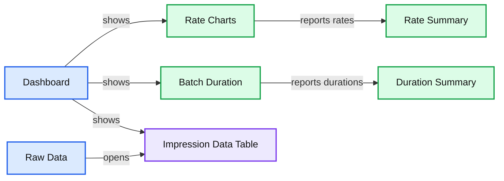
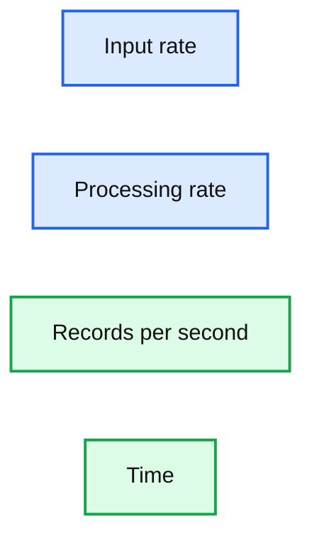

# Building a Real-Time Attribution Pipeline with Databricks Delta

- Source: https://www.databricks.com/blog/2018/08/09/building-a-real-time-attribution-pipeline-with-databricks-delta.html
- Published: 2018-08-09
- Authors: Caryl Yuhas, Denny Lee
- Categories: platform, solutions, product, engineering, open-source, data-science-machine-learning, data-engineering, data-streaming, company, news
- Images: 7 total, 4 extracted as architecture

[Get an early preview of O'Reilly's new ebook](https://www.databricks.com/resources/ebook/delta-lake-running-oreilly?itm_data=buildingrealtimeattributionpipelinedatabricksdelta-blog-oreillydlupandrunning) for the step-by-step guidance you need to start using Delta Lake.

---

In digital advertising, one of the most important things to be able to deliver to clients is information about how their advertising spend drove results.  The more quickly we can provide this, the better. To tie conversions or engagements to the impressions served in an advertising campaign, companies must perform attribution. Attribution can be a fairly expensive process, and running attribution against constantly updating datasets is challenging without the right technology.  Traditionally, this has not been an easy problem to solve as there are lots of things to reason about:

- How do we make sure the data can be written at low latency to a read location without corrupting records?
- How can we continuously append to a large, query-able dataset without exploding costs or loss of performance?
- And where and how should I introduce a join for attribution?

**Summary:** The diagram shows a real-time attribution pipeline moving user views, clicks, impressions, and conversions through Amazon Kinesis or Kafka into Databricks for ETL, aggregation, attribution, and reporting.

**Components:**

- User views and clicks
- Impressions
- User conversions
- Conversions
- Amazon Kinesis or Kafka
- Databricks for ETL, aggregation, and attribution
- Real-time reporting in BI tools

**Flows:**

- User views and clicks -> Impressions: impression events
- User conversions -> Conversions: conversion events
- Impressions -> Amazon Kinesis or Kafka: impression data
- Conversions -> Amazon Kinesis or Kafka: conversion data
- Amazon Kinesis or Kafka -> Databricks: streaming events
- Databricks -> Real-time reporting in BI tools: attributed and aggregated data

**Numbers:** none

```mermaid
%% Real-time attribution pipeline from user events to BI reporting
flowchart LR
    views[User views and clicks]
    impressions[Impressions]
    conversions[Conversions]
    userConversions[User conversions]
    stream[Amazon Kinesis or Kafka]
    databricks[Databricks ETL aggregation attribution]
    reporting[Real-time reporting in BI tools]

    views -->|impression events| impressions
    userConversions -->|conversion events| conversions
    impressions -->|impression data| stream
    conversions -->|conversion data| stream
    stream -->|streaming events| databricks
    databricks -->|attributed and aggregated data| reporting

    classDef client fill:#dbeafe,stroke:#2563eb,stroke-width:2px,color:#111
    classDef service fill:#dcfce7,stroke:#16a34a,stroke-width:2px,color:#111
    classDef store fill:#ede9fe,stroke:#7c3aed,stroke-width:2px,color:#111
    classDef cache fill:#fef3c7,stroke:#d97706,stroke-width:2px,color:#111
    classDef queue fill:#cffafe,stroke:#0891b2,stroke-width:2px,color:#111
    classDef critical fill:#fee2e2,stroke:#dc2626,stroke-width:4px,color:#111
    classDef external fill:#e5e7eb,stroke:#6b7280,stroke-width:2px,color:#111,stroke-dasharray:4 3
    classDef decision fill:#fce7f3,stroke:#db2777,stroke-width:2px,color:#111

    class views,userConversions client
    class impressions,conversions service
    class stream queue
    class databricks service
    class reporting external
```

source image: https://www.databricks.com/wp-content/uploads/2018/08/adtech-streaming.png

Fortunately, Databricks makes this easy with Structured Streaming and Databricks Delta.  In this blog post (and associated notebook), we are going to take a quick look at how to use the DataFrame API to build Structured Streaming applications on top of Kinesis (for those using Azure Databricks, you can use [Azure EventHubs](https://docs.microsoft.com/en-us/azure/databricks/spark/latest/structured-streaming/streaming-event-hubs#azure-event-hubs), [Apache Kafka on HDInsight](https://docs.microsoft.com/en-us/azure/databricks/spark/latest/structured-streaming/kafka#connect-kafka-on-hdinsight-to-azure-databricks), or [Azure Cosmos DB](https://docs.microsoft.com/en-us/azure/databricks/data/data-sources/azure/cosmosdb-connector#use-the-azure-cosmos-db-spark-connector) integration), and use Databricks Delta to query the streams in near-real-time.  We will also show how you can use the BI tool of your choice to review your attribution data in real-time.

## Define Streams

The first thing we will need to do is to establish the *impression* and conversion data streams.   The impression data stream provides us a real-time view of the attributes associated with those customers who were served the digital ad (impression) while the conversion stream denotes customers who have performed an action (e.g. click the ad, purchased an item, etc.) based on that ad.

With Structured Streaming in Databricks, you can quickly plug into the stream as Databricks supports direct connectivity to Kafka ([Apache Kafka](https://docs.databricks.com/spark/latest/structured-streaming/kafka.html#structured-streaming-kafka), [Apache Kafka on AWS](https://aws.amazon.com/msk/), [Apache Kafka on HDInsight](https://docs.microsoft.com/en-us/azure/databricks/spark/latest/structured-streaming/kafka#connect-kafka-on-hdinsight-to-azure-databricks)) and [Kinesis](https://docs.databricks.com/spark/latest/structured-streaming/kinesis.html#structured-streaming-kinesis) as noted in the following code snippet (this is for impressions, repeat this step for conversions)

Next, create data streams schema as noted in the following code snippet.

Finally, we will want to create our streaming *impressions* DataFrame.  With the Databricks display command, we will see both the data and the input/processing rate in real-time alongside our data.

**Summary:** Databricks displays a real-time impressions streaming DataFrame with input and processing rates, batch duration metrics, and raw event rows.

**Components:**

- Dashboard view
- Raw Data view
- Input versus Processing Rate chart
- Batch Duration chart
- Streaming impressions data table
- Real-time rate summary
- Batch duration summary

**Flows:**

- Dashboard -> Input versus Processing Rate: displays input and processing rates
- Dashboard -> Batch Duration: displays batch duration metrics
- Dashboard -> Streaming impressions data table: displays streaming impression records
- Raw Data -> Streaming impressions data table: provides raw event rows

**Numbers:**

- 131.7 rec/s input rate
- 65.6 rec/s processing rate
- 3.1 s average batch duration
- 2 s latest batch duration
- Chart scales: 0, 500, 1k, 1.5k, 2k
- Batch duration chart scale: 0, 5, 10, 15
- Time labels: 11:43, 11:44, 11:45, 11:46, 11:47, 11:48
- Date: Jan 22
- Showing the first 1000 rows
- Visible event values include 24, 43, 41, 28, 33, 16, 60
- Visible creative IDs include 781593, 617593, 153572, 865392, 930897, 983324, 339132, 160250
- Advertiser ID: 523981
- Click values: 0, 1
- Bid amounts: -0.06, 0.700000000000001, 0.52, 0.9299999999999999, 1.03, 0.35, 0.33, 0.950000000000001
- Impression timestamps range from 2018-01-19T18:46:23.220+0000 through 2018-01-19T18:46:23.262+0000

source image: https://www.databricks.com/wp-content/uploads/2018/08/Impressions-Streaming-DF.png

## Sync Streams to Databricks Delta

The impression (`imp`) and conversion (`conv`) streams can be synced directly to Databricks Delta allowing us a greater degree of flexibility and scalability for this real-time attribution use-case.  t allows you to quickly write these real-time data streams into Parquet format on S3 / Blob Storage while allowing users to read from the same directory simultaneously without the overhead of managing consistency, transactionality and performance yourself.  As noted in the following code snippet, we’re capturing the raw records from a single source and writing it into its own Databricks Delta table.

It is important to note that with Databricks Delta, you can also:

- Apply additional ETL, analytics, and/or enrichment steps at this point
- Write data from different streams or batch process and different sources into the same table

**Summary:** The chart compares input and processing rates over time, showing input consistently above processing.

**Components:**

- Input rate, blue line
- Processing rate, orange line
- Records per second axis
- Time axis

**Flows:**

- none

**Numbers:** 7.8 rec/s input rate; 4.7 rec/s processing rate; y-axis values 0, 10, 20, 30, 40; timestamps 11:35, 11:40, 11:45; date Jan 22

source image: https://www.databricks.com/wp-content/uploads/2018/08/Sync-to-Delta-1.png

**Summary:** The chart shows batch duration over time, with an average of 4.6 seconds and a latest value of 16.6 seconds.

**Components:**

- Batch Duration chart measured in seconds
- Average duration metric
- Latest duration metric
- Time axis showing Jan 22

**Flows:**

- none

**Numbers:** 4.6 s, 16.6 s, 15, 10, 5, 0, 11:35, 11:40, 11:45, Jan 22

```mermaid
%% Shows batch duration measurements over time with average and latest values
flowchart LR
    A[Batch Duration in seconds]

    class A service

    classDef client   fill:#dbeafe,stroke:#2563eb,stroke-width:2px,color:#111
    classDef service  fill:#dcfce7,stroke:#16a34a,stroke-width:2px,color:#111
    classDef store    fill:#ede9fe,stroke:#7c3aed,stroke-width:2px,color:#111
    classDef cache    fill:#fef3c7,stroke:#d97706,stroke-width:2px,color:#111
    classDef queue    fill:#cffafe,stroke:#0891b2,stroke-width:2px,color:#111
    classDef critical fill:#fee2e2,stroke:#dc2626,stroke-width:4px,color:#111
    classDef external fill:#e5e7eb,stroke:#6b7280,stroke-width:2px,color:#111,stroke-dasharray:4 3
    classDef decision fill:#fce7f3,stroke:#db2777,stroke-width:2px,color:#111
```

source image: https://www.databricks.com/wp-content/uploads/2018/08/Sync-to-Delta-2.png

## Databricks Delta Views for Ad Hoc Reporting

Now that we have created our impression and conversion Databricks Delta tables, we will create named views so we can easily execute our joins in Spark SQL as well as make this data available to query from your favorite BI tool.  Let’s first start with creating our Databricks Delta views.

## Calculate Real-time Attribution

Now that we have established our Databricks Delta views, we can calculate our last touch attribution on the view and then calculate *weighted attribution* on the view.

### Calculate Last Touch Attribution on View

To calculate the real-time window attribution, as noted in the preceding sections, we will need to join two different Delta streams of data: *impressions* and *conversions*. As noted in the following code snippet, we will first define our *Databricks delta-based impressions* *and conversions*.  We will also define window specification which will be used by the following *dense_rank()* statement.  The window and rank define our attribution logic.

As well, you can plug in your favorite BI tool such as [Tableau](https://docs.databricks.com/integrations/bi/tableau.html) to perform ad-hoc analysis of your data.

 

## Calculate Weighted Attribution on View

In the preceding case, we demonstrate a very naive model — isolating all of a user’s impressions prior to conversion, selecting the most recent, and attributing only the most recent impression prior to conversion.   A more sophisticated model might apply attribution windows or weight the impressions by time such as the code snippet below.

## Discussion

In this blog, we have reviewed how Databricks Delta provides a simplified solution for a real-time attribution pipeline.  The advantages of using Databricks Delta to sync and save your data streams include (but not limited to) the ability to:

- Save and persist your real-time streaming data like a data warehouse because Databricks Delta maintains a transaction log that efficiently tracks changes to the table.
- Yet still, have the ability to run your queries and perform your calculations in real-time and completing in seconds
- With Databricks Delta, you can have multiple writers can simultaneously modify a dataset and still see consistent views.
- Writers can modify a dataset without interfering with jobs reading the dataset.
- An important optimization is that Databricks Delta avoids the “many small file” problem typical of many big data projects because it features automatic file management that organizes data into large files so that they can be read efficiently.
- Statistics enable speeding up reads by 10-100x and data skipping avoids reading irrelevant information.

Together with your streaming framework and the Databricks Unified Analytics Platform, you can quickly build and use your real-time attribution pipeline with Databricks Delta to solve your complex display advertising problems *in real-time*.
  

**Interested in the open source Delta Lake?**
[Visit the Delta Lake online hub](https://delta.io?utm_source=delta-blog) to learn more, download the latest code and join the Delta Lake community.
