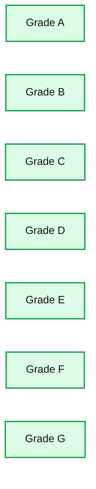
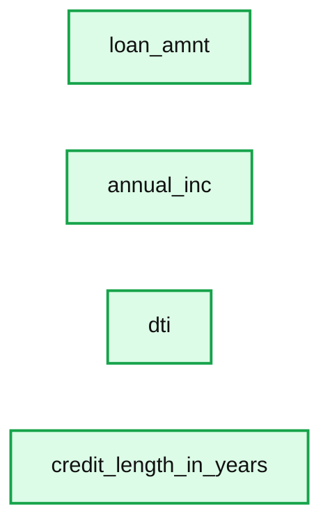
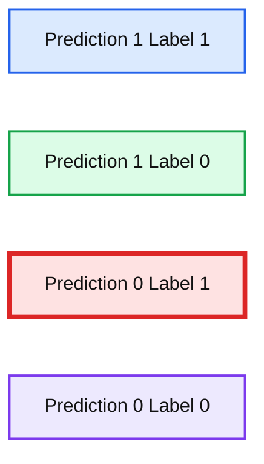

# Loan Risk Analysis with XGBoost and Databricks Runtime for Machine Learning

- Source: https://www.databricks.com/blog/2018/08/09/loan-risk-analysis-with-xgboost-and-databricks-runtime-for-machine-learning.html
- Published: 2018-08-09
- Authors: Amy Wang, Denny Lee
- Categories: platform, solutions, product, engineering, open-source, data-science-machine-learning, company, news
- Images: 5 total, 3 extracted as architecture

[Try this notebook series in Databricks](https://pages.databricks.com/rs/094-YMS-629/images/loan-risk-analysis.zip)

For companies that make money off of interest on loans held by their customer, it’s always about increasing the bottom line. Being able to assess the risk of loan applications can save a lender the cost of holding too many risky assets. It is the data scientist’s job to run analysis on your customer data and make business rules that will directly impact loan approval.

The data scientists that spend their time building these machine learning models are a scarce resource and far too often they are siloed into a sandbox:

- Although they work with data day in and out, they are dependent on the data engineers to obtain up-to-date tables.
- With data growing at an exponential rate, they are dependent on the infrastructure team to provision compute resources.
- Once the model building process is done, they must trust software developers to correctly translate their model code to production ready code.

This is where the Databricks [Unified Analytics Platform](https://www.databricks.com/product/data-lakehouse) can help bridge those gaps between different parts of that workflow chain and reduce friction between the data scientists, data engineers, and software engineers.

In addition to reducing operational friction, Databricks is a central location to run the latest Machine Learning models. Users can leverage the native Spark MLLib package or download any open source Python or R ML package. With [Databricks Runtime for Machine Learning](https://www.databricks.com/blog/2018/06/05/announcing-databricks-runtime-for-machine-learning.html), Databricks clusters are preconfigured with XGBoost, scikit-learn, and numpy as well as popular Deep Learning frameworks such as TensorFlow, Keras, Horovod, and their dependencies.

In this blog, we will explore how to:

- Import our sample data source to create a Databricks table
- Explore your data using Databricks Visualizations
- Execute ETL code against your data
- Execute ML Pipeline including model tuning XGBoost Logistic Regression

## Import data

For our experiment, we will be using the public Lending Club Loan Data.  It includes all funded loans from 2012 to 2017. Each loan includes applicant information provided by the applicant as well as the current loan status (Current, Late, Fully Paid, etc.) and latest payment information. For more information, refer to the Lending Club Data schema.

Once you have downloaded the data locally, you can create a database and table within the Databricks workspace to load this dataset.  For more information, refer to Databricks Documentation > User Guide > Databases and Tables > Create a Table section for [AWS](https://docs.databricks.com/data/tables.html#create-a-table) or [Azure](https://docs.microsoft.com/en-us/azure/databricks/data/tables#create-a-table).

In this case, we have created the Databricks Database `amy` and table `loanstats_2012_2017`.  The following code snippet allows you to access this table within a Databricks notebook via PySpark.

## Explore your Data

With the Databricks `display` command, you can make use of the Databricks native visualizations.

**Summary:** Bar chart showing total loan amount by loan grade, with grade C highest and grade G lowest.

**Components:**

- Grade A
- Grade B
- Grade C
- Grade D
- Grade E
- Grade F
- Grade G
- loan_amt vertical axis
- grade horizontal axis

**Flows:**

- none

**Numbers:** 0; 1,000,000,000; 2,000,000,000; 3,000,000,000; 4,000,000,000; 5,000,000,000; 6,000,000,000; 7,000,000,000

source image: https://www.databricks.com/wp-content/uploads/2018/08/image2-1.png

In this case, we can view the asset allocations by reviewing the loan grade and the loan amount.

## Munging your data with the PySpark DataFrame API

As noted in [Cleaning Big Data (Forbes)](https://www.forbes.com/sites/gilpress/2016/03/23/data-preparation-most-time-consuming-least-enjoyable-data-science-task-survey-says/#49b69a086f63), 80% of a Data Scientist’s work is data preparation and is often the least enjoyable aspect of the job.  But with PySpark, you can write Spark SQL statements or use the PySpark DataFrame API to streamline your data preparation tasks.  Below is a code snippet to simplify the filtering of your data.

After this ETL process is completed, you can use the `display` command again to review the cleansed data in a scatterplot.

**Summary:** A scatterplot matrix shows pairwise relationships and distributions for loan amount, annual income, debt-to-income ratio, and credit length.

**Components:**

- loan_amnt variable with distribution and pairwise scatterplots
- annual_inc variable with distribution and pairwise scatterplots
- dti variable with distribution and pairwise scatterplots
- credit_length_in_years variable with distribution and pairwise scatterplots

**Flows:**

- none

**Numbers:** 100k, 200k, 20.0, 40.0, 250k, 150k, 100k, 50.0k, 30.0, 20.0, 10.0, 50.0, 40.0, 30.0, 20.0, 10.0

source image: https://www.databricks.com/wp-content/uploads/2018/08/image5-1.png

To view this same asset data broken out by state on a map visualization, you can use the `display` command combined the the PySpark DataFrame API using `group by` statements with `agg` (aggregations) such as the following code snippet.

## Training our ML model using XGBoost

While we can quickly visualize our asset data, we would like to see if we can create a machine learning model that will allow us to predict if a loan is good or bad based on the available parameters.   As noted in the following code snippet, we will predict `bad_loan` (defined as `label`) by building our ML pipeline as follows:

- Executes an `imputer` to fill in missing values within the `numerics` attributes (output is `numerics_out`)
- Using `indexers` to handle the categorical values and then converting them to vectors using OneHotEncoder via `oneHotEncoders` (output is `categoricals_class`).
- The `features` for our ML pipeline are defined by combining the `categorical_class` and `numerics_out`.
- Next, we will assemble the features together by executing the `VectorAssembler`.
- As noted previously, we will establish our `label` (i.e. what we are going to try to predict) as the `bad_loan` column.
- Prior to establishing which algorithm to apply, apply the standard scaler to build our pipeline array (`pipelineAry`).

>  While the previous code snippets are in Python, the following code examples are written in Scala to allow us to utilize XGBoost4J-Spark. The [notebook series](https://pages.databricks.com/rs/094-YMS-629/images/loan-risk-analysis.zip) includes Python code that saves the data in Parquet and subsequently reads the data in Scala.

Now that we have established out pipeline, let’s create our XGBoost pipeline and apply it to our training dataset.

Note, that `"nworkers" -> 16, "nthreads" -> 4` is configured as the instances used were 16 VMs each with 4 VCPUs and approximately 30 GB of Memory.

Now that we have our model, we can test our model against the validation dataset with `predictions` containing the result.

## Reviewing Model Efficacy

Now that we have built and trained our XGBoost model, let’s determine its efficacy by using the `BinaryClassficationEvaluator`.

Upon calculation, the XGBoost validation data area-under-curve (AUC) is: ~0.6520.

## Tune Model using MLlib Cross Validation

We can try to tune our model using MLlib cross validation via `CrossValidator` as noted in the following code snippet. We first establish our parameter grid so we can execute multiple runs with our grid of different parameter values. Using the same `BinaryClassificationEvaluator` that we had used to test the model efficacy, we apply this at a larger scale with a different combination of parameters by combining the `BinaryClassificationEvaluator` and `ParamGridBuilder` and apply it to our `CrossValidator()`.

>  Note, for the initial configuration of the XGBoostEstimator, we use num_round but we use round (num_round is not an attribute in the estimator)

This code snippet will run our cross-validation and choose the best set of parameters. We can then re-run our predictions and re-calculate the accuracy.

Our accuracy increased slightly with a value ~0.6734.

You can also review the bestModel parameters by running the following snippet.

## Quantify the Business Value

A great way to quickly understand the business value of this model is to create a confusion matrix.  The definition of our matrix is as follows:

- Prediction=1, Label=1 (Blue) : Correctly found bad loans. sum_net = loss avoided.
- Prediction=1, Label=0 (Orange) : Incorrectly labeled bad loans. sum_net = profit forfeited.
- Prediction=0, Label=1 (Green) : Incorrectly labeled good loans. sum_net = loss still incurred.
- Prediction=0, Label=0 (Red) : Correctly found good loans. sum_net = profit retained.

The following code snippet calculates the following confusion matrix.

**Summary:** The chart compares net monetary impact across four prediction and label outcomes.

**Components:**

- Blue bar: prediction 1, label 1
- Orange bar: prediction 1, label 0
- Green bar: prediction 0, label 1
- Red bar: prediction 0, label 0
- Vertical axis: sum_net_mill

**Flows:**

- none

**Numbers:** 100, 80, 60, 40, 20, 0, -20, -40, -60, -80, -100, -120, -140, -160, -180, -200, -220, -240; legend values 1,1, 1,0, 0,1, 0,0

source image: https://www.databricks.com/wp-content/uploads/2018/08/Screen-Shot-2018-08-09-at-3.13.56-AM.png

To determine the value gained from implementing the model, we can calculate this as

 

Our current XGBoost model with AUC = ~0.6734, the values note the significant value gain from implementing our XGBoost model.

- value (XGBoost): 22.076

>  Note, the value referenced here is in terms of millions of dollars saved from prevent lost to bad loans.

## Summary

We demonstrated how you can quickly perform loan risk analysis using the [Databricks Unified Analytics Platform (UAP)](https://www.databricks.com/product/data-lakehouse) which includes the Databricks Runtime for Machine Learning.  With [Databricks Runtime for Machine Learning](https://www.databricks.com/blog/2018/06/05/announcing-databricks-runtime-for-machine-learning.html), Databricks clusters are preconfigured with XGBoost, scikit-learn, and numpy as well as popular Deep Learning frameworks such as TensorFlow, Keras, Horovod, and their dependencies.

By removing the data engineering complexities commonly associated with such data pipelines, we could quickly import our data source into a Databricks table, explore your data using Databricks Visualizations, execute ETL code against your data, and build, train, and tune your ML pipeline using XGBoost logistic regression.  Try out this [notebook series](https://pages.databricks.com/rs/094-YMS-629/images/loan-risk-analysis.zip) in Databricks today!
