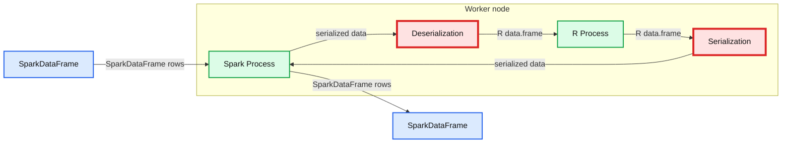
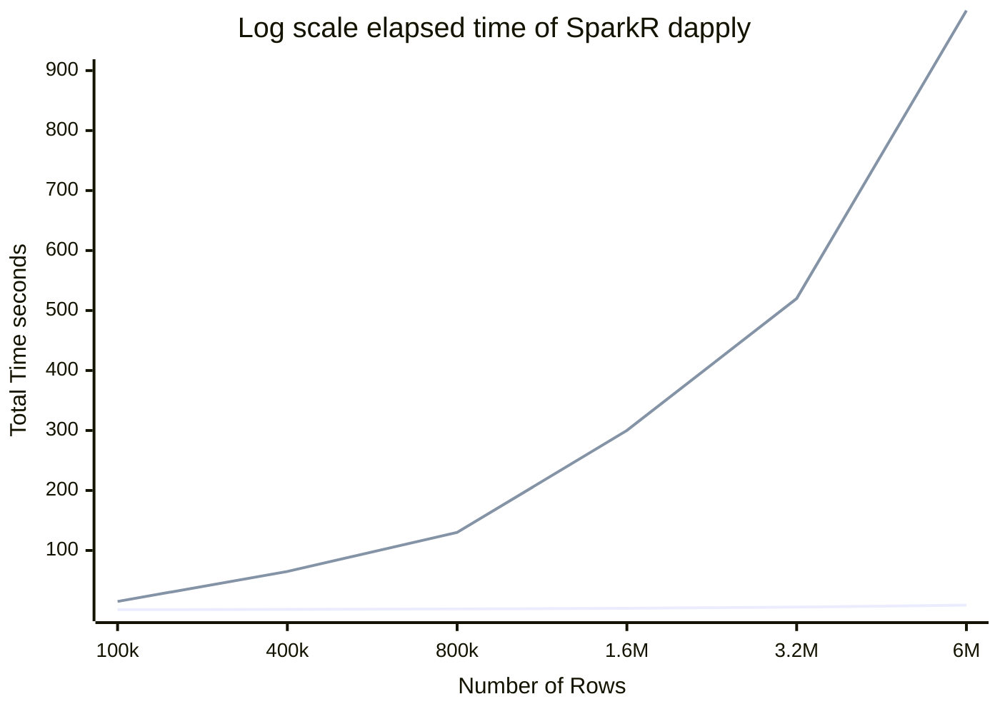
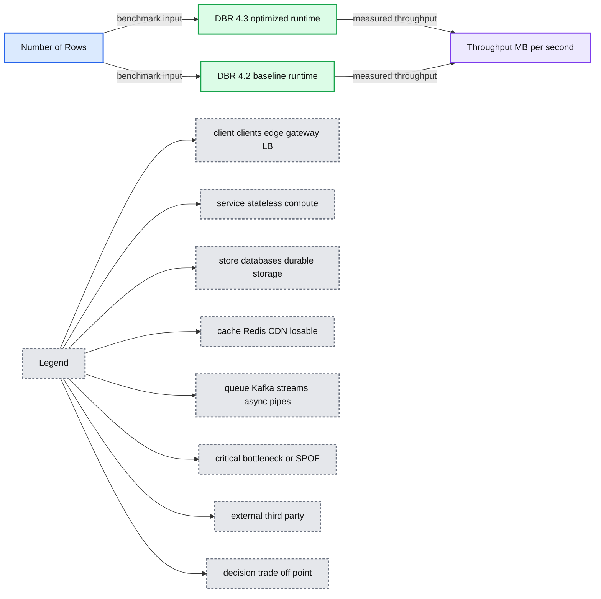
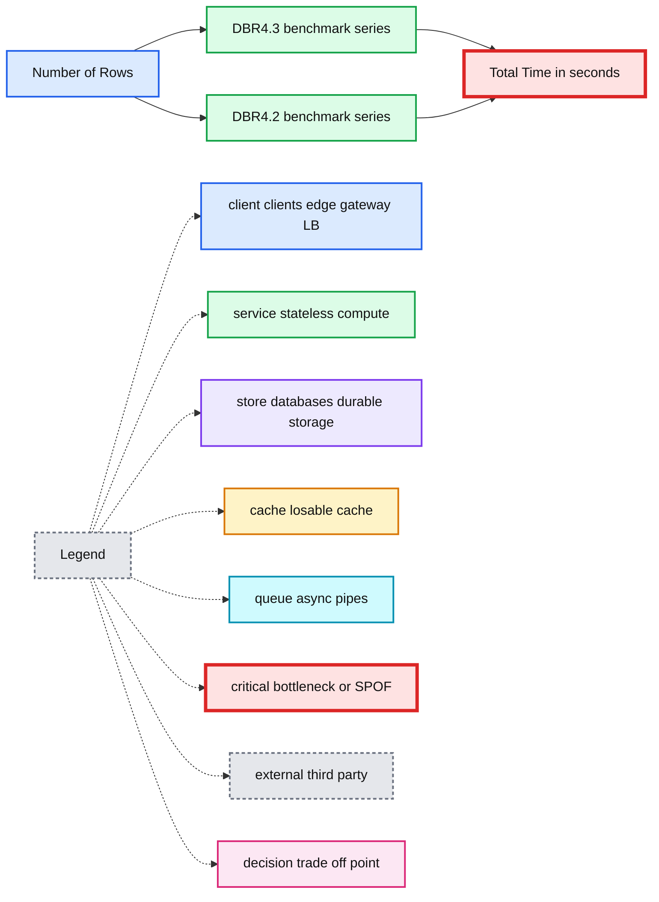
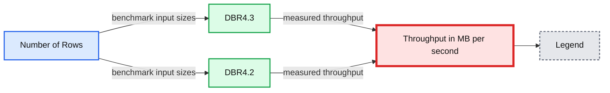

# 100x Faster Bridge between Apache Spark and R with User-Defined Functions on Databricks

- Source: https://www.databricks.com/blog/2018/08/15/100x-faster-bridge-between-spark-and-r-with-user-defined-functions-on-databricks.html
- Published: 2018-08-15
- Authors: Liang Zhang, Hossein Falaki
- Categories: engineering, open-source, data-science-machine-learning
- Images: 5 total, 5 extracted as architecture

SparkR User-Defined Function (UDF) API opens up opportunities for big data workloads running on [Apache Spark](https://www.databricks.com/spark/about) to embrace R's rich package ecosystem. Some of our customers that have R experts on board use SparkR UDF API to blend R's sophisticated packages into their ETL pipeline, applying transformations that go beyond Spark’s built-in functions on the distributed SparkDataFrame. Some other customers use R UDFs for [parallel simulations](https://www.databricks.com/blog/2017/06/23/parallelizing-large-simulations-apache-sparkr-databricks.html) or hyper-parameter tuning. Overall, the API is powerful and enables many use cases.

SparkR UDF API transfers data between Spark JVM and R process back and forth. Inside the UDF function, user gets a wonderful island of R with access to the entire R ecosystem. But unfortunately, the bridge between R and JVM is far from efficient. It currently only allows one "car" to pass on the bridge at any time, and the "car" here is a single field in any Row of a SparkDataFrame. It should not be a surprise that traffic on the bridge is very slow.

In this blog, we provide an overview of SparkR’s UDF API and then show how we made the bridge between R and Spark on Databricks efficient. We present some benchmark results.

## Overview of SparkR User-Defined Function API

SparkR offers four APIs that run a user-defined function in R to a SparkDataFrame

- *dapply()*
- *dapplyCollect()*
- *gapply()*
- *gapplyCollect()*

*dapply()* allows you to run an R function on each partition of the SparkDataFrame and returns the result as a new SparkDataFrame, on which you may apply other transformations or actions. *gapply()* allows you to apply a function to each grouped partition consisting of a key and the corresponding rows in a SparkDataFrame. *dapplyCollect()* and *gapplyCollect()* are shortcuts if you want to call *collect()* on the result.

The following diagram illustrates the serialization and deserialization performed during the execution of the UDF. The data gets serialized twice and deserialized twice in total, all of which are row-wise.

**Summary:** The diagram shows row-wise serialization and deserialization between a Spark process and an R process on a worker node.

**Components:**

- SparkDataFrame
- Spark Process
- Serialization
- Deserialization
- R data.frame
- R Process
- Worker node

**Flows:**

- SparkDataFrame -> Spark Process: SparkDataFrame rows
- Spark Process -> Deserialization: serialized data
- Deserialization -> R Process: R data.frame
- R Process -> Serialization: R data.frame
- Serialization -> Spark Process: serialized data
- Spark Process -> SparkDataFrame: SparkDataFrame rows

**Numbers:** none

source image: https://www.databricks.com/wp-content/uploads/2018/08/image1-2.png

By vectorizing data serialization and deserialization in Databricks Runtime 4.3, we encode and decode all the values of a column at once. This eliminates the primary bottleneck which row-wise serialization, and significantly improves SparkR’s UDF performance. Also, the benefit from the vectorization is more drastic for larger datasets.

## Methodology and Benchmark Results

We use the Airlines' dataset for the benchmark. The dataset consists of 24 integer fields and 5 string fields including date, departure time, destination and other information about each flight. We measure the running time and throughput of SparkR UDF APIs on subsets of data with varying sizes on both Databricks Runtime (DBR) 4.2 and Databricks Runtime 4.3, and report the mean and standard deviation over 20 runs. DBR 4.3 includes the new optimization work, while DBR 4.2 does not. All the tests are performed on cluster with eight i3.xlarge workers.

### SparkR::dapply()

To demonstrate the acceleration, we use a trivial user function with *SparkR::dapply()* that simply returns the input R `data.frame.`

**Summary:** Benchmark comparing elapsed time for SparkR dapply across Databricks Runtime 4.3 and 4.2 as dataset size increases.

**Components:**

- SparkR dapply user-defined function
- DBR 4.3 optimized runtime
- DBR 4.2 baseline runtime
- Number of Rows input scale
- Total Time seconds measurement

**Flows:**

- Number of Rows -> DBR 4.3: benchmark input size
- Number of Rows -> DBR 4.2: benchmark input size
- DBR 4.3 -> Total Time seconds: optimized elapsed-time result
- DBR 4.2 -> Total Time seconds: baseline elapsed-time result

**Numbers:** 100x; DBR 4.3; DBR 4.2; 1, 2, 4, 10, 30, 100, 200, 400, 800 seconds; 100k, 400k, 800k, 1.6M, 3.2M, 6M rows

source image: https://www.databricks.com/wp-content/uploads/2018/08/image2-2.png

**Summary:** Benchmark chart comparing SparkR dapply throughput for DBR 4.3 and DBR 4.2 across increasing row counts.

**Components:**

- SparkR dapply benchmark
- DBR 4.3 optimized runtime
- DBR 4.2 baseline runtime
- Number of Rows input axis
- Throughput output in MB per second

**Flows:**

- Number of Rows -> DBR 4.3 optimized runtime: benchmark input
- Number of Rows -> DBR 4.2 baseline runtime: benchmark input
- DBR 4.3 optimized runtime -> Throughput output: measured throughput
- DBR 4.2 baseline runtime -> Throughput output: measured throughput

**Numbers:** 4.3, 4.2, 100k, 400k, 800k, 1.6M, 3.2M, 6M, 1, 2, 4, 10, 30, 70, 100x, 20, 8, i3.xlarge, 100s, 3s, 30 MB/s, 0.5 MiB/s, 6M, 10 seconds

source image: https://www.databricks.com/wp-content/uploads/2018/08/image3-1.png

Overall, the improvement is one to two orders of magnitude, and increases with the number of rows in the dataset. For data with 800k rows, the running time reduces from more than 100s to less than 3s. The throughput of DBR 4.3 is more than 30 MB/s, while it is only about 0.5 MiB/s before our optimization. For data with 6M rows, the running time is still below 10 seconds, and the throughput is about 70 MiB/s -- that is 100x acceleration!

### SparkR::gapply()

In practice *SparkR::gapply()* is more frequently used compared to *dapply()*. In our benchmarks, we removed the shuffling cost by pre-partitioning the data by the *DayOfMonth* field, and using the same key in *gapply()* to count the total number of flights on each day of month.

**Summary:** Benchmark chart comparing log-scale elapsed time for SparkR gapply across row counts on DBR4.3 and DBR4.2.

**Components:**

- DBR4.3 benchmark series
- DBR4.2 benchmark series
- Number of Rows x-axis
- Total Time in seconds y-axis
- Logarithmic scale

**Flows:**

- Number of Rows -> DBR4.3 benchmark series: measured row-count inputs
- Number of Rows -> DBR4.2 benchmark series: measured row-count inputs
- DBR4.3 benchmark series -> Total Time in seconds: elapsed-time results
- DBR4.2 benchmark series -> Total Time in seconds: elapsed-time results

**Numbers:** 4.3, 4.2, 100k, 400k, 800k, 1.6M, 3.2M, 6M, 2 seconds, 4 seconds, 10 seconds, 30 seconds, 100 seconds, 200 seconds

source image: https://www.databricks.com/wp-content/uploads/2018/08/image4-2.png

**Summary:** Benchmark chart comparing SparkR::gapply() throughput on DBR4.3 and DBR4.2 across increasing row counts.

**Components:**

- SparkR::gapply() benchmark
- DBR4.3
- DBR4.2
- Number of Rows axis
- Throughput in MB/second axis

**Flows:**

- Number of Rows -> DBR4.3: benchmark input sizes
- Number of Rows -> DBR4.2: benchmark input sizes
- DBR4.3 -> Throughput: measured throughput
- DBR4.2 -> Throughput: measured throughput

**Numbers:** 100, 30, 10, 4, 2, 1, 100k, 400k, 800k, 1.6M, 3.2M, 6M, DBR4.3, DBR4.2, 100x

source image: https://www.databricks.com/wp-content/uploads/2018/08/image5-2.png

In our experiment, *gapply()* runs faster than *dapply()*, because the output data of the UDF is the aggregated result of the input data, which is small. Thus the total serialization and deserialization time could be halved.

## Summary

In summary, our optimization has an overwhelming advantage over the previous version on all ranges of typical data sizes, and for larger data, we observed one to two orders of magnitude improvement. Such significant improvement can empower many use cases that were barely acceptable before. Also, Date and Timestamp data types are now supported in DBR 4.3, which had to be cast to double in the previous version.

## Read More

This optimization is one of a series of efforts from Databricks that boost the performance of SparkR on Databricks Runtime. Check out the following assets for more information:

- [Accelerating R Workflows on Databricks](https://www.databricks.com/blog/2017/10/06/accelerating-r-workflows-on-databricks.html)
- [Parallelizing Large Simulations with Apache SparkR on Databricks](https://www.databricks.com/blog/2017/06/23/parallelizing-large-simulations-apache-sparkr-databricks.html)
- [On-Demand Webinar and FAQ: Parallelize R Code Using Apache Spark](https://www.databricks.com/blog/2017/08/21/on-demand-webinar-and-faq-parallelize-r-code-using-apache-spark.html)
