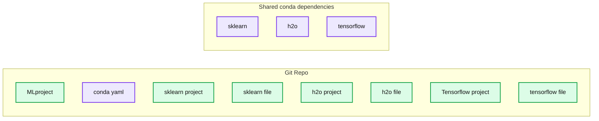
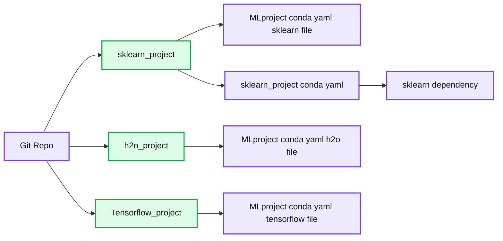

# Introducing mlflow-apps: A Repository of Sample Applications for MLflow

- Source: https://www.databricks.com/blog/2018/08/16/introducing-mlflow-apps-a-repository-of-sample-applications-for-mlflow.html
- Published: 2018-08-16
- Authors: Juntai Zheng
- Categories: platform, engineering, open-source, data-science-machine-learning
- Images: 2 total, 2 extracted as architecture

## Introduction

This summer, I was a software engineering intern at Databricks on the Machine Learning (ML) Platform team. As part of my intern project, I built a set of MLflow apps that demonstrate MLflow's capabilities and offer the community examples to learn from.

In this blog, I'll discuss this library of pluggable ML applications, all runnable via [MLflow](https://www.databricks.com/blog/2018/06/05/introducing-mlflow-an-open-source-machine-learning-platform.html). In addition, I’ll share how I implemented two MLflow features during my internship: running MLprojects from Git subdirectories and TensorFlow integration.

## mlflow-apps: A Set of Sample MLflow Applications

[mlflow-apps](https://github.com/mlflow/mlflow-apps) is a repository of pluggable ML applications runnable via MLflow. It helps users get a jump start on using MLflow by providing concrete examples on how MLflow can be used.

Through a one-line MLflow API call or CLI commands, users can run apps to train TensorFlow, XGBoost, and scikit-learn models on data stored locally or in cloud storage. These apps log common metrics and parameters via [MLflow’s tracking APIs](https://www.mlflow.org/docs/latest/tracking.html), allowing users to easily compare fitted models.

Currently, mlflow-apps focuses on model training, but we plan to add additional functionality for feature engineering /data pre-processing. We welcome community contributions on this front.

mlflow-apps comprises of three apps, each of which creates and trains a different model based on your input data. The models trained by the apps are:

- [TensorFlow's DNNRegressor](https://www.tensorflow.org/api_docs/python/tf/estimator/DNNRegressor)
- [XGBoost's Gradient Boosted Tree](https://xgboost.readthedocs.io/en/latest/python/python_api.html#module-xgboost.sklearn) (GBT)
- [Sklearn's Elastic Net](https://scikit-learn.org/stable/modules/generated/sklearn.linear_model.ElasticNet.html)

Curious about how you can use the apps? You can see the source code and a short tutorial for the apps in the repository [here](https://github.com/mlflow/mlflow-apps). For an in-depth tutorial that demonstrates how to use these apps with MLflow within Databricks, check out this [notebook](https://docs.databricks.com/_static/notebooks/blog-mlflow-apps.html).

## Enhancing Open Source MLflow

MLflow has the ability to run MLflow projects located in remote git repositories, via CLI commands such as

MLflow can now execute ML projects described by [MLproject](https://www.mlflow.org/docs/latest/projects.html#specifying-projects) files located in subdirectories of git repositories. Previously, executing an MLflow run from a remote repository required the MLproject and conda.yaml files to be in the root directory of the git repository. An example git repo structure would have had to look like the following:

*Original MLFlow Git Repo Layout*

**Summary:** The diagram shows an MLflow Git repository layout where separate projects share a root `conda.yaml` containing all framework dependencies.

**Components:**

- Git Repo
- MLproject
- conda.yaml
- sklearn_project with sklearn_file
- h2o_project with h2o_file
- Tensorflow_project with tensorflow_file
- sklearn dependency
- h2o dependency
- tensorflow dependency

**Flows:**

- None

**Numbers:** none

source image: https://www.databricks.com/wp-content/uploads/2018/08/image1-3.png

Original MLFlow Git Repo Layout

This git repo structure would cause each project to share unnecessary dependencies with each other (e.g. running the `sklearn_file` would require a conda environment with all three different frameworks installed despite only sklearn being needed). With the new feature implemented, a command could look like this:

which would subsequently access the MLproject file located in a subdirectory called `sklearn_project`. The previous example git repo shown above can now be restructured as such:

*Improved MLflow Project Git Layout*

**Summary:** Shows a modular Git repository layout for separate MLflow projects and the contents of one project’s conda environment file.

**Components:**

- `sklearn_project` using sklearn
- `h2o_project` using h2o
- `Tensorflow_project` using TensorFlow
- Each project contains an `MLproject` file, a `conda.yaml` file, and a framework-specific project file
- `conda.yaml` containing sklearn as a dependency

**Flows:**

- none

**Numbers:** none

source image: https://www.databricks.com/wp-content/uploads/2018/08/image2-3.png

Improved MLflow Project Git Layout

Now, the projects and dependencies are nicely modularized and decoupled (e.g. `sklearn_project` only needs the `sklearn` framework when creating a conda environment). This in turn leads to a cleaner and easier user experience with MLflow.

## TensorFlow Integration for MLflow

Although MLflow allows users to run and deploy models using any ML library, we also want the project to have built-in easy-to-use integrations with popular libraries. As part of my internship, I developed an integration for TensorFlow, which allows saving, loading and deploying TensorFlow models.

In addition to logging TensorFlow models, you can load them back and perform inference on them using MLflow APIs.

MLflow currently has built-in integrations for TensorFlow, SparkML, H2O, and sklearn models. Keep your eye out for more framework support in the near future!

## Conclusion

While working on mlflow-apps, I was able to experience MLflow both as a user and a project developer. I was able to better see the how closely intertwined the community and project developers are for open source projects like MLflow.

As my first internship, I couldn’t have asked for a better experience. I came into Databricks eager to learn everything about the industry and new technologies - what I found were engineers who matched my desire to learn. Because I was in an environment where accomplished engineers constantly push themselves to learn and challenge themselves, I, in turn, was encouraged to do the same. Consequently, I improved my skills both as a software engineer by leaps and bounds.

Special shoutout to the Production Serving and ML Platform teams, which include Matei Zaharia, Aaron Davidson, Paul Ogilvie, Andrew Chen, Mani Parkhe, Tomas Nykodym, Sue Ann Hong, Corey Zumar, and my mentor Sid Murching. Thanks for the fantastic summer!

## Read More

Check out other resources for learning about MLflow & mlflow-apps here:

- [mlflow-apps](https://github.com/mlflow/mlflow-apps)
- [mlflow-apps Example Notebook](https://docs.databricks.com/_static/notebooks/blog-mlflow-apps.html)
- [MLflow Git Repo](https://github.com/mlflow/mlflow)
- [MLflow Documentation](https://www.mlflow.org/docs/latest/index.html)
