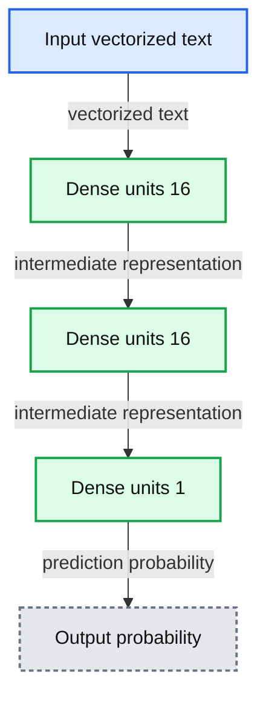
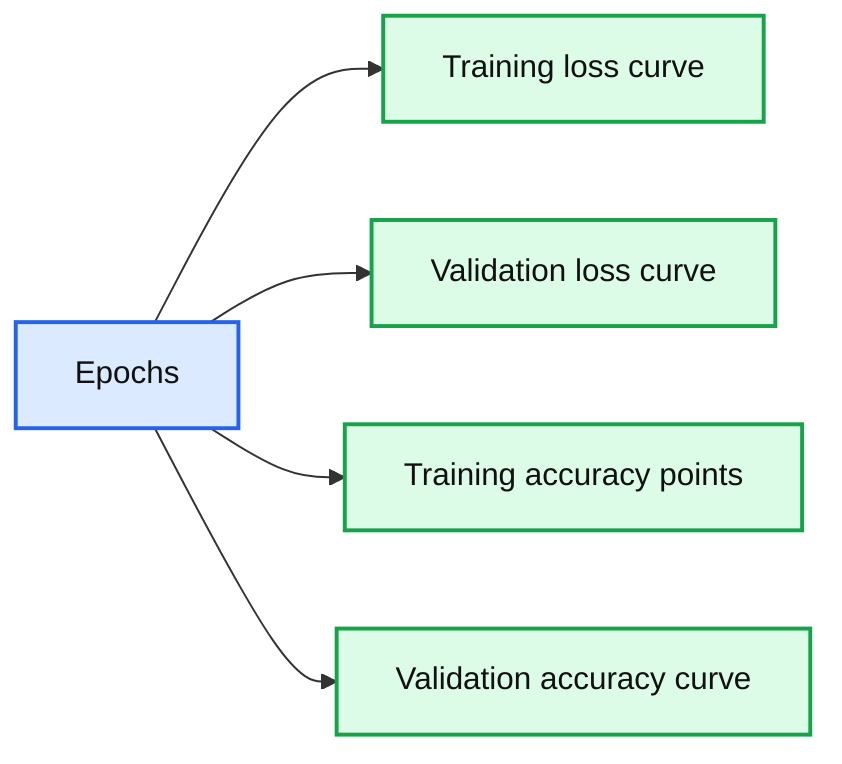
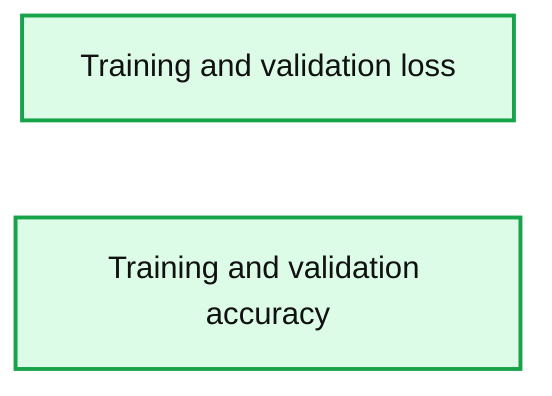
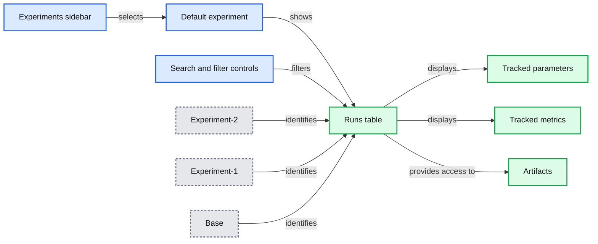

# How to Use MLflow to Experiment a Keras Network Model: Binary Classification for Movie Reviews

*Use MLflow in your favorite Python IDE*

- Source: https://www.databricks.com/blog/2018/08/23/how-to-use-mlflow-to-experiment-a-keras-network-model-binary-classification-for-movie-reviews.html
- Published: 2018-08-23
- Authors: Jules Damji
- Categories: platform, engineering, open-source, data-science-machine-learning
- Images: 6 total, 5 extracted as architecture

In the [last blog post](https://www.databricks.com/blog/2018/07/10/how-to-use-mlflow-tensorflow-and-keras-with-pycharm.html), we demonstrated the ease with which you can get started with [MLflow](https://mlflow.org/), an open-source platform to manage machine learning lifecycle. In particular, we illustrated a simple Keras/TensorFlow model using MLflow and [PyCharm](https://www.databricks.com/glossary/what-is-pycharm). This time we explore a binary classification Keras network model. Using [MLflow’s Tracking APIs](https://www.mlflow.org/docs/latest/tracking.html), we will track metrics—*accuracy and loss*–during training and validation from runs between baseline and experimental models. As before we will use [PyCharm](https://www.jetbrains.com/pycharm/) and localhost to run all experiments.

## Binary Classification for IMDB Movie Reviews

Binary classification is a common machine learning problem, where you want to categorize the outcome into two distinct classes, especially for sentiment classification. For this example, we will classify movie reviews into "positive" or "negative" reviews, by examining review’s text content for occurance of common words that express an emotion.

Borrowed primarily from François Chollet’s ["Deep Learning with Python"](https://www.manning.com/books/deep-learning-with-python?a_aid=keras&a_bid=76564dff), the Keras network example code has been [modularized and modified](https://github.com/dmatrix/jsd-mlflow-examples/tree/master/keras/imdbclassifier) to constitute as an [MLFlow project](https://www.mlflow.org/docs/latest/projects.html) and incorporate the [MLflow Tracking API](https://www.mlflow.org/docs/latest/tracking.html) to log parameters, metrics, and artifacts.

### Methodology and Experiments

The Internet Movie Database (IMDB) comes packaged with [Keras](https://keras.io/); it is a set of 50,000 popular movies, split into 25,000 reviews for training and 25,000 for validation, with an even distribution of “positive” and “negative” sentiments. We will use this dataset for training and validating our a model.

By simple data preparation, we can convert this data into tensors, as numpy arrays, for our Keras [neural network](https://www.databricks.com/glossary/neural-network) model to process. (The code for reading and preparing data is in the module: [*data_utils_nn.py*](https://github.com/dmatrix/jsd-mlflow-examples/blob/master/keras/imdbclassifier/data_utils_nn.py).)

We will create two Keras neural network models—*baseline and experimental*—and train them on our dataset. While the *baseline model* will remain constant, we will experiment with the two *experimental models*, by supplying different tuning parameters and loss functions to compare the results.

This is where [MLflow’s tracking component](https://www.mlflow.org/docs/latest/tracking.html) immensely helps us evaluate which of the myriad tunning parameters produce the best metrics in our models. Let’s first examine the *baseline* model.

### Baseline Model: Keras Neural Network Performance

*source : Deep Learning with Python*

**Summary:** A Keras Sequential neural network transforms vectorized text input into an output probability through three Dense layers.

**Components:**

- Sequential model using Keras
- Dense layer using Keras with 16 units
- Dense layer using Keras with 16 units
- Dense layer using Keras with 1 unit
- Output probability

**Flows:**

- Input -> Dense 16 bottom: vectorized text
- Dense 16 bottom -> Dense 16 middle: intermediate representation
- Dense 16 middle -> Dense 1: intermediate representation
- Dense 1 -> Output probability: prediction probability

**Numbers:** 16, 16, 1



<sub>source image: https://www.databricks.com/wp-content/uploads/2018/08/image8.png</sub>

source : Deep Learning with Python

François’s code example employs this Keras network architectural choice for binary classification. It comprises of three [Dense layers](https://keras.io/api/layers/core_layers/): one hidden layer (16 units), one input layer (16 units), and one output layer (1 unit), as show in the diagram. “A hidden unit is a dimension in the representation space of the layer,” Chollet writes, where 16 is adequate for this problem space; for complex problems, like image classification, we can always bump up the units or add hidden layers to experiment and observe its effect on accuracy and loss metrics (which we shall do in the experiments below).

While the input and hidden layers use [*relu*](https://en.wikipedia.org/wiki/Rectifier_(neural_networks)) as an activation function, the final output layer uses [*sigmoid*](https://en.wikipedia.org/wiki/Sigmoid_function), to squash its results into probabilities between [0, 1]. Anything closer to 1 suggests positive, while something below 0.5 can indicate negative.

With this recommended baseline architecture, we train our base model and log all the parameters, metrics, and artifacts. This snippet code, from module [*models_nn.py*](https://github.com/dmatrix/jsd-mlflow-examples/blob/master/keras/imdbclassifier/model_nn.py), creates a stack of dense layers as depicted in the diagram above.

Next, after building the model, we compile the model, with appropriate loss function and optimizers. Since we are expecting probabilities as our final output, the recommended loss function for binary classification is [`binary_crosstropy`](https://keras.io/api/losses/) and the corresponding suggested optimizer is [`rmsprop.`](https://keras.io/api/optimizers/) The code snippet from module [*train_nn.py*](https://github.com/dmatrix/jsd-mlflow-examples/blob/master/keras/imdbclassifier/train_nn.py) compiles our model.

Finally, we fit (train) and evaluate by running iterations or epochs with a default batch size for 512 samples from the IMDB data set for each iteration, with default parameters:

- Epochs = 20
- Loss = binary_misantropy
- Units = 16
- Hidden Layers = 1

To run from the command line, cd to the Git repository directory *keras/imdbclassifier* and run either:

`python main_nn.py`

Or from the GitHub repo top level directory run:

`mlflow run keras/imdbclassifier -e main`

Or directly from Gitbub:

`mlflow run 'https://github.com/dmatrix/jsd-mlflow-examples.git#keras/imdbclassifier'`

https://www.youtube.com/watch?v=6oGIwyAlUIM
 Fig 1: Animated run with base model parameters on a local host

At the end of the run, the model will print a set of final metrics such as *binary_loss*, *binary_accuracy*, *validation_loss*, and *validation_accuracy* for both training set and validation set after all iterations.

Fig 2: Results and metrics run with base model parameters

As you will notice from the runs, the loss decreases over iterations while the accuracy increases, with the former converging toward 0 and the latter toward 1.

Our final training data (*binary_loss*) converged to 0.211 and the validation data (*validation_loss*) tracked with 0.29—which tracked somewhat closely with *binary_loss*. On the other hand, the accuracy diverged after several epochs suggesting we may be overfitting with the training data (see plots below).

(*Note*: To access these plots, launch the MLFlow UI, click on any experimental run, and access its artifacts’ folder.)

When predicting with unseen IMDB reviews, the prediction results averaged at 0.88 accuracy, which is close to our validation accuracy, but still fairly far off. However, as you can see, for some reviews the network confidently predicted results with 99% probability of a positive review.

*Fig 3a: Matplotlib artifacts logged with base and experiment model parameters*

**Summary:** Two plots compare baseline model training and validation loss and accuracy across epochs.

**Components:**

- Training loss curve
- Validation loss curve
- Training accuracy points
- Validation accuracy curve
- Epoch axis
- Loss axis

**Flows:**

- Epochs -> Training loss curve: loss measurements
- Epochs -> Validation loss curve: loss measurements
- Epochs -> Training accuracy points: accuracy measurements
- Epochs -> Validation accuracy curve: accuracy measurements

**Numbers:** 3a, 0.2, 0.3, 0.4, 0.5, 0.6, 0.7, 0.80, 0.85, 0.90, 0.95, 2.5, 5.0, 7.5, 10.0, 12.5, 15.0, 17.5, 20.0, 20



<sub>source image: https://www.databricks.com/wp-content/uploads/2018/08/image9.jpg</sub>

Fig 3a: Matplotlib artifacts logged with base and experiment model parameters

*Fig 3b: Matplotlib artifacts logged with base and experiment model parameters*

**Summary:** Two Matplotlib plots compare training and validation loss and accuracy across epochs for a Keras model.

**Components:**

- Training loss series
- Validation loss curve
- Training accuracy series
- Validation accuracy curve
- Epochs axis
- Loss axis
- Accuracy axis

**Flows:**

- none

**Numbers:** 20 epochs; loss ticks 0.05, 0.10, 0.15, 0.20, 0.25; accuracy ticks 0.60, 0.65, 0.70, 0.75, 0.80, 0.85, 0.90, 0.95; training accuracy reaches approximately 0.98; validation accuracy reaches approximately 0.89; training loss reaches approximately 0.025; validation loss reaches approximately 0.085.



<sub>source image: https://www.databricks.com/wp-content/uploads/2018/08/image3.jpg</sub>

Fig 3b: Matplotlib artifacts logged with base and experiment model parameters

At this point, after observing the basic model metrics, you may ask, can we do better? Can we tweak some tuning parameters such as number of hidden layers, epochs, loss function or units to affect better results. Let’s try with some recommended experiments.

## Experimental Model: Keras Neural Network Performance

[MLflow’s Tracking Component](https://www.mlflow.org/docs/latest/tracking.html) allows us to track experimental runs of our model with different parameters and persist their metrics and artifacts for analysis. Let’s launch a couple of runs with the following experimental parameters, as Chollet suggests, that are different from the default model and observe an outcome:

| Model | Units | Epochs | Loss Function | Hidden Layers |
|---|---|---|---|---|
| Base | 16 | 20 | binary_crosstropy | 1 |
| Experiment-1 | 32 | 30 | binary_crosstropy | 3 |
| Experiment-2 | 32 | 20 | mse | 3 |

*Table 1: Models and Parameters*

### Running Experiments on Local Host

Since we are running MLflow on the local machine, all results are logged locally. However, you can as easily log metrics [remotely on a hosted tracking server in Databricks](https://mlflow.org/docs/latest/tracking.html#connecting-to-a-remote-server), by simply setting an environment variable MLFLOW_TRACKING_URI or programmatically set with [*mlflow.set_tracking_uri()*](https://mlflow.org/docs/latest/python_api/mlflow.html#mlflow.set_tracking_uri).

Either connects to a tracking URI and log results. In both cases, the URI can either be a HTTP/HTTPS URI for a remote server, or a local path to a directory. On the local host, the URI defaults to an *mlruns* directory.

### Running Experiments within PyCharm with MLFlow

Since I prefer PyCharm for my Python development, I’ll run my experiments from within PyCharm on my laptop, providing the experimental parameters. Below is an animation from the first experiment. (To learn how to use MLflow within PyCharm read [my previous blog](https://www.databricks.com/blog/2018/07/10/how-to-use-mlflow-tensorflow-and-keras-with-pycharm.html)).

Although I ran the experiments by providing parameters within PyCharm’s run configurations, you can just as easily run these experiments on the command line from the top level directory, too:

https://www.youtube.com/watch?v=Wgt6f6CfpkY
 Fig 4: Animated run with experiment-1 model parameters

All experiments’ runs are logged, and we can examine each metric and compare various runs to assess results. All the code that logs these artifacts using [MLflow Tracking API](https://www.mlflow.org/docs/latest/tracking.html) is in the [*train_nn.py*](https://github.com/dmatrix/jsd-mlflow-examples/blob/master/keras/imdbclassifier/train_nn.py) module. Here is a partial code snippet:

### Comparing Experiments and Results with MLFlow UI

Now the best part. MLflow allows you to view all your runs and logged results from an MLflow GUI, where you can compare all three runs’ metrics. Recent UI improvements in [MLFlow v0.5.1](https://www.databricks.com/blog/2018/08/21/whats-new-in-mlflow-v0-5-0-release.html) offer a better experience in comparing runs.

To launch a Flask tracking server on your localhost:5000, use command line `mlflow ui`.

*Fig 5: MLflow UI table view of all runs’ metrics, parameters, and artifacts*

**Summary:** MLflow UI compares experiment runs by displaying their parameters, metrics, and artifacts in a table.

**Components:**

- MLflow tracking UI
- Experiments sidebar
- Default experiment
- Search and filter controls
- Runs table
- Tracked parameters
- Tracked metrics
- Artifacts

**Flows:**

- Experiments sidebar -> Runs table: selects the experiment
- Search and filter controls -> Runs table: filters displayed runs
- Runs table -> Tracked parameters: displays run parameters
- Runs table -> Tracked metrics: displays run metrics
- Runs table -> Artifacts: provides access to logged artifacts
- Experiment-2 -> Runs table: identifies a run
- Experiment-1 -> Runs table: identifies a run
- Base -> Runs table: identifies a run

**Numbers:** 5, 0, 9, 20, 30, 32, 3, 1, 2, 16, 0.876, 0.09, 0.966, 0.441, 0.992, 0.035, 0.885, 0.025, 0.883, 0.304, 0.937, 0.212, 0.89, 0.212, 0.881, 0.069, 0.96, 0.04, 0.887, 0.04, 0.867, 0.304, 0.937, 0.212, 0.89, 0.212, 0.883, 0.304, 0.937, 0.212, 0.89, 0.212, 0.881, 0.069, 0.96, 0.04, 0.887, 0.04



<sub>source image: https://www.databricks.com/wp-content/uploads/2018/08/image5.jpg</sub>

Fig 5: MLflow UI table view of all runs’ metrics, parameters, and artifacts

For example, I can compare all three experiments’ metrics to see which of the runs produced an acceptable validation accuracy and loss as well view each of my experiments’ matplotlib images to see how they fared across epochs.

https://www.youtube.com/watch?v=89I0Tro8BAQ
 Fig 6: Animated view of metrics with experimental parameters

### Comparing Results from Three Runs

By quickly examining our runs in MLFlow UI, we can easily observe the following:

- Changing the number of epochs did not give us any benefit except the model began overfitting, as it reached training accuracy of 99%, with no corresponding difference to validation accuracy, which diverges after several epochs.
- Changing the loss function to `mse`, units to 32, and hidden layers to 3, however, gave us a better validation loss as well as a converging *average_loss* to 0 for the validation data. With other metrics tracking closely across models, a couple of extra hidden layers and more units minimized the validation loss.

*Fig 7: Comparing three run with parameters*

**Summary:** MLflow compares three Keras experiment runs by displaying their parameters and resulting metrics.

**Components:**

- MLflow comparison interface using MLflow
- Three experiment runs
- Parameters section
- Metrics section

**Flows:**

- Three experiment runs -> Parameters section: epochs, hidden layers, loss function, and output values
- Three experiment runs -> Metrics section: accuracy and loss measurements

**Numbers:** 7, 3, 20, 32, 30, 1, 16, 0.878, 0.09, 0.977, 0.025, 0.885, 0.866, 0.441, 0.992, 0.035, 0.879, 0.89, 0.304, 0.937, 0.212; 2018-08-13 15:13:54; 2018-08-13 14:34:43; 2018-08-13 09:12:03; run UUID `d1c0b6387a864aa8873b6ae9fcc215ef45ac8c41c5db40e394e9b638d0293f078962616d1a349cdb432d31c548dfd1`

```text
%% mermaid failed to render; kept as text
%% MLflow comparison of three experiment runs and their parameters and metrics
flowchart LR
    M[MLflow] --> C[Comparing three runs]
    C --> P[Parameters]
    C --> T[Metrics]
    R1[Run one] --> P
    R2[Run two] --> P
    R3[Run three] --> P
    R1 --> T
    R2 --> T
    R3 --> T

    classDef client   fill:#dbeafe,stroke:#2563eb,stroke-width:2px,color:#111
    classDef service  fill:#dcfce7,stroke:#16a34a,stroke-width:2px,color:#111
    classDef store    fill:#ede9fe,stroke:#7c3aed,stroke-width:2px,color:#111
    classDef cache    fill:#fef3c7,stroke:#d97706,stroke-width:2px,color:#111
    classDef queue    fill:#cffafe,stroke:#0891b2,stroke-width:2px,color:#111
    classDef critical fill:#fee2e2,stroke:#dc2626,stroke-width:4px,color:#111
    classDef external fill:#e5e7eb,stroke:#6b7280,stroke-width:2px,color:#111,stroke-dasharray:4 3
    classDef decision fill:#fce7f3,stroke:#db2777,stroke-width:2px,color:#111
    M,C,P,T,R1,R2,R3 service
```

<sub>source image: https://www.databricks.com/wp-content/uploads/2018/08/image2.jpg</sub>

Fig 7: Comparing three run with parameters

### Improving Model Metrics With Further Experiments

Notably, François Chollet posits that with further training, validation, and tests (TVT), we can achieve higher accuracy, over 95% and converge the loss to 0.01%. One way to achieve it is through further experiments with machine learning techniques such as
*add more data, simple-hold out validation, k-fold validation, add weight regularization, add dropout network layers, and increase network capacity*. These could minimize overfitting and achieve generalization—and as consequence drive better accuracy and minimal loss.

We could implement these techniques here, carry out further experiments, and use MLflow to assess outcomes. I’ll leave that as an exercise for the reader.

Because such experiments and iterations are so central to the way data scientists asses models, MLflow facilitates such lifecycle tasks. To that extent, this blog demonstrated that part of MLflow’s functionality.

## Closing Thoughts

So far we demonstrated the key use of MLflow Tracking Component’s APIs to log model’s myriad parameters, metrics, and artifacts so that at any point or anyone can reproduce the results from model’s MLflow Git project repository.

Second, through command line, PyCharm runs, and MLFlow UI, we compared various runs to examine the best metrics, and observed that by altering some parameters, we approached a model that could perhaps be used with acceptable accuracy for doing sentiment classification of IMDB movie reviews based on common words that express positive or negative review. Even better, as noted, we could further improve our models’ outcomes by using suggested machine learning techniques.

Finally, but far importantly, we experimented using MLflow within PyCharm on a local host, but we could just as easily track experiments on a remote server. With MLflow, Numpy, Pandas, Keras, and TensorFlow packages installed as part of our PyCharm Python Virtual Environment, this methodical iteration of model experiments is a vital step in a machine learning model’s life cycle. And the MLflow platform facilitates this crucial step—all from within your favorite Python IDE.

## What’s Next

Now that we have compared the baseline model to a couple of experimental models and we have seen MLflow’s merits, what is the next step? Try MLflow at [mlflow.org](https://mlflow.org/) to get started. Or try some of tutorials and examples in the documentation.

## Read More

Here are some resources for you to learn more:

- Read [MLflow Docs](https://www.mlflow.org/docs/latest/index.html)
- Find out [How to Use Keras, TensorFlow, and MLflow with PyCharm](https://www.databricks.com/blog/2018/07/10/how-to-use-mlflow-tensorflow-and-keras-with-pycharm.html)
- Learn from [Introducing mlflow-apps: A Repository of Sample Applications for MLflow](https://www.databricks.com/blog/2018/08/16/introducing-mlflow-apps-a-repository-of-sample-applications-for-mlflow.html)
- View [MLflow Meetup Presentations](https://vimeo.com/284199854) and [Slides](https://www.slideshare.net/databricks/introduction-fo-mlflow)
- Find out [New Features in MLflow Release v0.5.2](https://www.databricks.com/blog/2018/08/21/whats-new-in-mlflow-v0-5-0-release.html)
