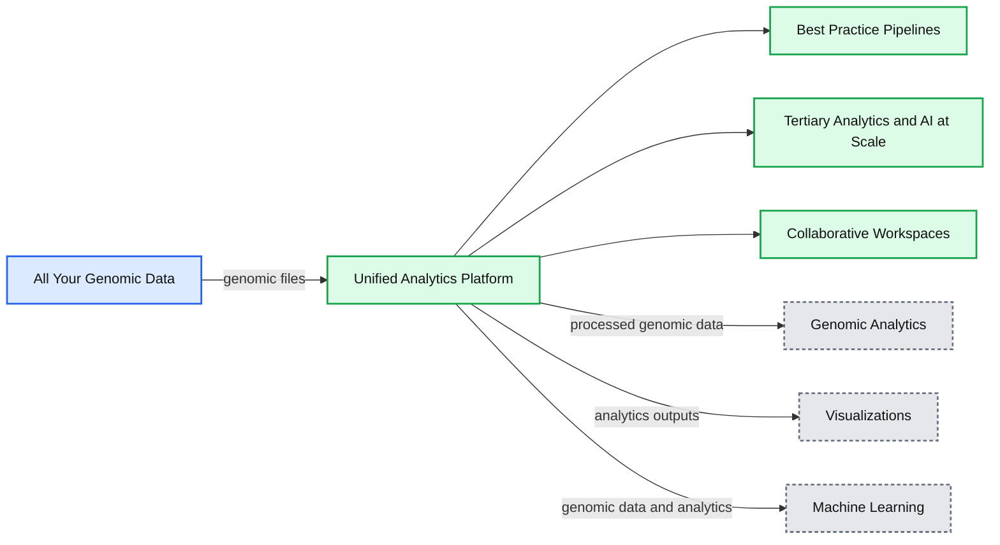

# Building the Fastest DNASeq Pipeline at Scale

- Source: https://www.databricks.com/blog/2018/09/10/building-the-fastest-dnaseq-pipeline-at-scale.html
- Published: 2018-09-10
- Authors: Henry Davidge, Frank Austin Nothaft
- Categories: engineering, platform
- Images: 3 total, 2 extracted as architecture

**Summary:** Databricks presents a unified cloud analytics platform that processes genomic data through pipelines, tertiary analytics and AI, and collaborative workspaces.

**Components:**

- All Your Genomic Data: BAM, SAM, CRAM, and Fastq files
- Best Practice Pipelines: Databricks genomic processing pipelines
- Tertiary Analytics and AI at Scale: Databricks analytics and AI
- Collaborative Workspaces: Databricks collaboration environment
- Genomic Analytics: GWAS and eQTL
- Visualizations: genomic data visualizations
- Machine Learning: genomic machine learning
- Unified Analytics Platform for Genomics: fully managed cloud platform

**Flows:**

- All Your Genomic Data -> Unified Analytics Platform for Genomics: genomic files
- Unified Analytics Platform for Genomics -> Genomic Analytics: processed genomic data
- Unified Analytics Platform for Genomics -> Visualizations: analytics outputs
- Unified Analytics Platform for Genomics -> Machine Learning: genomic data and analytics

**Numbers:** 10x-100x performance improvements

source image: https://www.databricks.com/wp-content/uploads/2018/09/Screen-Shot-2018-09-04-at-12.47.19-PM.png

In June, we announced the [Unified Analytics Platform for Genomics](https://www.databricks.com/blog/2018/06/06/unified-analytics-platform-for-genomics.html) with a simple goal: accelerate discovery with a collaborative platform for interactive genomic data processing, analytics and AI at massive scale.  In this post, we’ll go into more detail about one component of the platform: a scalable DNASeq pipeline that is concordant with GATK4 at best-in-class speeds.

## Making Sense of Sequence Data at Scale

The vast majority of genomic data comes from [massively parallel sequencing](https://en.wikipedia.org/wiki/Massive_parallel_sequencing) technology. In this technique, the sample DNA must first be sliced into short segments with lengths of about 100 base pairs. The sequencer will emit the genetic sequence for each segment. In order to correct for sequencing errors, we typically require that each position in the genome is covered by at least 30 of these segments. Since there are about 3 billion base pairs in the human genome, that means that after sequencing, we must reassemble 3 billion / 100 * 30 = 900 million short reads before we can begin real analyses. This is no small effort.

Since this process is common to anyone working with DNA data, it’s important to codify a sound approach. The GATK team at the Broad Institute has led the way in describing [best practices](https://www.broadinstitute.org/partnerships/education/broade/best-practices-variant-calling-gatk-1) for processing DNASeq data, and many people today run either the GATK itself or GATK-compliant pipelines.

At a high level, this pipeline consists of 3 steps:

- Align each short read to a reference genome
- Apply statistical techniques to regions with some variant reads to determine the likelihood of a true variation from the reference
- Annotate variant sites with information like which gene, if any, it affects

**Summary:** Short DNA reads are compared and aligned against a reference genome to identify matching and variant bases.

**Components:**

- Short Reads: nucleotide read sequences
- Read Alignment Comparison: grouped read fragments with highlighted differing bases
- Reference Genome: reference nucleotide sequence

**Flows:**

- Short Reads -> Read Alignment Comparison: read sequences for alignment
- Read Alignment Comparison -> Reference Genome: aligned bases and observed variants

**Numbers:** none

```mermaid
%% Shows short DNA reads being aligned against a reference genome
flowchart LR
    A[Short Reads] -->|read sequences| B[Read Alignment Comparison]
    B -->|aligned bases and variants| C[Reference Genome]

    classDef client   fill:#dbeafe,stroke:#2563eb,stroke-width:2px,color:#111
    classDef service  fill:#dcfce7,stroke:#16a34a,stroke-width:2px,color:#111
    classDef store    fill:#ede9fe,stroke:#7c3aed,stroke-width:2px,color:#111
    classDef cache    fill:#fef3c7,stroke:#d97706,stroke-width:2px,color:#111
    classDef queue    fill:#cffafe,stroke:#0891b2,stroke-width:2px,color:#111
    classDef critical fill:#fee2e2,stroke:#dc2626,stroke-width:4px,color:#111
    classDef external fill:#e5e7eb,stroke:#6b7280,stroke-width:2px,color:#111,stroke-dasharray:4 3
    classDef decision fill:#fce7f3,stroke:#db2777,stroke-width:2px,color:#111

    class A client
    class B service
    class C store
```

source image: https://www.databricks.com/wp-content/uploads/2018/09/Genomics-blog-graphic-1.jpg

## Challenges Processing DNASeq Data

Although the components of a DNASeq pipeline have been well characterized, we found that many of our customers face common challenges scaling their pipelines to ever-growing volumes of data. These challenges include:

- **Infrastructure Management:** A number of our customers run these pipelines on their on-premise high performance computing (HPC) clusters. However, HPC clusters are not elastic -- you can’t quickly increase the size according to demand. In the best case, increasing data volume led to long queues of requests, and thus long waiting times. In the worst case, customers struggle with expensive outages that hurt productivity. Even among companies that have migrated their workloads to the cloud, people spend as much time writing config files as performing valuable analyses.
- **Data Organization:** Bioinformaticians are accustomed to dealing with a large variety of file formats, such as BAM, FASTQ, and VCF. However, as the number of samples reaches a certain threshold, managing individual files becomes infeasible. To scale analyses, people need simpler abstractions to organize their data.
- **Performance:** Everyone cares about the performance of their pipeline. Traditionally, price per genome draws the most consideration, although as clinical use cases mature, speed is becoming more and more important.

As we saw these challenges repeated across different organizations, we recognized an opportunity to leverage our experience as the original creators of Apache SparkTM , the leading engine for large data processing and machine learning, and the Databricks platform to help our customers run DNASeq pipelines at speed and scale without creating operational headaches.

## Our Solution

We have built the first available horizontally-scalable pipeline that is concordant with GATK4 best practices. We use Spark to efficiently shard each sample’s input data and pass it to single node tools like [BWA-MEM](https://github.com/lh3/bwa/tree/master/bwakit) for alignment and GATK’s HaplotypeCaller for variant calling. Our pipeline runs as a Databricks job, so the platform handles infrastructure provisioning and configuration without user intervention.

As new data arrives, users can take advantage of our REST APIs and the [Databricks CLI](https://docs.databricks.com/dev-tools/cli/index.html) to kick off a new run.

Of course, this pipeline is only the first step toward gaining biological insights from genomic data. To simplify downstream analyses, in addition to outputting the familiar formats like VCF files, we write out the aligned reads, called variants, and annotated variants to high-performance [Databricks Delta Lake](https://www.databricks.com/product/delta-lake-on-databricks) parquet tables. Since the data from all samples is available in a single logical table, it’s simple to turn around and join genetic variants against interesting sources like medical images and electronic medical records without having to wrangle thousands of individual files. Researchers can then leverage these joint datasets to search for correlations between a person’s genetic code and properties like whether they have a family history of a certain disease.

## Benchmarking Our DNASeq Pipeline

### Accuracy

Since the output of a DNASeq pipeline feeds into important research and clinical applications, accuracy is paramount. The results from our pipeline achieve high accuracy relative to curated high-confidence variant calls. Note that these results do not include any variant score recalibration or hard filtering, which would further improve the precision by eliminating false positives.

|  | Precision | Recall | F Score |
|---|---|---|---|
| **SNP** | 99.34% | 99.89% | 99.62% |
| **INDEL** | 99.20% | 99.37% | 99.29% |

Concordance vs GIAB NA24385 high confidence calls on [PrecisionFDA Truth Challenge](https://precision.fda.gov/challenges/truth/results) dataset (according to [hap.py](https://github.com/Illumina/hap.py))

### Performance

For our benchmarking, we compared our DNAseq pipeline to Edico Genome’s FPGA implementation against representative whole genome and whole exome datasets from the Genome in a Bottle project. We also tested our pipeline against GIAB’s 300x coverage dataset to demonstrate its scalability. Each run includes best practice quality control measures like duplicate marking. This table excludes variant annotation time since not all platforms include it out of the box.

In these experiments, Databricks clusters are reading and writing directly to and from S3. For runs of Edico or OSS GATK4, we downloaded the input data to the local filesystem. The download times are not included in the runtimes below. According to Edico’s documentation, the system can stream input data from S3, but we were unable to get it working. We used spot instances in Databricks since clusters will automatically recover from spot instance terminations. The compute costs below include only AWS costs; platform / license fees are excluded.

#### 30x Coverage Whole Genome

| Platform | Reference confidence code | Cluster | Runtime | Approx compute cost | Speed Improvement |
|---|---|---|---|---|---|
| Databricks | VCF | 13 c5.9xlarge (416 cores) | 24m29s | $2.88 | 3.6x |
| Edico | VCF | 1 f1.2xlarge (fpga) | 1h27m | $2.40 | - |
| Databricks | GVCF | 13 c5.9xlarge (416 cores) | 39m23s | $4.64 | 3.8x |
| Edico | GVCF | 1 f1.2xlarge (fpga) | 2h29m | $4.15 | - |

#### 30x Coverage Whole Exome

| Platform | Reference confidence code | Cluster | Runtime | Approx compute cost | Speed Improvement |
|---|---|---|---|---|---|
| Databricks | VCF | 13 c5.9xlarge (416 cores | 6m36s | $0.77 | 3.0x |
| Edico | VCF | 13 c5.9xlarge (416 cores | 19m31s | $0.54 | - |
| Databricks | GVCF | 13 c5.9xlarge (416 cores) | 7m22s | $0.86 | 3.5x |
| Edico | GVCF | 1 f1.2xlarge | 25m34s | $0.71 | - |

#### 300x coverage whole genome

| Platform | Reference confidence code | Cluster | Runtime | Approx compute cost | Speed Improvement |
|---|---|---|---|---|---|
| Databricks | GVCF | 50 c5.9xlarge (1600 cores) | 2h34m | $69.30 | (*no competitive solutions at this scale)* |

At roughly the same compute cost, our pipeline achieves higher speeds by scaling horizontally while remaining concordant with GATK4. As data volume or time sensitivity increase, it’s simple to add additional compute power by increasing the cluster size to accelerate analyses without sacrificing accuracy.

## Techniques and Optimizations

### Sharded Variant Calling

Although GATK4 includes a Spark implementation of its commonly-used HaplotypeCaller, it’s currently in beta and marked as unsafe for real use cases. In practice, we found the implementation to disagree with the single node pipeline as well as suffer from long and unpredictable runtimes. To scale variant calling, we implemented a new sharding methodology on top of Spark SQL. We added a Catalyst [Generator](https://jaceklaskowski.gitbooks.io/mastering-spark-sql/content/spark-sql-Expression-Generator.html) that efficiently maps each short read to one or more padded bins, where each bin covers about 5000 base pairs. Then, we repartition and sort by bin id and invoke the single-node HaplotypeCaller on each bin.

### Spark SQL for Simple Transformations

Our first implementation used the [ADAM](https://github.com/bigdatagenomics/adam) project for simple transformations like converting between different variant representations and grouping paired end reads. These transformations typically used Spark’s RDD API. By rewriting them as Spark SQL expressions, we saved CPU cycles and reduced memory consumption.

### Optimized Infrastructure

Eventually, we managed to trim down the data movement overhead to the point where almost all CPU time was spent running the core algorithms, like BWA-MEM and the HaplotypeCaller. At this point, rather than optimize these external applications, we focused on optimizing the configuration. Since we control the pipeline packaging, we could do this step once so that all our users could benefit.

The most important optimization centered on reducing memory overhead until we could take advantage of high CPU VMs, which have the lowest price per core, but the least memory. Some helpful techniques included compressing GVCF output by banding reference regions as early as possible and modifying the [SnpEff](http://snpeff.sourceforge.net/) variant annotation library so that the in-memory database could be shared between executor threads.

All of these optimizations (and more) are built into our DNASeq pipeline to provide an out-of-the-box ready solution for processing and analyzing large-scale genomic datasets at industry leading speed, accuracy and cost.

## Try it!

Our DNASeq pipeline is currently available for private preview as part of our [Unified Analytics Platform for Genomics](https://www.databricks.com/product/genomics). Fill out the [preview request form](https://pages.databricks.com/genomics-preview.html) if you’re interested in taking the platform for a spin or visit our genomic solutions page to [learn more](https://www.databricks.com/product/genomics).
