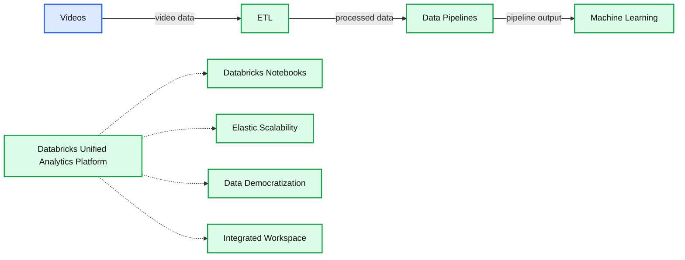
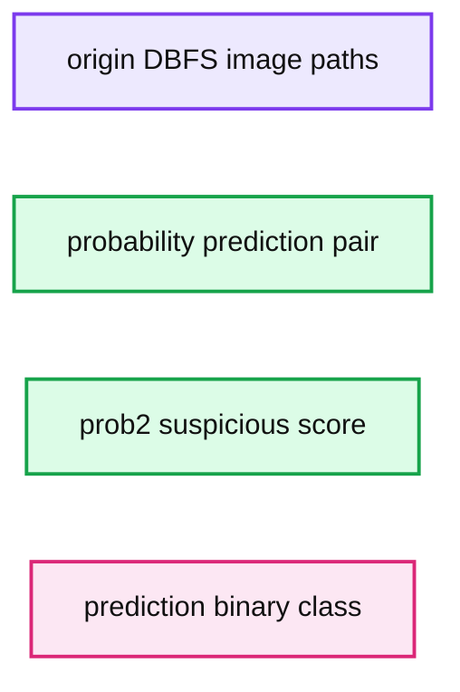

# Identify Suspicious Behavior in Video with Databricks Runtime for Machine Learning

- Source: https://www.databricks.com/blog/2018/09/13/identify-suspicious-behavior-in-video-with-databricks-runtime-for-machine-learning.html
- Published: 2018-09-13
- Authors: Raela Wang, Denny Lee
- Categories: platform, product, engineering, open-source, data-science-machine-learning, company, news
- Images: 15 total, 8 extracted as architecture

With the exponential growth of cameras and visual recordings, it is becoming increasingly important to operationalize and automate the process of video identification and categorization. Applications ranging from identifying the correct cat video to visually categorizing objects are becoming more prevalent.  With millions of users around the world generating and consuming billions of minutes of video daily, you will need the infrastructure to handle this massive scale.

**Summary:** The diagram shows a Databricks video-processing pipeline from videos through ETL and data pipelines to machine learning within the Databricks Unified Analytics Platform.

**Components:**

- Videos
- Databricks Unified Analytics Platform
- Databricks Notebooks
- ETL
- Data Pipelines
- Machine Learning
- Elastic Scalability
- Data Democratization
- Integrated Workspace

**Flows:**

- Videos -> ETL: video data
- ETL -> Data Pipelines: processed data
- Data Pipelines -> Machine Learning: pipeline output

**Numbers:** none

source image: https://www.databricks.com/wp-content/uploads/2018/09/db-video-pipeline.png

With the complexities of rapidly scalable infrastructure, managing multiple machine learning and deep learning packages, and high-performance mathematical computing, video processing can be complex and confusing.  Data scientists and engineers tasked with this endeavor will continuously encounter a number of architectural questions:

1. How to scale and how scalable will the infrastructure be when built?
2. With a heavy data sciences component, how can I integrate, maintain, and optimize the various machine learning and deep learning packages in addition to my Apache Spark infrastructure?
3. How will the data engineers, data analysts, data scientists, and business stakeholders work together?

Our solution to this problem is the [Databricks Unified Analytics Platform](https://www.databricks.com/product/data-lakehouse) which includes the Databricks notebooks, collaboration, and workspace features that allows different personas of your organization to come together and collaborate in a single workspace.  Databricks includes the [Databricks Runtime for Machine Learning](https://www.databricks.com/blog/2018/06/05/announcing-databricks-runtime-for-machine-learning.html) which is preconfigured and optimized with Machine Learning frameworks, including but not limited to XGBoost, scikit-learn, [TensorFlow](https://www.databricks.com/glossary/what-is-tensorflow), Keras, and Horovod. Databricks provides [optimized auto-scale clusters for reduced costs](https://www.databricks.com/blog/2018/05/02/introducing-databricks-optimized-auto-scaling.html) as well as GPU support in both [AWS](https://docs.databricks.com/clusters/gpu.html) and [Azure](https://docs.microsoft.com/en-us/azure/databricks/clusters/gpu).

In this blog, we will show how you can combine distributed computing with Apache Spark and deep learning pipelines (Keras, TensorFlow, and Spark Deep Learning pipelines) with the [Databricks Runtime for Machine Learning](https://www.databricks.com/blog/2018/06/05/announcing-databricks-runtime-for-machine-learning.html) to classify and identify suspicious videos.

## Classifying Suspicious Videos

In our scenario, we have a set of videos from the [EC Funded CAVIAR project/IST 2001 37540](http://groups.inf.ed.ac.uk/vision/CAVIAR/CAVIARDATA1/) datasets. We are using the *Clips from INRIA (1st Set)* with six basic scenarios acted out by the CAVIAR team members including:

- Walking
- Browsing
- Resting, slumping or fainting
- Leaving bags behind
- People/groups meeting, walking together and splitting up
- Two people fighting

In this blog post and the associated Identifying Suspicious Behavior in Video Databricks notebooks, we will pre-process, extract image features, and apply our machine learning against these videos.

*Source: Reenactment of a fight scene by CAVIAR members - EC Funded CAVIAR project/IST 2001 37540 *[*http://groups.inf.ed.ac.uk/vision/CAVIAR/CAVIARDATA1/*](http://groups.inf.ed.ac.uk/vision/CAVIAR/CAVIARDATA1/)

For example, we will identify suspicious images (such as the one below) extracted from our test dataset (such as above video) by applying a machine learning model trained against a different set of images extracted from our training video dataset.

## High-Level Data Flow

The graphic below describes our high-level data flow for processing our source videos to the training and testing of a logistic regression model.

**Summary:** High-level data flow from source videos through preprocessing and deep image feature extraction to logistic regression.

**Components:**

- Videos: Source video dataset
- Preprocessing: Image extraction from videos
- DeepImageFeaturizer: Deep image feature extraction
- Logistic Regression: Classification model

**Flows:**

- Videos -> Preprocessing: Source videos
- Preprocessing -> DeepImageFeaturizer: Extracted images
- DeepImageFeaturizer -> Logistic Regression: Image features

**Numbers:** none

source image: https://www.databricks.com/wp-content/uploads/2018/09/mnt_raela_video_splash.png

The high-level data flow we will be performing is:

- **Videos**: Utilize the [EC Funded CAVIAR project/IST 2001 37540](http://groups.inf.ed.ac.uk/vision/CAVIAR/CAVIARDATA1/) Clips from INRIA (1st videos) as our set of training and test datasets (i.e. training and test set of videos).
- **Preprocessing**: Extract images from those videos to create a set of training and test set of images.
- **DeepImageFeaturizer**: Using Spark Deep Learning Pipeline’s DeepImageFeaturizer, create a training and test set of image features.
- **Logistic Regression**: We will then train and fit a logistic regression model to classify suspicious vs. not suspicious image features (and ultimately video segments).

The libraries needed to perform this installation:

- h5py
- TensorFlow
- Keras
- Spark Deep Learning Pipelines
- TensorFrames
- OpenCV

With Databricks Runtime for ML, all but the OpenCV is already pre-installed and configured to run your Deep Learning pipelines with Keras, TensorFlow, and Spark Deep Learning pipelines.  With Databricks you also have the benefits of clusters that autoscale, being able to choose multiple cluster types, Databricks workspace environment including collaboration and multi-language support, and the Databricks Unified Analytics Platform to address all your analytics needs end-to-end.

## Source Videos

**Summary:** The diagram shows a video classification pipeline using preprocessing, DeepImageFeaturizer, and logistic regression.

**Components:**

- Videos: video input
- Preprocessing: video preprocessing
- DeepImageFeaturizer: deep image feature extraction
- Logistic Regression: classification model

**Flows:**

- Videos -> Preprocessing: video data
- Preprocessing -> DeepImageFeaturizer: preprocessed video frames
- DeepImageFeaturizer -> Logistic Regression: extracted image features

**Numbers:** none

source image: https://www.databricks.com/wp-content/uploads/2018/09/videos.png

To help jump-start your video processing, we have copied the CAVIAR Clips from INRIA (1st Set) videos [[EC Funded CAVIAR project/IST 2001 37540](http://groups.inf.ed.ac.uk/vision/CAVIAR/CAVIARDATA1/)] to `/databricks-datasets`.

https://www.youtube.com/watch?v=TMyqwGpdIRI

- Training Videos (`srcVideoPath`): `/databricks-datasets/cctvVideos/train/`
- Test Videos (`srcTestVideoPath)`: `/databricks-datasets/cctvVideos/test/`
- Labeled Data (`labeledDataPath)`: `/databricks-datasets/cctvVideos/labels/cctvFrames_train_labels.csv`

## Preprocessing

**Summary:** The diagram shows a video processing pipeline that extracts features from videos before logistic regression classification.

**Components:**

- Videos - video input data
- Preprocessing - image extraction and preparation
- DeepImageFeaturizer - deep image feature extraction
- Logistic Regression - classification model

**Flows:**

- Videos -> Preprocessing: video data
- Preprocessing -> DeepImageFeaturizer: preprocessed images
- DeepImageFeaturizer -> Logistic Regression: extracted image features

**Numbers:** none

source image: https://www.databricks.com/wp-content/uploads/2018/09/preprocessing.png

 We will ultimately execute our machine learning models (logistic regression) against the features of individual images from the videos.   The first (preprocessing) step will be to extract individual images from the video. One approach (included in the Databricks notebook) is to use OpenCV to extract the images per second as noted in the following code snippet.

In this case, we’re extracting the videos from our dbfs location and using OpenCV’s [VideoCapture method](https://docs.opencv.org/2.4/modules/highgui/doc/reading_and_writing_images_and_video.html#videocapture) to create image frames (taken every 1000ms) and saving those images to dbfs.   The full code example can be found in the Identify Suspicious Behavior in Video Databricks notebooks.

Once you have extracted the images, you can read and view the extracted images using the following code snippet:

with the output similar to the following screenshot.

 

Note, we will perform this task on both the training and test set of videos.

## DeepImageFeaturizer

**Summary:** The diagram shows a video processing pipeline from videos through preprocessing and DeepImageFeaturizer to logistic regression.

**Components:**

- Videos - input video data
- Preprocessing - video preprocessing
- DeepImageFeaturizer - deep image feature extraction
- Logistic Regression - classification model

**Flows:**

- Videos -> Preprocessing: video data
- Preprocessing -> DeepImageFeaturizer: preprocessed video frames
- DeepImageFeaturizer -> Logistic Regression: extracted image features

**Numbers:** none

source image: https://www.databricks.com/wp-content/uploads/2018/09/deep-image-featurizer.png

As noted in [A Gentle Introduction to Transfer Learning for Deep Learning](https://machinelearningmastery.com/transfer-learning-for-deep-learning/), transfer learning is a technique where a model trained on one task (e.g. identifying images of cars) is re-purposed on another related task (e.g. identifying images of trucks).  In our scenario, we will be using Spark Deep Learning Pipelines to perform [transfer learning on our images](https://github.com/databricks/spark-deep-learning#working-with-images-in-spark).

**Summary:** Inception V3 neural network architecture showing convolution, pooling, concatenation, dropout, fully connected, and softmax layers.

**Components:**

- Convolution layers
- Average pooling layers
- Max pooling layers
- Concatenation layers
- Dropout layers
- Fully connected layer
- Softmax layer

**Flows:**

- Input -> Convolution: image features
- Convolution -> Inception blocks: feature maps
- Inception blocks -> Concatenation: parallel feature maps
- Concatenation -> Pooling: reduced feature maps
- Pooling -> Inception blocks: processed feature maps
- Inception blocks -> Dropout: learned features
- Dropout -> Fully connected: regularized features
- Fully connected -> Softmax: class scores

**Numbers:** none

source image: https://www.databricks.com/wp-content/uploads/2018/09/inception_v3_architecture.png

*Source: Inception in TensorFlow*

As noted in the following code snippet, we are using the [Inception V3 model](https://arxiv.org/abs/1512.00567) ([Inception in TensorFlow](https://github.com/tensorflow/models/tree/master/research/slim)) within the `DeepImageFeaturizer` to automatically extract the last layer of a pre-trained neural network to transform these images to numeric features.

Both the training and test set of images (sourced from their respective videos) will be processed by the DeepImageFeaturizer and ultimately saved as `features` stored in Parquet files.

## Logistic Regression

**Summary:** The diagram shows a video machine learning pipeline from videos through preprocessing and deep image feature extraction to logistic regression.

**Components:**

- Videos: source video data
- Preprocessing: image and video preprocessing
- DeepImageFeaturizer: Spark Deep Learning Pipelines with a pretrained neural network
- Logistic Regression: machine learning classifier

**Flows:**

- Videos -> Preprocessing: video frames
- Preprocessing -> DeepImageFeaturizer: preprocessed images
- DeepImageFeaturizer -> Logistic Regression: numeric image features

**Numbers:** none

source image: https://www.databricks.com/wp-content/uploads/2018/09/logistic-regression.png

In the previous steps, we had gone through the process of converting our source training and test videos into images and then extracted and saved the features in Parquet format using OpenCV and Spark Deep Learning Pipelines DeepImageFeaturizer (with Inception V3).  At this point, we now have a set of numeric features to fit and test our ML model against. Because we have a training and test dataset and we are trying to classify whether an image (and its associated video) are suspicious, we have a classic supervised classification problem where we can give logistic regression a try.

This use case is supervised because included with the source dataset is the `labeledDataPath` which contains a labeled data CSV file (a mapping of image frame name and suspicious flag).  The following code snippet reads in this hand-labeled data (`labels_df`) and joins this to the training features Parquet files (`featureDF`) to create our train dataset.

We can now fit a logistic regression model (`lrModel`) against this dataset as noted in the following code snippet.

After training our model, we can now generate predictions on our test dataset, i.e. let our LR model predict which test videos are categorized as suspicious. As noted in the following code snippet, we load our test data (`featuresTestDF`) from Parquet and then generate the predictions on our test data (`result`) using the previously trained model (`lrModel`).

Now that we have the `results` from our test run, we can also extract out the second element (`prob2`) of the `probability` vector so we can sort by it.

>  In our example, the first row of the predictions DataFrame classifies the image as non-suspicious with prediction = 0. As we’re using binary logistic regression, the probability StructType of (firstelement, secondelement) means (probability of prediction = 0, probability of prediction = 1). Our focus is to review suspicious images hence why order by the second element (prob2).

We can execute the following Spark SQL query to review any suspicious images (`where prediction = 1`) ordered by `prob2`.

**Summary:** A results table lists DBFS image paths with logistic-regression probabilities, suspiciousness scores, and binary predictions.

**Components:**

- origin: DBFS paths to CCTV frame images
- probability: probability pair for predictions 0 and 1
- prob2: probability of prediction 1
- prediction: binary classification result

**Flows:**

- none

**Numbers:**

- Visible predictions: 1
- Visible probability pairs: 0.019603140170946682, 0.9803968598290532; 0.03504309818023664, 0.9649569018179635; 0.04389332024139191, 0.9561066797586081; 0.07955018324337278, 0.9204498167566273; 0.12001899045090385, 0.8799810095490961; 0.12756099937933807, 0.872439000620662; 0.17766534327189748, 0.822334657281025; 0.19767648629846, 0.8023235137015401; 0.21488111061429857, 0.7851188938570143; 0.21826721830719919, approximately 0.781327
- Visible prob2 values: 0.98039687, 0.9649569, 0.95610666, 0.9204498, 0.87991, 0.872439, 0.82233465, 0.8023235, 0.7851189, approximately 0.781327
- Frame identifiers include 0024, 0014, 0017, 0016, 0019, 0027, 0033, 0022, 0023, 0034
- Prediction classes: 0 and 1

source image: https://www.databricks.com/wp-content/uploads/2018/09/suspicious-activity-in-video.png

Based on the above results, we can now view the top three frames that are classified as suspicious.

Based on the results, you can quickly identify the video as noted below.

 

*Source: Reenactment of a fight scene by CAVIAR members - EC Funded CAVIAR project/IST 2001 37540 *[*http://groups.inf.ed.ac.uk/vision/CAVIAR/CAVIARDATA1/*](http://groups.inf.ed.ac.uk/vision/CAVIAR/CAVIARDATA1/)

 

## Summary

In closing, we demonstrated how to classify and identify suspicious video using the Databricks [Unified Analytics Platform](https://www.databricks.com/product/data-lakehouse): Databricks workspace to allow for collaboration and visualization of ML models, videos, and extracted images, Databricks Runtime for Machine Learning which comes preconfigured with Keras, TensorFlow, TensorFrames, and other machine learning and deep learning libraries to simplify maintenance of these various libraries, and optimized autoscaling of clusters with GPU support to scale up and scale out your high performance numerical computing.  Putting these components together simplifies the data flow and management of video classification (and other machine learning and deep learning problems) for you and your data practitioners. Try out the Identify Suspicious Behavior Databricks notebooks with [Databricks Runtime for Machine Learning](https://www.databricks.com/blog/2018/06/05/announcing-databricks-runtime-for-machine-learning.html) today.
