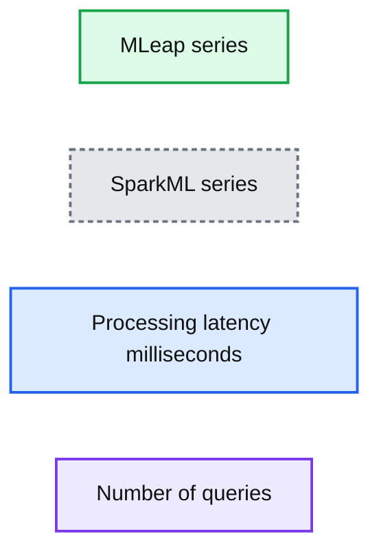

# New Features in MLflow v0.6.0

- Source: https://www.databricks.com/blog/2018/09/13/whats-new-in-mlflow-v0-6-0.html
- Published: 2018-09-13
- Authors: Aaron Davidson, Jules Damji
- Categories: platform, engineering, data-science-machine-learning
- Images: 2 total, 1 extracted as architecture

Today, we’re excited to announce [MLflow v0.6.0](https://www.mlflow.org/), released early in the week with new features. Now available on [PyPI](https://pypi.org/project/mlflow/) and [Maven](https://mvnrepository.com/artifact/org.mlflow/mlflow-client/0.6.0), the docs are [updated](https://mlflow.org/docs/latest/index.html). You can install the recent release with `pip install mlflow` as described in the [MLflow quickstart guide](https://mlflow.org/docs/latest/quickstart.html).

MLflow v0.6.0 introduces a number of major features:

- A Java client API, available on [Maven](https://mvnrepository.com/artifact/org.mlflow/mlflow-client/0.6.0)
- Support for saving and serving [Spark MLlib](https://mlflow.org/docs/latest/models.html#spark-mllib-spark) models as [MLeap](https://github.com/combust/mleap) for low-latency serving
- Support for tagging runs with metadata, during and after the run completion
- Support for deleting (and restoring deleted) experiments

In this post, we’ll describe new features, enhancements, and bug fixes in this release. In particular, we will focus on two features: A new Java MLflow client API and Spark MLlib and MLeap model integration.

## Java Client API

To give developers a choice of programming languages, we have included a [Java client tracking API](https://mlflow.org/docs/latest/java_api/index.html), similar in functionality to [Python client tracking API](https://mlflow.org/docs/latest/python_api/mlflow.tracking.html). Both offer CRUD interface to MLflow experiments and runs. This Java client is available on [Maven](https://mvnrepository.com/artifact/org.mlflow/mlflow-client/0.6.0).

Through the primary Java class constructor [*MlflowClient()*](https://mlflow.org/docs/latest/java_api/index.html) and its instance methods, you create, list, delete, log or access runs and its artifacts. By default, it connects to the tracking server set in the environment variable `MLFLOW_TRACKING_URI`, unless instantiated explicitly with [*MlflowClient(tracking_server_ui)*](https://mlflow.org/docs/latest/java_api/index.html) constructor.

If you have used the new MLflow Python tracking and experiment API, introduced in [MLflow v0.5.2](https://www.databricks.com/blog/2018/08/21/whats-new-in-mlflow-v0-5-0-release.html), it’s no different in functionality. As always, some code snippet will illustrate its usage. A full example, though, can be found in the sample directory of the Java client source code: [*QuickStartDriver.java*](https://github.com/mlflow/mlflow/blob/master/mlflow/java/client/src/main/java/org/mlflow/tracking/samples/QuickStartDriver.java)

## Spark MLlib and MLeap Model Integration

True to the MLflow’s design goal of “open platform," supporting popular ML libraries and model flavors, we have added yet another model flavor: [mlflow.mleap](https://mlflow.org/docs/latest/python_api/mlflow.mleap.html#). Spark MLlib models can be optionally saved in the [MLeap](https://github.com/combust/mleap) format. This new MLeap format allows deploying Spark MLlib models for low-latency production serving.

For real-time serving, the [MLeap framework](https://github.com/combust/mleap) is far more performant than Spark MLlib for a number of reasons. First, it employs a lighter weight, performant DataFrame representation. Second, unlike the Spark MLlib Pipeline model, it does not require a SparkContext while evaluating MLlib Pipelines in Scala. And, finally, it has serialization and deserialization mechanisms to convert PySpark Pipeline models into Scala objects.

**Summary:** Benchmark histogram comparing end-to-end prediction latency for MLeap and SparkML across 10,000 queries.

**Components:**

- MLeap histogram series using MLeap
- SparkML histogram series using Spark MLlib
- Processing latency axis measured in milliseconds
- Number of queries axis

**Flows:**

- none

**Numbers:** 10,000 queries; 0, 5, 10, 15, 20, 25, 30, 35, 40, 45, 50, 55, 60, 65, 70, 75, 80, 85, 90, 95 milliseconds; 0, 1,000, 2,000, 3,000, 4,000, 5,000, 6,000, 7,000 queries

source image: https://www.databricks.com/wp-content/uploads/2018/09/image2.png

From the above graph, you can see that MLeap can serve predictions in the single-digit millisecond range, whereas Spark MLlib reaches in the 100-millisecond range.

## Saving Spark MLib Models in MLeap Flavor

For this functionality, we have extended the [mlflow.spark](https://mlflow.org/docs/latest/python_api/mlflow.spark.html) API’s [`save_model(...)`](https://mlflow.org/docs/latest/python_api/mlflow.spark.html#mlflow.spark.save_model) to optionally save a Spark MLib model in MLeap format too, giving you the option to deploy a performant model for real-time serving. An example will illustrate how to save this model in both formats.

Let’s create a simple Spark MLlib model, log model, some parameters, and persist it in both a Spark MLlib and MLeap model format. An additional argument to [`mlflow.spark.save_model(...)`](https://mlflow.org/docs/latest/python_api/mlflow.spark.html#mlflow.spark.save_model) will persist in both formats: Spark MLlib and MLeap.

## Other Features and Bug Fixes

In addition to these features, other items, bugs and documentation fixes are included in this release. Some items worthy of note are:

- [API] Support for tagging runs with metadata, during and after the run completion
- [API] Experiments can now be deleted and restored via REST API, Python Tracking API, and MLflow CLI (#340, #344, #367, @mparkhe)
- [API] Added list_artifacts and download_artifacts to MlflowService to interact with a run's artifactory (#350, @andrewmchen)
- [API] Added get_experiment_by_name to Python Tracking API, and equivalent to Java API (#373, @vfdev-5)
- [API/Python] Version is now exposed via mlflow.**version**.
- [API/CLI] Added mlflow artifacts CLI to list, download, and upload to run artifact repositories (#391, @aarondav)
 *[API/CLI] Added mlflow artifacts CLI to list, download, and upload to run artifact repositories (#391, @aarondav)
- [API] Added get_experiment_by_name to Python Tracking API, and equivalent to Java API (#373, @vfdev-5)
- [Serving/SageMaker] SageMaker serving takes an AWS region argument (#366, @dbczumar)
- [UI] Added icons to source names in MLflow Experiments UI (#381, @andrewmchen)
- [Docs] Added comprehensive example of doing a multi-step workflow, chaining MLflow runs together and reusing results (#338, @aarondav)
- [Docs] Added comprehensive example of doing hyperparameter tuning (#368, @tomasatdatabricks)
- [Docs] Added code examples to mlflow.keras API (#341, @dmatrix)
- [Docs] Significant improvements to Python API documentation (#454, @stbof)
- [Docs] Examples folder refactored to improve readability. The examples now reside in examples/ instead of example/, too (#399, @mparkhe)

The full list of changes and contributions from the community can be found in the 0.6.0 Changelog. We welcome more input on [mlflow-users@googlegroups.com](https://groups.google.com/forum/#!forum/mlflow-users) or by [filing issues](https://github.com/databricks/mlflow/pulls) or submitting patches on GitHub. For real-time questions about MLflow, we have a [Slack channel](https://mlflow-users.slack.com/join/shared_invite/enQtMzkxMTAwNTcyODM5LTNkNTc5YWZlNDNjMzZiYWJhOTQwMjYwYWE3NDU2YTgzMDViYjJhNWI1MGI4NjViNTA0M2FhMzNhZTVkODE2NmU) for MLflow as well as you can follow [@MLflow](https://twitter.com/MLflow) on Twitter.

## Read More

For an overview of what we’re working on next, take a look at the roadmap slides in [our presentation.](https://www.slideshare.net/databricks/mlflow-infrastructure-for-a-complete-machine-learning-life-cycle)

## Credits

MLflow 0.6.0 includes patches, bug fixes, and doc changes from from Aaron Davidson, Adrian Zhuang, Alex Adamson, Andrew Chen, Corey Zumar, Hamroune Zahir, Joy Gioa, Jules Damji, Krishna Sangeeth, Matei Zaharia, Siddharth Murching, Shenggan, Stephanie Bodoff, Tomas Nykodym, Toon Baeyens, and VFDev.
