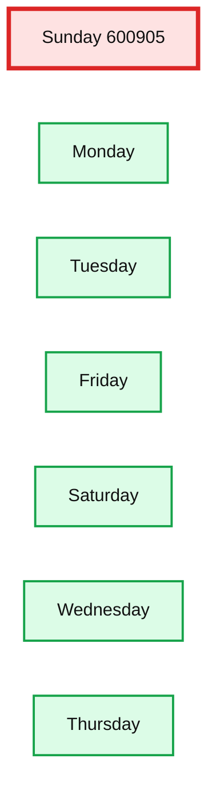
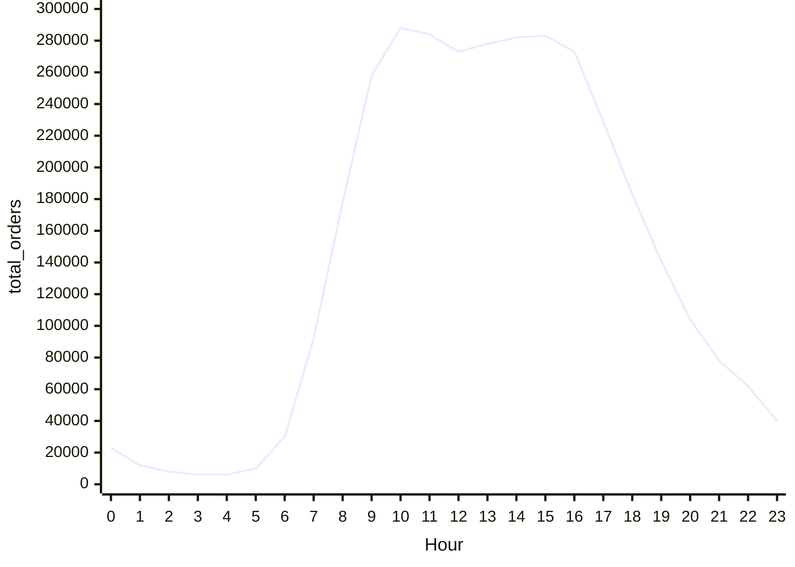
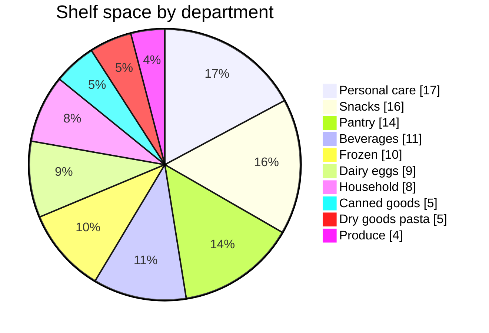
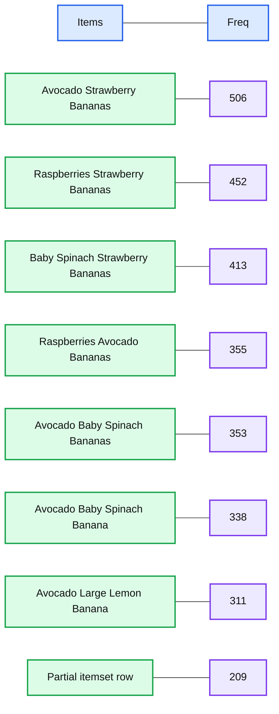
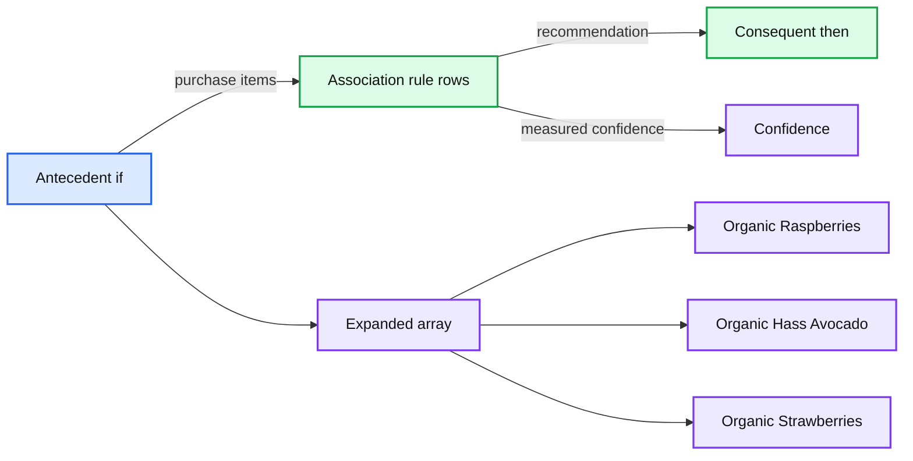

# Simplify Market Basket Analysis using FP-growth on Databricks

- Source: https://www.databricks.com/blog/2018/09/18/simplify-market-basket-analysis-using-fp-growth-on-databricks.html
- Published: 2018-09-18
- Authors: Bhavin Kukadia, Denny Lee
- Categories: product, engineering, open-source, data-science-machine-learning, company, news
- Images: 9 total, 6 extracted as architecture

When providing recommendations to shoppers on what to purchase, you are often looking for items that are frequently purchased together (e.g. peanut butter and jelly). A key technique to uncover associations between different items is known as market basket analysis. In your recommendation engine toolbox, the association rules generated by market basket analysis (e.g. if one purchases peanut butter, then they are likely to purchase jelly) is an important and useful technique.  With the rapid growth e-commerce data, it is necessary to execute models like market basket analysis on increasing larger sizes of data. That is, it will be important to have the algorithms and infrastructure necessary to generate your association rules on a distributed platform. In this blog post, we will discuss how you can quickly run your market basket analysis using Apache Spark MLlib `FP-growth` algorithm on Databricks.

To showcase this, we will use the publicly available Instacart Online Grocery Shopping Dataset 2017. In the process, we will explore the dataset as well as perform our market basket analysis to recommend shoppers to buy it again or recommend to buy new items.

 

 

The flow of this post, as well as the associated notebook, is as follows:

**Summary:** The diagram shows a four-stage market basket analysis workflow from data ingestion through association-rule review.

**Components:**

- Ingest Data - technology unspecified
- Explore Data - Spark SQL
- Train ML Model - FP-growth
- Review Association Rules - technology unspecified

**Flows:**

- Ingest Data -> Explore Data: ingested data
- Explore Data -> Train ML Model: explored data
- Train ML Model -> Review Association Rules: trained model and association rules

**Numbers:** none

```mermaid
%% Shows the market basket analysis workflow from ingestion to rule review
flowchart LR
    A[Ingest Data] -->|ingested data| B[Explore Data]
    B -->|explored data| C[Train ML Model]
    C -->|trained model and association rules| D[Review Association Rules]

    classDef client   fill:#dbeafe,stroke:#2563eb,stroke-width:2px,color:#111
    classDef service  fill:#dcfce7,stroke:#16a34a,stroke-width:2px,color:#111
    classDef store    fill:#ede9fe,stroke:#7c3aed,stroke-width:2px,color:#111
    classDef cache    fill:#fef3c7,stroke:#d97706,stroke-width:2px,color:#111
    classDef queue    fill:#cffafe,stroke:#0891b2,stroke-width:2px,color:#111
    classDef critical fill:#fee2e2,stroke:#dc2626,stroke-width:4px,color:#111
    classDef external fill:#e5e7eb,stroke:#6b7280,stroke-width:2px,color:#111,stroke-dasharray:4 3
    classDef decision fill:#fce7f3,stroke:#db2777,stroke-width:2px,color:#111

    class A,B,C,D service
```

source image: https://www.databricks.com/wp-content/uploads/2018/09/data-processing-pipeline.png

- **Ingest your data**: Bringing in the data from your source systems; often involving [ETL](https://www.databricks.com/glossary/extract-transform-load) processes (though we will bypass this step in this demo for brevity)
- **Explore your data using Spark SQL**: Now that you have cleansed data, explore it so you can get some business insight
- **Train your ML model using FP-growth**: Execute FP-growth to execute your frequent pattern mining algorithm
- **Review the association rules** generated by the ML model for your recommendations

## Ingest Data

The dataset we will be working with is 3 Million Instacart Orders, Open Sourced dataset:

>  The "Instacart Online Grocery Shopping Dataset 2017”, Accessed from https://www.instacart.com/datasets/grocery-shopping-2017 on 01/17/2018. This anonymized dataset contains a sample of over 3 million grocery orders from more than 200,000 Instacart users. For each user, we provide between 4 and 100 of their orders, with the sequence of products purchased in each order. We also provide the week and hour of day the order was placed, and a relative measure of time between orders.

You will need to download the file, extract the files from the gzipped TAR archive, and upload them into Databricks DBFS using the [Import Data](https://docs.databricks.com/data/data.html) utilities.  You should see the following files within `dbfs` once the files are uploaded:

- `Orders`: 3.4M rows, 206K users
- `Products`: 50K rows
- `Aisles`: 134 rows
- `Departments`: 21 rows
- `order_products__SET`: 30M+ rows where `SET` is defined as:
  - `prior`: 3.2M previous orders
  - `train`: 131K orders for your training dataset

Refer to the [Instacart Online Grocery Shopping Dataset 2017 Data Descriptions](https://gist.github.com/jeremystan/c3b39d947d9b88b3ccff3147dbcf6c6b) for more information including the schema.

### Create DataFrames

Now that you have uploaded your data to dbfs, you can quickly and easily create your DataFrames using `spark.read.csv`:

## Exploratory Data Analysis

Now that you have created DataFrames, you can perform exploratory data analysis using Spark SQL.  The following queries showcase some of the quick insight you can gain from the Instacart dataset.

### Orders by Day of Week

The following query allows you to quickly visualize that Sunday is the most popular day for the total number of orders while Thursday has the least number of orders.

**Summary:** Bar chart showing total Instacart orders by day of week, with Sunday busiest and Thursday least busy.

**Components:**

- Sunday orders
- Monday orders
- Tuesday orders
- Friday orders
- Saturday orders
- Wednesday orders
- Thursday orders
- Total orders axis

**Flows:**

- none

**Numbers:** 0, 50,000, 100,000, 150,000, 200,000, 250,000, 300,000, 350,000, 400,000, 450,000, 500,000, 550,000, 600,000, 650,000, 600,905.00

source image: https://www.databricks.com/wp-content/uploads/2018/09/busiest-day-of-week.png

### Orders by Hour

When breaking down the hours typically people are ordering their groceries from Instacart during business working hours with highest number orders at 10:00am.

**Summary:** Line chart showing total grocery orders by hour, peaking around 10:00 to 15:00 and declining afterward.

**Components:**

- Hour axis labeled 0 through 23
- Total orders series labeled `total_orders`
- Vertical scale ranging from 0 to 300,000 orders

**Flows:**

- none

**Numbers:** 0, 1, 2, 3, 4, 5, 6, 7, 8, 9, 10, 11, 12, 13, 14, 15, 16, 17, 18, 19, 20, 21, 22, 23, 0, 50,000, 100,000, 150,000, 200,000, 250,000, 300,000

source image: https://www.databricks.com/wp-content/uploads/2018/09/breakdown-by-hour.png

### Understand shelf space by department

As we dive deeper into our market basket analysis, we can gain insight on the number of products by department to understand how much shelf space is being used.

**Summary:** Shelf space by department, showing the percentage distribution of unique grocery products.

**Components:**

- Personal care department
- Snacks department
- Pantry department
- Beverages department
- Frozen department
- Dairy eggs department
- Household department
- Canned goods department
- Dry goods pasta department
- Produce department

**Flows:**

- none

**Numbers:** 17%, 16%, 14%, 11%, 10%, 9%, 8%, 5%, 5%, 4%

source image: https://www.databricks.com/wp-content/uploads/2018/09/shelf-space-by-department.png

As can see from the preceding image, typically the number of unique items (i.e. products) involve personal care and snacks.

### Organize Shopping Basket

To prepare our data for downstream processing, we will organize our data by shopping basket. That is, each row of our DataFrame represents an `order_id` with each `items` column containing an array of items.

Just like the preceding graphs, we can visualize the nested items using the`display` command in our Databricks notebooks.

## Train ML Model

To understand the frequency of items are associated with each other (e.g. how many times does peanut butter and jelly get purchased together), we will use association rule mining for market basket analysis. Spark MLlib implements two algorithms related to frequency pattern mining (FPM): [`FP-growth`](https://spark.apache.org/docs/latest/mllib-frequent-pattern-mining.html#fp-growth) and [`PrefixSpan`](https://spark.apache.org/docs/latest/mllib-frequent-pattern-mining.html#prefixspan). The distinction is that `FP-growth` does not use order information in the itemsets, if any, while `PrefixSpan` is designed for sequential pattern mining where the itemsets are ordered. We will use `FP-growth` as the order information is not important for this use case.

>  Note, we will be using the Scala API so we can configure setMinConfidence

>  With Databricks notebooks, you can use the %scala to execute Scala code within a new cell in the same Python notebook.

With the `mostPopularItemInABasket` DataFrame created, we can use Spark SQL to query for the most popular items in a basket where there are more than 2 items with the following query.

**Summary:** A Databricks result table ranks frequent itemsets by purchase frequency.

**Components:**

- Items column: frequent itemset arrays
- Freq column: purchase frequency values
- Itemset rows: organic produce combinations

**Flows:**

- none

**Numbers:** 506, 452, 413, 355, 353, 338, 311, 209

source image: https://www.databricks.com/wp-content/uploads/2018/09/most-frequent-itemset.png

As can be seen in the preceding table, the most frequent purchases of more than two items involve organic avocados, organic strawberries, and organic bananas.   Interesting, the top five frequently purchased together items involve various permutations of organic avocados, organic strawberries, organic bananas, organic raspberries, and organic baby spinach.    From the perspective of recommendations, the `freqItemsets` can be the basis for the **buy-it-again** recommendation in that if a shopper has purchased the items previously, it makes sense to recommend that they purchase it again.

## Review Association Rules

In addition to `freqItemSets`, the `FP-growth` model also generates `associationRules`. For example, if a shopper purchases *peanut butter*, what is the probability (or confidence) that they will also purchase *jelly. * For more information, a good reference is Susan Li's A Gentle Introduction on Market Basket Analysis — Association Rules.

A good way to think about *association rules* is that model determines that **if** you purchased something (i.e. the *antecedent*), **then** you will purchase this other thing (i.e. the *consequent*) with the following **confidence**.

**Summary:** A Databricks results table displays association rules mapping antecedent item sets to consequent recommendations with confidence scores.

**Components:**

- Antecedent if column
- Consequent then column
- Confidence column
- Expanded array of organic products
- Association rule rows

**Flows:**

- Antecedent item sets -> Consequent recommendations: purchase recommendation rules
- Antecedent item sets -> Confidence scores: confidence measurement

**Numbers:** 0, 1, 2, 0.6038461538461538, 0.56652360515102146, 0.5470085470085471, 0.5422885572139303, 0.5306122448979592, 0.5284974093264249, 0.5283018867924528, 0.5274725274725275, 0.5138121546961326, 0.5115273775216138, 0.509009009009009, 0.5073170731707317

source image: https://www.databricks.com/wp-content/uploads/2018/09/association-rules.png

As can be seen in the preceding graph, there is relatively strong confidence that if a shopper has organic raspberries, organic avocados, and organic strawberries in their basket, then it may make sense to recommend organic bananas as well. Interestingly, the top 10 (based on descending confidence) association rules - i.e. purchase recommendations - are associated with organic bananas or bananas.

## Discussion

In summary, we demonstrated how to explore our shopping cart data and execute market basket analysis to identify items frequently purchased together as well as generating association rules. By using Databricks, in the same notebook we can visualize our data; execute Python, Scala, and SQL; and run our `FP-growth` algorithm on an auto-scaling distributed Spark cluster - all managed by Databricks. Putting these components together simplifies the data flow and management of your infrastructure for you and your data practitioners. Try out the Market Basket Analysis using Instacart Online Grocery Dataset with [Databricks](https://www.databricks.com/try-databricks) today.
