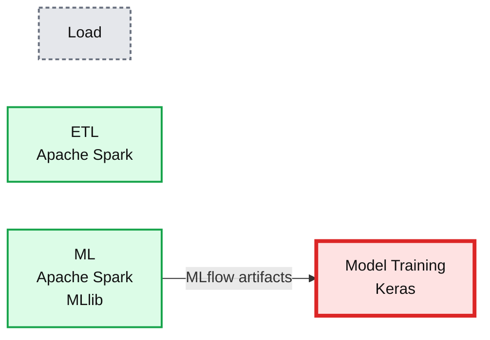
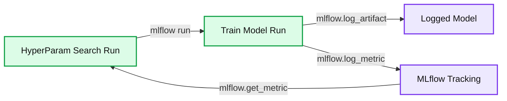

# MLflow v0.7.0 Features New R API by RStudio

- Source: https://www.databricks.com/blog/2018/10/03/mlflow-v0-7-0-features-new-r-api-by-rstudio.html
- Published: 2018-10-03
- Authors: Aaron Davidson, Jules Damji, Denny Lee
- Categories: company, solutions, open-source, partners, engineering, data-science-machine-learning, announcements, news
- Images: 6 total, 2 extracted as architecture

Today, we’re excited to announce [MLflow v0.7.0](https://www.mlflow.org/), released with new features, including a new [MLflow R client API](https://mlflow.org/docs/0.7.0/R-api.html) contributed by [RStudio](https://www.rstudio.com/). A testament to MLflow’s design goal of an open platform with adoption in the community, RStudio’s contribution extends the MLflow platform to a larger R community of data scientists who use RStudio and R programming language.  R is the third language supported in MLflow after Python and Java.

Now available on [PyPI](https://pypi.org/project/mlflow/) with docs [updated](https://mlflow.org/docs/latest/index.html), you can install the new release with  `pip install mlflow` as described in the [MLflow quickstart guide](https://mlflow.org/docs/latest/quickstart.html).

In this post, we will describe a number of major MLflow v0.7.0 features:

- An MLflow R API by RStudio, [available on CRAN](https://cran.r-project.org/web/packages/mlflow/index.html)
- Annotating runs with the MLflow UI

as well as showcase new samples on *multi-step workflows* and *hyperparameter tuning* using built-in support for logging Keras models.

## MLflow R API and RStudio Integration

In our continued commitment to expanding the MLflow open source community, RStudio has contributed an [R client tracking API](https://github.com/mlflow/mlflow/tree/master/mlflow/R/mlflow), similar in functionality to [Python](https://mlflow.org/docs/latest/python_api/index.html) and [Java](https://mlflow.org/docs/latest/java_api/index.html) client tracking APIs. Fully integrated with RStudio programming environment, it offers CRUD interface to MLflow experiments and runs. This R client is [available on CRAN](https://cran.r-project.org/web/packages/mlflow/index.html) or you can read instructions on [README.Rmd](https://github.com/mlflow/mlflow/blob/master/mlflow/R/mlflow/README.Rmd) how to install and use it.

If you have used the MLflow Python or Java tracking and experiment API introduced in [MLflow v0.5.2](https://www.databricks.com/blog/2018/08/21/whats-new-in-mlflow-v0-5-0-release.html) and [MLflow v0.6.0](https://www.databricks.com/blog/2018/09/13/whats-new-in-mlflow-v0-6-0.html) respectively, it’s no different to use in R.   More information can be found in GitHub in the [R folder](https://github.com/mlflow/mlflow/tree/master/mlflow/R/mlflow).

## Logging and Tracking Experiments with R

Similar to Java and Python client APIs, MLflow R client allows you to log parameters, code versions, metrics, and output files when running R code and then visualize the results via MLflow UI.

The following sample code snippet trains a linear model.

Moreover, you can create an experiment and set the tracking server UI to log runs as well as create and activate a new experiment using `mlflow` as follows:

Then using R APIs, you can fetch information about the active run.

or using MLflows user interface by running:

## Add Support for Annotating Runs

A powerful feature contributed by MLflow community member Alex Adamson (GitHub @aadamson) is the ability to annotate your runs using the MLflow UI.

## New Samples

As part of this release, there are two new MLflow samples:

- Multistep Workflows and Pipelines
- Hyperparameter Tuning

### Multistep Workflows and Pipelines

Within a machine learning model’s life cycle, it is not uncommon to have multiple steps before model training and deployment. For instance, we may want to collect data from a source, perform ETL and transform data into a performant format such as Parquet, and then finally use that cleansed data to train, track, and experiment our model—all within the MLflow platform. This[example workflow](https://github.com/mlflow/mlflow/blob/master/examples/multistep_workflow/README.rst) is one instance of its use as depicted in the figure below.

**Summary:** MLflow workflow showing data loading, Spark ETL, Spark MLlib processing, artifact transfer, and Keras model training.

**Components:**

- Load: source data
- ETL: Apache Spark
- ML: Apache Spark and MLlib
- Model Training: Keras
- MLflow Artifacts: artifacts passed between workflow stages

**Flows:**

- ML -> Model Training: MLflow artifacts

**Numbers:** none

source image: https://www.databricks.com/wp-content/uploads/2018/10/tutorial-multistep-workflow.png

As a self-contained multi-step process, we can express a workflow as a unit of multistep execution in an [MLflow project file](https://github.com/mlflow/mlflow/blob/master/examples/multistep_workflow/MLproject) through *entry points*.  As such output from each entry point run can be fed as an input of artifacts to the subsequent stage, this allows you to programmatically check the success of each step before supplying the output to the next stage in the workflow.

Like a UNIX multiple shell commands pipelined together, we can link together these individual runs or steps in the driver program using the [MLflow projects APIs](https://www.mlflow.org/docs/latest/python_api/mlflow.projects.html).  The following code sample ties together the four entry points as implemented in [main.py](https://github.com/mlflow/mlflow/blob/master/examples/multistep_workflow/main.py) through the following Python function:

To run this particular example from the [MLflow GitHub repo](https://github.com/mlflow/mlflow), execute the following commands:

This run will execute the steps in order, passing the results of one stage to the next, upon each successive run.

### Hyperparameter Tuning

This [Hyperparameter Tuning Example](https://github.com/mlflow/mlflow/tree/master/examples/hyperparam) MLproject shows how you can optimize a Keras deep learning model with MLflow and some popular optimization libraries: HyperOpt, GPyOpt, and random search.   Using the wine quality dataset, this project optimizes the RMSE metric of a Keras deep learning model via the `learning-rate` and `momentum` hyperparameters.

**Summary:** MLflow coordinates hyperparameter search and model training through Projects, logs metrics in Tracking, and stores the resulting model in Models.

**Components:**

- HyperParam Search Run using MLflow Projects
- Train Model Run using MLflow Projects
- Tracking using MLflow Tracking
- Logged Model using MLflow Models

**Flows:**

- HyperParam Search Run -> Train Model Run: `mlflow run` invocation
- Train Model Run -> Logged Model: `mlflow.log_artifact`
- Train Model Run -> Tracking: `mlflow.log_metric`
- Tracking -> HyperParam Search Run: `mlflow.get_metric`

**Numbers:** 18

source image: https://www.databricks.com/wp-content/uploads/2018/10/image1.jpg

The MLproject is comprised of four components: train and three different hyperparameter search examples.

### Train

The initial step for this MLproject is the [Train.py](https://github.com/mlflow/mlflow/blob/master/examples/hyperparam/train.py) code sample which splits an input dataset into three parts:

- Training: Used to fit the model
- Validation: Used to select the best hyperparameter values
- Test: Used to evaluate the expected performance and verify we did not overfit.

As MLflow has built-in support for logging [Keras models](https://www.databricks.com/glossary/keras-model), all metrics are logged (`mlflow.log_metric()`) within MLflow using Keras callbacks.

### Hyperparameter Search

This MLproject provides three hyperparameter search examples:

- [Random](https://github.com/mlflow/mlflow/blob/master/examples/hyperparam/search_random.py): Perform a simple random search over a random space
- Gpyopt: Use [GPyOpt](https://github.com/SheffieldML/GPyOpt) to optimize hyperparameters of train
- [Hyperopt](https://github.com/mlflow/mlflow/blob/master/examples/hyperparam/search_hyperopt.py): Use [Hyperopt](https://github.com/hyperopt/hyperopt) to optimize hyperparameters

While the three code samples use different mechanisms for hyperparameter search, they follow the same basic flow:

- Each parameter configuration (`get_metric()`) is evaluated in a new MLflow run invoking main entry point with selected parameters.
- The runs are evaluated based on validation set loss.
- The test set score is calculated to verify the results.
- Finally, the best run is recorded and stored as an artifact (`mlflow.log_artifact()`).

This flow can be best exemplified in the following code snippet (which is a simplified amalgamation of three hyperparameter search samples).

At this point, you can query for the best run with the MLflow API and store it as well as the associated artifacts using `mlflow.log_artifact()`.

## Other Features and Bug Fixes

In addition to these features, other items, bugs, and documentation fixes are included in this release. Some items worthy of note are:

### Breaking changes:

- [Python] The per-flavor implementation of load_pyfunc has been made private (#539, @tomasatdatabricks)
- [REST API, Java] logMetric now accepts a double metric value instead of a float (#566, @aarondav)

### Features:

- [R] Support for R (#370, #471, @javierluraschi; #548 @kevinykuo)
- [UI] Add support for adding notes to Runs (#396, @aadamson)
- [Python] Python API, REST API, and UI support for deleting Runs (#418, #473, #526, #579 @andrewmchen)
- [Python] Set a tag containing the branch name when executing a branch of a Git project (#469, @adrian555)
- [Python] Add a set_experiment API to activate an experiment before starting runs (#462, @mparkhe)
- [Python] Add arguments for specifying a parent run to tracking & projects APIs (#547, @andrewmchen)
- [Java] Add Java set tag API (#495, @smurching)
- [Python] Support logging a conda environment with sklearn models (#489, @dbczumar)
- [Scoring] Support downloading MLflow scoring JAR from Maven during scoring container build (#507, @dbczumar)

### Bug fixes:

- [Python] Print errors when the Databricks run fails to start (#412, @andrewmchen)
- [Python] Fix Spark ML PyFunc loader to work on Spark driver (#480, @tomasatdatabricks)
- [Python] Fix Spark ML load_pyfunc on distributed clusters (#490, @tomasatdatabricks)
- [Python] Fix error when downloading artifacts from a run's artifact root (#472, @dbczumar)
- [Python] Fix DBFS upload file-existence-checking logic during Databricks project execution (#510, @smurching)
- [Python] Support multi-line and unicode tags (#502, @mparkhe)
- [Python] Add missing DeleteExperiment, RestoreExperiment implementations in the Python REST API client (#551, @mparkhe)
- [Scoring] Convert Spark DataFrame schema to an MLeap schema prior to serialization (#540, @dbczumar)
- [UI] Fix bar chart always showing in metric view (#488, @smurching)

The full list of changes and contributions from the community can be found in the [0.7.0 Changelog](https://github.com/mlflow/mlflow/releases/tag/v0.7). We welcome more input on [mlflow-users@googlegroups.com](https://groups.google.com/forum/#!forum/mlflow-users) or by [filing issues](https://github.com/databricks/mlflow/pulls) or submitting patches on GitHub. For real-time questions about MLflow, we have a [Slack channel](https://mlflow-users.slack.com/join/shared_invite/enQtMzkxMTAwNTcyODM5LTNkNTc5YWZlNDNjMzZiYWJhOTQwMjYwYWE3NDU2YTgzMDViYjJhNWI1MGI4NjViNTA0M2FhMzNhZTVkODE2NmU) for MLflow as well as you can follow [@MLflow](https://twitter.com/MLflow) on Twitter.

## Read More

Refer to the following links for more information on MLflow 0.7.0.

- View an overview of [MLflow presentation](https://www.slideshare.net/databricks/mlflow-infrastructure-for-a-complete-machine-learning-life-cycle).
- Visit the [MLflow R Client from Studio on Github.](https://github.com/mlflow/mlflow/tree/master/mlflow/R/mlflow#mlflow-r-interface-for-mlflow)
- Get the slides from the MLflow Meetup at Mesosphere.
  - [Advanced MLflow Multi-step workflows and Hyperparameter tuning](https://www.slideshare.net/databricks/advanced-mlflow-multistep-workflows-hyperparameter-tuning-and-integrating-custom-libraries)
  - [MLflow R Client and RStudio integration](https://www.slideshare.net/databricks/mlflow-with-r)

## Credits

We want to thank [RStudio](https://www.rstudio.com/) engineering group for their major contribution to MLflow R APIs and RStudio integration. Additionally, MLflow 0.7.0 includes patches, bug fixes, and doc changes from Aaron Davidson, Adam Barnhard, Adrian Zhuang, Alex Adamson, Andrew Chen, Corey Zumar, Dror Atariah, GCBallesteros, Javier Luraschi, Jules Damji, Kevin Kuo, Mani Parkhe, Richin Jain, Siddharth Murching, Stephanie Bodoff, Tomas Nykodym, Zhao Feng
