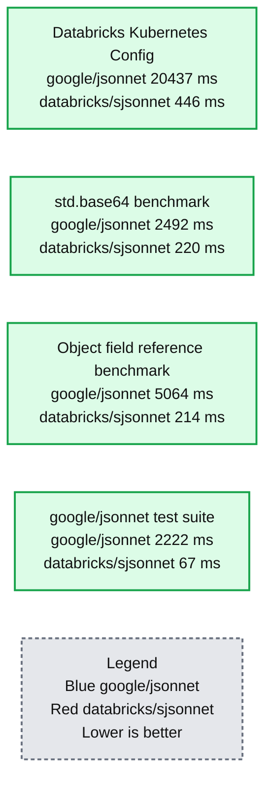
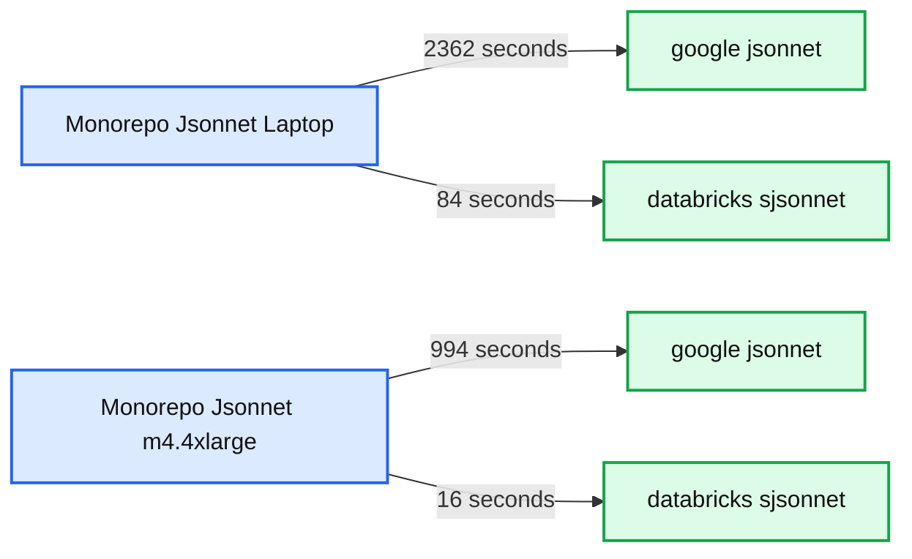

# Writing a Faster Jsonnet Compiler

- Source: https://www.databricks.com/blog/2018/10/12/writing-a-faster-jsonnet-compiler.html
- Published: 2018-10-12
- Authors: Li Haoyi, Josh Rosen, Ahir Reddy
- Categories: engineering
- Images: 2 total, 2 extracted as architecture

*This blog post is part of our series of internal engineering blogs on the Databricks platform, infrastructure management, integration, tooling, monitoring, and provisioning. See *[*our previous post on Declarative Infrastructure*](https://www.databricks.com/blog/2017/06/26/declarative-infrastructure-jsonnet-templating-language.html) *for background on some of the technologies discussed here.*

At Databricks, we use the [Jsonnet data templating language](https://jsonnet.org/) to declaratively manage configurations for services running across dozens of regions in both Azure and AWS. Over 100K lines of Jsonnet define Databricks’ infrastructure, generating service configurations, Kubernetes deployments, Cloudformation and Terraform templates, and more. We reached a scale where Jsonnet compilation time had become a bottleneck: a full recompile took over 10 minutes, even on fast multicore machines. To solve this problem, we implemented [*Sjsonnet*](https://github.com/databricks/sjsonnet), a new Jsonnet compiler which achieves 30-60x speedups in our real-world usage.

**Summary:** The chart compares compilation times for google/jsonnet and databricks/sjsonnet across four benchmarks, showing substantially lower times for databricks/sjsonnet.

**Components:**

- google/jsonnet compiler benchmark series
- databricks/sjsonnet compiler benchmark series
- Databricks Kubernetes Config benchmark
- std.base64 benchmark
- Object field reference benchmark
- google/jsonnet test suite benchmark

**Flows:**

- none

**Numbers:**

- Compilation Time in Milliseconds
- Y-axis values: 0, 5000, 10000, 15000
- Databricks Kubernetes Config: google/jsonnet 20437, databricks/sjsonnet 446
- std.base64 benchmark: google/jsonnet 2492, databricks/sjsonnet 220
- Object field reference benchmark: google/jsonnet 5064, databricks/sjsonnet 214
- google/jsonnet test suite: google/jsonnet 2222, databricks/sjsonnet 67

source image: https://www.databricks.com/wp-content/uploads/2018/10/Compilation-Time-in-Milliseconds.png

**Summary:** The chart compares Jsonnet compilation times for Google Jsonnet and Databricks Sjsonnet across two environments.

**Components:**

- google/jsonnet compiler
- databricks/sjsonnet compiler
- Compiling all our Monorepo Jsonnet, Laptop benchmark
- Compiling all our Monorepo Jsonnet, m4.4xlarge benchmark
- Compilation time measured in seconds

**Flows:**

- Benchmark input -> google/jsonnet: compilation
- Benchmark input -> databricks/sjsonnet: compilation

**Numbers:** 2500, 2000, 1500, 1000, 500, 0, 2362 seconds, 84 seconds, 994 seconds, 16 seconds

source image: https://www.databricks.com/wp-content/uploads/2018/10/Compilation-Time-in-Seconds.png

## What is Jsonnet?

We have previously written up why we use Jsonnet [here](https://www.databricks.com/blog/2017/06/26/declarative-infrastructure-jsonnet-templating-language.html), but in short:

- It allows you to templatize your JSON/YAML/etc. configuration in a convenient, structured way: no unsafe string-templating using regexes, mustache/jinja/`.erb` templates
- It allows you to re-use common configuration snippets across your infrastructure, avoiding copy-paste configs and making it easier to maintain & ensure consistency
- It is reproducible: as compared to using a general-purpose language like Python to configure deployments, Jsonnet's only inputs are the `.jsonnet` files, and its only output is `.json` configuration files. You can be certain your system will be configured the same way today as they were yesterday, and when you refactor you can simply diff the output JSON to verify you didn't break anything

Databricks has a relatively complex configuration matrix. Many cloud services only have a single production deployment, often of a single monolithic application, shared by all their customers. While some care needs to go into taking care of the distinction between development/staging/production, often a single, relatively simple deployment script will suffice.

Databricks, on the other hand, supports a wide variety of deployment scenarios:

- N different services: Databricks has separate services for managing worker clusters, serving the web-application, running scheduled jobs, and other things.
- Multi-tenant deployments v.s. single-tenant deployments v.s. private-cloud deployments v.s. free "community" deployments e.g. at [https://community.cloud.databricks.com](https://community.cloud.databricks.com/login.html)
- Deployment on Amazon Web Services v.s. Microsoft Azure
- And finally, development, staging, and production environments for all of the above

Each of these factors is multiplicative, resulting in dozens of different deployment configurations. Jsonnet's ability to re-use common configs and templates, while being entirely deterministic and reproducible, has been core to our ability to understand and maintain our deployments even as they are continually extended to support new features and products

## Jsonnet Performance Issues

Over time, we have noticed that the compilation of `.jsonnet` files to their output JSON or YAML was sometimes taking a significant amount of time:

Some of our slowest `.jsonnet` files, such as the one shown above, ended up taking over a minute to evaluate. This is an absurd amount of time for a compiler that is just passing some dictionaries around! In this case, the output `.json` file was only a ~500 kilobytes:

Not tiny, but not exactly a huge amount of configuration to compile.

Exactly which files were taking time seemed somewhat arbitrary, and it was unclear what was the cause, but the slowdown was definitely causing issues: the automated test suites, production deployments, as well as manual testing of changes in development all slowed down.

At Databricks we work hard to make sure our developers are as productive as possible and having some workflows be absurdly slow for no clear reason was no good. Thus over time, we've spent a significant amount of time trying to see what we could do about our Jsonnet compilation performance.

## Why is Jsonnet Slow?

After some investigation, we found two major suspects in what made Jsonnet compilation slow:

- Jsonnet doesn't re-use intermediate results and re-evaluates them every time
- Jsonnet's builtin functions are implemented in Jsonnet itself, rather than the host language

We will look into each one in turn.

### Jsonnet Doesn't Re-use Intermediate Results

Jsonnet provides a `std.trace` function that lets us print out when an expression is evaluated:

The first argument `"evaluating"` gets printed with debugging information (filename, line number) while the second parameter `123` becomes the return value of the `std.trace` function call. Here, we see:

- `"evaluating"` getting printed once
- `123` is returned from `std.trace`
- `123` becomes the value of the local variable `x`
- `123` finally becomes the output value of the `foo.jsonnet` file and printed to the console.

If we chain local variables together, we can see that each local is only evaluated once:

So far, this is all well and good, and what you would expect if you come from programming in Python, Javascript, or any other commonly-used language.

However, odd behavior emerges in some other cases: for example, if instead of referencing locals directly, I am referencing the fields of objects:

Here we can see that when `x2` evaluates `x1.k + x1.k`, the `std.trace` call runs twice! It turns out that evaluation of dictionary fields is treated more like method evaluation than field references: each time you ask for the value, the field is re-evaluated. While the semantics of Jsonnet (reproduciblity and purity) ensure the outcome of repeated evaluations are always the same, it conceals underlying performance issues. Put simply, this is *not* what you would expect, coming to Jsonnet from another programming language like Python or Javascript!

Now that we know this, it's clear that innocuous looking snippets can have a surprising blow-up in the time taken to evaluate them:

Here, I leave out the `std.trace` call because it would be printed over two million times when evaluating this little snippet. Even so, from the time command you can see that it takes a whole 5 seconds to evaluate this snippet, a number that will go up exponentially as the number of stages increases.

Such pathological cases do not exist in real usage: nobody is going to write a cascade of local `xN = {k: xM.k + xM.k};` bindings when trying to configure their cloudformation database or kubernetes cluster. On the other hand, in real usage the kinds of values and operations you end up doing with tend to be much more complex than `1 + 1`: you may be constructing large strings, sorting arrays, or md5 hashing inputs. In such cases it is entirely possible to end with small, innocuous-looking Jsonnet snippets that produce small, innocuous-looking JSON outputs, that nevertheless take multiple minutes to compile!

### Jsonnet's Built-In Functions are Implemented in Jsonnet Itself

Jsonnet provides a standard library of functions in the `std` object. We have already seen `std.trace`, but there are other common things like `std.parseInt` to convert a string into a number, `std.base64` to base64-encode a string, or `std.sort` to sort an array of values. All of these are common tasks when putting together your configuration.

It turns out that Jsonnet's standard library, in both C++ and Go implementations, is largely implemented in Jsonnet itself.

This is a slightly unusual decision: the Jsonnet compiler was designed for customizing configurations: e.g. letting you re-use a common string rather than copy-pasting it between your different YAML files, or defining a standard deployment template that each deployment can populate with hostnames/credentials/ip-addresses/etc.. This is typically not particularly compute-intensive: just passing some dictionaries around and adding keys here and there. Very different kind of computation from, say, implementing a base64 encoder:

This takes almost 2500 milliseconds to run in google/jsonnet:

While the equivalent C binary base64 takes a barely-measurable 14ms to run:

There are many functions like this, apart from `std.base64`: `std.escapeStringJson` which walks a string character-by-character to decide what to do, `std.format` that re-implements the bulk of Python's non-trivial %-string-formatting functionality, `std.manifestJson` which is designed to stringify potentially-large JSON blobs to embed as part of your configuration, all implemented in the Jsonnet itself and run using the not-especially-fast Jsonnet compiler.

Like the issue with Jsonnet not re-using the value of object-fields it computes, the problem here is not just that the standard library functions are *slow*, but that they are *unexpectedly slow*:

- Anyone with a background in a fast compiled language - C, C++, Java, Go - would expect core standard library functions to be compiled and fast like everything else
- Anyone with a background in slower interpreted languages - Python, Ruby, PHP - would expect core standard library functions to be written in C and be fast to execute regardless of how slow the interpreter is.

Glancing through the list of slowest `.jsonnet` files to evaluate, it was clear that many of them included usage of these built-in functions. Directly implementing them in the host runtime should greatly improve performance where these functions are used heavily.

## A New Compiler

Fundamentally, the problems with the Jsonnet compiler seemed avoidable: Jsonnet, despite its quirks, is still a very simple language. It should not be too hard to write a simple compiler for it, and even a naive compiler should be performant enough not to spend multiple-minutes evaluating tiny JSON blobs.

We ended up writing the [Sjsonnet](https://github.com/databricks/sjsonnet) compiler, written in Scala and running on the JVM.

An inevitable question would be why write a new compiler, rather than contributing improvements to the existing Jsonnet compiler? There were many factors: the complexity of the existing google/jsonnet implementation, the inherent additional difficulty of re-architecting an existing/unfamiliar codebase, lack of familiarity with the C++/Go languages, and the fact that it seemed simple to write an interpreter for a language as simple as Jsonnet.

For such a simple language, Sjsonnet is a correspondingly simple interpreter: at only ~2600 lines of Scala, it implements the simple two-stage parse -> evaluate pipeline common to most naive interpreters, with an additional "materialization" step unique to Jsonnet that turns the evaluated values into print-able JSON:

The Scala programming language makes writing this sort of compiler very easy: the entire parser is only [300 lines of code](https://github.com/databricks/sjsonnet/blob/2b93399c0916e5639d706545c51831e8041e10dc/sjsonnet/src/sjsonnet/Parser.scala), using the [FastParse](https://github.com/com-lihaoyi/fastparse) parsing library. The [evaluator](https://github.com/databricks/sjsonnet/blob/2b93399c0916e5639d706545c51831e8041e10dc/sjsonnet/src/sjsonnet/Evaluator.scala) is a simple function that recursively visits each node in the Syntax Tree and returns the value it evaluates to. JSON Strings, Numbers, Sequences and Maps are represented by `String`s, `Double`s, `Seq`s and `Map`s in the host language.

In an attempt to remedy the issues that we thought were causing poor performance in the google/jsonnet interpreter, Sjsonnet caches object fields to avoid unnecessary re-computation, and implements the [standard library functions in Scala rather than Jsonnet](https://github.com/databricks/sjsonnet/blob/2b93399c0916e5639d706545c51831e8041e10dc/sjsonnet/src/sjsonnet/Std.scala#L117).

Notably, Sjsonnet doesn't include any of the advanced features you see in more mature programming language interpreters: there is no intermediate bytecode transformation, no static optimization of any sort, no JIT compilation. Such things might be added later on, but currently Sjsonnet doesn't have any of them.

## Performance

Sjsonnet performs much better than google/jsonnet on the pathological cases we discussed earlier.

| **benchmark interpreter** | **google/jsonnet** | **databricks/sjsonnet** | **speedup** |
|---|---|---|---|
| kubernetes/config/.../config.jsonnet | 204375ms | 446ms | 458x |
| `std.base64` of long string | 2492ms | 220ms | 11x |
| `local x1 = {k: x0.k + x0.k}` 20 times | 5064ms | 214ms | 23x |

Here you can see sjsonnet finishing in about 200-400ms, which is slightly misleading: 200ms of that is startup overhead, which we will discuss below. This means the actual time taken to perform the latter two tasks is almost immeasurable. This is what you should expect from a program evaluating such trivial computations, and is much better than the several-seconds that google/jsonnet takes on the same input! The large, slow `config.jsonnet` file that took more than three minutes now takes less than half a second. From this we can see that Sjsonnet succeeds in specifically those cases we knew google/jsonnet had poor performance.

The motivation for writing a new compiler was the performance for real-world code. Maintaining a compiler, even for a simple language, is always a large investment: we need to see a correspondingly large performance boost in real usage in order for the project to be worth it. Luckily, we saw one:

| **benchmark interpreter** | **google/jsonnet** | **databricks/sjsonnet** | **speedup** |
|---|---|---|---|
| Running the google/jsonnet test suite | 2222ms | 67ms | 33x |
| Compiling all our Monorepo Jsonnet, Laptop | 2362s | 84s | 28x |
| Compiling all our Monorepo Jsonnet, m4.4xlarge | 994s | 16s | 60x |

In real usage, databricks/sjsonnet saw a 30-60x performance improvement over google/jsonnet. Many workflows that took tens of minutes to an hour now take 1 minute or less, a big quality-of-life improvement for the poor engineer who has to sit there waiting before they can update their Kubernetes cluster.

### Startup Overhead

Sjsonnet runs on the JVM, and JVM applications are slow to start: while a hello-world Java program may start in 100ms, non trivial applications tend to take an additional 0.5-1s of classloading time before any code runs at all, and after that it still takes time for the JVM to warm up to its full speed. Sjsonnet takes 0.5-1s per-invocation regardless of how small the input is. We can see this by running Sjsonnet on a trivial jsonnet file, using the `-i` flag to disable the long-running daemon:

To avoid this startup overhead, Sjsonnet comes bundled with a JVM-thin-client that keeps a long-running compiler daemon running in the background, reducing startup overhead to 0.2-0.3s. We can see this

Not perfect, but good enough for interactive use without feeling sluggish. In our main repository, we used our Bazel build tool's support for long-lived worker processes to keep the process around between compilations: this lets us keep Sjsonnet compiler always hot and ready to evaluate with no JVM startup/warmup overhead.

### Parsing

Sjsonnet's parser is a major bottleneck: profilers show 40-50% of execution time being spent in the parser. This is not unexpected, as the FastParse parsing library, while convenient and relatively snappy as far as parser-combinator libraries go, is still maybe 10x slower than a hand-written recursive descent parser.

In future, we may rewrite the parser by hand to get around this performance bottleneck. For now, we simply work-around this by caching the parsed syntax trees between runs, such that the vast majority of un-changed files do not need to be re-parsed each time. This takes only a few megabytes of memory for all the `.jsonnet` files in our primary repository and reduces the amount of execution time spent parsing to almost nothing.

### Caching

Sjsonnet currently does not do any clever caching of evaluated Jsonnet code: if you evaluate multiple files that both import the same common config, the common config will get re-evaluated each time even if nothing changed. This is one possible direction for future work that may allow us to further improve the performance of our Jsonnet compilation workflows.

## Compatibility

Sjsonnet passes the entire [google/jsonnet test suite](https://github.com/google/jsonnet/tree/master/test_suite), and produces roughly equivalent error messages in all the failure cases. Run on Databricks' own corpus of 100k lines of Jsonnet, the only difference came down to slight variations in floating-point-rendering:

Somehow, google/jsonnet has a somewhat unusual floating-point-rendering algorithm that doesn't quite line up with what you might expect coming from a Java, Javascript or Python background. Regardless of the reason, this change is benign and wouldn't affect anyone parsing these numbers into 64-bit double-precision floating point values.

Apart from the difference above, the rest of Databricks' Jsonnet output is byte-for-byte identical under google/jsonnet and databricks/sjsonnet. Sjsonnet even intentionally follows google/jsonnet's [incorrect escaping of ~ as a unicode character](https://github.com/google/jsonnet/issues/557), and does extra work to ensure that its output JSON formatting precisely matches google/jsonnet's output. Since Jsonnet's only output is in its JSON output, we can be very sure we aren't breaking anything in the migration from google/jsonnet to databricks/sjsonnet.

Perhaps the only place where a user may notice a difference in the two implementations is in the error messages, where databricks/sjsonnet follows the JVM format of stack trace printing rather than the google/jsonnet formatting.

The high degree of compatibility provides us other benefits: we did not need to fix or modify any of our 100,000 lines of `.jsonnet` files to use Sjsonnet. If in future we decide to migrate back to google/jsonnet, it would be a simple drop-in replacement to swap back.

## Looking forward

Sjsonnet solves our immediate problem of Jsonnet performance. Workflows that used to take minutes-to-an-hour now take seconds-to-a-minute. Together with the [Jsonnet Intellij Plugin](https://plugins.jetbrains.com/plugin/10852-jsonnet) we wrote, Sjsonnet greatly speeds up work on cloud systems at Databricks and improves the morale and efficiency of those engineers working on them.

Rather than locking us in, Sjsonnet gives options: a third Jsonnet implementation we can choose in addition to google/jsonnet and google/go-jsonnet, which is fast, simple, and easy to understand and extend. Perhaps some of the ideas from this implementation will make it back upstream, and if google/jsonnet or google/go-jsonnet catch up in performance at some point and surpass Sjsonnet, we may switch back. Even so, it might be handy to keep around a JVM implementation of Jsonnet, as a company that is heavily invested in both technologies.

Sjsonnet is available as a standalone executable, or on Maven Central to be used in your existing Java/Scala projects. See [https://github.com/databricks/sjsonnet#sjsonnet](https://github.com/databricks/sjsonnet#sjsonnet) for usage instructions if you want to try it out!
