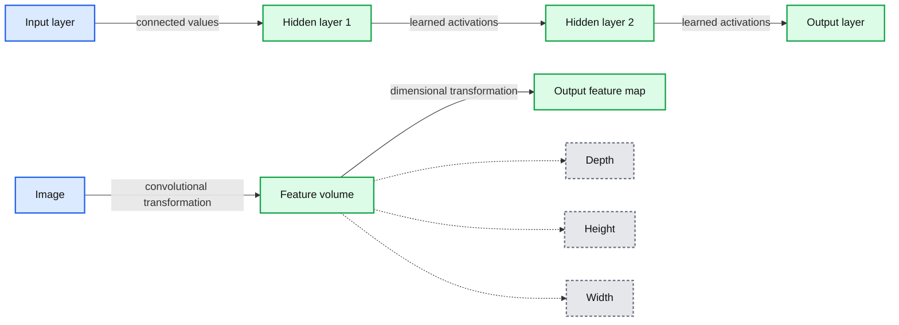

# Applying your Convolutional Neural Network: On-Demand Webinar and FAQ Now Available!

- Source: https://www.databricks.com/blog/2018/11/13/applying-your-convolutional-neural-network-on-demand-webinar-and-faq-now-available.html
- Published: 2018-11-13
- Authors: Denny Lee, Cyrielle Simeone
- Categories: platform, solutions, engineering, data-science-machine-learning
- Images: 5 total, 1 extracted as architecture

[Try this notebook in Databricks](https://pages.databricks.com/rs/094-YMS-629/images/Keras MNIST CNN %28Part 3%29.html)

On October 25th, we hosted a live webinar—[Applying your Convolutional Neural Network](https://www.slideshare.net/databricks/applying-your-convolutional-neural-networks)—with Denny Lee, Technical Product Marketing Manager at Databricks. This is the third webinar of a free deep learning fundamental series from Databricks.

In this webinar, we dived deeper into Convolutional Neural Networks (CNNs), a particular type of neural networks that assume that inputs are images, and have proven very effective for image classification and object recognition.

In particular, we talked about:

- CNN architecture, with nodes arranged in 3D with a width, height, and depth allowing to apply convolutional filters to extract features.
- How convolutional kernels (filters) work including how to chose the filter sizes, strides, and padding to extract features from regions of pixels in your input images.
- Pooling, or subsampling, techniques to reduce the image size to reduce the number of parameters thus the risk of overfitting.

We demonstrated some of these concepts using Keras (TensorFlow backend) on Databricks, and here is a link to our notebook to get started today:

- [MNIST demo using Keras CNN on Databricks (Part 3)](https://pages.databricks.com/rs/094-YMS-629/images/Keras%20MNIST%20CNN%20%28Part%203%29.html)

You can still watch Part 1 and Part 2 below:

If you’d like free access [Databricks Unified Analytics Platform](https://www.databricks.com/product/data-lakehouse) and try our notebooks on it, you can access a [free trial here](https://www.databricks.com/try-databricks).

Toward the end, we held a Q&A, and below are the questions and their answers, grouped by topics.

### Fundamentals

**Q: Do I really need to understand the math behind neural networks to use neural networks?**

While it isn’t completely necessary to understand the math behind neural networks to use them, it is important to understand these fundamentals to choose the right algorithms and to understand how to optimize, improve, and architect your deep learning (and machine learning) models. A good article on this topic is Wale Akinfaderin’s The Mathematics of Machine Learning.

### Convolutional Neural Networks

**Q: Why use CNNs instead of regular neural networks? And how do you use CNNs in real-life, can you share examples of applications for this?**

**Summary:** The diagram contrasts a regular neural network with a convolutional neural network that transforms image data into volumetric representations defined by depth, height, and width.

**Components:**

- Input layer - neural network input
- Hidden layer 1 - neural network computation
- Hidden layer 2 - neural network computation
- Output layer - neural network prediction
- Image - CNN input
- Feature volume - CNN representation
- Depth, height, and width - feature volume dimensions
- Output feature map - CNN output

**Flows:**

- Input layer -> Hidden layer 1: connected input values
- Hidden layer 1 -> Hidden layer 2: learned activations
- Hidden layer 2 -> Output layer: learned activations
- Image -> Feature volume: convolutional transformation
- Feature volume -> Output feature map: dimensional transformation

**Numbers:** hidden layer 1, hidden layer 2

source image: https://www.databricks.com/wp-content/uploads/2018/11/CNNs.png

*Source:*[*https://cs231n.github.io/convolutional-networks/*](https://cs231n.github.io/convolutional-networks/)

As discussed more in-depth in [Training Neural Networks](https://www.slideshare.net/databricks/training-neural-networks-122043775), convolutional neural networks (CNNs) are similar to regular [artificial neural networks](https://www.databricks.com/glossary/artificial-neural-network) but the former makes explicit assumptions that the input are images.  The issue is that fully connected artificial neural networks (as visualized in the left graphic) do not scale well against images. For example, a 200 pixel x 200 pixel  x 3 color channels (e.g. RGB) would result in 120,000 weights. The larger or more complex (channel wise) the image, the more weights would be required. In the case of CNNs, the nodes are only connected to a small region of the preceding layer organized in 3D (width, height, depth).  As the nodes are not *fully connected*, this reduces the number of weights (i.e. cardinality) thus allowing the network to complete its passes more quickly.

**Q: CNN is a network of layers, size and type. How do I choose them? based on what? in other words, how do I design my architecture?**

As noted in [Introduction to Neural Networks On-Demand Webinar and FAQ Now Available](https://www.databricks.com/blog/2018/10/01/introduction-to-neural-networks-on-demand-webinar-and-faq-now-available.html), while there are general rules of thumb on your starting point (e.g. start with one hidden layer and expand accordingly, number of input nodes is equal to the dimension of features, etc.), the key thing is that you will need to test.  That is, train your model and then run the test and/or validation runs against that model to understand the accuracy (higher is better) and loss (lower is better). In terms of designing your architecture, it is best to start off with the better understood and researched architectures (e.g. AlexNet, LeNet-5, Inception, VGG, ResNet, etc.).  From here, you can adjust the number, size, and type of layers as you run your experiments.

**Q: Why use softmax for the fully connected layer?**

When we're working with logistic regression, this presumes a Bernoulli distribution for our binary classification.  When you need to apply to more than two classifiers (such as our MNIST classification problem, we need the generalization of the Bernoulli distribution which is a multinomial distribution.  The type of regression that is applied to multinomial distribution (multi-classifier) is known as softmax regression. For MNIST, we're classifying handwritten digits for some value between `0, ..., 9` at the fully connected layer hence the use of softmax.

**Q: Is the filter size always an odd number?**

A common approach for the filter size is `f x f` where `f` is an odd number.  While not explicitly called out, on slide 39 of the [Applying Neural Networks](https://pages.databricks.com/rs/094-YMS-629/images/DLFS%20-%20Applying%20Neural%20Networks.pdf),  `f` is an odd number because the goal is to convolve the source pixel and its surrounding pixels.  The bare minimum would be a `3 x 3` filter size since that would be the source pixel + 1 pixel out in 2D space.

By having an even `f` size, this would result in convolving less than half the pixels around the source pixel.  To dive deeper, a good SO response to this question can be found at [https://datascience.stackexchange.com/questions/23183/why-convolutions-always-use-odd-numbers-as-filter-size/23186](https://datascience.stackexchange.com/questions/23183/why-convolutions-always-use-odd-numbers-as-filter-size/23186).

**Q: How can I implement a CNN with variable input length?  That is, any suggestions for training data that have variable sized images?**

In general, you would need to resize your images or zero-pad them so that all of the input images for your CNN are the same size.  There are some approaches involving LSTMs, RNNs or recursive neural networks (especially for text data) that can handle variable sized input though note that this is often a non-trivial task.

### ML Environment & Resources

**Q: I am paid Databricks user.  I know how to run Keras on my own PC, but not yet inside Databricks. **

When using Databricks, spin up a *Databricks Runtime for Machine Learning* cluster that includes but not limited to Keras, TensorFlow, XGBoost, Horovod, and scikit-learn.  For more information, refer to [Announcing Databricks Runtime for Machine Learning](https://www.databricks.com/blog/2018/06/05/announcing-databricks-runtime-for-machine-learning.html).

**Q: Did we have a similar session for ML? **

There are a number of great [Databricks webinars](https://www.databricks.com/resources?_sft_resource_type=webinars) available; ones that focus on Machine Learning include (but are not limited to):

- [Introducing MLflow: Infrastructure for a Complete Machine Learning Lifecycle](https://www.brighttalk.com/webcast/12891/329900)
- [Parallelize R Code Using Apache® Spark](https://event.on24.com/eventRegistration/EventLobbyServlet?target=reg20.jsp&partnerref=databricks&eventid=1457336&sessionid=1&key=DA88A3A3586E064F45FC73DB63C552EA&regTag=&sourcepage=register)
- [Productionizing Apache Spark™ MLlib Models for Real-time Prediction Serving](https://pages.databricks.com/Reg-Real-time-Prediction-Serving.html)
- [How Databricks and Machine Learning is Powering the Future of Genomics](https://pages.databricks.com/Reg-Future-of-Genomics.html)
- [GraphFrames: DataFrame-based Graphs for Apache® Spark™](https://pages.databricks.com/DataFrame-based-Graphs-for-Spark.html)
- [Apache® Spark™ MLlib: From Quick Start to Scikit-Learn](https://pages.databricks.com/Spark-MLlib-Scikit-Learn.html)

### Resources

- [Machine Learning 101](https://medium.com/onfido-tech/machine-learning-101-be2e0a86c96a)
- [Andrej Karparthy’s ConvNetJS MNIST Demo](https://cs.stanford.edu/people/karpathy/convnetjs/demo/mnist.html)
- [What is back propagation in neural networks?](https://www.quora.com/What-is-back-propagation-in-neural-networks)
- CS231n: Convolutional Neural Networks for Visual Recognition
  - With particular focus on [CS231n: Lecture 7: Convolution Neural Networks](https://www.youtube.com/watch?v=LxfUGhug-iQ)
- [Neural Networks and Deep Learning](http://neuralnetworksanddeeplearning.com/index.html)
- [TensorFlow](https://www.tensorflow.org/)
- [Deep Visualization Toolbox](https://www.youtube.com/watch?v=AgkfIQ4IGaM)
- [Back Propagation with TensorFlow](http://blog.aloni.org/posts/backprop-with-tensorflow/)
- [TensorFrames: Google TensorFlow with Apache Spark](https://www.databricks.com/session/tensorframes-deep-learning-with-tensorflow-on-apache-spark)
- [Integrating deep learning libraries with Apache Spark](https://www.slideshare.net/databricks/integrating-deep-learning-libraries-with-apache-spark)
- [Build, Scale, and Deploy Deep Learning Pipelines with Ease](https://www.databricks.com/blog/2017/09/06/build-scale-deploy-deep-learning-pipelines-ease.html)
