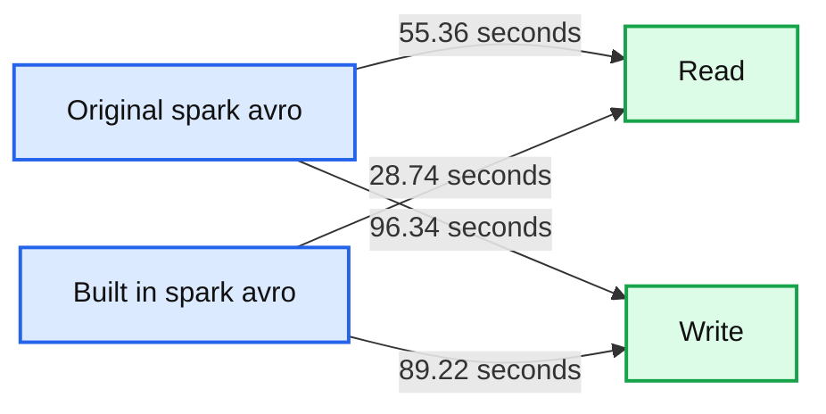

# Apache Avro as a Built-in Data Source in Apache Spark 2.4

- Source: https://www.databricks.com/blog/2018/11/30/apache-avro-as-a-built-in-data-source-in-apache-spark-2-4.html
- Published: 2018-11-30
- Authors: Gengliang Wang, Wenchen Fan, Michael Armbrust
- Categories: solutions, engineering, open-source, data-engineering
- Images: 1 total, 1 extracted as architecture

[Try this notebook in Databricks](https://docs.databricks.com/_static/notebooks/avro-benchmark.html)

[Apache Avro](https://avro.apache.org) is a popular data serialization format. It is widely used in the Apache Spark and Apache Hadoop ecosystem, especially for Kafka-based data pipelines. Starting from [Apache Spark 2.4](https://www.databricks.com/blog/2018/11/08/introducing-apache-spark-2-4.html) release, Spark provides built-in support for reading and writing Avro data. The new built-in **spark-avro** module is originally from Databricks’ open source project [Avro Data Source for Apache Spark](https://github.com/databricks/spark-avro) (referred to as spark-avro from now on). In addition, it provides:

- New functions *from_avro()* and *to_avro()* to read and write Avro data within a DataFrame instead of just files.
- [Avro logical types](https://avro.apache.org/docs/1.8.2/spec.html#Logical+Types) support, including Decimal, Timestamp, and Date types. See the related schema conversions for details.
- 2X read throughput improvement and 10% write throughput improvement.

In this blog, we examine each of the above features through examples, giving you a flavor of its easy API usage, performance improvements, and merits.

## Load and Save Functions

In Apache Spark 2.4, to load/save data in Avro format, you can simply specify the file format as “avro” in the DataFrameReader and DataFrameWriter. For consistency and familiarity, the usage is similar to other data sources.

## Power of from_avro() and to_avro()

To further simplify your data transformation pipeline, we introduced two new built-in functions: *from_avro()* and *to_avro()*. Avro is commonly used to serialize/deserialize the messages/data in Apache Kafka-based data pipeline. Using Avro records as columns is useful when reading from or writing to Kafka. Each Kafka key-value record is augmented with some metadata, such as the ingestion timestamp into Kafka, the offset in Kafka, etc.

There are three instances where these functions are useful:

- When Spark reads Avro binary data from Kafka, *from_avro()* can extract your data, clean it, and transform it.
- When you want to transform your structs into Avro binary records and then push them downstream to Kafka again or write them to a file, use *to_avro()*.
- When you want to re-encode multiple columns into a single one, use *to_avro().*

Both functions are available only in Scala and Java.

For more examples, see [Read and Write Streaming Avro Data with DataFrames](https://docs.databricks.com/spark/latest/structured-streaming/avro-dataframe.html#avro-dataframe).

## Compatibility with Databricks spark-avro

The built-in spark-avro module is compatible with the Databricks’ open source repository [spark-avro](https://github.com/databricks/spark-avro).

To read/write the data source tables that were previously created using `com.databricks.spark.avro`, you can load/write these same tables using this built-in Avro module, without any code changes. In fact, if you prefer to using your own build of a spark-avro jar file, you can simply disable the configuration `spark.sql.legacy.replaceDatabricksSparkAvro.enabled`, and use the option `--jars` when deploying your applications. Read the [Advanced Dependency Management](https://spark.apache.org/docs/latest/submitting-applications.html#advanced-dependency-management) section in the [Application Submission Guide](https://spark.apache.org/docs/latest/submitting-applications.html) for more details.

## Performance Improvement

With the IO optimization of [SPARK-24800](https://github.com/apache/spark/commit/96030876383822645a5b35698ee407a8d4eb76af), the built-in Avro data source achieves performance improvement on both reading and writing Avro files. We conducted a few benchmarks and observed 2x performance in reads, while an 8% improvement in writes.

### Configuration and Methodology

We ran the benchmark on a single node Apache Spark cluster on [Databricks Community](https://www.databricks.com/try-databricks) edition. For the detailed implementation of the benchmark, check the [Avro benchmark notebook](https://docs.databricks.com/_static/notebooks/avro-benchmark.html).

**Summary:** Benchmark chart comparing read and write times for original spark-avro and built-in spark-avro, where shorter times are better.

**Components:**

- Original spark-avro benchmark
- Built-in spark-avro benchmark
- Read operation
- Write operation
- Time axis in seconds

**Flows:**

- Original spark-avro -> Read operation: 55.36 seconds
- Built-in spark-avro -> Read operation: 28.74 seconds
- Original spark-avro -> Write operation: 96.34 seconds
- Built-in spark-avro -> Write operation: 89.22 seconds

**Numbers:** 100, 75, 50, 25, 0, 55.36, 28.74, 96.34, 89.22, seconds

source image: https://www.databricks.com/wp-content/uploads/2018/11/image1.png

As shown in the charts, the read performance is almost 2 times faster, and the write performance also has an 8% improvement.

### Configuration details:

- **Data**: A 1M-row DataFrame with columns of various types: Int/Double/String/Map/Array/Struct, etc.
- **Cluster**: 6.0 GB Memory, 0.88 Cores, 1 DBU
- **Databricks runtime version**: 5.0 (with new built-in spark-avro) and 4.0 (with external Databricks spark-avro library)

## Conclusion

The new built-in spark-avro module provides better user experience and IO performance in Spark SQL and [Structured Streaming](https://www.databricks.com/glossary/what-is-structured-streaming). The original spark-avro will be deprecated in favor of the new built-in support for Avro in Spark itself.

You can try the [Apache Spark 2.4](https://www.databricks.com/blog/2018/11/08/introducing-apache-spark-2-4.html) release with this package on [Databricks Runtime 5.0](https://www.databricks.com/blog/2018/11/18/announcing-databricks-runtime-5-0.html) today. To learn more about how to use Apache Avro in the cloud for structured streaming, read our documentation on [Azure Databricks](https://docs.microsoft.com/en-us/azure/databricks/spark/latest/structured-streaming/avro-dataframe#avro-dataframe) or [AWS](https://docs.databricks.com/spark/latest/structured-streaming/avro-dataframe.html#avro-dataframe).
