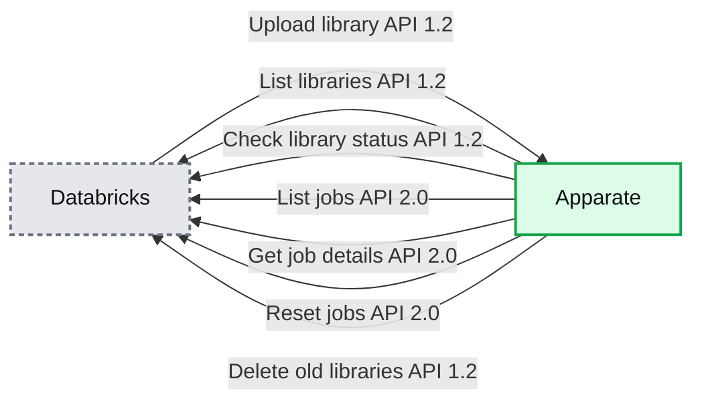

# Apparate: Managing Libraries in Databricks with CI/CD

- Source: https://www.databricks.com/blog/2019/01/15/apparate-managing-libraries-in-databricks-with-ci-cd.html
- Published: 2019-01-15
- Authors: Hanna Torrence
- Categories: product, partners, open-source, news, customers
- Images: 4 total, 3 extracted as architecture

*This is a guest blog from Hanna Torrence, Data Scientist at ShopRunner.*

## Introduction

As leveraging data becomes a more vital component of organizations' tech stacks, it becomes increasingly important for data teams to make use of software engineering best-practices. The Databricks platform provides excellent tools for exploratory Apache Spark workflows in notebooks as well as scheduled jobs. But for our production-level data jobs, our team wanted to leverage the power of version control systems like GitHub and CI/CD tools like Jenkins alongside the cluster management power of Databricks. Databricks supports notebook CI/CD concepts (as noted in the post [Continuous Integration & Continuous Delivery with Databricks](https://www.databricks.com/blog/2017/10/30/continuous-integration-continuous-delivery-databricks.html)), but we wanted a solution that would allow us to use our existing CI/CD setup to both update scheduled jobs to new library versions and have those same libraries available in the UI for use with interactive clusters.

Building libraries and uploading them through the Databricks UI allows the use of custom code, but it is a very manual process. Once we accumulated a number of jobs it became very time consuming to update each by hand. To solve this problem we developed [apparate](https://apparate.readthedocs.io/en/latest/), a python command line tool to manage the uploading and updating of custom libraries used in Databricks jobs from continuous integration/continuous delivery (CI/CD) tools like Jenkins. Now you can enjoy the magic as well!

## What is CI/CD? Why should I care?

CI/CD refers to a set of related ideas around automating the deployment process. CI stands for continuous integration, where the code is consistently merged into common codebases (no long running parallel feature branches that are a disaster to merge). CD stands for either continuous deployment, where the master branch of the codebase is kept in a deployable state, or continuous delivery, where the master branch is actually deployed on every merge.

**Summary:** The diagram shows a CI/CD workflow progressing from writing code through testing, merging, and deployment.

**Components:**

- Write code - technology not specified
- Test - technology not specified
- Merge - technology not specified
- Deploy - technology not specified

**Flows:**

- Write code -> Test: code changes
- Test -> Merge: tested code
- Merge -> Deploy: merged code

**Numbers:** none

source image: https://www.databricks.com/wp-content/uploads/2019/01/apparate_code-to-deploy.png

All of these come along with a set of habits and tools so one can automate integration, deployment, and delivery without fear of breaking anything. CI/CD tools such as Jenkins, Travis, and CircleCI allow one to define workflows that speed up development, reduce manual effort, simplify the flow of communication, and allow for feedback in earlier stages. A standard [Jenkinsfile](https://www.jenkins.io/doc/book/pipeline/jenkinsfile/) for one of our Python packages will run a linting tool, run unit tests, push the packaged python library to our artifact store, and then use apparate to push the egg to Databricks.

**Summary:** The diagram shows a CI/CD workflow from writing code through testing, packaging, Databricks upload, and job execution.

**Components:**

- Write code: code development
- Run unit tests and lint code: testing and code-quality checks
- Merge: source-code integration
- Package library: library packaging
- Upload to Databricks with apparate: Databricks deployment using apparate
- Run code as a job: Databricks job execution

**Flows:**

- Write code -> Run unit tests and lint code: source code
- Run unit tests and lint code -> Merge: validated code
- Merge -> Package library: merged code
- Package library -> Upload to Databricks with apparate: packaged library
- Upload to Databricks with apparate -> Run code as a job: uploaded library

**Numbers:** none

source image: https://www.databricks.com/wp-content/uploads/2019/01/apparate_code-to-job.png

Here's an example code snippet from a Jenkinsfile, with the environment variables DATABRICKS_HOST, TOKEN, and SHARED_FOLDER set as the desired config values and LIBRARY_CHANNEL a slack channel dedicated to alerts around the library being uploaded:

## Why did we write apparate?

When our team started setting up CI/CD for the various packages we maintain, we encountered some difficulties integrating Jenkins with Databricks.

We write a lot of Python + PySpark packages in our data science work, and we often deploy these as batch jobs run on a schedule using Databricks. However, each time we merged in a new change to one of these libraries we would have to manually create a package, upload it using the Databricks GUI, go find all the jobs that used the library, and update each one to point to the new job. As our team and our set of libraries and jobs grew, this became unsustainable (not to mention a big break from the CI/CD philosophy…).

As we set out to automate this using Databricks’ library API, we realized that this task required using two versions of the API and many dependant API calls. Instead of trying to recreate that logic in each Jenkinsfile, we wrote apparate. Apparate is now available on PyPi for general use and works with both egg files for Python libraries and jar files for Scala libraries.

## How apparate works

Apparate weaves together a collection of calls to Databricks APIs. It uses version 1.2 of the libraries API and version 2.0 of the jobs API to gather the info it needs and update libraries and jobs accordingly. Note that apparate relies on a versioning system that clearly signals breaking changes - we use[semantic versioning](https://semver.org/) at ShopRunner. Apparate does some string-parsing internally to match up the library names seen in Databricks' UI with the way the libraries are stored internally, so it does require that the egg or jar files are named in a consistent way (most packaging tools do this by default).

The upload_and_update command works like this:

- Load the egg or jar onto Databricks' platform so it can be found in the UI library selection.
- Get a list of libraries currently available on the platform
- Use a series of API calls to create a mapping between the path in the UI and the filename of the actual egg or jar file stored under the hood.
- Get a list of all jobs and filter down to the ones that use any version of the current library
- Find all other versions of the library we just uploaded
- Update any job using the same major version to use the new library
- Delete the earlier minor versions of the same major version of the library in the production folder

**Summary:** The diagram shows Apparate synchronizing Databricks libraries and jobs through REST API calls.

**Components:**

- Databricks UI and library storage
- Databricks Libraries REST API
- Databricks Jobs REST API
- Apparate library and job mappings

**Flows:**

- Databricks -> Apparate: Upload library through `/api/1.2/libraries/upload`
- Apparate -> Databricks: List libraries through `/api/1.2/libraries/list`
- Apparate -> Databricks: Retrieve library status through `/api/1.2/libraries/status?libraryId={}`
- Apparate -> Databricks: List jobs through `/api/2.0/jobs/list`
- Apparate -> Databricks: Retrieve job details through `/api/2.0/jobs/get?job_id={}`
- Apparate -> Databricks: Reset jobs to use the new library through `/api/2.0/jobs/reset`
- Apparate -> Databricks: Optionally delete old library versions through `/api/1.2/libraries/delete`

**Numbers:** 1.2, 2.0

source image: https://www.databricks.com/wp-content/uploads/2019/01/apparate_databricks_flow.png

## How to use apparate

To connect with your Databricks account, apparate needs two pieces of information - your hostname (something like https://.cloud.databricks.com) and an access token. Both of these follow the same format as the authentication for the Databricks CLI ([Azure](https://docs.microsoft.com/en-us/azure/databricks/dev-tools/cli/index#set-up-authentication) | [AWS](https://docs.databricks.com/dev-tools/cli/index.html#set-up-authentication)). Any access token will work to upload libraries, but updating jobs requires an access token with admin permissions (these can be created by admin accounts). Finally, apparate asks you to specify a production folder which corresponds to a path in the Databricks UI where you want to store production-level libraries. Apparate can upload libraries to any folder, but will only update jobs with libraries in the production folder and will only clean up old versions in the production folder.

Once you complete the installation, you can run `apparate configure` to quickly set up the .apparatecfg file where apparate stores this information. The `configure` command works well for interactive use, but if you're using an automated setup it’s often easier to provide the file directly as in the Jenkins example above.

Apparate comes with two main commands, `upload` and `upload_and_update`.

`upload` takes an egg or jar file and a path in the Databricks UI and simply pushes the library to that location. For example:

`upload_and_update` uploads an egg or jar to the production folder, updates any jobs using the same major version of the library, and then deletes old versions of the same library (within the same major version). You can also turn off the deleting behavior if deleting things makes you nervous. For example:

or

Both of these commands log information about what they've done, and we've found it useful to redirect the logged statements to a dedicated devops alert Slack channel. These notifications let everyone see when libraries they use have been updated. There’s also a `--v DEBUG` option, which gives extensive information about the file name parsing going on under the hood. This option can be helpful if apparate is not behaving as expected, or for developing new features for apparate itself.

Apparate can also be useful while developing libraries. We've often found it frustrating to frequently re-upload a library that was changing daily as we worked out a new feature. With apparate, this workflow is much simpler. When you are ready to test out changes to your library, start by deleting the current version. (Note that moving or renaming the old version is sometimes insufficient, and it must be fully deleted AND removed from the trash folder before the cluster will consistently recognize the new copy). Then restart your cluster, so it wipes the old version from the cache. Then the `apparate upload` command easily uploads the library for you.

For complete documentation, check out[https://apparate.readthedocs.io/en/latest/](https://apparate.readthedocs.io/en/latest/).

## How apparate has improved our workflow

We now have more confidence in the versions of our code that we're running and spend less time manually editing job descriptions and cluster configurations. Each time we run a job we can be confident it's running the latest stable version of the library. No more job failures because someone missed a job on the version update! Everyone knows that the current versions of all team libraries can be found in our shared databricks folder, which is especially useful for common utility libraries.

Apparate lives on github at[https://github.com/ShopRunner/stork](https://github.com/ShopRunner/stork), and we welcome pull requests. Apparate has made our lives much easier, and we hope it can do the same for you!
