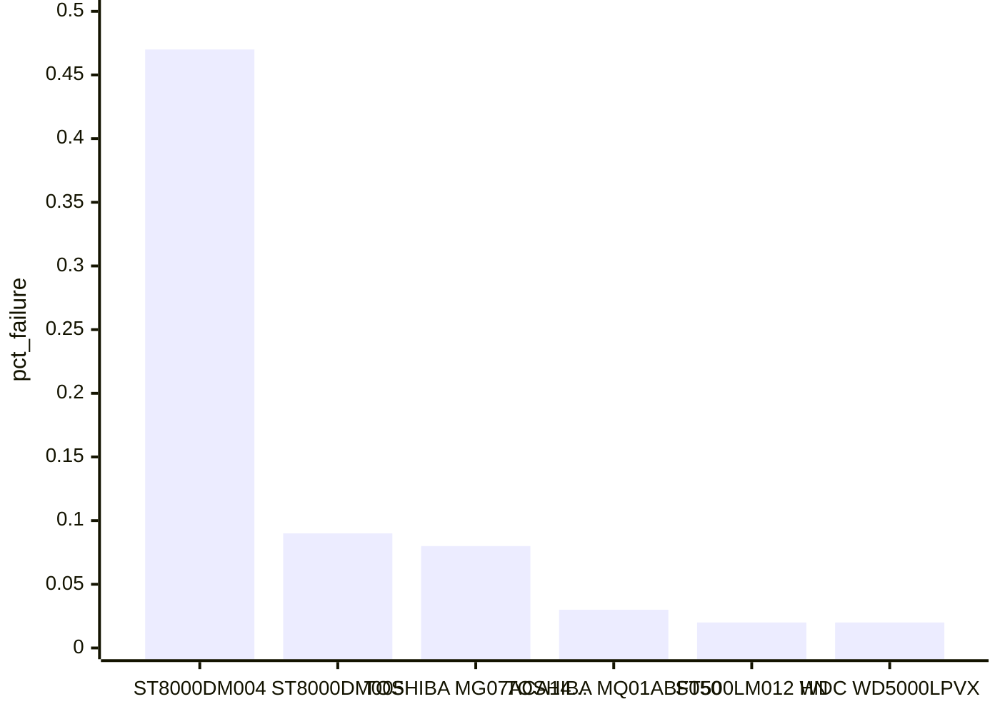
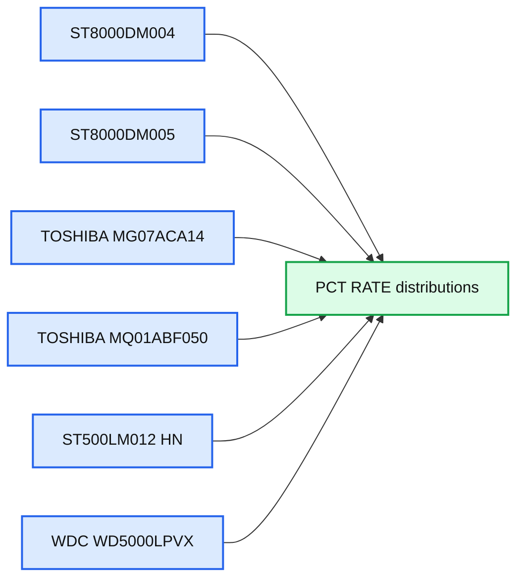
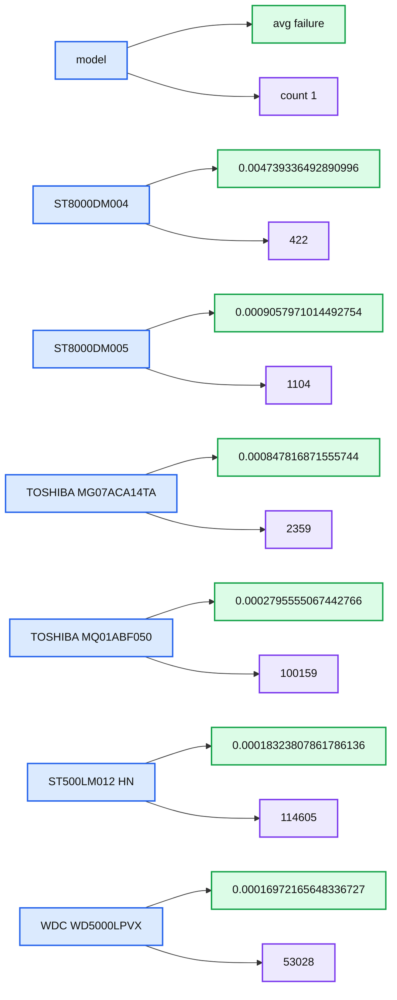
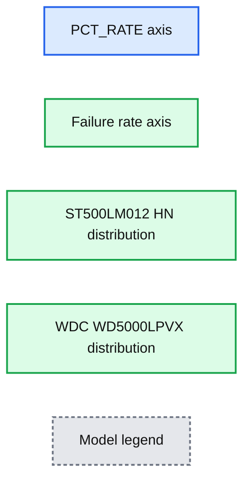

# Near-Real-Time Hardware Failure Rate Estimation with Bayesian Reasoning

- Source: https://www.databricks.com/blog/2019/02/14/near-real-time-hardware-failure-rate-estimation-with-bayesian-reasoning.html
- Published: 2019-02-14
- Authors: Sean Owen
- Categories: data-science-machine-learning, product, news
- Images: 4 total, 4 extracted as architecture

[Try this notebook in Databricks](https://pages.databricks.com/rs/094-YMS-629/images/drive_failure_streaming_bayesian%20%28public%20blog%29.html)

*You might be using Bayesian techniques in your data science without knowing it! And if you're not, then it could enhance the power of your analysis. This blog follows the introduction to Bayesian reasoning on [Data Science Central](https://www.datasciencecentral.com/an-introduction-to-bayesian-reasoning/), and will demonstrate how these ideas can improve a real-world use case: estimating hard drive failure rate from a source of streaming sensor data. When you’re caught up on what these techniques can do for you, read on!*

## Use Case: Hard Drive Failure

You have telemetry from your data center’s hard drives, including drive model and failures. You’d like to understand which drives have an unusually high failure rate.

The kind people at Backblaze have provided [just this kind of data](https://www.backblaze.com/cloud-storage/resources/hard-drive-test-data) from several years of operating data centers. The data is broken down by individual drive and by day, and has rich information from SMART sensor readings, but we’ll just use the drive model and whether it failed on a given day. Take the Q2 and Q3 2018 data as an example; download the archives of CSV files and unpack to a shared location.

As above, the most straightforward thing to do is find the failure rate by model, and take that as the best estimate of actual failure rate. The top 6 drives by failure rate (note: here the rate is annualized to failure rate per year, for readability) are:

**Summary:** Annualized hardware failure rates for the six models with the highest observed failure rates.

**Components:**

- ST8000DM004 model
- ST8000DM005 model
- TOSHIBA MG07ACA14... model
- TOSHIBA MQ01ABF050 model
- ST500LM012 HN model
- WDC WD5000LPVX model
- pct_failure annualized failure-rate metric

**Flows:**

- none

**Numbers:** 0.00, 0.10, 0.20, 0.30, 0.40, 0.50; approximately 0.47, 0.09, 0.08, 0.03, 0.02, 0.02; Q2, Q3, 2018; top 6

source image: https://www.databricks.com/wp-content/uploads/2019/02/image5.png

(In Databricks, just use the plot options in the cell output to switch from a table view of these results to the histogram above.) The ST8000DM004 looks like it has a high failure rate of almost 0.5% per year, but, how sure are we that it has not just experienced an unfortunately high string of failures in Q2 and Q3?

Assuming a constant true failure rate λ, the number of failures per time follows a [Poisson distribution](https://en.wikipedia.org/wiki/Poisson_distribution), Poisson(λ), just as the number of heads above followed a binomial distribution. Also as above, we’d instead like to understand the distribution of the failure rate λ. It follows a [gamma distribution](https://en.wikipedia.org/wiki/Gamma_distribution) with parameters ɑ and β. As with the beta distribution, they have a convenient interpretation. After seeing *f* failures in *t* days, the distribution of λ is Gamma(*f*,*t*).

**Summary:** The chart shows annualized failure-rate distributions for six hard-drive models.

**Components:**

- ST8000DM004 model distribution
- ST8000DM005 model distribution
- TOSHIBA MG07ACA14... model distribution
- TOSHIBA MQ01ABF050 model distribution
- ST500LM012 HN model distribution
- WDC WD5000LPVX model distribution
- PCT_RATE horizontal axis
- Density vertical axis

**Flows:**

- Model observations -> failure-rate distribution: estimated PCT_RATE values

**Numbers:** 0.1, 0.2, 0.3, 0.4, 2k, 4k, 6k, 8k, 10k

source image: https://www.databricks.com/wp-content/uploads/2019/02/image1.png

Notice how different the distribution of estimated failure rate is for various models. The ST8000DM004 has a very wide distribution across, admittedly, higher failure rates; it’s cut off for readability here, but the bulk of its distribution extends past 0.4% per year (again note that the plot is annualized failure rate, for readability). This is because we have relatively very few observations of this model:

**Summary:** Table comparing average failure rates and observation counts across six hard-drive models.

**Components:**

- model: hard-drive model identifiers
- avg failure: average failure-rate values
- count 1: observation counts
- ST8000DM004: hard-drive model
- ST8000DM005: hard-drive model
- TOSHIBA MG07ACA14TA: hard-drive model
- TOSHIBA MQ01ABF050: hard-drive model
- ST500LM012 HN: hard-drive model
- WDC WD5000LPVX: hard-drive model

**Flows:**

- model -> avg failure: model-specific average failure rate
- model -> count 1: model-specific observation count

**Numbers:**

- ST8000DM004: 0.004739336492890996, 422
- ST8000DM005: 0.0009057971014492754, 1104
- TOSHIBA MG07ACA14TA: 0.000847816871555744, 2359
- TOSHIBA MQ01ABF050: 0.0002795555067442766, 100159
- ST500LM012 HN: 0.00018323807861786136, 114605
- WDC WD5000LPVX: 0.00016972165648336727, 53028
- count column label: 1

source image: https://www.databricks.com/wp-content/uploads/2019/02/image4.png

Zoom in on the two peaked distributions at the left, for the “ST500LM012 HN” and “WDC WD5000LPVX”:

**Summary:** The chart compares annualized failure-rate distributions for two hard-drive models by PCT_RATE.

**Components:**

- PCT_RATE horizontal axis
- Failure-rate vertical axis
- ST500LM012 HN distribution
- WDC WD5000LPVX distribution
- Model legend

**Flows:**

- none

**Numbers:** 10k, 8k, 6k, 4k, 2k, 0.01, 0.02, 0.03, 0.04, 0.05, ST500LM012, WD5000LPVX

source image: https://www.databricks.com/wp-content/uploads/2019/02/image2.png

Interestingly, the WDC’s most likely annualized failure rate is lower than the ST500’s -- about 0.015% vs 0.02%. However, we have fewer observations of the WDC, and its distribution is wider. If the question were, which drive is more likely to have a failure rate above 0.03%, then based on this information, it would be the WDC. This might actually be relevant if, for example, deciding which drives are most likely to be out of manufacturer’s tolerances. Distributions matter! Not just MAP estimates.

## Analyzing Failures in a Stream with Priors

This data doesn’t arrive all at once, in reality. It arrives in a stream, and so it’s natural to run these kind of queries continuously. This is simple with Apache Spark’s [Structured Streaming](https://spark.apache.org/docs/latest/structured-streaming-programming-guide.html), and proceeds almost identically.

Of course, on the first day this streaming analysis is rolled out, it starts from nothing. Even after two quarters of data here, there’s still significant uncertainty about failure rates, because failures are rare.

An organization that’s transitioning this kind of offline data science to an online streaming context probably *does* have plenty of historical data. This is just the kind of prior belief about failure rates that can be injected as a prior distribution on failure rates!

The gamma distribution is, conveniently, [conjugate](https://en.wikipedia.org/wiki/Conjugate_prior) to the Poisson distribution, so we can use the gamma distribution to represent the prior, and can trivially compute the posterior gamma distribution after observing some data without a bunch of math. Because of the interpretation of the parameters ɑ and β as number of failures and number of days, these values can be computed over historical data and then just added to the parameters computed and updated continuously by a Structured Streaming job. Observe:

https://www.youtube.com/watch?v=8dzq5EEhuxk

Historical data yields the ɑ and β from the gamma-distributed priors for each model, and this is easily joined into the same analysis on a stream of data (here, simulated as a ‘stream’ from the data we analyzed above).

When run, this yields an updating plot of failure rate distributions for the models with the highest failure rate. It could as easily produce alerts or other alerts based on other functions of these distributions, with virtually the same code that produced a simple offline analysis.

## Conclusion

There’s more going on when you fit a distribution than you may think. You may be employing ‘frequentist’ or ‘Bayesian’ reasoning without realizing it. There are advantages to the Bayesian point of view, because it gives a place for prior knowledge about the answer, and yields a distribution over answers instead of one estimate. This perspective can easily be put into play in real-world applications with Spark’s Structured Streaming and understanding of prior and posterior distributions.
