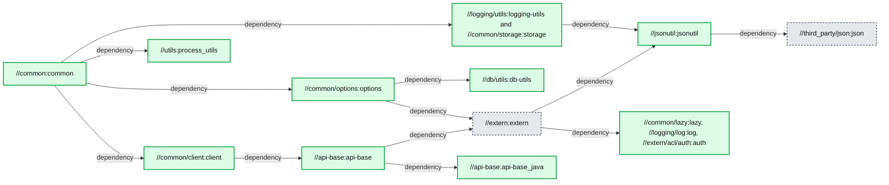
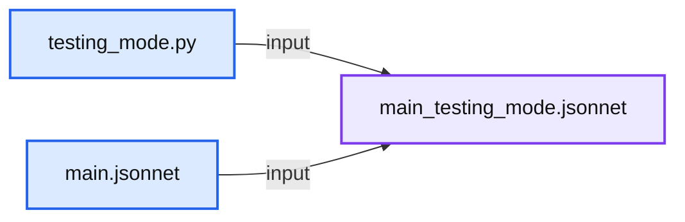
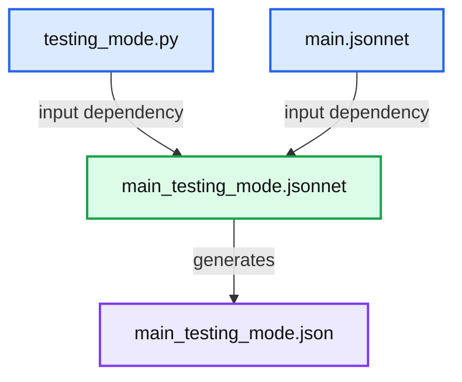
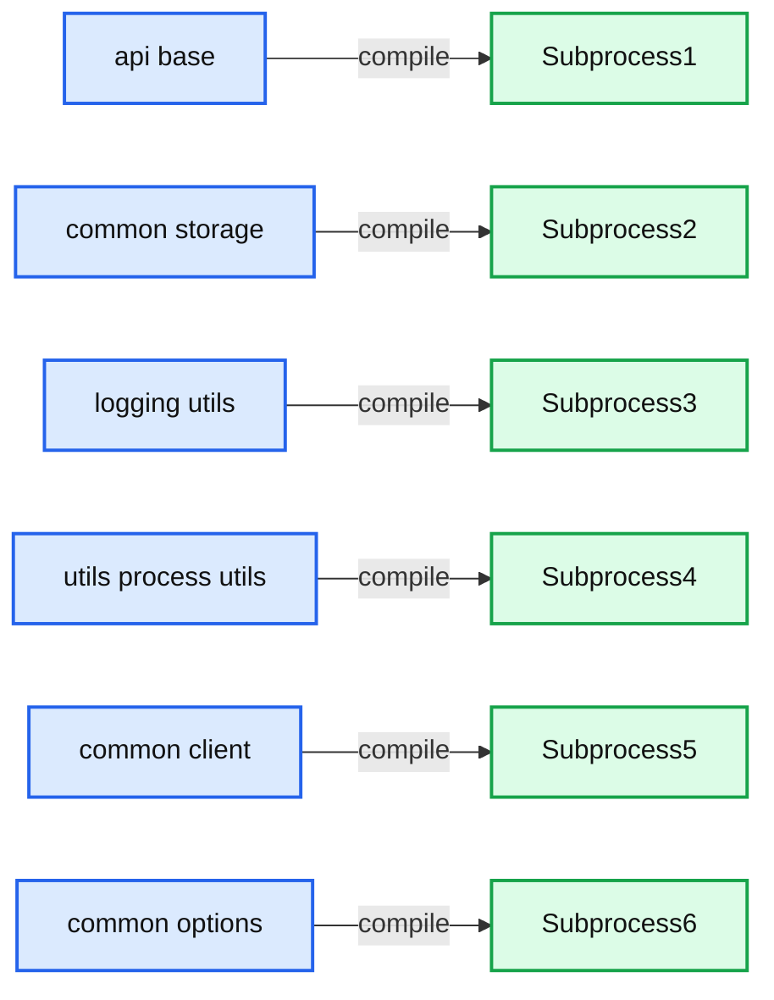
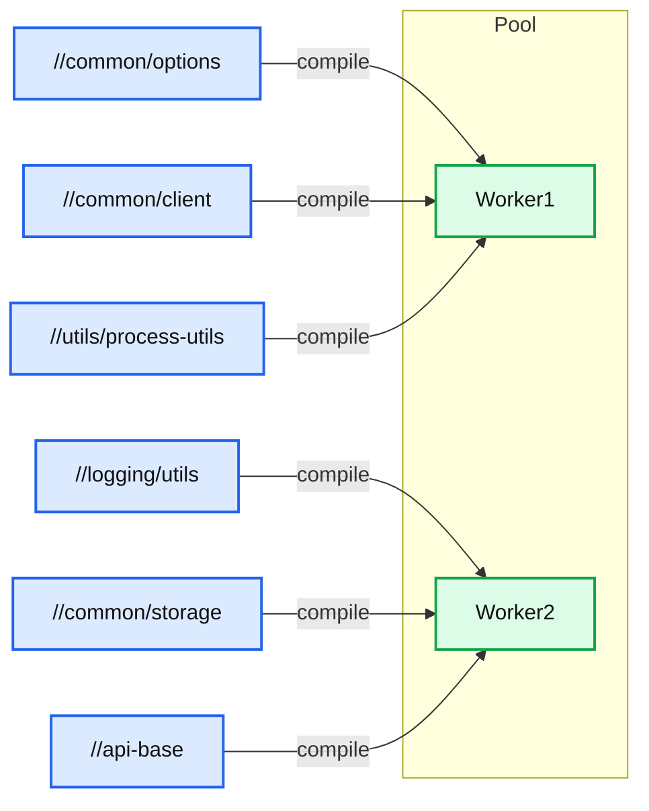
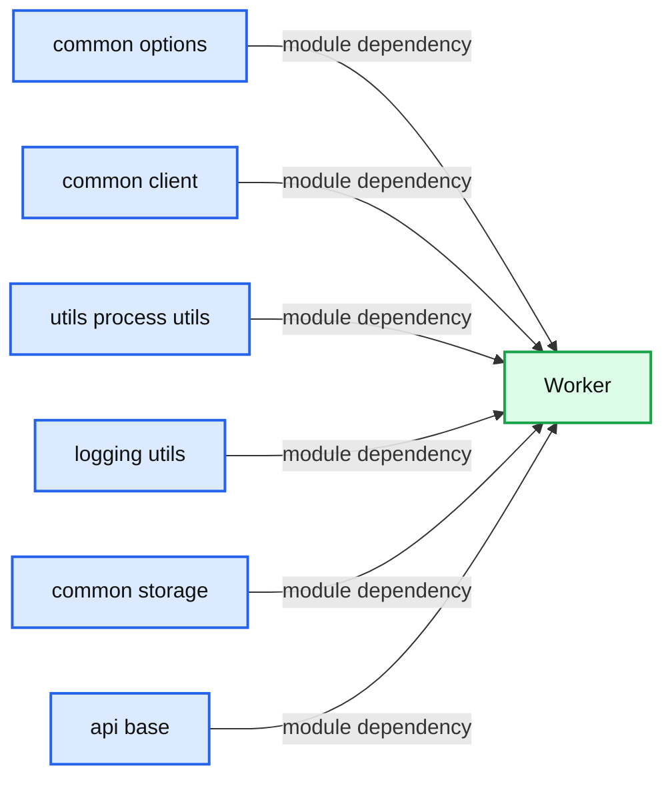
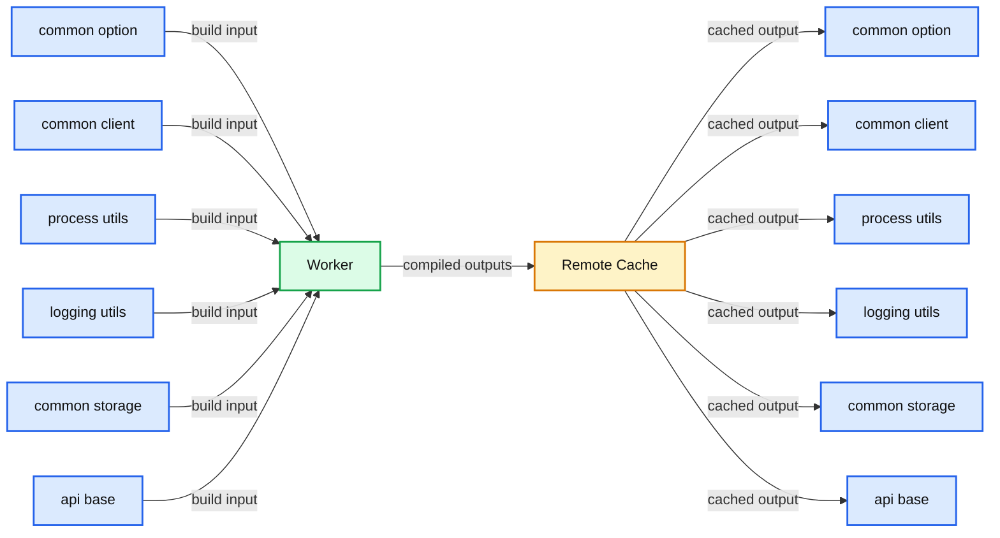
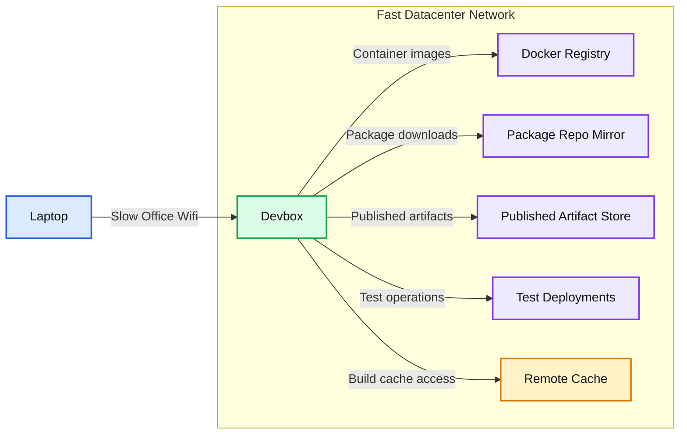

# Speedy Scala Builds with Bazel at Databricks

- Source: https://www.databricks.com/blog/2019/02/27/speedy-scala-builds-with-bazel-at-databricks.html
- Published: 2019-02-27
- Authors: Li Haoyi, Ahir Reddy
- Categories: company, engineering
- Images: 8 total, 8 extracted as architecture

Databricks [migrated](http://www.youtube.com/watch?v=wCkqtM44BvU&t=12m28s) over from the standard [Scala Build Tool](https://www.scala-sbt.org/) (SBT) to using [Bazel](https://bazel.build/) to build, test and deploy our Scala code. Through improvements in our build infrastructure, Scala compilation workflows that previously took minutes to tens of minutes now complete in seconds. This post will walk you through the improvements we made to achieve that, and demonstrate the concrete speedup each change contributed to the smooth experience using Scala with Bazel at Databricks.

## The Databricks Codebase

The Databricks codebase is a [Monorepo](https://en.wikipedia.org/wiki/Monorepo), containing the Scala code that powers most of our services, Javascript for front-end UI, Python for scripting, [Jsonnet](https://www.databricks.com/blog/2017/06/26/declarative-infrastructure-jsonnet-templating-language.html) to configure our infrastructure, and much more.

The Scala portion is by far the largest, and at time of writing comprises:

- 1,000,000 lines of Scala code
- Split over 5500 source files
- In 600 modules (also known as *Targets* in Bazel)
- Deployed as a few dozen different services.

While we appreciate Scala as a programming language, everyone knows that the Scala compiler is slow. Despite [recent improvements](https://www.lightbend.com/blog), some benchmarks put it about [6x slower than the Java compiler](https://gkossakowski.medium.com/on-kentucky-mule-a-transcript-d11ab2920c95) when compiling the equivalent code. Compared to most programming languages, it is much easier for Scala compilation times to get out of hand. This was borne out by the feedback in our internal surveys, which specifically called out our Scala code as taking too long to compile:

>  Building + applying the build take too much time. End up spending a lot of 1-2 minutes time fragments everyday waiting for build/sync Building scala projects in Bazel (~10-15 min). Compiling app (~30 seconds). Compiling app tests (~90 seconds)

This feedback from our engineers kicked off a series of projects to do something about these long iteration cycles, which we will present below. As a baseline for discussion, we will compare the experience of working with two modules within our Scala codebase:

- **//common:** a general-purpose utility module that doesn't depend on much (relatively speaking) but is used throughout our codebase.
- **//app:** a common webservice, this depends on a large number of other modules (including **//common**) but isn't directly used by other Scala modules (we end up deploying it in a docker container).

With the following statistics:

| Target | # Source Files | # Source lines | # Transitive Files | # Transitive Lines | # Transitive Modules |
|---|---|---|---|---|---|
| //common | 176 | 22,000 | 500 | 50,000 | 15 |
| //app | 48 | 13,000 | 1,100 | 180,000 | 112 |

Each of these Scala modules has a number of upstream modules that it depends on. Using Bazel (and sed to clean up some of our legacy-related noise) it is straightforward to visualize the structure of that dependency graph:

`bazel query "kind(generic_scala_worker,deps(//common))" --output=graph | tred | dot -Tsvg > common-graph.svg`

**Summary:** Bazel dependency graph for the `//common` Scala module and its upstream targets.

**Components:**

- `//common:common` - Bazel Scala target
- `//common/options:options` - Bazel Scala target
- `//common/client:client` - Bazel Scala target
- `//utils:process_utils` - Bazel utility target
- `//logging/utils:logging-utils` and `//common/storage:storage` - Bazel Scala targets
- `//db/utils:db-utils` - Bazel Scala target
- `//api-base:api-base` - Bazel Scala target
- `//extern:extern` - Bazel external dependency target
- `//api-base:api-base_java` - Bazel Java target
- `//jsonutil:jsonutil` - Bazel utility target
- `//common/lazy:lazy`, `//logging/log:log`, and `//extern/acl/auth:auth` - Bazel targets
- `//third_party/json:json` - Bazel third-party target

**Flows:**

- `//common:common -> //common/options:options`: dependency
- `//common:common -> //common/client:client`: dependency
- `//common:common -> //utils:process_utils`: dependency
- `//common:common -> //logging/utils:logging-utils and //common/storage:storage`: dependency
- `//common/options:options -> //db/utils:db-utils`: dependency
- `//common/options:options -> //extern:extern`: dependency
- `//common/client:client -> //api-base:api-base`: dependency
- `//api-base:api-base -> //extern:extern`: dependency
- `//api-base:api-base -> //api-base:api-base_java`: dependency
- `//logging/utils:logging-utils and //common/storage:storage -> //jsonutil:jsonutil`: dependency
- `//extern:extern -> //jsonutil:jsonutil`: dependency
- `//extern:extern -> //common/lazy:lazy, //logging/log:log, and //extern/acl/auth:auth`: dependency
- `//jsonutil:jsonutil -> //third_party/json:json`: dependency

**Numbers:** none

source image: https://www.databricks.com/wp-content/uploads/2019/02/image3.png

Viewing the structure of **//common**'s dependency graph, we can see that some modules such as **//common/client:client**, **//common/options:options**, and **//utils:process_utils** are independent: they do not depend on each other in any way, and thus Bazel will compile them in parallel. On the other hand, other modules like **//common:common**, **//common/options:options**, and **//db/utils:db-utils** do have dependencies on each other, and thus Bazel is forced to compile them sequentially.

The dependency graph for **//app** is similar, just much larger and too messy to show here. We will use these two modules to demonstrate how our various performance-related efforts impact two primary Scala compilation workflows:

- **Clean builds**: these involve re-compiling every Scala module in our codebase, or at least the ones that the module you want depends on. This often happens when you set up a new laptop, or when you change branch using Git and end up modifying tons of files.
-

**Delta builds**: these involve re-compiling a small number of Scala modules, often a single one, after making a small change, often to a single file. This often happens during iterative development, perhaps adding a single println and seeing what it prints out.

## How Bazel Works

Before we discuss concrete performance numbers, it helps to have a basic understanding of what Bazel is.

[Bazel](https://bazel.build/) is a flexible, general-purpose build tool from Google. Bazel helps you keep track of dependencies between parts of your codebase: when you ask Bazel to compile a module (also called a *target*), Bazel re-uses already-compiled code where ever possible and parallelizes compilation of modules which do not depend on one another. The end goal is producing the compiled output you asked for as quickly as possible.

At its core Bazel is built around the concept of *Targets* that live in *BUILD* files, which themselves live in subfolders in your project folder. A Target is essentially a shell command that takes input files and generates output files, for example:

*BUILD* files like above are written in a subset of the Python language known as [Starlark](https://docs.bazel.build/versions/main/skylark/language.html). The above *BUILD* file defines a single target using the `genrule` function (Bazel functions are also called *rules*): that target takes two input files *testing_mode.py* and *main.jsonnet*, and runs a shell command in a sandbox to generate a single output file *main_testing_mode.jsonnet*:

**Summary:** Two input files generate one output file.

**Components:**

- `testing_mode.py` - Python file
- `main.jsonnet` - Jsonnet file
- `main_testing_mode.jsonnet` - Generated Jsonnet file

**Flows:**

- `testing_mode.py -> main_testing_mode.jsonnet`: input
- `main.jsonnet -> main_testing_mode.jsonnet`: input

**Numbers:** none

source image: https://www.databricks.com/wp-content/uploads/2019/02/image7-300x126.png

This is similar to how [Makefiles](https://en.wikipedia.org/wiki/Makefile) work, except written in Python rather than a bespoke Makefile syntax.

The above target can be built using `bazel build`, which returns the *main_testing_mode.jsonnet* file listed in the `outs` array:

The first time you run `bazel build` on this target, it will run the `cmd` given to invoke `python` on the given inputs. Subsequent runs will simply return the already-built outputfile, unless the one of the inputs to this target (*testing_mode.py* or *main.jsonnet*) changed since the last run. This is similar to the venerable [Make](https://en.wikipedia.org/wiki/Make_(software)) build tool.

One difference between Bazel and Make is that Bazel lets you define your own helper functions: if you have the same few targets being defined over and over (e.g., maybe every Scala compile target also has a linter you can run, and a REPL you can open), or a few targets that look more-or-less the same (e.g. they all shell out to the Scala compiler in the same way), wrap them in a function to keep your build configuration DRY.

For example, the following target defines a *jsonnet_to_json* function that internally calls `genrule` to convert the *main_testing_mode.jsonnet* file (which we constructed above) into a *main_testing_mode.json* file that can be used elsewhere:

While helper functions like *jsonnet_to_json* make things more convenient, if you dig into the implementation, you will eventually find a shell command similar to the one we saw above that actually runs on the input *srcs* files to generate the output outs files. The above two targets and the two input files define the following dependency graph:

**Summary:** The diagram shows two input files combining into an intermediate Jsonnet file, which generates a final JSON file.

**Components:**

- `testing_mode.py` - Python input file
- `main.jsonnet` - Jsonnet input file
- `main_testing_mode.jsonnet` - Intermediate Jsonnet file
- `main_testing_mode.json` - Generated JSON file

**Flows:**

- `testing_mode.py -> main_testing_mode.jsonnet`: input dependency
- `main.jsonnet -> main_testing_mode.jsonnet`: input dependency
- `main_testing_mode.jsonnet -> main_testing_mode.json`: generates JSON output

**Numbers:** none

source image: https://www.databricks.com/wp-content/uploads/2019/02/image4-1-300x183.png

Bazel itself doesn't really care what each target does. As long as each target converts input files into output files using a shell command, that's all Bazel needs. In exchange, Bazel will do everything else: cache generated files if their inputs didn't change, invalidate the caches when something changes, parallelize shell commands that do not depend on each other, and so on.

## Naive Bazel Scala Integration

Bazel does not know anything about Scala by default, but there is an open-source bazel-scala integration in [rules_scala](https://github.com/bazelbuild/rules_scala) that contains a few helper functions (similar to *jsonnet_to_json* above) to help you compile Scala code by shelling out to the Scala compiler. In essence, it provides a *scala_library* helper function that can be used as follows:

You give the *scala_library* target a list of source files in *srcs*, any upstream scala_library targets in *deps*, and it will shell out to the Scala compiler with the necessary command-line flags to compile your sources and give you a compiled jar file, spawning one compiler subprocess per module:

**Summary:** The diagram shows Scala modules mapped to separate compiler subprocesses.

**Components:**

- `//api-base` module
- `//common/storage` module
- `//logging/utils` module
- `//utils/process-utils` module
- `//common/client` module
- `//common/options` module
- Subprocess1
- Subprocess2
- Subprocess3
- Subprocess4
- Subprocess5
- Subprocess6

**Flows:**

- `//api-base -> Subprocess1`: compilation input
- `//common/storage -> Subprocess2`: compilation input
- `//logging/utils -> Subprocess3`: compilation input
- `//utils/process-utils -> Subprocess4`: compilation input
- `//common/client -> Subprocess5`: compilation input
- `//common/options -> Subprocess6`: compilation input

**Numbers:** 1, 2, 3, 4, 5, 6

source image: https://www.databricks.com/wp-content/uploads/2019/02/image5-1-300x266.png

While this does work, performance is a big issue. Shelling out to spawn new compiler subprocesses over and over is inefficient for a variety of reasons:

- We pay the heavy cost of JVM startup time for every target we compile.
- The short-lived subprocesses never benefit from the JIT compilation that happens once the JVM has warmed up.
- We end up with multiple compiler processes running concurrently, hogging the RAM of your laptop.

Using this naive subprocess-spawning compilation strategy, the time taken to compile both **//app** and **//common**, Clean and Delta builds, is as follows:

| Action | Naive |
|---|---|
| //app (Clean) | 1065s |
| //app (Delta) | 26s |
| //common (Clean) | 186s |
| //common (Delta) | 38s |

Almost 20 minutes to clean rebuild the **//app** target, and 3 minutes to clean rebuild **//common**. Note that this includes some degree of parallelism, as mentioned above.

Even Delta builds, maybe adding a single `println`, take around 30 seconds. This is pretty slow, and doesn't include the time needed to do other things in your workflow (running tests, packaging docker containers, restarting services, etc.).

For both targets, and both workflows, this is a tremendously slow experience and would be unacceptable to our engineers who are modifying, recompiling, and testing their code day in and day out.

## Long-lived Worker Processes

The first big improvement we made to our Scala compilation infrastructure was making use of Bazel's support for [long-lived worked processes](https://blog.bazel.build/2015/12/10/java-workers.html). Bazel allows you to make a target use a long-lived worker process, rather than repeatedly shelling out to a subprocess, in order to fully take advantage of technologies like the JVM whose performance starts off poor but improves over time as the JIT compiler kicks in. This allows us to keep our Scala compiler process live, and the JVM hot in-memory, by sharing a pool of worker processes between all modules that need to be compiled:

**Summary:** A pool of long-lived Scala compiler workers receives compilation requests from multiple Bazel modules.

**Components:**

- `//common/options` - Bazel Scala module
- `//common/client` - Bazel Scala module
- `//utils/process-utils` - Bazel Scala module
- `//logging/utils` - Bazel Scala module
- `//common/storage` - Bazel Scala module
- `//api-base` - Bazel Scala module
- Worker1 - long-lived Scala compiler worker process
- Worker2 - long-lived Scala compiler worker process
- Pool - shared worker process pool

**Flows:**

- `//common/options -> Worker1`: compilation request
- `//common/client -> Worker1`: compilation request
- `//utils/process-utils -> Worker1`: compilation request
- `//logging/utils -> Worker2`: compilation request
- `//common/storage -> Worker2`: compilation request
- `//api-base -> Worker2`: compilation request

**Numbers:** none

source image: https://www.databricks.com/wp-content/uploads/2019/02/image2-1-300x284.png

This results in a significant speedup:

| Action | Naive | Worker |
|---|---|---|
| //app (Clean) | 1065s | 279s |
| //app (Delta) | 26s | 9s |
| //common (Clean) | 186s | 84s |
| //common (Delta) | 38s | 18s |

As you can see, by converting our naive subprocess-spawning Bazel-Scala integration to long-lived workers, compile are down 2-4x across the board. Clean compiles of the *app* now take 5 minutes instead of almost 20 minutes.

By default, Bazel spawns N different workers which allow building N targets in parallel (N is often the number of cores available) each of which compiles modules in a single-threaded fashion. Databricks' Scala Bazel integration instead shares a single multi-threaded JVM worker process that is able to process a number of modules at once in parallel:

**Summary:** The diagram shows six Scala code modules feeding into a shared Worker.

**Components:**

- `//common/options` module, technology not specified
- `//common/client` module, technology not specified
- `//utils/process-utils` module, technology not specified
- `//logging/utils` module, technology not specified
- `//common/storage` module, technology not specified
- `//api-base` module, technology not specified
- Worker, technology not specified

**Flows:**

- `//common/options -> Worker`: module dependency
- `//common/client -> Worker`: module dependency
- `//utils/process-utils -> Worker`: module dependency
- `//logging/utils -> Worker`: module dependency
- `//common/storage -> Worker`: module dependency
- `//api-base -> Worker`: module dependency

**Numbers:** none

source image: https://www.databricks.com/wp-content/uploads/2019/02/image8-296x300.png

This greatly reduces the memory usage, since Scala compiler processes are heavy-weight and can easily take 1-2 gb of memory each. The initial warm-up is also faster as the JVM quickly reaches the amount of load necessary to JIT optimize the running code.

## Upgrading to Scala 2.12

When Databricks was founded in the halcyon days of 2013, Scala 2.10 was the latest version of the language, and it remained the version of Scala used throughout our codebase out of inertia. However, the core Scala team has put in a [lot of work](https://www.lightbend.com/blog) to try and improve the performance of the compiler, and by upgrading from 2.10 to Scala 2.12, we should be able to let Databricks engineers enjoy those speedups.

Upgrading from Scala 2.10 to 2.12 was a slow, multi-step process:

- Prepare 2.12 compatible versions of all our third-party dependencies: some were on old versions, and were only 2.12 compatible on more recent versions.
- Prepare Bazel helper functions to cross-build modules between Scala 2.10 and 2.12. Greatly simplified, this was just a function with a loop to define different versions of a target and its dependencies:

- Incrementally roll out 2.12 support using cross_scala_library across the entire 600-target/million-line codebase, including running all unit and integration tests on Scala 2.12.
- Deploy 2.12 versions of our various services to production.
- Remove the old 2.10 support once our 2.12-compiled code was in production and running smoothly.

Most of the work was getting all the build configuration, third-party libraries, etc. lined up correctly to cross-build things; there were relatively few code changes. Here is a sampling of some of the commit logs from that period:

>  Delete some PropertyCheckConfig customization in our tests since the new version of ScalaCheck doesn't support it Remove some overloads that Scala 2.12 doesn't like due to their ambiguity (Scala's not meant to allow multiple overloads with default parameters, but I guess 2.10 is a bit sloppy) Use InternalError instead of NotImplementedError to test fatal exceptions, since the latter is no longer fatal in 2.12 Floating point literals cannot end with a trailing ., so I added a 0 after the .

Necessary changes, but generally pretty small. The whole process took several months of on-and-off work, but went smoothly without any incident.

The exact speedup we got varied greatly. Here's a benchmark where we compared compilation times of a wide range of modules, before and after the upgrade:

| Target | 2.10 Compile | 2.12 Compile | Ratio |
|---|---|---|---|
| //manager | 40s | 23s | 58% |
| //manager_test | 28s | 18s | 64% |
| //app:handlers | 21s | 13s | 62% |
| //elastic | 18s | 11s | 61% |
| //launcher | 13s | 8s | 61% |
| //launcher:launcher_test | 19s | 9s | 47% |

We saw about a 30-60% reduction in compile times across the board. Test suites seemed to benefit more than non-test modules, probably thanks to the new [Java 8 Lambda Encoding](https://www.scala-lang.org/news/2.12.0/#java-8-style-bytecode-for-lambdas) that reduces the number of class files generated by our lambda-heavy Scalatest [FunSuites](https://www.scalatest.org/getting_started_with_fun_suite).

This upgrade also resulted in much smaller compiled `.jar` files:

| Target | 2.10 Jar Size | 2.12 Jar Size | Ratio |
|---|---|---|---|
| //manager | 3.7mb | 2.4mb | 65% |
| //manager_test | 5.6mb | 1.8mb | 32% |
| //app:trees | 2.6mb | 1.8mb | 69% |
| //app:handlers | 2.0mb | 1.3mb | 65% |
| //elastic | 1.9mb | 1.6mb | 84% |
| //launcher | 1.2mb | 0.8mb | 67% |
| //launcher:launcher_test | 1.3mb | 0.5mb | 38% |

Overall, upgrading from Scala 2.10 to 2.12 wasn't an order-of-magnitude improvement in performance, but was still a significant across the board win. Almost every workflow, from compilation, to packaging, to deployment, all benefited significantly from the shorter compilation times and smaller compiled `.jar` files.

Going back to our original benchmarks, we can see the significant improvement in compilation performance that arises from the Scala 2.10 to Scala 2.12 upgrade

| Action | Naive | Worker | Scala 2.12 |
|---|---|---|---|
| //app (Clean) | 1065s | 279s | 181s |
| //app (Delta) | 26s | 9s | 6s |
| //common (Clean) | 186s | 84s | 74s |
| //common (Delta) | 38s | 18s | 14s |

## Remote Caching

Bazel by default caches compiled artifacts locally: if you call `bazel build` on the same target twice, the second run will be almost instant as Bazel simply returns the file that was produced by the first. While this makes Delta builds relatively quick, it doesn't help for Clean builds, where Bazel still ends up having to compile large portions of your codebase before you can start working on the module you are interested in.

In addition to the local cache, Bazel also has support for [Remote Caching](https://docs.bazel.build/versions/main/remote-caching.html). That means that whenever someone generates a file, perhaps the output *.jar* from the **//common module**, Bazel will upload it to a central server and make it available for anyone else on the team to download (assuming the inputs and the command generating that file are the same):

**Summary:** The diagram shows two laptops using a shared remote cache to avoid recompiling identical Bazel module outputs.

**Components:**

- Laptop #1: local Bazel build environment.
- Worker: Bazel build worker compiling modules.
- Remote Cache: shared Bazel remote cache.
- Laptop #2: local Bazel build environment.
- `//common/option`: Scala module.
- `//common/client`: Scala module.
- `//utils/process-utils`: Scala module.
- `//logging/utils`: Scala module.
- `//common/storage`: Scala module.
- `//api-base`: Scala module.

**Flows:**

- `//common/option` on Laptop #1 -> Worker: build input.
- `//common/client` on Laptop #1 -> Worker: build input.
- `//utils/process-utils` on Laptop #1 -> Worker: build input.
- `//logging/utils` on Laptop #1 -> Worker: build input.
- `//common/storage` on Laptop #1 -> Worker: build input.
- `//api-base` on Laptop #1 -> Worker: build input.
- `Worker -> Remote Cache`: compiled module outputs.
- `Remote Cache -> //common/option` on Laptop #2: cached output.
- `Remote Cache -> //common/client` on Laptop #2: cached output.
- `Remote Cache -> //utils/process-utils` on Laptop #2: cached output.
- `Remote Cache -> //logging/utils` on Laptop #2: cached output.
- `Remote Cache -> //common/storage` on Laptop #2: cached output.
- `Remote Cache -> //api-base` on Laptop #2: cached output.

**Numbers:** none

source image: https://www.databricks.com/wp-content/uploads/2019/02/image1-2.png

That means that each file only needs to get compiled once throughout your engineering organization: if someone already compiled **//app** on the latest master, you can simply download the generated files onto your laptop without needing to compile anything at all!

Bazel's remote cache backends are pluggable: Nginx, Google Cloud Storage, Amazon S3, etc. can all be used for the backend storage. At Databricks we utilize a simple [multi-level cache](https://github.com/ahirreddy/bazel-cache-s3) with two layers:

1. An LRU read-through in-memory cache built on top of [groupcache](https://github.com/golang/groupcache)
2. Amazon S3, as an unbounded backing store

The exact speedup that the Remote Cache gives you varies greatly depending on your network latency and throughput, but even on so-so residential WiFi, the gains are substantial:

| Action | Naive | Worker | Scala 2.12 | Remote Cache |
|---|---|---|---|---|
| //app (Clean) | 1065s | 279s | 181s | 60s |
| //app (Delta) | 26s | 9s | 6s | - |
| //common (Clean) | 186s | 84s | 74s | 18s |
| //common (Delta) | 38s | 18s | 14s | - |

Here, we can see it takes just 1 minute to do a clean "build" of the **//app** target if the artifacts are already remotely cached, and only 20s to do a clean build of **//common**. For people on fast office Wifi/Wired connections, it would take even less time.

That means that someone downloading the Databricks monorepo and starting work on our 180,000 line web application can get everything "compiled" and ready to begin development in 60s or less: a huge improvement from the 20 minutes it originally took!

Apart from speeding up Scala compilation, remote caching works with anything: bundling Javascript, building Docker images, constructing tarballs, etc.– all can benefit. And because the remote cache also supports our CI test-running machines, we found usage of the cache greatly reduced the CI time necessary to compile our code before running tests. This saves developers a lot of amount of time waiting for PR validation:

| Action | Uncached Run | Remote Cache |
|---|---|---|
| Full Build | 70m | 10m |
| Full Test | 90m | 30m |

Overall, this was a huge win all around.

## Cloud Devboxes

So far, we have managed to substantially speed up people working with Scala code on their laptops: clean builds are 10-15x faster, and Delta builds are 3-4x faster than before. However, there are many reasons why you may not want to build code on your laptop at all:

- Laptops are usually limited to 4 cores and 16GB of RAM, while Bazel can parallelize work onto as many cores as you can give it (limited only by [Amdahl's Law](https://en.wikipedia.org/wiki/Amdahl%27s_law)).
- Laptops often have Antivirus, either for security or for compliance, which can seriously degrade performance (especially filesystem IO) via intercepting system calls or performing background scans.
- Laptops are often physically far away from the rest of your infrastructure: deployments, package repos, remote caches, etc. all live in a data center with fast wired connections, while your laptop sits in an office somewhere else interacting over slow office WiFi.
- Laptops are filled with other programs that fight for system resources: IntelliJ takes 1-2GB of RAM, Chrome 300mb of RAM per tab, Slack another 1gb, Docker another 1-2GB. This quickly eats into the resources you have to actually do work.
- Laptops are susceptible to thermal throttling: they could be working at much less than 100% CPU capacity if airflow isn't good, or the room is hot, or your fans have accumulated dust.

While individually these issues are bearable, together they can add up to significant performance degradation for compiling things on your laptop v.s. compiling things on a dedicated single-purpose machine.

Databricks solves this issue by providing engineers with remote Cloud Devboxes: beefy 16-Core/64GB-RAM Linux VMs hosted on Amazon EC2. These are spun up on-demand, have files efficiently synced over from your laptop, and shut down when not in use. We currently use a [custom sync engine](https://github.com/databricks/devbox) that gives us somewhat snappier syncing v.s. rsync/[watchdog](https://pythonhosted.org/watchdog/)/[watchman](https://facebook.github.io/watchman/), and better IO performance than NFS/SSHFS/Samba.

A new engineer at Databricks simply needs to run the `devbox/sync` command to spin up a new devbox that they can then SSH into and begin using. They can edit files on their laptop using their favorite editor or IDE, and seamlessly run terminal commands over SSH to build/run/test their code on the remote machine, getting the best of both worlds of convenience and performance. These devboxes are hosted in the same AWS region as many of our other development services and infrastructure:

**Summary:** The diagram shows a laptop connecting through slow office WiFi to a Devbox, which connects over a fast datacenter network to development infrastructure.

**Components:**

- Laptop - developer client
- Devbox - remote development machine
- Docker Registry - container image registry
- Package Repo Mirror - package repository mirror
- Published Artifact Store - artifact storage
- Test Deployments - test deployment environments
- Remote Cache - build cache

**Flows:**

- Laptop -> Devbox: SSH terminal commands and file editing
- Devbox -> Docker Registry: container image access
- Devbox -> Package Repo Mirror: package downloads
- Devbox -> Published Artifact Store: artifact publishing
- Devbox -> Test Deployments: test deployment operations
- Devbox -> Remote Cache: build cache access

**Numbers:** none

source image: https://www.databricks.com/wp-content/uploads/2019/02/image6-1024x580.png

The fast network between the Devbox and other infrastructure means that expensive operations like downloading binaries from the remote cache can be much faster, while the slow network between your laptop and the Devbox isn't a problem given the small amounts of data typically transferred back and forth over the SSH terminal.

Cloud Devboxes significantly speed up all workflows:

| Action | Naive | Worker | Scala 2.12 | Remote Cache | Devbox (Non-Cached) | Devbox (Cached) |
|---|---|---|---|---|---|---|
| //app (Clean) | 1065s | 279s | 181s | 60s | 100s | 2s |
| //app (Delta) | 26s | 9s | 6s | - | 5s | - |
| //common (Clean) | 186s | 84s | 74s | 18s | 30s | 1s |
| //common (Delta) | 38s | 18s | 14s | - | 7s | - |

Here, we can see that non-cached clean and Delta builds take half as much time as before. Even more impressively, cached builds that download already-compiled artifacts are almost instant, taking barely 1 or 2 seconds! This makes sense when you consider that the bottleneck for cached builds is network throughput and latency, and in-datacenter gigabit networking is going to be orders-of-magnitude faster than your slow office Wifi.

The m5-4xlarge machines that we provide by default cost 0.768$/hr. While that would be expensive to keep running all the time (~550$ a month), an engineer working on it for 20hrs/week (optimistically spending half of their 40hr work week actively coding) would only end up costing about 4$/day, which is definitely worth the significant increase in productivity.

## Fine-Grained Incremental Compilation

The last major performance improvement we have made is a fine-grained incremental compilation. While Bazel is able to cache and re-use compiled artifacts on a per-module basis, the Scala incremental compiler (named [Zinc](https://github.com/sbt/zinc)) is able to cache and re-use the compiled output of individual files and classes within a module. This further reduces the amount of code you need to compile, especially during iterative development where you are often tweaking methods or adding `println`s in a single file.

While the [old version of Zinc](https://github.com/typesafehub/zinc) had a standalone compile-server and command-line interface to it, the current version has lost that capability. Instead, we use the ZincWorker from the Mill Scala build tool for our incremental compilation needs, which is modular enough to simply drop into our Bazel Scala compile worker process. ZincWorker wraps all the messiness of Zinc's implementation details and provides a relatively straightforward API to call:

Essentially, you give the ZincWorker a list of upstream *CompilationResults* (which includes both compiled class files as well as metadata "analysis" files), and it incrementally compiles it and returns a new *CompilationResult* containing the compiled class files and analysis file for this compilation target.

The incremental compilation doesn't affect clean builds, but it can greatly speed up Delta builds where you are making small changes to a single file:

| Action | Naive | Worker | Scala 2.12 | Remote Cache | Devbox (Non-Cached) | Devbox (Cached) | Incremental |
|---|---|---|---|---|---|---|---|
| //app (Clean) | 1065s | 279s | 181s | 60s | 100s | 2s | - |
| //app (Delta) | 26s | 9s | 6s | - | 5s | - | 1s |
| //common (Clean) | 186s | 84s | 74s | 18s | 30s | 1s | - |
| //common (Delta) | 38s | 18s | 14s | - | 7s | - | 1s |

Here we can see that Delta builds for both **//app** and **//common** are now down to 1 second each! That's about as fast as you could hope for.

Due to rare issues that may turn up in the Zinc incremental compiler (for example [#630](https://github.com/sbt/zinc/issues/630)), we have made incremental compilation opt-in via a command-line flag: `SCALA_INCREMENTAL`:

This way engineers who are iterating on some code can use it, but the vast majority of batch processes, CI builds, and deployment workflows will remain non-incremental. If any issues turn up with the incremental compiler, an engineer can simply drop the `SCALA_INCREMENTAL` flag to fall back to the tried-and-trusted batch workflow.

## Conclusion

Even though our monorepo contains a million lines of Scala, working with code within is fast and snappy. This was not through one silver bullet, but through a series of incremental improvements to chip away at the compile-time problem from a variety of different angles.

When iterating on a single module or test suite, things build and are ready to use in a matter of seconds, not unlike the experience of working with much smaller projects:

From the point of view of engineers working on any of our many products and services, the upgrades were almost entirely transparent: things magically got faster without them needing to lift a finger. This lets Web developers focus on web development, cloud infrastructure people can focus on cloud infrastructure, and machine learning experts can focus on machine learning, all simply relying on the simple, stable and performant build infrastructure that everyone shares.

Despite the transparency of the effort, developers did notice and appreciate the changes, and said so on our internal developer surveys:

>  Dev cycles are pretty fast, and getting faster I like Bazel and I am learning to love the build cache! Bazel building across multiple languages is surprisingly fast.

There still are cases where compilation time is problematic: for example, the large 500-file modules of the [apache/spark](https://github.com/apache/spark) project. Nevertheless, for many engineers, Scala compilation has been reduced from a daily headache to an occasional nuisance.

This work on speeding up Scala compiles itself is part of a larger effort: to improve the productivity of Databricks engineers more broadly: Speeding up Docker workflows, Javascript UI development, CI test runs, etc. In fact, improvements like Cloud Devboxes or Remote Caching are language agnostic, and help speed up all sorts of builds regardless of what specific files you are building.

If you are interested in contributing to our world-class Scala development environment or experiencing what a smooth and productive Scala development is like, you should come [work for us](https://www.databricks.com/company/careers)!
