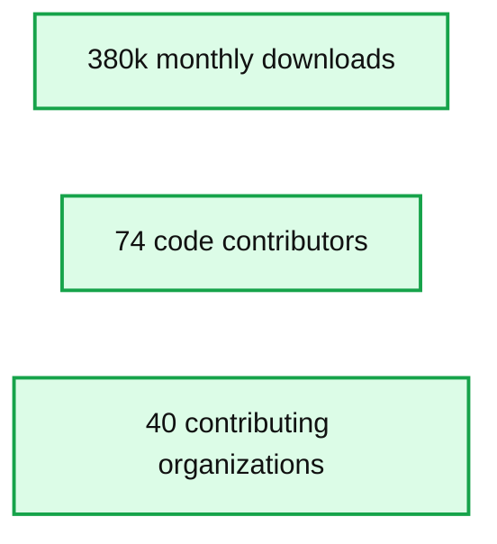

# Managed MLflow on Databricks now in public preview

- Source: https://www.databricks.com/blog/2019/03/06/managed-mlflow-on-databricks-now-in-public-preview.html
- Published: 2019-03-06
- Authors: Andy Konwinski, Matei Zaharia, Cyrielle Simeone
- Categories: platform, solutions, product, announcements, engineering, data-science-machine-learning, company
- Images: 4 total, 1 extracted as architecture

[Try this tutorial in Databricks](https://docs.databricks.com/applications/mlflow/quick-start.html)

Building production machine learning applications is challenging because there is no standard way to record experiments, ensure reproducible runs, and manage and deploy models. To address these challenges, last June we introduced [MLflow](https://mlflow.org), an open source platform to manage the ML lifecycle that works with any machine learning library and environment. The project has grown rapidly since then, with over 74 contributors and 14 releases.

Today, we are also excited to announce the public preview of [Managed MLflow on Databricks](https://docs.databricks.com/applications/mlflow/index.html): a fully managed version of MLflow integrated into Databricks. Our goals with Managed MLflow are two-fold:

1. Offer a SaaS version of MLflow with management and security built in for easy use.
2. Integrate MLflow throughout the [Databricks Unified Analytics Platform](https://www.databricks.com/product/data-lakehouse), so that users can get reproducibility and experiment management across their Databricks Notebooks, Jobs, data stores, etc.

In this post, we’ll briefly describe MLflow, then show how Managed MLflow on Databricks makes MLflow even easier to use in the context of a complete data science platform.

## What is MLflow?

[MLflow](https://www.databricks.com/blog/2018/06/05/introducing-mlflow-an-open-source-machine-learning-platform.html) is a lightweight set of APIs and user interfaces that developers can use with any ML framework to help streamline their workflow. Specifically, it includes three features:

- **Experiment tracking,** which lets users capture experiment parameters, code and metrics and compare them using an interactive UI or the MLflow API.
- **Projects,** a simple means of packaging code and dependencies for reproducible runs or multi-step pipelines.
- **MLflow Models,** a set of APIs to package models and deploy the same model to many production environments (e.g. Docker, Azure ML serving, or Apache SparkTM jobs).

Since we released MLflow, we found that the idea of an open source platform for the ML lifecycle resonated strongly with the community. The project has seen contributions from over 74 developers and 40 companies, such as an [R API contributed by RStudio](https://www.databricks.com/blog/2018/10/03/mlflow-v0-7-0-features-new-r-api-by-rstudio.html) and many other additions. We are excited to [continue growing MLflow](https://www.databricks.com/blog/2019/01/08/kicking-off-2019-with-an-mlflow-user-survey.html) in 2019 based on community feedback.

*Some stats on MLflow’s open source community growth*

**Summary:** MLflow’s open source community growth is summarized through monthly downloads, code contributors, and contributing organizations.

**Components:**

- Monthly downloads - technology not specified
- Code contributors - technology not specified
- Contributing organizations - technology not specified

**Flows:**

- none

**Numbers:**

- 380k monthly downloads
- 74 code contributors
- 40 contributing organizations

source image: https://www.databricks.com/wp-content/uploads/2019/03/image2.png

Some stats on MLflow’s open source community growth

With Managed MLflow, we are not only offering MLflow as a service, but also embracing MLflow throughout the Databricks Workspace. For example, notebook revisions are automatically captured **and linked to** as part of experiment runs, you can run projects as Databricks jobs, and experiments are integrated with your workspace’s security controls. We next describe these key features.

### Track Experiments in Your Databricks Workspace

Creating high-quality ML models usually takes significant trial and error and many iterations of building, testing, tuning, etc. During this process, it is imperative to track everything that went into a specific run, along with the results, and then to be able to organize and securely share those runs. Now you can create [Experiments](https://docs.databricks.com/applications/mlflow/tracking.html) right inside the Databricks file browser and log your results to them.

An experiment in the Databricks workspace listing its runs and their associated metadata

#### **Recording Runs**

You can use the [MLflow Tracking API](https://docs.databricks.com/applications/mlflow/tracking.html) to record **runs** that keep track of models, parameters, data, code, and results. Managed MLflow can track runs that happen inside or outside your Databricks workspace. To record a run, simply load the open source MLflow client library (i.e., attach it to your Databricks cluster), call `mlflow.start_run()` in your code, and then call MLflow logging statements (such as `mlflow.log_param()`) to capture parameters, metrics, etc.

If you create a run in a Databricks notebook, Databricks automatically captures and links the run back to the specific revision of the notebook that was used to generate it. You can restore that revision anytime to edit that version of the code.

https://www.youtube.com/watch?v=rIC4rKetaVw

In addition to capturing metadata such as hyperparameters and tags, a run can also track models and other artifacts such as images or text files. These artifacts may be large and so by default are stored in the Databricks Filesystem (DBFS) which is backed by your cloud provider’s blob storage, enabling storage and management of millions of models.

#### **Managing Experiments**

MLflow Experiments can be created and organized in the Databricks Workspace just like a notebook, library, or folder. Simply click on an experiment to see a list of its runs or compare them. Crucially, with Managed MLflow, Experiments are integrated with Databricks' standard [role-based access controls](https://docs.databricks.com/administration-guide/access-control/workspace-acl.html) to set sharing permissions.

### Reproducible Projects Runs on Databricks

The ability to reproducibly run a project is key to data science productivity, knowledge sharing, and faster development. A project might contain, for example, code that creates features from your data and then trains a model that uses the data and a set of hyperparameters as input. MLflow specifies a way to package a [**project**](https://mlflow.org/docs/latest/projects.html) in a standard file-based format that integrates with Git, Anaconda, and Docker to capture dependencies such as libraries, parameters, and data (see below for more on what exactly an MLflow project is).

With Managed MLflow, you can develop your MLflow projects locally and execute them [remotely on a Databricks cluster](https://docs.databricks.com/applications/mlflow/projects.html).

https://www.youtube.com/watch?v=t3QyMgB037I

To run a project on Databricks from your local command line you simply type `mlflow run project_folder_or_git_url --mode databricks --cluster-spec your_cluster_spec.json` (learn more about cluster specs in our docs for [Azure](https://docs.microsoft.com/en-us/azure/databricks/clusters/#id1) and [AWS](https://docs.databricks.com/dev-tools/api/latest/clusters.html)). You can also achieve the same result using the MLflow Python API, which lets you chain together projects as a [multi-step workflow](https://github.com/mlflow/mlflow/tree/master/examples/multistep_workflow) or do parallel [hyperparameter tuning](https://github.com/mlflow/mlflow/tree/master/examples/hyperparam).

### Model Deployment and Model Operations in Databricks

Finally, you can use the open source MLflow client from within Databricks notebooks and jobs to manage your models and deploy them into production across any serving mode (batch, streaming, low-latency REST, etc) across a wide range of deployment platforms. Your deployment options include:

- Batch or low-latency streaming (e.g. using Structured Streaming) inference
  - On big data using Apache Spark in Databricks
  - On small data using native model formats (for example, scikit-learn or R) in Databricks.
- Low-latency scoring via RESTful API using MLflow's built-in support for deploying to Azure Machine Learning, Amazon SageMaker, or Docker.
- Export Spark MLlib models using MLeap for low latency scoring embedded directly into your JVM application (see more [here](https://www.databricks.com/blog/2018/09/13/whats-new-in-mlflow-v0-6-0.html)).
- Downloading models through the MLflow API to embed them in an application.

All of these deployment operations can be performed from inside of Databricks via the open source MLflow library. However, deploying the model is only part of the bigger picture when it comes to operationalization. For example, most models are put into production today by scheduling them to score a batch of all new data at some regular interval. This requires a job scheduler such as [Databricks jobs](https://docs.databricks.com/jobs.html). You can schedule a Databricks job to score your new data every hour (or day, or week, depending on your data ingest velocity) and automatically alert you if any errors or performance anomalies occur.

https://www.youtube.com/watch?v=PWXK7w6XEP8

## What Users Are Saying

Before launching our public preview of MLflow, we also worked closely with dozens of private preview customers in fields ranging from biotechnology to finance and e-commerce. Their feedback helped us greatly improve MLflow. We are delighted to see Managed MLflow help our customers address their ML lifecycle challenges.

You can join us at the [Data + AI Summit](https://www.databricks.com/dataaisummit) to hear directly from other organizations like Comcast and Showtime about how MLflow has helped them accelerate their Machine Learning lifecycle.

## Next Steps

Our public preview of Managed MLflow is just the start -- we plan to extend Managed MLflow with more integrations and even simpler workflows as we develop the service. We think that what we have so far is already useful for many teams, however, so we would love to hear your feedback.

If you're an existing Databricks user, you can start using Managed MLflow by importing the **Quick Start Notebook** for [Azure Databricks](https://docs.microsoft.com/en-us/azure/databricks/applications/mlflow/quick-start) or [AWS](https://docs.databricks.com/applications/mlflow/quick-start.html). If you're not yet a Databricks user, visit [databricks.com/mlflow](https://www.databricks.com/product/managed-mlflow) to learn more and start a free trial of Databricks and Managed MLflow.

Finally, if you’d like to learn more about MLflow, don't miss our upcoming webinar - [Managing the Complete Machine Learning Lifecycle](https://pages.databricks.com/201903-US-WB-Managing-the-Complete-Machine-Learning-Lifecycle-Reg.html) - with Andy Konwinski, Co-founder, VP of Product at Databricks and lead Product Manager for MLflow. In addition, we will offer an MLflow [training](https://www.databricks.com/sparkaisummit/north-america-2020/apache-spark-training) at [Data + AI Summit](https://www.databricks.com/dataaisummit) for hands-on experience. We’d love to hear how you use MLflow and how we can make the ML and data development cycle even simpler.
