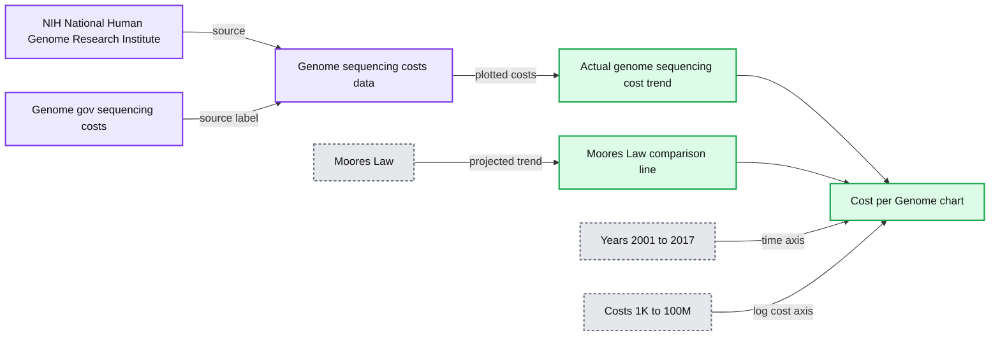
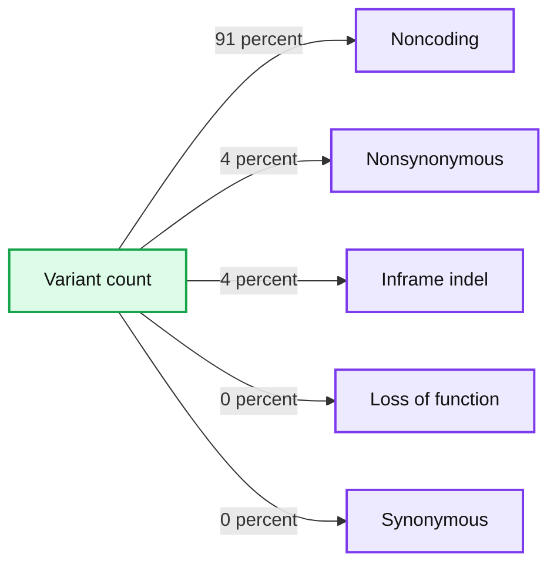

# Simplifying Genomics Pipelines at Scale with Databricks Delta

- Source: https://www.databricks.com/blog/2019/03/07/simplifying-genomics-pipelines-at-scale-with-databricks-delta.html
- Published: 2019-03-07
- Authors: William Brandler, Frank Austin Nothaft
- Categories: engineering, open-source, data-science-machine-learning, data-engineering
- Images: 8 total, 7 extracted as architecture

[Get an early preview of O'Reilly's new ebook](https://www.databricks.com/resources/ebook/delta-lake-running-oreilly?itm_data=simplifyinggenomicspipelinesdelta-blog-oreillydlupandrunning) for the step-by-step guidance you need to start using Delta Lake.

---

[Try this notebook in Databricks](https://pages.databricks.com/rs/094-YMS-629/images/Simplifying%20Genomics%20Pipelines%20at%20Scale%20with%20Databricks.html)
*This blog is the first blog in our “Genomics Analysis at Scale” series. In this series, we will demonstrate how the [Databricks Unified Analytics Platform for Genomics](https://www.databricks.com/product/genomics) enables customers to analyze population-scale genomic data. Starting from the output of our [genomics pipeline](https://www.databricks.com/blog/2018/09/10/building-the-fastest-dnaseq-pipeline-at-scale.html), this series will provide a tutorial on using Databricks to run sample quality control, joint genotyping, cohort quality control, and advanced statistical genetics analyses.*

---

Since the completion of the [Human Genome Project](https://www.genome.gov/human-genome-project/What) in 2003, there has been an explosion in data fueled by a dramatic drop in the cost of DNA sequencing, from $3B1 for the first genome to under $1,000 today.

>  [1] [The Human Genome Project](https://www.genome.gov/human-genome-project/What) was a $3B project led by the Department of Energy and the National Institutes of Health began in 1990 and completed in 2003.

**Summary:** The chart shows the decline in cost per genome from 2001 through 2017 compared with Moore’s Law.

**Components:**

- Cost per Genome chart
- NIH National Human Genome Research Institute source
- Genome sequencing costs data source
- Actual genome sequencing cost trend
- Moore’s Law comparison line
- Year axis from 2001 to 2017
- Cost axis from $1K to $100M

**Flows:**

- Genome sequencing cost data -> Actual genome sequencing cost trend: plotted costs
- Moore’s Law -> Moore’s Law comparison line: projected cost trend

**Numbers:** $100M, $10M, $1M, $100K, $10K, $1K, 2001, 2002, 2003, 2004, 2005, 2006, 2007, 2008, 2009, 2010, 2011, 2012, 2013, 2014, 2015, 2016, 2017

source image: https://www.databricks.com/wp-content/uploads/2019/03/costpergenome_2017.jpg

Source: [DNA Sequencing Costs: Data](https://www.genome.gov/about-genomics/fact-sheets/DNA-Sequencing-Costs-Data)

Consequently, the field of genomics has now matured to a stage where companies have started to do DNA sequencing at population-scale. However, sequencing the DNA code is only the first step, the raw data then needs to be transformed into a format suitable for analysis. Typically this is done by gluing together a series of [bioinformatics](https://www.databricks.com/glossary/bioinformatics) tools with custom scripts and processing the data on a single node, one sample at a time, until we wind up with a collection of genomic variants.  [Bioinformatics](https://www.databricks.com/glossary/bioinformatics) scientists today spend the majority of their time building out and maintaining these pipelines. As genomic data sets have expanded into the petabyte scale, it has become challenging to answer even the following simple questions in a timely manner:

- How many samples have we sequenced this month?
- What is the total number of unique variants detected?
- How many variants did we see across different classes of variation?

Further compounding this problem, data from thousands of individuals cannot be stored, tracked nor versioned while also remaining accessible and queryable. Consequently, researchers often duplicate subsets of their genomic data when performing their analyses, causing the overall storage footprint and costs to escalate.  In an attempt to alleviate this problem, today researchers employ a strategy of “data freezes”, typically between six months to two years, where they halt work on new data and instead focus on a frozen copy of existing data. There is no solution to incrementally build up analyses over shorter time frames, causing research progress to slow down.

There is a compelling need for robust software that can consume genomic data at industrial scale, while also retaining the flexibility for scientists to explore the data, iterate on their analytical pipelines, and derive new insights.

**Summary:** Unified Databricks genomics platform that processes genomic files through rapid pipelines, notebooks, Delta Lake, tertiary analytics, and downstream machine learning and visualization.

**Components:**

- Genomic data files: BAM, VCF, CRAM, and FASTQ
- Rapid pipelines: genomic data processing workflows
- Databricks Notebooks: GATK4 best practices, DNA, RNA, cancer sequencing, custom pipelines, joint genotyping, legacy tool parallelization, and GWAS
- Delta Lake: scalable data management and analytics storage
- Tertiary analytics: scalable downstream analysis
- Outputs: real-time visualizations, dashboarding, machine learning, and accelerated time to impact

**Flows:**

- Genomic data files -> Rapid pipelines: genomic file ingestion
- Rapid pipelines -> Databricks Notebooks: processed genomic data
- Databricks Notebooks -> Delta Lake: analytical data writes
- Delta Lake -> Databricks Notebooks: managed analytical data access
- Databricks Notebooks -> Tertiary analytics: scalable downstream analysis
- Tertiary analytics -> Outputs: visualizations, dashboards, machine learning, and impact

**Numbers:** 4

```mermaid
%% Shows a unified Databricks genomics analytics platform
flowchart LR
    A[Genomic data files] -->|file ingestion| B[Rapid pipelines]
    B -->|processed genomic data| C[Databricks notebooks]
    C -->|data writes| D[Delta Lake]
    D -->|managed data access| C
    C -->|downstream analysis| E[Tertiary analytics]
    E -->|analytics outputs| F[Visualizations dashboards and machine learning]

    classDef client fill:#dbeafe,stroke:#2563eb,stroke-width:2px,color:#111
    classDef service fill:#dcfce7,stroke:#16a34a,stroke-width:2px,color:#111
    classDef store fill:#ede9fe,stroke:#7c3aed,stroke-width:2px,color:#111
    classDef cache fill:#fef3c7,stroke:#d97706,stroke-width:2px,color:#111
    classDef queue fill:#cffafe,stroke:#0891b2,stroke-width:2px,color:#111
    classDef critical fill:#fee2e2,stroke:#dc2626,stroke-width:4px,color:#111
    classDef external fill:#e5e7eb,stroke:#6b7280,stroke-width:2px,color:#111,stroke-dasharray:4 3
    classDef decision fill:#fce7f3,stroke:#db2777,stroke-width:2px,color:#111

    class A external
    class B,C,E service
    class D store
    class F client
```

source image: https://www.databricks.com/wp-content/uploads/2019/06/genomics-reader-writer_image3.png

Fig 1. Architecture for end-to-end genomics analysis with Databricks

With [Databricks Delta: A Unified Management System for Real-time Big Data Analytics](https://www.youtube.com/watch?v=gg-lEJ4sBaA), the Databricks platform has taken a major step towards solving the data governance, data access, and data analysis issues faced by researchers today. With [Databricks Delta Lake](https://www.databricks.com/product/delta-lake-on-databricks), you can store all your genomic data in one place, and create analyses that update in real-time as new data is ingested. Combined with optimizations in our [Unified Analytics Platform for Genomics](https://www.databricks.com/product/genomics) (UAP4G) for reading, writing, and processing genomics file formats, we offer an end-to-end solution for genomics pipelines workflows. The UAP4G architecture offers flexibility, allowing customers to plug in their own pipelines and develop their own tertiary analytics. As an example, we’ve highlighted the following dashboard showing quality control metrics and visualizations that can be calculated and presented in an automated fashion and customized to suit your specific requirements.

https://www.youtube.com/watch?v=73fMhDKXykU

In the rest of this blog, we will walk through the steps we took to build the quality control dashboard above, which updates in real time as samples finish processing. By using a Delta-based pipeline for processing genomic data, our customers can now operate their pipelines in a way that provides real-time, sample-by-sample visibility. With Databricks notebooks (and integrations such as GitHub and MLflow) they can track and version analyses in a way that will ensure their results are reproducible. Their bioinformaticians can devote less time to maintaining pipelines and spend more time making discoveries. We see the UAP4G as the engine that will drive the transformation from ad-hoc analyses to production genomics on an industrial scale, enabling better insights into the link between genetics and disease.

## Read Sample Data

Let’s start by reading variation data from a small cohort of samples; the following statement reads in data for a specific sampleId and saves it using the Databricks Delta format (in the delta_stream_output folder).

>  Note, the annotations_etl_parquet folder contains annotations generated from the [1000 genomes dataset](https://www.internationalgenome.org/) stored in parquet format.   The ETL and processing of these annotations were performed using [Databricks’ Unified Analytics Platform for Genomics](https://www.databricks.com/product/genomics).

## Start Streaming the Databricks Delta Table

In the following statement, we are creating the exomes Apache Spark DataFrame which is reading a stream (via readStream) of data using the Databricks Delta format.  This is a continuously running or dynamic DataFrame, i.e. the exomes DataFrame will load new data as data is written into the delta_stream_output folder.   To view the exomes DataFrame, we can run a DataFrame query to find the count of variants grouped by the sampleId.

When executing the `display` statement, the Databricks notebook provides a streaming dashboard to monitor the streaming jobs.  Immediately below the streaming job are the results of the display statement (i.e. the count of variants by sample_id).

Let’s continue answering our initial set of questions by running other DataFrame queries based on our `exomes` DataFrame.

## Single Nucleotide Variant Count

To continue the example, we can quickly calculate the number of single nucleotide variants (SNVs), as displayed in the following graph.

**Summary:** Bar chart showing single nucleotide variant counts by alternate and reference allele pair.

**Components:**

- Y-axis labeled GroupCount
- X-axis labeled alternateAllele, referenceAllele
- Variant categories A, G; T, C; C, T; G, A; G, C; T, G; C, G; A, C; C, A; G, T; T, A; A, T
- Blue bars representing variant counts

**Flows:**

- none

**Numbers:** 0.00, 200k, 400k, 600k, 800k, 1.0M, 1.2M, 1.4M, 1.6M, 1.8M, 2.0M, 2.2M, 2.4M, 2.6M

```mermaid
%% Shows single nucleotide variant counts by allele pair
flowchart LR
  AG[A G]
  TC[T C]
  CT[C T]
  GA[G A]
  GC[G C]
  TG[T G]
  CG[C G]
  AC[A C]
  CA[C A]
  GT[G T]
  TA[T A]
  AT[A T]

  classDef client fill:#dbeafe,stroke:#2563eb,stroke-width:2px,color:#111
  classDef service fill:#dcfce7,stroke:#16a34a,stroke-width:2px,color:#111
  classDef store fill:#ede9fe,stroke:#7c3aed,stroke-width:2px,color:#111
  classDef cache fill:#fef3c7,stroke:#d97706,stroke-width:2px,color:#111
  classDef queue fill:#cffafe,stroke:#0891b2,stroke-width:2px,color:#111
  classDef critical fill:#fee2e2,stroke:#dc2626,stroke-width:4px,color:#111
  classDef external fill:#e5e7eb,stroke:#6b7280,stroke-width:2px,color:#111,stroke-dasharray:4 3
  classDef decision fill:#fce7f3,stroke:#db2777,stroke-width:2px,color:#111

  class AG,TC,CT,GA,GC,TG,CG,AC,CA,GT,TA,AT service
```

source image: https://www.databricks.com/wp-content/uploads/2019/03/single_nucleotide_variant_count_sorted.png

>  Note, the display command is part of the Databricks workspace that allows you to view your DataFrame using Databricks visualizations (i.e. no coding required).

## Variant Count

Since we have annotated our variants with functional effects, we can continue our analysis by looking at the spread of variant effects we see. The majority of the variants detected flank regions that code for proteins, these are known as noncoding variants.

**Summary:** Donut chart showing the distribution of variants by mutation type, dominated by noncoding variants.

**Components:**

- Loss of function mutation category
- Noncoding mutation category
- Nonsynonymous mutation category
- Inframe indel mutation category
- Synonymous mutation category

**Flows:**

- Variant count -> Mutation type categories: distribution by mutation type

**Numbers:** 91%, 4%, 4%, 0%, 0%, inframe_indel 20,576.00

source image: https://www.databricks.com/wp-content/uploads/2019/03/mutation_type_donut.png

## Amino Acid Substitution Heatmap

Continuing with our `exomes` DataFrame, let’s calculate the amino acid substitution counts with the following code snippet.  Similar to the previous DataFrames, we will create another dynamic DataFrame (`aa_counts`) so that as new data is processed by the exomes DataFrame, it will subsequently be reflected in the amino acid substitution counts as well.  We are also writing the data into memory (i.e. `.format(“memory”)`) and processed batches every 60s (i.e. `trigger(processingTime=’60 seconds’)`) so the downstream Pandas heatmap code can process and visualize the heatmap.

The following code snippet reads the preceding `amino_acid_substitutions` Spark table, determines the max count, creates a new Pandas pivot table from the Spark table, and then plots out the heatmap.

**Summary:** A heatmap showing amino acid substitution counts by reference amino acid and alternate amino acid for a single sample.

**Components:**

- Reference amino acid axis: Ala, Arg, Asn, Asp, Cys, Gln, Glu, Gly, His, Ile, Leu, Lys, Met, Phe, Pro, Ser, Thr, Trp, Tyr, Val
- Alternate amino acid axis: Ala, Arg, Asn, Asp, Cys, Gln, Glu, Gly, His, Ile, Leu, Lys, Met, Phe, Pro, Ser, Thr, Trp, Tyr, Val
- Amino acid substitution count matrix: annotated heatmap cells

**Flows:**

- Reference amino acid -> Substitution count matrix: reference residue categories
- Substitution count matrix -> Alternate amino acid: alternate residue categories

**Numbers:** Cell annotations include 0, 3, 4, 5, 7, 8, 9, 10, 11, 12, 14, 15, 16, 17, 18, 19, 21, 22, 24, 25, 28, 29, 30, 31, 32, 33, 35, 37, 39, 40, 41, 42, 43, 45, 47, 49, 51, 54, 60, 62, 65, 66, 67, 68, 69, 70, 73, 74, 75, 77, 84, 89, 90, 91, 92, 93, 96, 101, 105, 108, 110, 111, 114, 115, 122, 126, 128, 130, 134, 138, 139, 141, 155, 159, 160, 167, 171, 172, 177, 182, 193, 200, 239, 241, 242, 255, 259, 273, 281, 283, 304, 307, 320, 340, 352, 377, 399, 453, 535, 572, 573, 715, 1080, 1168, 1202, 1268

```mermaid
%% Shows an amino acid substitution count heatmap
flowchart LR
    R[Reference amino acid] -->|reference categories| M[Amino acid substitution count matrix]
    M -->|alternate categories| A[Alternate amino acid]

    classDef client   fill:#dbeafe,stroke:#2563eb,stroke-width:2px,color:#111
    classDef service  fill:#dcfce7,stroke:#16a34a,stroke-width:2px,color:#111
    classDef store    fill:#ede9fe,stroke:#7c3aed,stroke-width:2px,color:#111
    classDef cache    fill:#fef3c7,stroke:#d97706,stroke-width:2px,color:#111
    classDef queue    fill:#cffafe,stroke:#0891b2,stroke-width:2px,color:#111
    classDef critical fill:#fee2e2,stroke:#dc2626,stroke-width:4px,color:#111
    classDef external fill:#e5e7eb,stroke:#6b7280,stroke-width:2px,color:#111,stroke-dasharray:4 3
    classDef decision fill:#fce7f3,stroke:#db2777,stroke-width:2px,color:#111

    class R client
    class M store
    class A client
```

source image: https://www.databricks.com/wp-content/uploads/2019/03/single_sampleid_amino_acid_map.png

## Migrating to a Continuous Pipeline

Up to this point, the preceding code snippets and visualizations represent a single run for a single `sampleId`.  But because we’re using Structured Streaming and Databricks Delta, this code can be used (without any changes) to construct a production data pipeline that computes quality control statistics continuously as samples roll through our pipeline. To demonstrate this, we can run the following code snippet that will load our entire dataset.

As described in the earlier code snippets, the source of the `exomes` DataFrame are the files loaded into the `delta_stream_output` folder.  Initially, we had loaded a set of files for a single `sampleId` (i.e., `sampleId = “SRS000030_SRR709972”`).   The preceding code snippet now takes all of the generated parquet samples (i.e. `parquets`) and incrementally loads those files by `sampleId` into the same `delta_stream_output` folder.   The following animated GIF shows the abbreviated output of the preceding code snippet.

https://www.youtube.com/watch?v=JPngSC5Md-Q

## Visualizing your Genomics Pipeline

When you scroll back to the top of your notebook, you will notice that the `exomes` DataFrame is now automatically loading the new `sampleIds`.  Because the structured streaming component of our genomics pipeline runs continuously, it processes data as soon as new files are loaded into the `delta_stream_outputpath` folder.  By using the Databricks Delta format, we can ensure the transactional consistency of the data streaming into the exomes DataFrame.

https://www.youtube.com/watch?v=Q7KdPsc5mbY

As opposed to the initial creation of our `exomes` DataFrame, notice how the structured streaming monitoring dashboard is now loading data (i.e., the fluctuating “input vs. processing rate”, fluctuating “batch duration”, and an increase of distinct keys in the “aggregations state”).  As the `exomes` DataFrame is processing, notice the new rows of `sampleIds` (and variant counts).  This same action can also be seen for the associated *group by mutation type query*.

https://www.youtube.com/watch?v=sT179SCknGM

With Databricks Delta, any new data is transactionally consistent in each and every step of our genomics pipeline.  This is important because it ensures your pipeline is consistent (maintains consistency of your data, i.e. ensures all of the data is “correct”), reliable (either the transaction succeeds or fails completely), and can handle real-time updates (the ability to handle many transactions concurrently and any outage of failure will not impact the data).   Thus even the data in our downstream amino acid substitution map (which had a number of additional ETL steps) is refreshed seamlessly.

**Summary:** Amino-acid substitution map showing mutation counts by reference amino acid and alternate amino acid.

**Components:**

- Reference amino-acid rows: Ala, Arg, Asn, Asp, Cys, Gln, Glu, Gly, His, Ile, Leu, Lys, Met, Phe, Pro, Ser, Thr, Trp, Tyr, Val
- Alternate-amino-acid columns: *, Ala, Arg, Asn, Asp, Cys, Gln, Glu, Gly, His, Ile, Leu, Lys, Met, Phe, Pro, Ser, Ter, Thr, Trp, Tyr, Val
- Heatmap cells: mutation counts encoded by color intensity

**Flows:**

- Reference amino acid -> Alternate amino acid: mutation count

**Numbers:**

- Ala: 0, 35306, 0, 0, 912, 0, 0, 1098, 1932, 0, 0, 0, 0, 0, 0, 2148, 2451, 0, 10101, 0, 0, 7940
- Arg: 977, 0, 16282, 0, 0, 5088, 8095, 0, 3968, 7182, 141, 1374, 3404, 279, 0, 1661, 2042, 0, 726, 3662, 0, 0
- Asn: 0, 0, 0, 12613, 2954, 0, 0, 0, 0, 468, 470, 0, 1753, 0, 0, 0, 5189, 0, 948, 0, 462, 0
- Asp: 0, 732, 0, 3675, 16658, 0, 0, 3232, 2164, 844, 0, 0, 0, 0, 0, 0, 0, 0, 0, 0, 702, 485
- Cys: 164, 0, 3526, 0, 0, 6226, 0, 0, 585, 0, 0, 0, 0, 0, 429, 0, 1348, 0, 0, 488, 1946, 0
- Gln: 743, 0, 7138, 0, 0, 0, 0, 9268, 2038, 0, 2390, 0, 614, 1302, 0, 0, 798, 0, 0, 0, 0, 0
- Glu: 280, 1355, 0, 0, 3146, 0, 2115, 10795, 2735, 0, 0, 0, 4218, 0, 0, 0, 0, 0, 0, 0, 0, 627
- Gly: 120, 2128, 4860, 0, 2365, 775, 0, 2204, 21045, 0, 0, 0, 0, 0, 0, 0, 4776, 0, 0, 306, 0, 1687
- His: 0, 0, 5520, 745, 665, 0, 2025, 0, 0, 10857, 0, 461, 0, 0, 0, 776, 0, 0, 0, 1955, 0
- Ile: 0, 0, 184, 586, 0, 0, 0, 0, 0, 0, 10653, 1190, 74, 1950, 399, 0, 443, 0, 4427, 0, 0, 8730
- Leu: 177, 0, 1124, 0, 0, 0, 510, 0, 0, 629, 1032, 36255, 0, 1464, 3589, 5678, 2139, 2, 0, 232, 0, 3495
- Lys: 64, 0, 3533, 1945, 0, 0, 1178, 4138, 0, 0, 139, 0, 7857, 266, 0, 0, 0, 0, 0, 995, 0, 0, 0
- Met: 0, 0, 319, 0, 0, 0, 0, 0, 0, 2320, 1312, 270, 0, 0, 0, 0, 0, 0, 4292, 0, 0, 4841
- Phe: 0, 0, 0, 0, 0, 439, 0, 0, 0, 0, 596, 3859, 0, 0, 8297, 0, 1694, 0, 0, 592, 530
- Pro: 0, 2276, 1565, 0, 0, 0, 695, 0, 0, 945, 0, 7367, 0, 0, 0, 0, 34763, 5108, 0, 1793, 0, 0
- Ser: 195, 2357, 1839, 4743, 0, 1684, 0, 0, 3994, 0, 719, 2438, 0, 0, 1463, 4398, 33024, 0, 2849, 232, 685, 0
- Thr: 0, 8318, 775, 1153, 0, 0, 0, 0, 0, 4861, 0, 768, 4555, 0, 1961, 2874, 0, 31761, 0, 0, 0
- Trp: 781, 0, 3058, 0, 0, 345, 0, 0, 291, 0, 0, 168, 0, 0, 0, 0, 262, 0, 0, 0, 0, 1
- Tyr: 445, 0, 0, 312, 561, 2293, 0, 0, 0, 1856, 0, 0, 688, 0, 590, 1, 0, 0, 0, 11149, 0
- Val: 0, 6930, 0, 0, 412, 0, 0, 559, 1209, 0, 9252, 3804, 0, 5021, 611, 0, 0, 0, 0, 0, 0, 15683
- Axis labels: reference, alternate
- Visible symbol: *

```mermaid
%% Shows the amino acid substitution count matrix
flowchart LR
    R[Reference amino acids] -->|mutation count| M[Amino acid substitution heatmap]
    M -->|alternate amino acid columns| A[Alternate amino acids]

    classDef client   fill:#dbeafe,stroke:#2563eb,stroke-width:2px,color:#111
    classDef service  fill:#dcfce7,stroke:#16a34a,stroke-width:2px,color:#111
    classDef store    fill:#ede9fe,stroke:#7c3aed,stroke-width:2px,color:#111
    classDef cache    fill:#fef3c7,stroke:#d97706,stroke-width:2px,color:#111
    classDef queue    fill:#cffafe,stroke:#0891b2,stroke-width:2px,color:#111
    classDef critical fill:#fee2e2,stroke:#dc2626,stroke-width:4px,color:#111
    classDef external fill:#e5e7eb,stroke:#6b7280,stroke-width:2px,color:#111,stroke-dasharray:4 3
    classDef decision fill:#fce7f3,stroke:#db2777,stroke-width:2px,color:#111

    class R,A client
    class M service
```

source image: https://www.databricks.com/wp-content/uploads/2019/03/amino-acid-map-all-files.png

As the last step of our genomics pipeline, we are also monitoring the distinct mutations by reviewing the Databricks Delta parquet files within DBFS (i.e. increase of distinct mutations over time).

**Summary:** A Databricks notebook reads Parquet data, renames the count column to distinct mutations, and displays a rising time series across Spark jobs.

**Components:**

- Databricks notebook code cell
- Spark read Parquet
- DBFS Parquet path
- Distinct mutations time-series chart
- Spark Jobs indicator
- Time axis
- Mutation-count axis

**Flows:**

- DBFS Parquet path -> Spark read Parquet: reads variant count data
- Spark read Parquet -> Databricks notebook code cell: renames count to distinct mutations
- Databricks notebook code cell -> Distinct mutations time-series chart: displays results
- Distinct mutations time-series chart -> Time axis: plots values over time
- Distinct mutations time-series chart -> Mutation-count axis: plots mutation counts

**Numbers:** 1, 2, 3, 3 Spark Jobs, 500k, 1M, 1.5M, 2M, 2.5M, 3M, 18:35, Jan 17, 18:45, 18:55

```mermaid
%% Shows a Databricks Parquet read and the resulting distinct mutations time series
flowchart LR
    A[DBFS Parquet path] -->|read variant count data| B[Spark read Parquet]
    B -->|rename count to distinct mutations| C[Databricks notebook code cell]
    C -->|display results| D[Distinct mutations chart]
    D -->|plots values over time| E[Time axis]
    D -->|plots mutation counts| F[Mutation count axis]
    G[Spark Jobs] -->|3 jobs| C

    classDef client   fill:#dbeafe,stroke:#2563eb,stroke-width:2px,color:#111
    classDef service  fill:#dcfce7,stroke:#16a34a,stroke-width:2px,color:#111
    classDef store    fill:#ede9fe,stroke:#7c3aed,stroke-width:2px,color:#111
    classDef cache    fill:#fef3c7,stroke:#d97706,stroke-width:2px,color:#111
    classDef queue    fill:#cffafe,stroke:#0891b2,stroke-width:2px,color:#111
    classDef critical fill:#fee2e2,stroke:#dc2626,stroke-width:4px,color:#111
    classDef external fill:#e5e7eb,stroke:#6b7280,stroke-width:2px,color:#111,stroke-dasharray:4 3
    classDef decision fill:#fce7f3,stroke:#db2777,stroke-width:2px,color:#111

    class A store
    class B,C,G service
    class D client
    class E,F external
```

source image: https://www.databricks.com/wp-content/uploads/2019/03/distinct-mutations-multiple-files.png

## Summary

Using the foundation of the Databricks Unified Analytics Platform - with particular focus with Databricks Delta - bioinformaticians and researchers can apply distributed analytics with transactional consistency using [Databricks Unified Analytics Platform for Genomics](https://www.databricks.com/product/genomics). These abstractions allow data practitioners to simplify genomics pipelines.  Here we have created a genomic sample quality control pipeline that continuously processes data as new samples are processed, without manual intervention.  Whether you are performing ETL or performing sophisticated analytics, your data will flow through your genomics pipeline rapidly and without disruption. Try it yourself today by downloading the [Simplifying Genomics Pipelines at Scale with Databricks Delta notebook](https://pages.databricks.com/rs/094-YMS-629/images/Simplifying%20Genomics%20Pipelines%20at%20Scale%20with%20Databricks.html).

Get Started Analyzing Genomics at Scale:

- Read our Unified Analytics for Genomics [solution guide](https://www.databricks.com/product/genomics)
- Download the [Simplifying Genomics Pipelines at Scale with Databricks Delta notebook](https://pages.databricks.com/rs/094-YMS-629/images/Simplifying%20Genomics%20Pipelines%20at%20Scale%20with%20Databricks.html)
- Sign-up for a [free trial](https://pages.databricks.com/genomics-preview.html)of Databricks Unified Analytics for Genomics

 

## Acknowledgments

Thanks to Yongsheng Huang and Michael Ortega for their contributions.
  

**Interested in the open source Delta Lake?**
[Visit the Delta Lake online hub](https://delta.io?utm_source=delta-blog) to learn more, download the latest code and join the Delta Lake community.
