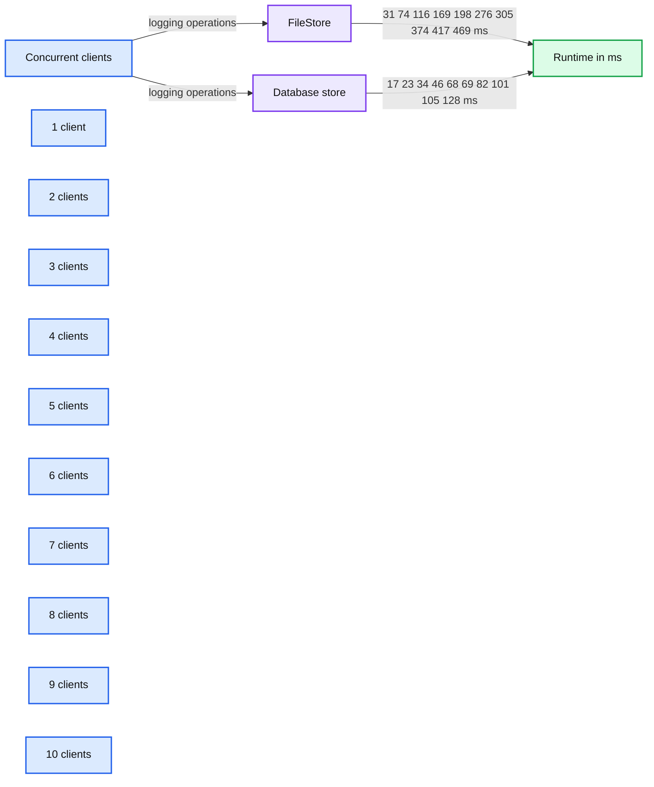

# MLflow v0.9.0 Features SQL Backend, Projects in Docker, and Customization in Python Models

- Source: https://www.databricks.com/blog/2019/03/28/mlflow-v0-9-0-features-sql-backend-projects-in-docker-and-customization-in-python-models.html
- Published: 2019-03-28
- Authors: Sue Ann Hong, Jules Damji
- Categories: engineering, data-science-machine-learning, platform, open-source
- Images: 2 total, 2 extracted as architecture

[Read Rise of the Data Lakehouse](https://www.databricks.com/resources/ebook/rise-data-lakehouse?itm_data=mlflowv090features-blog-riselakehousebook) to explore why lakehouses are the data architecture of the future with the father of the data warehouse, Bill Inmon.

---

[MLflow v0.9.0](https://github.com/mlflow/mlflow/releases/tag/v0.9.0) was released today. It introduces a set of new features and community contributions, including SQL store for tracking server, support for MLflow projects in Docker containers, and simple customization in Python models. Additionally, this release adds a plugin scheme to customize MLflow backend store for tracking and artifacts.

Now available on [PyPi](https://pypi.org/project/mlflow/) and with [docs online](https://mlflow.org/docs/latest/index.html), you can install this new release with `pip install mlflow` as described in the [MLflow quickstart guide](https://mlflow.org/docs/latest/quickstart.html).

In this post, we will elaborate on a set of MLflow v0.9.0 features:

- An efficient SQL compatible backend store for tracking scales experiments in the thousands.
- A plugin scheme for tracking artifacts extends backend store capabilities.
- Ability to run MLflow projects in Docker Containers allows extensibility and stronger isolation during execution.
- Ability to customize Python models injects post and preprocessing logic in a python_func model flavor.

## SQL Backend Store for Tracking

For thousands of MLflow runs and experimental parameters, the default File store tracking server implementation does not scale. Thanks to the community contributions from Anderson Reyes, the [SQLAlchemy](https://www.sqlalchemy.org/) store, an open-source SQL compatible store for Python, addresses this problem, providing scalable and performant store. Compatible with other SQL stores (such as MySQL, PostgreSQL, SQLite, and MS SQL), developers can connect to a local or remote store for persisting their experimental runs, parameters, and artifacts.

### Logging Runtimes Performance

We compared the logging performance of MySQL-based SqlAlchemyStore against FileStore. The setup involved 1000 runs spread over five experiments running on a MacBook Pro with four cores on Intel i7 and 16GB of memory. (In a future blog, we plan to run this benchmark on a large EC2 machine expecting even better performance.)

Measuring logging performance averaging over thousands of operations, we saw about 3X speed-up when using a database-backed store, as shown in Fig.1.

Furthermore, we stress-tested with multiple clients scaling up to 10 concurrent clients logging metrics, params, and tags to the backend store. While both stores show a linear increase in runtimes per operation, the database-backed store continued to scale with large concurrent loads.

*Fig.1 Logging Performance Runtimes*

**Summary:** The chart compares logging runtimes for FileStore and Database store across 1 to 10 concurrent clients.

**Components:**

- FileStore using file-backed storage
- Database store using database-backed storage
- Concurrent clients measured by client count
- Runtime measured in milliseconds

**Flows:**

- Concurrent clients -> FileStore: logging metrics, params, and tags
- Concurrent clients -> Database store: logging metrics, params, and tags
- FileStore -> Runtime measurement: recorded runtime per operation
- Database store -> Runtime measurement: recorded runtime per operation

**Numbers:** Client counts 1, 2, 3, 4, 5, 6, 7, 8, 9, 10. FileStore runtimes 31, 74, 116, 169, 198, 276, 305, 374, 417, 469 ms. Database store runtimes 17, 23, 34, 46, 68, 69, 82, 101, 105, 128 ms. Y-axis values 0, 100, 200, 300, 400, 500 ms. About 3X speed-up.

source image: https://www.databricks.com/wp-content/uploads/2019/03/image3-1.png

Fig.1 Logging Performance Runtimes

### Search Runtime Performance

Performance of Search and Get APIs showed a significant performance boost. The following comparison shows search runtimes for the two store types over an increasing number of runs.

**Summary:** The chart compares FileStore and Database store runtimes across increasing numbers of runs.

**Components:**

- FileStore, file-based backend store
- Database store, database-backed backend store
- Number of runs, workload scale
- Runtime in milliseconds, performance metric

**Flows:**

- none visible

**Numbers:** 10, 100, 200, 300, 400, 500 runs; FileStore runtimes 200, 2384, 4892, 7928, 12113, 15151 ms; Database store runtimes 44, 184, 354, 518, 723, 840 ms; axis values 0, 5000, 10000, 15000, 20000 ms.

```mermaid
%% Chart comparing FileStore and Database store runtimes
xychart-beta
    x-axis "Number of runs" [10, 100, 200, 300, 400, 500]
    y-axis "Runtime in ms" 0 --> 20000
    bar "FileStore" [200, 2384, 4892, 7928, 12113, 15151]
    bar "Database store" [44, 184, 354, 518, 723, 840]
```

source image: https://www.databricks.com/wp-content/uploads/2019/03/image2-2.png

 Fig.2 Search Runtime Performance

For more information about backend store setup and configuration, read the documentation on [Tracking Storage](https://mlflow.org/docs/latest/tracking.html#storage).

## Customized Plugins for Backend Store

Even though the internal MLflow pluggable architecture enables different backends for both tracking and artifact stores, it does not provide an ability to add new providers to plug in handlers for new backends.

A proposal for [MLflow Plugin System](https://gist.github.com/zblz/9e337a55a7ba73314890be68370fa69a) from the community contributors Andrew Crozier and Víctor Zabalza now enables you to register your store handlers with MLflow. This scheme is useful for a few reasons:

- Allows external contributors to package and publish their customized handlers
- Extends tracking capabilities and integration with stores available on other cloud platforms
- Provides an ability to provide a separate plugin for tracking and artifacts if desired

Central to this pluggable scheme is the notion of [entrypoints](https://gist.github.com/zblz/9e337a55a7ba73314890be68370fa69a#using-entrypoints-as-plugin-manager), used effectively in other Python packages, for example, pytest, papermill, click etc. To integrate and provide your MLflow plugin handlers, say for tracking and artifacts, you will need to two class implementations: [*TrackingStoreRegistery*](https://gist.github.com/zblz/9e337a55a7ba73314890be68370fa69a#plugin-system-for-tracking-client) and [*ArtifactStoreRegistery*](https://gist.github.com/zblz/9e337a55a7ba73314890be68370fa69a#plugin-system-for-artifact-store).

For a detail explanation on how to implement, register, and use this pluggable scheme for customizing backend store, read the [proposal and its implementation details](https://gist.github.com/zblz/9e337a55a7ba73314890be68370fa69a).

## Projects in Docker Containers

Besides running MLflow projects within a Conda environment, with the help of community contributor Marcus Rehm, this release extends your ability to run [MLflow projects within a Docker](https://github.com/mlflow/mlflow/tree/master/examples/docker#running-this-example) container. It has three advantages. First, it allows you to capture non-Python dependencies such as Java libraries. Second, it offers stronger isolation while running MLflow projects. And third, it opens avenues for future capabilities to add tools to MLflow for running other dockerized projects, for example, on Kubernetes clusters for scaling.

To run MLflow projects within Docker containers, you need two artifacts: Dockerfile and MLProject file. The [Docker file](https://github.com/mlflow/mlflow/blob/master/examples/docker/Dockerfile) expresses your dependencies how to build a Docker image, while the [MLProject file](https://github.com/mlflow/mlflow/blob/master/examples/docker/MLproject) specifies the Docker image name to use, the entry points, and default parameters to your model.

With two simple commands, you can run your MLflow project in a Docker container and view the runs’ results, as shown in the animation below. Take note that environment variable such as MLFLOW_TRACKING_URI is preserved in the container, so you can view its runs’ metrics in the MLflow UI.

1. `docker build . -t mlflow-docker-example`
2. `mlflow run . -P alpha=0.5`

https://www.youtube.com/watch?v=74HF2CRFY_4

## Simple Python Model Customization

Often, ML developers want to build and deploy models that include custom inference logic (e.g., preprocessing, postprocessing or business logic) and data dependencies. Now you can create custom Python models using new MLflow model APIs.

To build a custom Python model, extend the *mlflow.pyfunc.PythonModel* class:

The *load_context()* method is used to load any artifacts (including other models!) that your model may need in order to make predictions. You define your model’s inference logic by overriding the *predict()* method.

The new custom models documentation demonstrates how PythonModel can be used to save [XGBoost](https://xgboost.readthedocs.io/en/latest/) models with MLflow; check out the [XGBoost example!](https://mlflow.org/docs/latest/models.html#example-saving-an-xgboost-model-in-mlflow-format)

For more information about the new model customization features in MLflow, read the documentation on [customized Python models](https://mlflow.org/docs/latest/models.html#custom-python-models).

## Other Features and Bug Fixes

In addition to these features, several other new pieces of functionality are included in this release. Some items worthy of note are:

### Features

- [CLI] Add CLI commands for runs: now you can list, delete, restore, and describe runs through the CLI (#720, @DorIndivo)
- [CLI] The run command now can take `--experiment-name` as an argument, as an alternative to the `--experiment-id` argument. You can also choose to set the _EXPERIMENT_NAME_ENV_VAR environment variable instead of passing in the value explicitly. (#889, #894, @mparke)
- [R] Support for HTTP authentication to the Tracking Server in the R client. Now you can connect to secure Tracking Servers using credentials set in environment variables, or provide custom plugins for setting the credentials. As an example, this release contains a Databricks plugin that can detect existing Databricks credentials to allow you to connect to the Databricks Tracking Server. (#938, #959, #992, @tomasatdatabricks)
- [Models] PyTorch model persistence improvements to allow persisting definitions and dependencies outside the immediate scope:
  - Add a code_paths parameter to `mlflow.pytorch.save_model()` and `mlflow.pytorch.log_model()` to allow external module dependencies to be specified as paths to python files. (#842, @dbczumar).
  - Improve mlflow.pytorch.save_model to capture class definitions from notebooks and the **main** scope (#851, #861, @dbczumar)

The full list of changes, bug fixes, and contributions from the community can be found in the 0.9.0 Changelog. We welcome more input on [mlflow-users@googlegroups.com](https://groups.google.com/forum/#!forum/mlflow-users) or by [filing issues](https://github.com/databricks/mlflow/pulls) on GitHub. For real-time questions about MLflow, we also offer a [Slack channel](https://mlflow-users.slack.com/join/shared_invite/enQtMzkxMTAwNTcyODM5LTNkNTc5YWZlNDNjMzZiYWJhOTQwMjYwYWE3NDU2YTgzMDViYjJhNWI1MGI4NjViNTA0M2FhMzNhZTVkODE2NmU). Finally, you can follow [@MLflow](https://twitter.com/MLflow) on Twitter for the latest news.

## Credits

We want to thank the following contributors for updates, doc changes, and contributions in MLflow 0.9.0: Aaron Davidson, Ahmad Faiyaz, Anderson Reyes, Andrew Crozier, Corey Zumar, DorIndivo, Dmytro Aleksandrov, Hanyu Cui, Jim Thompson, Kevin Kuo, Kevin Yuen, Matei Zaharia, Marcus Rehm, Mani Parkhe, Maitiú Ó Ciaráin, Mohamed Laradji, Siddharth Murching, Stephanie Bodoff, Sue Ann Hong, Taneli Mielikäinen, Tomas Nykodym, Víctor Zabalza, 4n4nd
