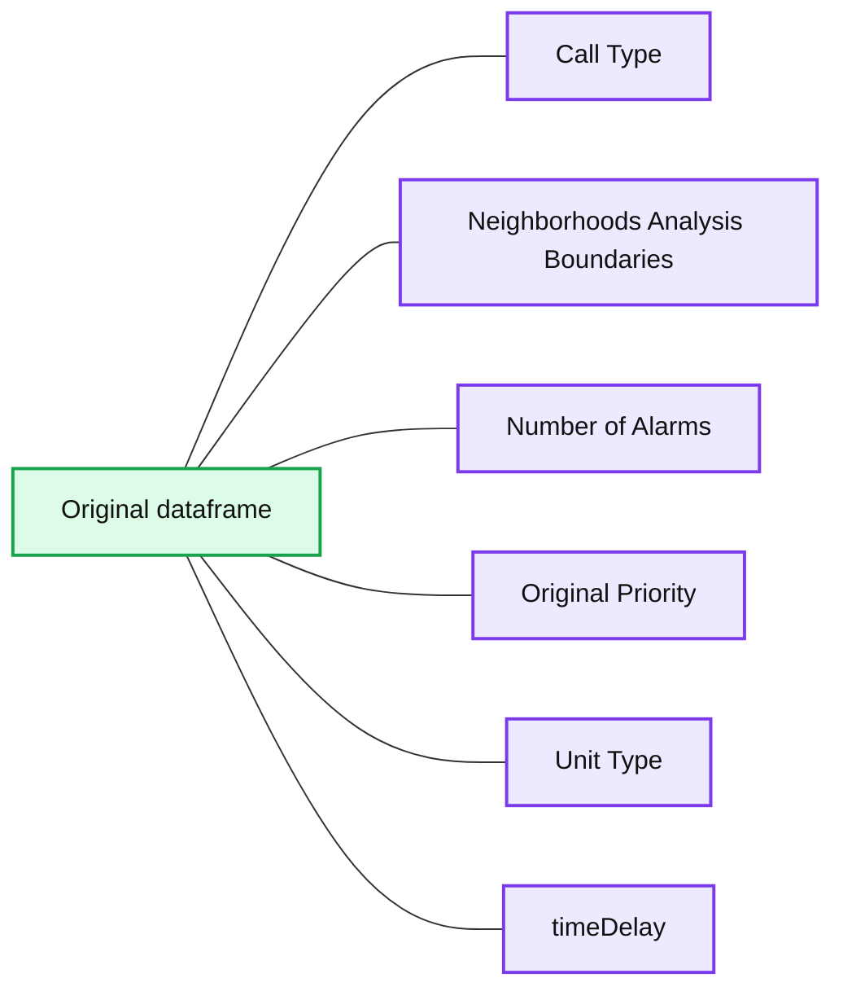

# Koalas: Easy Transition from pandas to Apache Spark

- Source: https://www.databricks.com/blog/2019/04/24/koalas-easy-transition-from-pandas-to-apache-spark.html
- Published: 2019-04-24
- Authors: Tony Liu, Tim Hunter, Cyrielle Simeone
- Categories: solutions, announcements, engineering, data-science-machine-learning, company, news
- Images: 2 total, 1 extracted as architecture

Today at Spark + AI Summit, we announced Koalas, a new open source project that augments PySpark’s DataFrame API to make it compatible with pandas.

Python data science has exploded over the past few years and pandas has emerged as the lynchpin of the ecosystem. When data scientists get their hands on a data set, they use pandas to explore. It is the ultimate tool for data wrangling and analysis. In fact, pandas’ read_csv is often the very first command students run in their data science journey.

The problem? pandas does not scale well to big data. It was designed for small data sets that a single machine could handle. On the other hand, Apache Spark has emerged as the de facto standard for big data workloads. Today many data scientists use pandas for coursework, pet projects, and small data tasks, but when they work with very large data sets, they either have to migrate to PySpark to leverage Spark or downsample their data so that they can use pandas.

Now with Koalas, data scientists can make the transition from a single machine to a distributed environment without needing to learn a new framework. As you can see below, you can scale your pandas code on Spark with Koalas just by replacing one package with the other.

pandas:

Koalas:

## pandas as the standard vocabulary for Python data science

As Python has emerged as the primary language for data science, the community has developed a vocabulary based on the most important libraries, including pandas, matplotlib and numpy. When data scientists are able to use these libraries, they can fully express their thoughts and follow an idea to its conclusion. They can conceptualize something and execute it instantly.

But when they have to work with libraries outside of their vocabulary, they stumble, they check StackOverflow every few minutes, and they have to interrupt their workflow just to get their code to work. Even though PySpark is simple to use and similar in many ways to pandas, it is still a different vocabulary they have to learn.

At Databricks, we believe that enabling pandas on Spark will significantly increase productivity for data scientists and data-driven organizations for several reasons:

- Koalas removes the need to decide whether to use pandas or PySpark for a given data set
- For work that was initially written in pandas for a single machine, Koalas allows data scientists to scale up their code on Spark by simply switching out pandas for Koalas
- Koalas unlocks big data for more data scientists in an organization since they no longer need to learn PySpark to leverage Spark

Below, we show two examples of simple and powerful pandas methods that are straightforward to run on Spark with Koalas.

## Feature engineering with categorical variables

Data scientists often encounter categorical variables when they build ML models. A popular technique is to encode categorical variables as dummy variables. In the example below, there are several categorical variables including call type, neighborhood and unit type. pandas’ get_dummies method is a convenient method that does exactly this. Below we show how to do this with pandas:

*Original dataframe*

**Summary:** Original dataframe showing emergency call records and categorical or numeric fields.

**Components:**

- Call Type
- Neighborhoods Analysis Boundaries
- Number of Alarms
- Original Priority
- Unit Type
- timeDelay

**Flows:**

- none

**Numbers:** 1, 2, 3, 3.75, 1.85, 2.35, 2.666666666666665, 5.616666666666666

source image: https://www.databricks.com/wp-content/uploads/2019/04/image1.png

Original dataframe

New dataframe

Now thanks to Koalas, we can do this on Spark with just a few tweaks:

And that’s it!

## Arithmetic with timestamps

Data scientists work with timestamps all the time but handling them correctly can get really messy. pandas offers an elegant solution. Let’s say you have a DataFrame of dates:

To subtract the start dates from the end dates with pandas, you just run:

Now to do the same thing on Spark, all you need to do is replace pandas with Koalas:

Once again, it’s that simple.

## Next steps and getting started with Koalas

You can watch the official announcement of Koalas by Reynold Xin at Spark + AI Summit:

We created Koalas because we meet a lot of data scientists who are reluctant to work with large data. We believe that Koalas will empower them by making it really easy to scale their work on Spark.

So far, we have implemented common DataFrame manipulation methods, as well as powerful indexing techniques in pandas. Here are some upcoming items in our roadmap, mostly focusing on improving coverage:

- String manipulation for working with [text data](https://pandas.pydata.org/pandas-docs/stable/user_guide/text.html)
- Date/time manipulation for [time series data](https://pandas.pydata.org/pandas-docs/stable/user_guide/timeseries.html)

This initiative is in its early stages but is quickly evolving. If you are interested in learning more about Koalas or getting started, check out [the project’s GitHub repo](https://github.com/databricks/koalas). We welcome your feedback and contributions!
