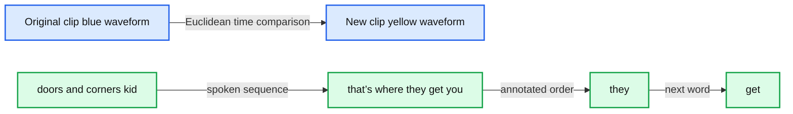
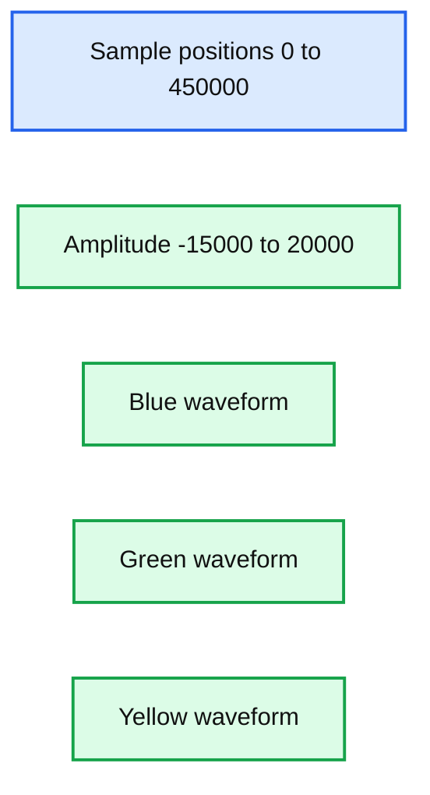

# Understanding Dynamic Time Warping

*Part 1 of our Using Dynamic Time Warping and MLflow to Detect Sales Trends Series*

- Source: https://www.databricks.com/blog/2019/04/30/understanding-dynamic-time-warping.html
- Published: 2019-04-30
- Authors: Ricardo Portilla, Brenner Heintz
- Categories: engineering, company, open-source, news, data-science-machine-learning, platform
- Images: 7 total, 2 extracted as architecture

[Try this notebook in Databricks](https://pages.databricks.com/rs/094-YMS-629/images/dynamic-time-warping-background.html)

This blog is part 1 of our two-part series **Using Dynamic Time Warping and MLflow to Detect Sales Trends**. To go to part 2, go to [Using Dynamic Time Warping and MLflow to Detect Sales Trends](https://www.databricks.com/blog/2019/04/30/using-dynamic-time-warping-and-mlflow-to-detect-sales-trends.html).

---

The phrase “dynamic time warping,” at first read, might evoke images of Marty McFly driving his DeLorean at 88 MPH in the *Back to the Future* series. Alas, dynamic time warping does not involve time travel; instead, it’s a technique used to dynamically compare time series data when the time indices between comparison data points do not sync up perfectly.

As we’ll explore below, one of the most salient uses of dynamic time warping is in speech recognition - determining whether one phrase matches another, even if it the phrase is spoken faster or slower than its comparison. You can imagine that this comes in handy to identify the “wake words” used to activate your Google Home or Amazon Alexa device - even if your speech is slow because you haven’t yet had your daily cup(s) of coffee.

Dynamic time warping is a useful, powerful technique that can be applied across many different domains. Once you understand the concept of dynamic time warping, it’s easy to see examples of its applications in daily life, and its exciting future applications. Consider the following uses:

- *Financial markets* - comparing stock trading data over similar time frames, even if they do not match up perfectly. For example, comparing monthly trading data for February (28 days) and March (31 days).
- *Wearable fitness trackers* - more accurately calculating a walker’s speed and the number of steps, even if their speed varied over time.
- *Route calculation* - calculating more accurate information about a driver’s ETA, if we know something about their driving habits (for example, they drive quickly on straightaways but take more time than average to make left turns).

Data scientists, data analysts, and anyone working with time series data should become familiar with this technique, given that perfectly aligned time-series comparison data can be as rare to see in the wild as perfectly “tidy” data.

In this blog series, we will explore:

- The basic principles of dynamic time warping
- Running dynamic time warping on sample audio data
- Running dynamic time warping on sample sales data using MLflow

## Dynamic Time Warping

The objective of time series comparison methods is to produce a *distance metric* between two input time series. The similarity or dissimilarity of two-time series is typically calculated by converting the data into vectors and calculating the Euclidean distance between those points in vector space.

Dynamic time warping is a seminal time series comparison technique that has been used for speech and word recognition since the 1970s with sound waves as the source; an often cited paper is [Dynamic time warping for isolated word recognition based on ordered graph searching techniques](https://ieeexplore.ieee.org/document/1171695).

### Background

This technique can be used not only for pattern matching, but also anomaly detection (e.g. overlap time series between two disjoint time periods to understand if the shape has changed significantly, or to examine outliers). For example, when looking at the red and blue lines in the following graph, note the traditional time series matching (i.e. Euclidean Matching) is extremely restrictive. On the other hand, dynamic time warping allows the two curves to match up evenly even though the X-axes (i.e. time) are not necessarily in sync.  Another way is to think of this is as a robust dissimilarity score where a lower number means the series is more similar.

Source: Wiki Commons: [File:Euclidean_vs_DTW.jpg](https://commons.wikimedia.org/wiki/File:Euclidean_vs_DTW.jpg)

Two-time series (the base time series and new time series) are considered similar when it is possible to map with function f(x) according to the following rules so as to match the magnitudes using an optimal (warping) path.

### Sound pattern matching

Traditionally, dynamic time warping is applied to audio clips to determine the similarity of those clips.  For our example, we will use four different audio clips based on two different quotes from a TV show called [The Expanse](https://www.imdb.com/title/tt3230854/). There are four audio clips (you can listen to them below but this is not necessary) - three of them (clips 1, 2, and 4) are based on the quote:

> “Doors and corners, kid. That's where they get you.”

and one clip (clip 3) is the quote

> “You walk into a room too fast, the room eats you.”

| Doors and Corners, Kid. That's where they get you. [v1] | Doors and Corners, Kid. That's where they get you. [v2] |
|---|---|
| You walk into a room too fast, the room eats you. | Doors and Corners, Kid. That's where they get you [v3] |

Quotes are from [The Expanse](https://www.amazon.com/The-Expanse-Season-1/dp/B018BZ3SCM)

Below are visualizations using `matplotlib` of the four audio clips:

- **Clip 1**: This is our base time series based on the quote “*Doors and corners, kid. That's where they get you”*.
- **Clip 2**: This is a new time series [v2] based on clip 1 where the intonation and speech pattern is extremely exaggerated.
- **Clip 3**: This is another time series that's based on the quote *“You walk into a room too fast, the room eats you.”* with the same intonation and speed as Clip 1.
- **Clip 4**: This is a new time series [v3] based on clip 1 where the intonation and speech pattern is similar to clip 1.

The code to read these audio clips and visualize them using matplotlib can be summarized in the following code snippet.

The full code-base can be found in the notebook [Dynamic Time Warping Background](https://pages.databricks.com/rs/094-YMS-629/images/dynamic-time-warping-background.html).

As noted below, when the two clips (in this case, clips 1 and 4) have different intonations (amplitude) and latencies for the same quote.

If we were to follow a traditional Euclidean matching (per the following graph), even if we were to discount the amplitudes, the timings between the original clip (blue) and the new clip (yellow) do not match.

**Summary:** The chart compares two audio waveforms using Euclidean matching, showing misaligned timing for corresponding spoken words.

**Components:**

- Euclidean Matching
- Original clip blue waveform
- New clip yellow waveform
- Spoken labels doors, and, corners, kid, that’s, where, they, get, you

**Flows:**

- Original clip blue waveform -> New clip yellow waveform: Euclidean time comparison
- they -> get: Annotated word sequence

**Numbers:** none

source image: https://www.databricks.com/wp-content/uploads/2019/04/euclidean-matching.png

With dynamic time warping, we can shift time to allow for a time series comparison between these two clips.

For our time series comparison, we will use the `[fastdtw](https://pypi.org/project/fastdtw/)` PyPi library; the instructions to install PyPi libraries within your Databricks workspace can be found here: [Azure](https://docs.microsoft.com/en-us/azure/databricks/libraries/#pypi-libraries) | [AWS](https://docs.databricks.com/libraries/index.html#pypi-libraries).  By using fastdtw, we can quickly calculate the distance between the different time series.

The full code-base can be found in the notebook [Dynamic Time Warping Background](https://pages.databricks.com/rs/094-YMS-629/images/dynamic-time-warping-background.html).

| Base | Query | Distance |
|---|---|---|
| Clip 1 | Clip 2 | 480148446.0 |
|  | Clip 3 | 310038909.0 |
|  | Clip 4 | 293547478.0 |

 

**Summary:** The chart compares three overlaid audio waveforms across sample positions from 0 to 450000.

**Components:**

- Horizontal sample axis, technology not indicated
- Vertical amplitude axis, technology not indicated
- Blue waveform, clip identity not labeled
- Green waveform, clip identity not labeled
- Yellow waveform, clip identity not labeled

**Flows:**

- None visible

**Numbers:** 0, 50000, 100000, 150000, 200000, 250000, 300000, 350000, 400000, 450000, -15000, -10000, -5000, 0, 5000, 10000, 15000, 20000

source image: https://www.databricks.com/wp-content/uploads/2019/04/dtw-clip1-clip4.png

Some quick observations:

- As noted in the preceding graph, Clips 1 and 4 have the shortest distance as the audio clips have the same words and intonations
- The distance between Clips 1 and 3 is also quite short (though longer than when compared to Clip 4) even though they have different words, they are using the same intonation and speed.
- Clips 1 and 2 have the longest distance due to the extremely exaggerated intonation and speed even though they are using the same quote.

As you can see, with dynamic time warping, one can ascertain the similarity of two different time series.

## Next

Now that we have discussed dynamic time warping, let's apply this use case to [detect sales trends](https://www.databricks.com/blog/2019/04/30/using-dynamic-time-warping-and-mlflow-to-detect-sales-trends.html).
