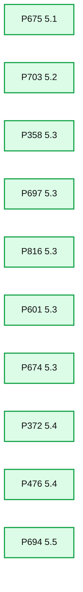
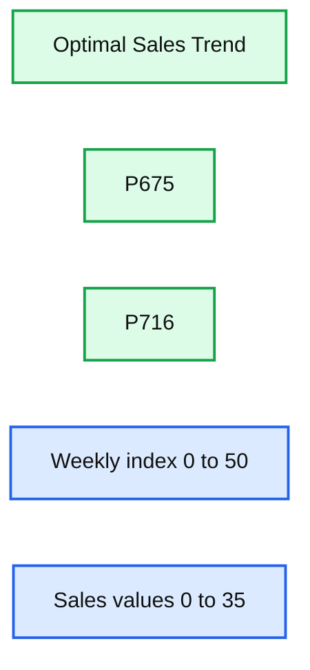
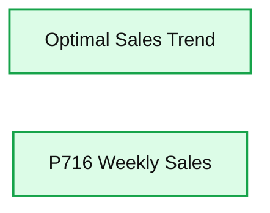

# Using Dynamic Time Warping and MLflow to Detect Sales Trends

- Source: https://www.databricks.com/blog/2019/04/30/using-dynamic-time-warping-and-mlflow-to-detect-sales-trends.html
- Published: 2019-04-30
- Authors: Ricardo Portilla, Brenner Heintz
- Categories: platform, engineering, open-source, data-science-machine-learning, company, news
- Images: 7 total, 6 extracted as architecture

[Try this notebook series (in DBC format) in Databricks](https://pages.databricks.com/rs/094-YMS-629/images/dtw-mlflow-sales.zip)

This blog is part 2 of our two-part series **Using Dynamic Time Warping and MLflow to Detect Sales Trends**.

---

The phrase "dynamic time warping," at first read, might evoke images of Marty McFly driving his DeLorean at 88 MPH in the *Back to the Future* series. Alas, dynamic time warping does not involve time travel; instead, it's a technique used to dynamically compare time series data when the time indices between comparison data points do not sync up perfectly.

As we'll explore below, one of the most salient uses of dynamic time warping is in speech recognition – determining whether one phrase matches another, even if the phrase is spoken faster or slower than its comparison. You can imagine that this comes in handy to identify the "wake words" used to activate your Google Home or Amazon Alexa device – even if your speech is slow because you haven't yet had your daily cup(s) of coffee.

Dynamic time warping is a useful, powerful technique that can be applied across many different domains. Once you understand the concept of dynamic time warping, it's easy to see examples of its applications in daily life, and its exciting future applications. Consider the following uses:

- *Financial markets* – comparing stock trading data over similar time frames, even if they do not match up perfectly. For example, comparing monthly trading data for February (28 days) and March (31 days).
- *Wearable fitness trackers* – more accurately calculating a walker's speed and the number of steps, even if their speed varied over time.
- *Route calculation* – calculating more accurate information about a driver's ETA, if we know something about their driving habits (for example, they drive quickly on straightaways but take more time than average to make left turns).

Data scientists, data analysts, and anyone working with time series data should become familiar with this technique, given that perfectly aligned time-series comparison data can be as rare to see in the wild as perfectly "tidy" data.

In this blog series, we will explore:

- The basic principles of dynamic time warping
- Running dynamic time warping on sample audio data
- Running dynamic time warping on sample sales data using MLflow

For more background on dynamic time warping, refer to the previous post [Understanding Dynamic Time Warping](https://www.databricks.com/blog/2019/04/30/understanding-dynamic-time-warping.html).

## Background

Imagine that you own a company that creates 3D printed products. Last year, you knew that drone propellers were showing very consistent demand, so you produced and sold those, and the year before you sold phone cases. **The new year is arriving very soon, and you're sitting down with your manufacturing team to figure out what your company should produce for next year. **Buying the 3D printers for your warehouse put you deep into debt, so you have to make sure that your printers are running at or near 100% capacity at all times in order to make the payments on them.

Since you're a wise CEO, you know that your production capacity over the next year will ebb and flow - there will be some weeks when your production capacity is higher than others. For example, your capacity might be higher during the summer (when you hire seasonal workers), and lower during the 3rd week of every month (because of issues with the 3D printer filament supply chain). Take a look at the chart below to see your company's production capacity estimate:

**Summary:** Line chart showing optimal weekly product sales across 51 weeks.

**Components:**

- Optimal Weekly Product Sales chart
- Week horizontal axis
- Sales vertical axis
- Weekly sales line with data markers

**Flows:**

- none

**Numbers:** 0, 5, 10, 15, 20, 25, 30, 35, 40, 50, 51


<sub>source image: https://www.databricks.com/wp-content/uploads/2019/04/dtw_optimal-weekly-product-sales.png</sub>

**Your job is to choose a product for which weekly demand meets your production capacity as closely as possible.** You're looking over a catalog of products which includes last year's sales numbers for each product, and you think this year's sales will be similar.

If you choose a product with weekly demand that exceeds your production capacity, then you'll have to cancel customer orders, which isn't good for business. On the other hand, if you choose a product without enough weekly demand, you won't be able to keep your printers running at full capacity and may fail to make the debt payments.

**Dynamic time warping comes into play here because sometimes supply and demand for the product you choose will be slightly out of sync.** There will be some weeks when you simply don't have enough capacity to meet all of your demand, but as long as you're very close and you can make up for it by producing more products in the week or two before or after, your customers won't mind. If we limited ourselves to comparing the sales data with our production capacity using Euclidean Matching, we might choose a product that didn't account for this, and leave money on the table. Instead, we'll use dynamic time warping to choose the product that's right for your company this year.

## Load the product sales data set

We will use the weekly sales transaction data set found in the [UCI Dataset Repository](https://archive.ics.uci.edu/ml/index.php) to perform our sales-based time series analysis. (Source Attribution: James Tan, jamestansc '@' suss.edu.sg, Singapore University of Social Sciences)

**Summary:** A weekly product sales table showing unit sales for products P1 through P8 across weeks W0 through W13.

**Components:**

- Product_Code: product identifiers P1 through P8.
- Weekly sales columns: W0 through W13.
- Sales values: units sold per product per week.

**Flows:**

- none

**Numbers:**

- Products: P1, P2, P3, P4, P5, P6, P7, P8
- Weeks: W0, W1, W2, W3, W4, W5, W6, W7, W8, W9, W10, W11, W12, W13
- Sales values by product:
  - P1: 11, 12, 10, 8, 13, 12, 14, 21, 6, 14, 11, 14, 16, 9
  - P2: 7, 6, 3, 2, 7, 1, 6, 3, 3, 3, 2, 2, 6, 2
  - P3: 7, 11, 8, 9, 10, 8, 7, 13, 12, 6, 14, 9, 4, 7
  - P4: 12, 8, 13, 5, 9, 6, 9, 13, 13, 11, 8, 4, 5, 4
  - P5: 8, 5, 13, 11, 6, 7, 9, 14, 9, 9, 11, 18, 8, 4
  - P6: 3, 3, 2, 7, 6, 3, 8, 6, 6, 3, 1, 1, 5, 4
  - P7: 4, 8, 3, 7, 8, 7, 2, 3, 10, 3, 5, 2, 3, 4
  - P8: 8, 6, 10, 9, 6, 8, 7, 5, 10, 10, 8, 8, 15, 9

```text
%% mermaid failed to render; kept as text
%% Shows the product sales table and its weekly sales fields
flowchart LR
    A[Product code]
    B[Products P1 to P8]
    C[Weeks W0 to W13]
    D[Weekly unit sales]
    E[Sales values]

    classDef client fill:#dbeafe,stroke:#2563eb,stroke-width:2px,color:#111
    classDef service fill:#dcfce7,stroke:#16a34a,stroke-width:2px,color:#111
    classDef store fill:#ede9fe,stroke:#7c3aed,stroke-width:2px,color:#111
    classDef cache fill:#fef3c7,stroke:#d97706,stroke-width:2px,color:#111
    classDef queue fill:#cffafe,stroke:#0891b2,stroke-width:2px,color:#111
    classDef critical fill:#fee2e2,stroke:#dc2626,stroke-width:4px,color:#111
    classDef external fill:#e5e7eb,stroke:#6b7280,stroke-width:2px,color:#111,stroke-dasharray:4 3
    classDef decision fill:#fce7f3,stroke:#db2777,stroke-width:2px,color:#111
    client = clients edge gateway LB
    service = stateless compute
    store = databases durable storage
    cache = Redis CDN anything losable
    queue = Kafka streams async pipes
    critical = bottleneck or SPOF
    external = third party
    decision = trade off point

    class A,B client
    class C,D service
    class E store
```

<sub>source image: https://www.databricks.com/wp-content/uploads/2019/04/dtw_data_display.png</sub>

Each product is represented by a row, and each week in the year is represented by a column. Values represent the number of units of each product sold per week. There are 811 products in the data set.

## Calculate distance to optimal time series by product code

Using the calculated dynamic time warping 'distances' column, we can view the distribution of DTW distances in a histogram.

**Summary:** Histogram showing the distribution of pairwise product-sales DTW distances.

**Components:**

- DTW distance histogram
- Distances x-axis
- Counts y-axis

**Flows:**

- Distances -> Counts: histogram frequency distribution

**Numbers:** 0, 5, 6, 7, 8, 9, 10, 11, 20, 30, 40, 50, 60, 70, 80, 90

```mermaid
%% Shows the DTW distance frequency distribution
flowchart LR
    D[Distances from 5 to 11] -->|frequency bins| H[DTW distance histogram]
    H -->|counts from 0 to 90| C[Counts]

    classDef client   fill:#dbeafe,stroke:#2563eb,stroke-width:2px,color:#111
    classDef service  fill:#dcfce7,stroke:#16a34a,stroke-width:2px,color:#111
    classDef store    fill:#ede9fe,stroke:#7c3aed,stroke-width:2px,color:#111
    classDef cache    fill:#fef3c7,stroke:#d97706,stroke-width:2px,color:#111
    classDef queue    fill:#cffafe,stroke:#0891b2,stroke-width:2px,color:#111
    classDef critical fill:#fee2e2,stroke:#dc2626,stroke-width:4px,color:#111
    classDef external fill:#e5e7eb,stroke:#6b7280,stroke-width:2px,color:#111,stroke-dasharray:4 3
    classDef decision fill:#fce7f3,stroke:#db2777,stroke-width:2px,color:#111

    class D client
    class H service
    class C store
```



<sub>source image: https://www.databricks.com/wp-content/uploads/2019/04/dtw_distance_pairwise_product_sales.png</sub>

From there, we can identify the product codes closest to the optimal sales trend (i.e., those that have the smallest calculated DTW distance). Since we're using Databricks, we can easily make this selection using a SQL query. Let's display those that are closest.

**Summary:** Bar chart showing DTW distance by product code, with distances increasing from P675 to P694.

**Components:**

- P675 bar, DTW distance approximately 5.1
- P703 bar, DTW distance approximately 5.2
- P358 bar, DTW distance approximately 5.3
- P697 bar, DTW distance approximately 5.3
- P816 bar, DTW distance approximately 5.3
- P601 bar, DTW distance approximately 5.3
- P674 bar, DTW distance approximately 5.3
- P372 bar, DTW distance approximately 5.4
- P476 bar, DTW distance approximately 5.4
- P694 bar, DTW distance approximately 5.5

**Flows:**

- none

**Numbers:** 0.00, 0.50, 1.00, 1.50, 2.0, 2.5, 3.0, 3.5, 4.0, 4.5, 5.0, 5.5, 6.0, 675, 703, 358, 697, 816, 601, 674, 372, 476, 694, approximately 5.1, 5.2, 5.3, 5.4, 5.5



<sub>source image: https://www.databricks.com/wp-content/uploads/2019/04/dtw_distance-vs-pcode.png</sub>

After running this query, along with the corresponding query for the product codes that are *furthest* from the optimal sales trend, we were able to identify the 2 products that are closest and furthest from the trend. Let's plot both of those products and see how they differ.

**Summary:** The chart compares weekly optimal sales trends with products P675 and P716.

**Components:**

- Optimal Sales Trend - sales trend series
- P675 - product sales series
- P716 - product sales series
- Weekly index axis - weeks 0 through 50
- Sales axis - values 0 through 35

**Flows:**

- none

**Numbers:** 675, 716, 0, 5, 10, 15, 20, 25, 30, 35, 50



<sub>source image: https://www.databricks.com/wp-content/uploads/2019/04/dtw_compare_optimal_vs.png</sub>

As you can see, Product #675 (shown in the orange triangles) represents the best match to the optimal sales trend, although the absolute weekly sales are lower than we'd like (we'll remedy that later). This result makes sense since we'd expect the product with the closest DTW distance to have peaks and valleys that somewhat mirror the metric we're comparing it to. (Of course, the exact time index for the product would vary on a week-by-week basis due to dynamic time warping). Conversely, Product #716 (shown in the green stars) is the product with the worst match, showing almost no variability.

## Finding the optimal product: Small DTW distance and similar absolute sales numbers

Now that we've developed a list of products that are closest to our factory's projected output (our "optimal sales trend"), we can filter them down to those that have small DTW distances as well as similar absolute sales numbers. One good candidate would be Product #202, which has a DTW distance of 6.86 versus the population median distance of 7.89 and tracks our optimal trend very closely.

**Summary:** Line chart comparing the optimal sales trend with weekly sales for product P716, identified as a candidate for product P2.

**Components:**

- Optimal Sales Trend
- P716 weekly sales
- Weekly time axis
- Sales value axis

**Flows:**

- No arrows are visible.

**Numbers:** 0, 10, 20, 30, 40, 50, 60, P2, P716



<sub>source image: https://www.databricks.com/wp-content/uploads/2019/04/dtw_compare-weekly-sales-p2.png</sub>

## Using MLflow to track best and worst products, along with artifacts

[MLflow](https://mlflow.org/) is an open source platform for managing the machine learning lifecycle, including experimentation, reproducibility, and deployment. **Databricks notebooks offer a fully integrated MLflow environment, allowing you to create experiments, log parameters and metrics, and save results.** For more information about getting started with MLflow, take a look at the excellent [documentation](https://www.mlflow.org/docs/latest/index.html).

**MLflow's design is centered around the ability to log all of the inputs and outputs of each experiment we do in a systematic, reproducible way.** On every pass through the data, known as a "Run," we're able to log our experiment's:

- **Parameters** - the inputs to our model.
- **Metrics** - the output of our model, or measures of our model's success.
- **Artifacts** - any files created by our model - for example, PNG plots or CSV data output.
- **Models** - the model itself, which we can later reload and use to serve predictions.

In our case, we can use it to run the dynamic time warping algorithm several times over our data while changing the "stretch factor,'' the maximum amount of warp that can be applied to our time series data. To initiate an MLflow experiment, and allow for easy logging using `mlflow.log_param()`, `mlflow.log_metric()`,  `mlflow.log_artifact()`, and `mlflow.log_model()`, we wrap our main function using:

as shown in the abbreviated code below.

With each run through the data, we've created a log of the "stretch factor" parameter being used, and a log of products we classified as being outliers based upon the Z-score of the DTW distance metric. We were even able to save an artifact (file) of a histogram of the DTW distances. **These experimental runs are saved locally on Databricks and remain accessible in the future if you decide to view the results of your experiment at a later date.**

Now that MLflow has saved the logs of each experiment, we can go back through and examine the results. From your Databricks notebook, select the 

 icon in the upper right-hand corner to view and compare the results of each of our runs.

https://www.youtube.com/watch?v=62PAPZo-2ZU

Not surprisingly, as we increase our "stretch factor," our distance metric decreases. Intuitively, this makes sense: as we give the algorithm more flexibility to warp the time indices forward or backward, it will find a closer fit for the data. In essence, we've traded some bias for variance.

## Logging Models in MLflow

MLflow has the ability to not only log experiment parameters, metrics, and artifacts (like plots or CSV files), but also to log machine learning models. An MLflow Model is simply a folder that is structured to conform to a consistent API, ensuring compatibility with other MLflow tools and features. This interoperability is very powerful, allowing any Python model to be rapidly deployed to many different types of production environments.

**MLflow comes pre-loaded with a number of common model "flavors" for many of the most popular machine learning libraries**, including scikit-learn, Spark MLlib, PyTorch, TensorFlow, and others. These model flavors make it trivial to log and reload models after they are initially constructed, as demonstrated in this [blog post](https://www.databricks.com/blog/2018/09/21/how-to-use-mlflow-to-reproduce-results-and-retrain-saved-keras-ml-models.html). For example, when using MLflow with scikit-learn, logging a model is as easy as running the following code from within an experiment:

**MLflow also offers a "Python function" flavor, which allows you to save any model from a third-party library (such as XGBoost, or spaCy), or even a simple Python function itself, as an MLflow model.** Models created using the Python function flavor live within the same ecosystem and are able to interact with other MLflow tools through the Inference API. Although it's impossible to plan for every use case, the Python function model flavor was designed to be as universal and flexible as possible. It allows for custom processing and logic evaluation, which can come in handy for ETL applications. Even as more "official" Model flavors come online, the generic Python function flavor will still serve as an important "catch all," providing a bridge between Python code of any kind and MLflow's robust tracking toolkit.

Logging a Model using the Python function flavor is a straightforward process. **Any model or function can be saved as a Model, with one requirement: it must take in a [pandas Dataframe](https://www.databricks.com/glossary/pandas-dataframe) as input, and return a DataFrame or NumPy array.** Once that requirement is met, saving your function as an MLflow Model involves defining a Python class that inherits from PythonModel, and overriding the `.predict()` method with your custom function, as described [here](https://www.mlflow.org/docs/latest/python_api/mlflow.pyfunc.html#creating-custom-pyfunc-models).

## Loading a logged model from one of our runs

Now that we've run through our data with several different stretch factors, the natural next step is to examine our results and look for a model that did particularly well according to the metrics that we've logged. **MLflow makes it easy to then reload a logged model, and use it to make predictions on new data, using the following instructions:**

1. Click on the link for the run you'd like to load our model from.
2. Copy the 'Run ID'.
3. Make note of the name of the folder the model is stored in. In our case, it's simply named "model."
4. Enter the model folder name and Run ID as shown below:

To show that our model is working as intended, we can now load the model and use it to measure DTW distances on two new products that we've created within the variable `new_sales_units`:

## Next steps

As you can see, our MLflow Model is predicting new and unseen values with ease. And since it conforms to the Inference API, we can deploy our model on any serving platform (such as [Microsoft Azure ML](https://mlflow.org/docs/latest/models.html#deploy-a-python-function-model-on-microsoft-azure-ml), or [Amazon Sagemaker](https://mlflow.org/docs/latest/models.html#deploy-a-python-function-model-on-amazon-sagemaker)), deploy it as a [local REST API endpoint](https://mlflow.org/docs/latest/models.html#deploy-a-python-function-model-as-a-local-rest-api-endpoint), or [create a user-defined function (UDF)](https://mlflow.org/docs/latest/models.html#export-a-python-function-model-as-an-apache-spark-udf) that can easily be used with Spark-SQL.    In closing, we demonstrated how we can use dynamic time warping to predict sales trends using the Databricks [Unified Analytics Platform.](https://www.databricks.com/product/data-lakehouse)  Try out the [Using Dynamic Time Warping and MLflow to Predict Sales Trends](https://pages.databricks.com/rs/094-YMS-629/images/dtw-mlflow-sales.zip) notebook with [Databricks Runtime for Machine Learning](https://www.databricks.com/blog/2018/06/05/announcing-databricks-runtime-for-machine-learning.html) today.
