# Detecting Financial Fraud at Scale with Decision Trees and MLflow on Databricks

- Source: https://www.databricks.com/blog/2019/05/02/detecting-financial-fraud-at-scale-with-decision-trees-and-mlflow-on-databricks.html
- Published: 2019-05-02
- Authors: Elena Boiarskaia, Navin Albert, Denny Lee
- Categories: platform, engineering, open-source, data-science-machine-learning, company, news
- Images: 14 total, 13 extracted as architecture

[Try this notebook in Databricks](https://notebooks.databricks.com/notebooks/FSI/fraud_orchestration/index.html)

Detecting fraudulent patterns at scale using artificial intelligence is a challenge, no matter the use case. The massive amounts of historical data to sift through, the complexity of the constantly evolving machine learning and deep learning techniques, and the very small number of actual examples of fraudulent behavior are comparable to finding a needle in a haystack while not knowing what the needle looks like. In the financial services industry, the added concerns with security and the importance of explaining how fraudulent behavior was identified further increases the complexity of the task.

**Summary:** The diagram shows domain experts encoding fraud-detection rules and illustrates how adding another data source makes the rules brittle.

**Components:**

- Source data, shown as database icons
- Domain experts, shown as people icons
- Fraud-detection rule code
- Detection output, shown as checklist icons
- Rule failure, shown as a red X

**Flows:**

- none visible

**Numbers:** 56900, 105, 12, 1160000, 1, 0

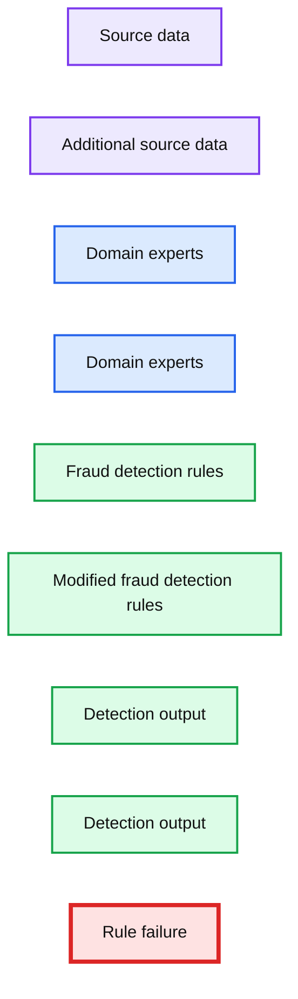

source image: https://www.databricks.com/wp-content/uploads/2019/04/financial-rules-brittle.png

To build these detection patterns, a team of domain experts comes up with a set of rules based on how fraudsters typically behave. A workflow may include a subject matter expert in the financial fraud detection space putting together a set of requirements for a particular behavior. A data scientist may then take a subsample of the available data and select a set of deep learning or machine learning algorithms using these requirements and possibly some known fraud cases. To put the pattern in production, a data engineer may convert the resulting model to a set of rules with thresholds, often implemented using SQL.

This approach allows the financial institution to present a clear set of characteristics that led to the identification of a fraudulent transaction that is compliant with the General Data Protection Regulation ([GDPR](https://en.wikipedia.org/wiki/General_Data_Protection_Regulation)). However, this approach also poses numerous difficulties. The implementation of a fraud detection system using a hardcoded set of rules is very brittle. Any changes to the fraud patterns would take a very long time to update. This, in turn, makes it difficult to keep up with and adapt to the shift in fraudulent activities that are happening in the current marketplace.

**Summary:** Three siloed compartments containing user icons are separated by blocked communication links.

**Components:**

- Left siloed compartment: technology unspecified
- Middle siloed compartment: technology unspecified
- Right siloed compartment: technology unspecified

**Flows:**

- Left silo -> Middle silo: bidirectional communication blocked
- Middle silo -> Right silo: bidirectional communication blocked

**Numbers:** none

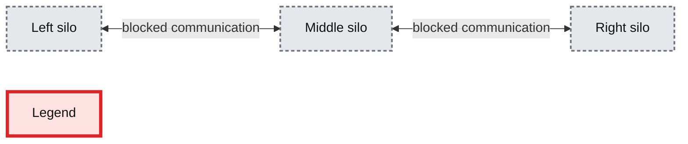

source image: https://www.databricks.com/wp-content/uploads/2019/04/siloed-without-databricks.png

Additionally, the systems in the workflow described above are often siloed, with the domain experts, data scientists, and data engineers all compartmentalized. The data engineer is responsible for maintaining massive amounts of data and translating the work of the domain experts and data scientists into production level code. Due to a lack of common platform, the domain experts and data scientists have to rely on sampled down data that fits on a single machine for analysis. This leads to difficulty in communication and ultimately a lack of collaboration.

In this blog, we will showcase how to convert several such rule-based detection use cases to machine learning use cases on the Databricks platform, unifying the key players in fraud detection: domain experts, data scientists, and data engineers. We will learn how to create a machine learning fraud detection data pipeline and visualize the data in real-time leveraging a framework for building modular features from large data sets. We will also learn how to detect fraud using decision trees and Apache Spark MLlib. We will then use MLflow to iterate and refine the model to improve its accuracy.

### Solving with Machine Learning

There is a certain degree of reluctance with regard to machine learning models in the financial world as they are believed to offer a "black box" solution with no way of justifying the identified fraudulent cases. GDPR requirements, as well as financial regulations, make it seemingly impossible to leverage the power of data science. However, several successful use cases have shown that applying machine learning to detect fraud at scale can solve a host of the issues mentioned above.

**Summary:** Databricks Unified Analytics Platform connects financial data through data engineering, analytics, and machine learning using Databricks Notebooks.

**Components:**

- Financial Data - technology not specified
- Databricks Unified Analytics Platform - Databricks platform
- Databricks Notebooks - Databricks notebooks
- Data Engineering - technology not specified
- Data Analytics - technology not specified
- Machine Learning - technology not specified
- Integration w Data Sources - technology not specified
- Integrated Workspace - technology not specified
- Data Democratization - technology not specified

**Flows:**

- Financial Data -> Data Engineering: financial data
- Data Engineering -> Data Analytics: engineered data
- Data Analytics -> Machine Learning: analytical outputs

**Numbers:** none

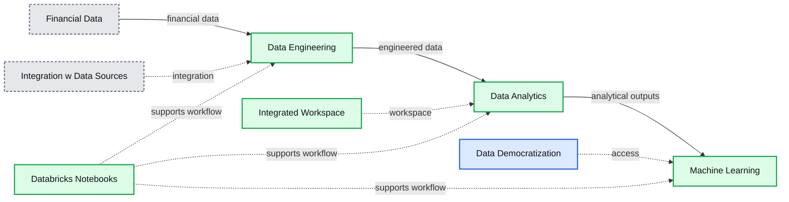

source image: https://www.databricks.com/wp-content/uploads/2019/04/financial-fraud-db-architecture.png

 

Training a supervised machine learning model to detect financial fraud is very difficult due to the low number of actual confirmed examples of fraudulent behavior. However, the presence of a known set of rules that identify a particular type of fraud can help create a set of synthetic labels and an initial set of features. The output of the detection pattern that has been developed by the domain experts in the field has likely gone through the appropriate approval process to be put in production. It produces the expected fraudulent behavior flags and may, therefore, be used as a starting point to train a machine learning model. This simultaneously mitigates three concerns:

1. The lack of training labels,
2. The decision of what features to use,
3. Having an appropriate benchmark for the model.

Training a machine learning model to recognize the rule-based fraudulent behavior flags offers a direct comparison with the expected output via a confusion matrix. Provided that the results closely match the rule-based detection pattern, this approach helps gain confidence in machine learning based fraud prevention with the skeptics. The output of this model is very easy to interpret and may serve as a baseline discussion of the expected false negatives and false positives when compared to the original detection pattern.

Furthermore, the concern with machine learning models being difficult to interpret may be further assuaged if a decision tree model is used as the initial machine learning model. Because the model is being trained to a set of rules, the decision tree is likely to outperform any other machine learning model. The additional benefit is, of course, the utmost transparency of the model, which will essentially show the decision-making process for fraud, but without human intervention and the need to hard code any rules or thresholds. Of course, it must be understood that the future iterations of the model may utilize a different algorithm altogether to achieve maximum accuracy. The transparency of the model is ultimately achieved by understanding the features that went into the algorithm. Having interpretable features will yield interpretable and defensible model results.

The biggest benefit of the machine learning approach is that after the initial modeling effort, future iterations are modular and updating the set of labels, features, or model type is very easy and seamless, reducing the time to production. This is further facilitated on the Databricks Unified Analytics Platform where the domain experts, data scientists, data engineers may work off the same data set at scale and collaborate directly in the notebook environment. So let's get started!

## Ingesting and Exploring the Data

We will use a synthetic dataset for this example. To load the dataset yourself, [please download it](https://www.kaggle.com/)to your local machine from Kaggle and then import the data via Import Data - [Azure](https://docs.microsoft.com/en-us/azure/databricks/data/data#import-data) and [AWS](https://docs.databricks.com/data/data.html#import-data)

The PaySim data simulates mobile money transactions based on a sample of real transactions extracted from one month of financial logs from a mobile money service implemented in an African country. The below table shows the information that the data set provides:

**Summary:** A schema table describing the fields provided by the PaySim financial transaction dataset.

**Components:**

- step - PaySim dataset field; time-step information
- type - PaySim dataset field; transaction category
- amount - PaySim dataset field; transaction value
- nameOrig - PaySim dataset field; originating customer
- oldbalanceOrg - PaySim dataset field; original customer balance
- newbalanceOrig - PaySim dataset field; resulting customer balance
- nameDest - PaySim dataset field; recipient customer
- oldbalanceDest - PaySim dataset field; original recipient balance
- newbalanceDest - PaySim dataset field; resulting recipient balance

**Flows:**

- none

**Numbers:** 1, 1 hour, 744, 30 days, M

```mermaid
%% PaySim transaction dataset schema
flowchart TD
  step["step - unit of time"]
  type["type - transaction category"]
  amount["amount - local currency amount"]
  nameOrig["nameOrig - originating customer"]
  oldbalanceOrg["oldbalanceOrg - balance before transaction"]
  newbalanceOrig["newbalanceOrig - balance after transaction"]
  nameDest["nameDest - recipient customer"]
  oldbalanceDest["oldbalanceDest - recipient balance before transaction"]
  newbalanceDest["newbalanceDest - recipient balance after transaction"]

  classDef client fill:#dbeafe,stroke:#2563eb,stroke-width:2px,color:#111
  classDef service fill:#dcfce7,stroke:#16a34a,stroke-width:2px,color:#111
  classDef store fill:#ede9fe,stroke:#7c3aed,stroke-width:2px,color:#111
  classDef cache fill:#fef3c7,stroke:#d97706,stroke-width:2px,color:#111
  classDef queue fill:#cffafe,stroke:#0891b2,stroke-width:2px,color:#111
  classDef critical fill:#fee2e2,stroke:#dc2626,stroke-width:4px,color:#111
  classDef external fill:#e5e7eb,stroke:#6b7280,stroke-width:2px,color:#111,stroke-dasharray:4 3
  classDef decision fill:#fce7f3,stroke:#db2777,stroke-width:2px,color:#111

  class step,type,amount,nameOrig,oldbalanceOrg,newbalanceOrig,nameDest,oldbalanceDest,newbalanceDest store
```

source image: https://www.databricks.com/wp-content/uploads/2019/04/1-Ingest-Data.png

### Exploring the Data

Creating the DataFrames - Now that we have uploaded the data to [Databricks File System (DBFS)](https://docs.databricks.com/data/databricks-file-system.html), we can quickly and easily create [DataFrames](https://www.databricks.com/glossary/what-are-dataframes) using Spark SQL

Now that we have created the DataFrame, let's take a look at the schema and the first thousand rows to review the data.

**Summary:** A Spark DataFrame table displays financial transaction records with transaction details, originator balances, and destination balances.

**Components:**

- `step` - transaction step
- `type` - transaction type
- `amount` - transferred amount
- `nameOrig` - originator account identifier
- `oldbalanceOrg` - originator balance before transfer
- `newbalanceOrig` - originator balance after transfer
- `nameDest` - destination account identifier
- `oldbalanceDest` - destination balance before transfer

**Flows:**

- none

**Numbers:** 1, 9839.64, 170136, 160296.36, 0, 1864.28, 21249, 19384.72, 181, 11668.14, 41554, 29885.86, 7817.71, 53860, 46042.29, 7107.77, 183195, 176087.23, 7861.64, 176087.23, 168225.59, 4024.36, 2671

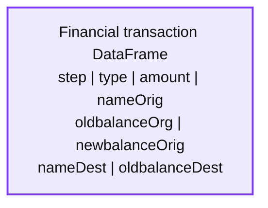

source image: https://www.databricks.com/wp-content/uploads/2019/04/Table.png

### Types of Transactions

Let's visualize the data to understand the types of transactions the data captures and their contribution to the overall transaction volume.

**Summary:** Spark SQL groups financial transactions by type, showing their percentage contribution to total transaction volume.

**Components:**

- Spark SQL query
- TRANSFER transactions
- CASH_IN transactions
- CASH_OUT transactions
- PAYMENT transactions
- DEBIT transactions

**Flows:**

- Financials -> Spark SQL query: grouped transaction counts
- Spark SQL query -> Transaction type chart: percentage distribution

**Numbers:** 35%, 34%, 22%, 8%, 1%, count(1)

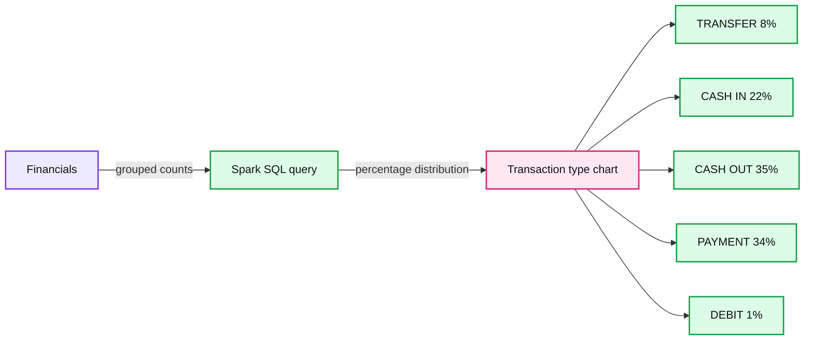

source image: https://www.databricks.com/wp-content/uploads/2019/04/5-Types-of-transactions.png

To get an idea of how much money we are talking about, let's also visualize the data based on the types of transactions and on their contribution to the amount of cash transferred (i.e. sum(amount)).

**Summary:** Bar chart showing total transaction amount grouped by transaction type.

**Components:**

- SQL query
- Financials data
- TRANSFER bar
- CASH_IN bar
- CASH_OUT bar
- PAYMENT bar
- DEBIT bar

**Flows:**

- none visible

**Numbers:** 500G, 450G, 400G, 350G, 300G, 250G, 200G, 150G, 100G, 50G, 0.00

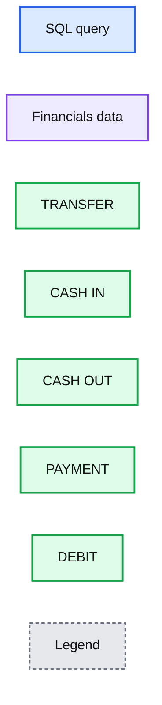

source image: https://www.databricks.com/wp-content/uploads/2019/04/6-Amount-histogram.png

### Rules-based Model

We are not likely to start with a large data set of known fraud cases to train our model. In most practical applications, fraudulent detection patterns are identified by a set of rules established by the domain experts. Here, we create a column called `label` based on these rules.

### Visualizing Data Flagged by Rules

These rules often flag quite a large number of fraudulent cases. Let's visualize the number of flagged transactions. We can see that the rules flag about 4% of the cases and 11% of the total dollar amount as fraudulent.

**Summary:** SQL results show fraudulent transactions represent 4% of transactions and 11% of the total amount.

**Components:**

- SQL query using `financials_labeled`
- Transactions donut chart
- Total Amount donut chart
- Label legend with values 1 and 0

**Flows:**

- none

**Numbers:** 4%, 96%, 11%, 89%, 1, 0, `count(1)`, `sum(amount)`

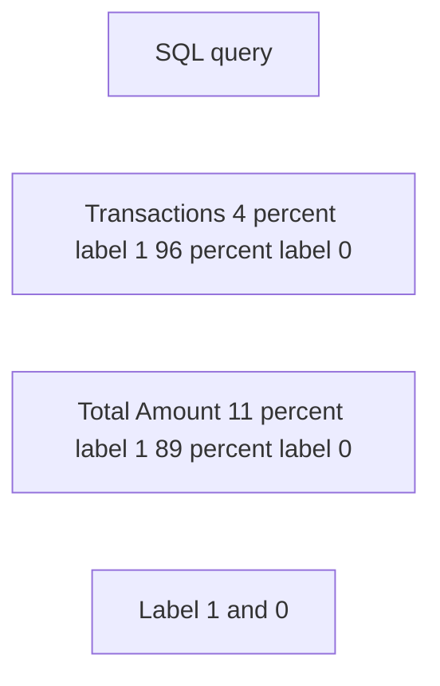

source image: https://www.databricks.com/wp-content/uploads/2019/04/5-Transactions.png

## Selecting the Appropriate Machine Learning Models

In many cases, a black box approach to fraud detection cannot be used. First, the domain experts need to be able to understand why a transaction was identified as fraudulent. Then, if action is to be taken, the evidence has to be presented in court. The decision tree is an easily interpretable model and is a great starting point for this use case.

**Summary:** The diagram shows a decision tree splitting two features, X1 and X2, to classify transactions into labeled regions and classes.

**Components:**

- Training data scatter plot using features X1 and X2
- Root decision node R
- X1 threshold 1.2 decision
- X2 threshold 1.9 decision
- X2 threshold 2.4 decision
- X1 threshold 0.9 decision
- X1 threshold 0.4 decision
- X1 threshold 2.0 decision
- X1 threshold 0.4 decision
- X1 threshold 2.0 decision
- X1 threshold 0.9 decision
- X1 threshold 0.9 decision
- Leaf classes represented by colored symbols
- Data regions d1 through d9

**Flows:**

- R -> X1 threshold 1.2: feature test
- R -> X1 threshold 1.2 alternate: feature test
- X1 threshold 1.2 -> X2 threshold 1.9: feature test
- X1 threshold 1.2 -> X2 threshold 1.9 alternate: feature test
- X1 threshold 1.2 alternate -> X2 threshold 2.4: feature test
- X1 threshold 1.2 alternate -> X2 threshold 2.4 alternate: feature test
- X2 threshold 1.9 -> X1 threshold 0.9: feature test
- X2 threshold 1.9 -> X1 threshold 2.0: feature test
- X2 threshold 2.4 -> X1 threshold 0.4: feature test
- X2 threshold 2.4 -> X1 threshold 2.0: feature test
- X1 threshold 0.9 -> leaf class: classification
- X1 threshold 2.0 -> leaf class: classification
- X1 threshold 0.4 -> leaf class: classification
- X1 threshold 2.0 alternate -> leaf class: classification
- X1 threshold 0.9 alternate -> leaf class: classification

**Numbers:** 1, 2, 3, 4, 0.0, 0.5, 1.0, 1.5, 2.0, 1.0, 2.0, 3.0, 4.0, 1.2, 1.9, 2.4, 0.9, 0.4, 2.0, 0.4, 2.0, 0.9, 0.9, d1, d2, d3, d4, d5, d6, d7, d8, d9

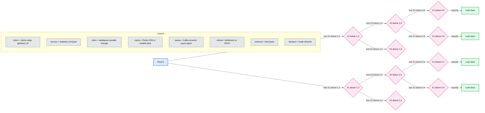

source image: https://www.databricks.com/wp-content/uploads/2019/04/6.5-Decision-Trees.png

### Creating the Training Set

To build and validate our ML model, we will do an 80/20 split using `.randomSplit`. This will set aside a randomly chosen 80% of the data for training and the remaining 20% to validate the results.

### Creating the ML Model Pipeline

To prepare the data for the model, we must first convert categorical variables to numeric using `.StringIndexer`. We then must assemble all of the features we would like for the model to use. We create a pipeline to contain these feature preparation steps in addition to the decision tree model so that we may repeat these steps on different data sets. Note that we fit the pipeline to our training data first and will then use it to transform our test data in a later step.

### Visualizing the Model

Calling `display()` on the last stage of the pipeline, which is the decision tree model, allows us to view the initial fitted model with the chosen decisions at each node. This helps to understand how the algorithm arrived at the resulting predictions.

*Visual representation of the Decision Tree model*

**Summary:** Decision tree model showing feature-based splits leading to binary predictions.

**Components:**

- Feature 6 root decision
- Feature 3 decision
- Feature 2 decisions
- Feature 1 decisions
- Feature 4 decision
- Feature 5 decisions
- Feature 0 decisions
- Binary prediction leaves

**Flows:**

- Feature 6 -> Feature 3: value <= 5.98e+4
- Feature 6 -> Feature 6: value > 5.98e+4
- Feature 3 -> Prediction 1: value <= 1.72e+1
- Feature 3 -> Feature 2: value > 1.72e+1
- Feature 6 -> Feature 2: value <= 3.81e+4
- Feature 6 -> Feature 0: value > 3.81e+4
- Feature 2 -> Feature 5: value <= 5.04e+4
- Feature 2 -> Prediction 0: value > 5.04e+4
- Feature 0 -> Prediction 0: value in 0,1,2,4
- Feature 0 -> Feature 5: value not in 0,1,2,4
- Feature decisions -> Binary prediction leaves: threshold-based classification

**Numbers:** 0, 1, 2, 3, 4, 5, 6, 1.72e+1, 3.81e+4, 5.04e+4, 4.69e+1, 6.72e+5, 2.30e+6, 7.45e+5, 5.98e+4, 0, 1, 2, 4, 0, 1

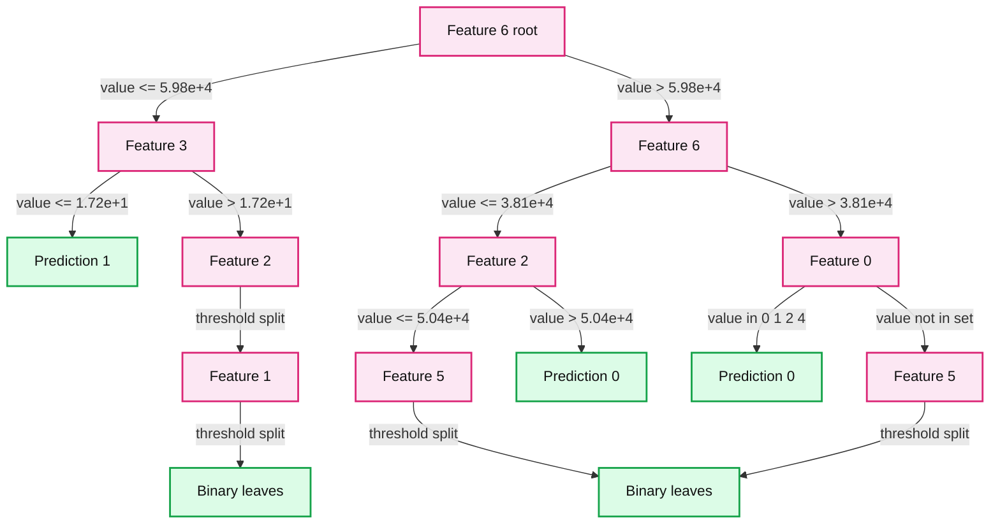

source image: https://www.databricks.com/wp-content/uploads/2019/04/6.75-Visualizing-the-Model.png

Visual representation of the Decision Tree model

### Model Tuning

To ensure we have the best fitting tree model, we will cross-validate the model with several parameter variations. Given that our data consists of 96% negative and 4% positive cases, we will use the Precision-Recall (PR) evaluation metric to account for the unbalanced distribution.

 

### Model Performance

We evaluate the model by comparing the Precision-Recall (PR) and Area under the ROC curve (AUC) metrics for the training and test sets. Both PR and AUC appear to be very high.

To see how the model misclassified the results, let's use matplotlib and pandas to visualize our confusion matrix.

**Summary:** Confusion matrix for the unbalanced test set, showing fraud and no fraud predictions.

**Components:**

- Fraud true label
- No Fraud true label
- Fraud predicted label
- No Fraud predicted label
- Unbalanced test confusion matrix
- Color scale for prediction counts

**Flows:**

- none

**Numbers:** 50717, 58, 2421, 1219030, 1200000, 1050000, 900000, 750000, 600000, 450000, 300000, 150000

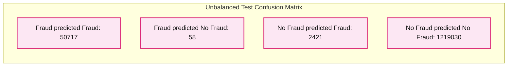

source image: https://www.databricks.com/wp-content/uploads/2019/04/8-Confusion-Martrix-1.png

 

### Balancing the Classes

We see that the model is identifying 2421 more cases than the original rules identified. This is not as alarming as detecting more potential fraudulent cases could be a good thing. However, there are 58 cases that were not detected by the algorithm but were originally identified. We are going to attempt to improve our prediction further by balancing our classes using undersampling.  That is, we will keep all the fraud cases and then downsample the non-fraud cases to match that number to get a balanced data set. When we visualized our new data set, we see that the yes and no cases are 50/50.

**Summary:** Donut chart showing an almost balanced label distribution, with label 1 at 51% and label 0 at 49%.

**Components:**

- Label 1, blue category
- Label 0, orange category

**Flows:**

- none

**Numbers:** 51%, 49%, 1, 0

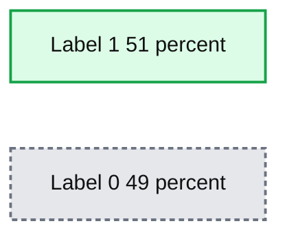

source image: https://www.databricks.com/wp-content/uploads/2019/04/9-Graph-2.png

### Updating the Pipeline

Now let's update the [ML pipeline](https://www.databricks.com/glossary/what-are-ml-pipelines) and create a new cross validator. Because we are using ML pipelines, we only need to update it with the new dataset and we can quickly repeat the same pipeline steps.

### Review the Results

Now let's look at the results of our new confusion matrix. The model misidentified only one fraudulent case. Balancing the classes seems to have improved the model.

**Summary:** Confusion matrix showing fraud and no fraud classifications on a balanced test set.

**Components:**

- Confusion Matrix Balanced Test
- True label axis
- Predicted label axis
- Fraud true-label row
- No Fraud true-label row
- Fraud predicted-label column
- No Fraud predicted-label column
- Color scale

**Flows:**

- True Fraud -> Predicted Fraud: 50774 classifications
- True Fraud -> Predicted No Fraud: 1 classification
- True No Fraud -> Predicted Fraud: 488 classifications
- True No Fraud -> Predicted No Fraud: 1220963 classifications

**Numbers:** 50774, 1, 488, 1220963, 1200000, 1050000, 900000, 750000, 600000, 450000, 300000, 150000

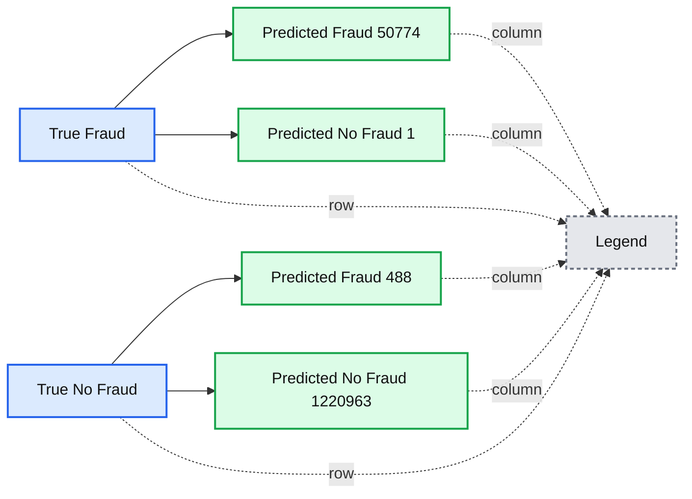

source image: https://www.databricks.com/wp-content/uploads/2019/04/Confusion-Matrix-2.png

### Model Feedback and Using MLflow

Once a model is chosen for production, we want to continuously collect feedback to ensure that the model is still identifying the behavior of interest. Since we are starting with a rule-based label, we want to supply future models with verified true labels based on human feedback. This stage is crucial for maintaining confidence and trust in the machine learning process. Since analysts are not able to review every single case, we want to ensure we are presenting them with carefully chosen cases to validate the model output. For example, predictions, where the model has low certainty, are good candidates for analysts to review. The addition of this type of feedback will ensure the models will continue to improve and evolve with the changing landscape.

MLflow helps us throughout this cycle as we train different model versions. We can keep track of our experiments, comparing the results of different model configurations and parameters. For example here, we can compare the PR and AUC of the models trained on balanced and unbalanced data sets using the MLflow UI. Data scientists can use MLflow to keep track of the various model metrics and any additional visualizations and artifacts to help make the decision of which model should be deployed in production. The data engineers will then be able to easily retrieve the chosen model along with the library versions used for training as a .jar file to be deployed on new data in production. Thus, the collaboration between the domain experts who review the model results, the data scientists who update the models, and the data engineers who deploy the models in production, will be strengthened throughout this iterative process.

https://www.youtube.com/watch?v=x_4S9r-Kks8

https://www.youtube.com/watch?v=BVISypymHzw

## Conclusion

We have reviewed an example of how to use a rule-based fraud detection label and convert it to a machine learning model using Databricks with MLflow. This approach allows us to build a scalable, modular solution that will help us keep up with ever-changing fraudulent behavior patterns. Building a machine learning model to identify fraud allows us to create a feedback loop that allows the model to evolve and identify new potential fraudulent patterns. We have seen how a decision tree model, in particular, is a great starting point to introduce machine learning to a fraud detection program due to its interpretability and excellent accuracy.

A major benefit of using the Databricks platform for this effort is that it allows for data scientists, engineers, and business users to seamlessly work together throughout the process. Preparing the data, building models, sharing the results, and putting the models into production can now happen on the same platform, allowing for unprecedented collaboration. This approach builds trust across the previously siloed teams, leading to an effective and dynamic fraud detection program.

[Try this notebook](https://notebooks.databricks.com/notebooks/FSI/fraud_orchestration/index.html) by signing up for a free trial in just a few minutes and get started creating your own models.
