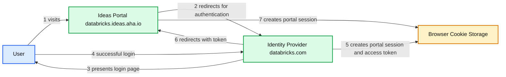

# Single Sign-On (SSO) to Third Party Applications

- Source: https://www.databricks.com/blog/2019/05/03/single-sign-on-sso-to-third-party-applications.html
- Published: 2019-05-03
- Authors: Kyle Lim
- Categories: engineering
- Images: 1 total, 1 extracted as architecture

This past winter, I was a software engineering intern at Databricks on the Identity and Access Management (IAM) team. During my time here, I had the opportunity to work on multiple projects, including a major project that the whole team worked on along with my own dedicated project. In this blog, I will share my experiences with the latter. My dedicated intern project was to build out [single sign-on](https://en.wikipedia.org/wiki/Single_sign-on) workflow for Databricks-managed third-party applications such as the Unified Support Portal and the Ideas Portal, in order to improve the overall enterprise platform experience provided by Databricks.

## Project Implementation

### Background

Databricks strives for a great user experience, and to do this we provide a number of third-party services that are critical to the enterprise-grade customer experience. This includes the Ideas Portal to submit feature requests, the Unified Support Portal to file support tickets and access internal documentation, and an education portal to access training material for the Databricks product. These are all services a customer may visit frequently, and it is a poor user experience to create and maintain credentials for all of these services.

Our solution to simplify the experience is to utilize the Databricks workspace as an identity provider. To do this, we implemented a single sign-on workflow for all of these third-party services with your credentials in Databricks.

### User Workflow

We wanted the user workflow to be as simple as possible. For example, if you access a ticket in the support portal without being logged in, we want a seamless transition where you are redirected to Databricks for authentication, are authenticated, and then redirected back behind the scenes.

Here is the workflow at a high-level:

1. You browse to a third party portal, e.g., Ideas Portal backed by Aha!
2. The Ideas Portal does not have any active browser session, so it redirects to the Databricks portal for authentication.
3. The Databricks portal does not have any active browser session, so you are presented with the login page.
4. Upon successful login, a browser session is created for the Databricks portal and we generate an access token.
5. The browser redirects to the Ideas Portal on a redirect response from the Databricks portal.
6. The Ideas Portal accepts the token and you are authenticated.
7. A browser session is created for the Ideas Portal upon authentication.

**Summary:** The diagram shows a seven-step SSO flow between a user, the Ideas Portal, the Databricks Identity Provider, and browser cookie storage.

**Components:**

- User
- Ideas Portal at databricks.ideas.aha.io
- Identity Provider at *.databricks.com
- Browser Cookie Storage

**Flows:**

- User -> Ideas Portal: visits the Ideas Portal
- Ideas Portal -> Identity Provider: redirects the user for authentication
- Identity Provider -> User: presents the login page
- User -> Identity Provider: successfully logs in
- Identity Provider -> Browser Cookie Storage: creates a Databricks portal browser session and access token
- Databricks portal -> Ideas Portal: redirects the browser with the token
- Ideas Portal -> Browser Cookie Storage: creates an Ideas Portal browser session

**Numbers:** 1, 2, 3, 4, 5, 6, 7

source image: https://www.databricks.com/wp-content/uploads/2019/06/SSO-To-3rd-Party_-Design-Doc.png

### SSO Using JWT

We implemented the SSO workflow by using [JSON Web Tokens](https://jwt.io/) (JWT). The main advantage of using JWT is that it is lightweight, easy to maintain, and simple to scale out to new services in the future. The Databricks portal would generate a JWT signed using the [HMAC algorithm](https://en.wikipedia.org/wiki/HMAC). After creating a JWT, we would exchange the token with the authorization server of a third party service to validate the claim of the user. Afterwards, we can finally authenticate on the third party and seamlessly sign in!

### SSO Redirection

In order to craft a perfect user experience, we needed to make our authentication flow work behind the scenes seamlessly. For example, let's say you received an email with a support ticket and a link to the support portal. You click the link and expect to already be signed in. If you are forced to type in credentials or manually go to a Databricks workspace, it breaks your workflow. To address this, we make some redirects in our backend to appropriately authenticate and sign in.

The secret behind our SSO flow is in our cookie storage. When you access your Databricks workspace, Databricks sets a [Top Level Domain](https://en.wikipedia.org/wiki/Top-level_domain) (TLD) cookie with your workspace ID. When you access a third-party application without being signed in, you are redirected to another page that reads in your workspace ID, authenticates on the provided workspace, and finally redirects you back to the page you were on. If you are is part of multiple workspaces, you are given an option for each workspace. Using this redirection flow, Databricks can sign you into our third-party services without interruptions.

## Conclusion

Working on the IAM team allowed me to learn how to make systems scalable as an internal developer, to work on consumer-facing features to learn how to make the product more robust and user-friendly, and to have an impact on customers who use Databricks.

I would like to thank my mentor, Alexandra Cong, for being there whenever I needed her and my manager, Yun Park, for all of the support throughout my internship. Additionally I want to thank Rohit Gupta for continual guidance throughout my dedicated intern project, and I want to give a shout out to the rest of the IAM team for their valuable help during my four months here!
