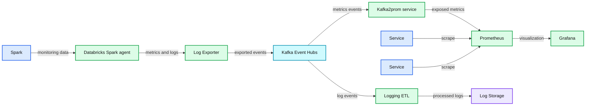

# Real-Time Distributed Monitoring and Logging in the Azure Cloud

- Source: https://www.databricks.com/blog/2019/05/06/real-time-distributed-monitoring-and-logging-in-the-azure-cloud.html
- Published: 2019-05-06
- Authors: Johann Miller
- Categories: engineering
- Images: 2 total, 2 extracted as architecture

How can you observe the unobservable? At Databricks we rely heavily on detailed metrics from our internal services to maintain high availability and reliability. However, the Databricks platform manages Apache Spark™ clusters for customers, deployed into their own Azure accounts and private virtual networks, which our monitoring infrastructure cannot easily observe.

This blog describes the solution we built to get real-time metrics into our central monitoring infrastructure from these "unobservable" environments. The architecture we propose is not unique to monitoring only Apache Spark™ Clusters, but can be used to scrape metrics and log from any distributed architecture deployed in Azure Cloud or a private VPN.

## Setup

Databricks provides a cloud service with a global architecture, operating services in a variety of clouds, regions, and deployment models. This unique complexity introduces challenges that emphasize the importance of having appropriate visibility into our services. The Observability team at Databricks is responsible for providing a platform to process data across three pillars: metrics, logs, and traces. This post focuses on how we delivered an improved experience for 2 of the 3 data sources: metrics (measurements recording the service state or health) and logs (distinct events emitted by a service).

Our metrics monitoring infrastructure is comprised of deployments of [Prometheus](https://prometheus.io/), an open source monitoring system, running in regional Kubernetes clusters. Each set of replicated services is responsible for collecting telemetry from all colocated services, ingesting and storing metrics at a regular sampling interval. We leverage [Grafana](https://grafana.com/) and [Alertmanager](https://prometheus.io/docs/alerting/latest/alertmanager/) to build dashboards and real-time alerting, so that our engineers can stay informed about the health of Databricks services.

**Summary:** The diagram shows per-region Databricks monitoring, with customer metrics and logs collected through Prometheus, Blob Storage, a logging ETL process, and log storage.

**Components:**

- Databricks Spark agent using Apache Spark
- Log Exporter
- Blob Storage using Azure Blob Storage
- Logging ETL
- Log Storage
- Prometheus
- Grafana
- Service
- Service

**Flows:**

- Service -> Prometheus: scrapes metrics
- Service -> Prometheus: scrapes metrics
- Databricks Spark agent -> Prometheus: scraping blocked across virtual network
- Databricks Spark agent -> Log Exporter: logging data
- Log Exporter -> Blob Storage: exported logs
- Blob Storage -> Logging ETL: stored logs
- Logging ETL -> Log Storage: transformed logs

**Numbers:** none

source image: https://www.databricks.com/wp-content/uploads/2019/07/blog-fig1-070819.png

```mermaid
%% Per-region Databricks monitoring architecture
flowchart LR
    Agent[Databricks Spark agent]
    Exporter[Log Exporter]
    Blob[Blob Storage]
    ETL[Logging ETL]
    Logs[Log Storage]
    Prom[Prometheus]
    Grafana[Grafana]
    Svc1[Service]
    Svc2[Service]

    Agent -->|logging data| Exporter
    Exporter -->|exported logs| Blob
    Blob -->|stored logs| ETL
    ETL -->|transformed logs| Logs
    Svc1 -->|scrapes metrics| Prom
    Svc2 -->|scrapes metrics| Prom
    Agent -.->|scraping blocked across virtual network| Prom

    subgraph Legend
        L1[client = clients edge gateway LB]
        L2[service = stateless compute]
        L3[store = databases durable storage]
        L4[cache = Redis CDN or losable data]
        L5[queue = Kafka streams async pipes]
        L6[critical = bottleneck or SPOF]
        L7[external = third party]
        L8[decision = trade off point]
    end

    classDef client fill:#dbeafe,stroke:#2563eb,stroke-width:2px,color:#111
    classDef service fill:#dcfce7,stroke:#16a34a,stroke-width:2px,color:#111
    classDef store fill:#ede9fe,stroke:#7c3aed,stroke-width:2px,color:#111
    classDef cache fill:#fef3c7,stroke:#d97706,stroke-width:2px,color:#111
    classDef queue fill:#cffafe,stroke:#0891b2,stroke-width:2px,color:#111
    classDef critical fill:#fee2e2,stroke:#dc2626,stroke-width:4px,color:#111
    classDef external fill:#e5e7eb,stroke:#6b7280,stroke-width:2px,color:#111,stroke-dasharray:4 3
    classDef decision fill:#fce7f3,stroke:#db2777,stroke-width:2px,color:#111

    class Agent,Exporter,ETL,Prom,Svc1,Svc2 service
    class Blob,Logs store
    class Grafana external
    class L1,L2,L3,L4,L5,L6,L7,L8 external
```

Figure 1. Per-region view of Databricks monitoring architecture.

This architecture works well for services that run in the same Kubernetes cluster, but as discussed above, customer deployments cannot be scraped in this way. These services being unreachable by our Prometheus deployments means we do not collect their metric data and lose valuable service insights.

However, we do have an in-house log-exporter agent running in those environments.  We decided to leverage that to also collect metrics and proxy them back to our central clusters.

## Requirements

After chatting with other interfacing engineers, we gathered the following requirements for this system:

- Process throughput of high 10's of GBs per minute, with flexible scaling for forecasted future load
- Achieve sub-minute latency
- Ensure high availability and fault tolerance

While we can leverage the log-exporter, we can't use our existing log ETL pipelines as they operate against object storage, and have significant latency. A primary use case for the metric pipeline is real-time alerting, and late data inhibits our ability to minimize incident response times.

Additionally, we would like this system to be extensible for use cases such as improving the latency of our existing log pipeline. The logging pipeline has a slightly looser requirement on latency (minutes), but significantly higher throughput.

## Transport

We decided to use [Apache Kafka](https://kafka.apache.org/) for data transport. Kafka is a common solution for building real-time event log pipelines, and uses a variety of methods to achieve levels of throughput, latency, and fault tolerance that make it attractive for this use case.

Additionally we leverage [Azure Event Hubs](https://azure.microsoft.com/en-us/services/event-hubs/), a cloud-hosted data ingestion service that can expose a Kafka surface. This meant we could start quickly without investing much in deploying and managing the infrastructure, while leaving the possibility of migrating to self-managed Kafka in the future with minimal code change.

## Building a Real-Time Pipeline

Once we settled on the transport layer and deployed Event Hubs, we moved on to implementing the actual collection pipeline.

## Gathering Metrics

Our log-exporter is (unsurprisingly) file-oriented. We therefore modified our main service loop to dump all the services’ metrics to a file every thirty seconds. The Prometheus client library makes this quite easy, as we can simply iterate over the default registry and write out all the metrics found there. This is the same data that would be returned if the service was scrapped directly via Prometheus. We chose thirty seconds since this emulates the scrape interval we use for services when scraped directly.

Our log-exporter already has support for a "streaming" mode where files can be "tailed" and written to a stream endpoint. We simply configured our log-exporter to treat the metrics dump file as a log that should be streamed.

## Producing messages

The next step was to modify our log exporter to support Kafka as a protocol. This was straightforward to build using the OSS Kafka producer.  We did have to make some choices regarding how aggressive to be when trying to guarantee delivery. We decided to trade guarantees for increased throughput by lowering the bar for record acknowledgement. Losing one round of metrics isn't too bad, since we'll simply send an updated metric value thirty seconds later.

## Consuming messages

Things are somewhat more complex on the consumer side. Moving logs from Kafka to the [ETL pipeline](https://www.databricks.com/glossary/extract-transform-load) is natural, but the process for metrics is less clear. As mentioned earlier, Prometheus operates on a pull model where it scrapes the services around it. For services that cannot be scraped (i.e., short-running jobs), they offer the [Pushgateway](https://github.com/prometheus/pushgateway). Services can send their metrics to be cached by the Pushgateway, and a co-located Prometheus will scrape them from there.

We adopted this model to expose the proxied metrics to Prometheus with a service named Kafka2Prom (K2P). All of the K2P pods belong to a single Kafka consumer group. Each pod is assigned some subset of the partitions, and consumes the respective metrics then emits them to a Prometheus-compatible metrics endpoint for collection. We provide delivery guarantees by only committing the offsets back to Kafka once the metrics have been exposed.

At this point our metrics collection pipeline looks like the figure below:

**Summary:** Per-region Databricks monitoring architecture showing metrics and logs flowing through Kafka, Prometheus, a logging ETL, and durable log storage.

**Components:**

- Spark, Apache Spark
- Databricks Spark agent
- Log Exporter
- Kafka, using Event Hubs
- Kafka2prom service
- Prometheus
- Service
- Service
- Grafana
- Logging ETL
- Log Storage

**Flows:**

- Spark -> Databricks Spark agent: monitoring data
- Databricks Spark agent -> Log Exporter: metrics and logs
- Log Exporter -> Kafka: exported events
- Kafka -> Kafka2prom service: metrics events
- Kafka2prom service -> Prometheus: exposed metrics
- Service -> Prometheus: scrape
- Service -> Prometheus: scrape
- Prometheus -> Grafana: monitoring visualization
- Kafka -> Logging ETL: log events
- Logging ETL -> Log Storage: processed logs

**Numbers:** none

source image: https://www.databricks.com/wp-content/uploads/2019/07/blog-fig2-070819.png

Figure 2. Per-region view of Databricks monitoring architecture (with Kafka and Kafka2prom services).

One caveat is that Prometheus ingests metrics and stores them using the timestamp set as the scrape time (rather than upload time or event time). This is a good assumption for the local services, but it has some implications for K2P. K2P needs to guarantee that once a certain metric has been exposed to Prometheus by any pod, no older value of that metric will ever be exposed because Prometheus would give it a later timestamp. All values of a metric are published to the same Kafka topic, so guaranteeing this within one pod is simple. It’s slightly harder to guarantee during a partition rebalance: if the new metric value appears on the new pod while the old pod still hosts the previous value, Prometheus could scrape them out of order. To avoid this, we synchronously evict the cache of the old pod before allowing the new pod to receive any metrics from the rebalanced topic.

Another consideration is how to address “noisy neighbors”. Because we need ordering within a pod, the distribution of records across partitions is not necessarily uniform. While we have the option of scaling the number of K2P pods up to the number of partitions, we also may want to assign multiple partitions to one pod and make use of multiple CPUs. We keep all processing for a partition within a single thread, because it would otherwise be difficult to keep ordering guarantees. In this setup, we don’t want a backup on one partition to block the other threads from processing. For multi-threaded processing, we needed to asynchronously pass records from the consumer(s) to the processors. For this, we use a small backlog queue on every partition. This allows isolation between partitions: if one thread falls behind and its queue fills up, we can pause this partition while the other threads continue unaffected. This also gives us some flexibility on how we deal with back pressure. For example, in an emergency we could stop pausing partitions and instead drop from the front of the queue. We would have less granular metrics data, but we could catch up to the current metrics without skipping directly to the latest record and losing all insight about what happened in between.

## Conclusion

This project enabled real-time visibility of the state of "unobservable" Spark workers in Azure. This improves monitoring (dashboards and alerts) and engineers' ability to make data-driven decisions to improve the performance and stability of our product.

The various components of this system can scale horizontally and independently, allowing Databricks the ability to continue to adapt to the growing data scale of telemetry use cases. Furthermore, we expect to continue expanding use cases that generate additional insights and leverage this log-centric architecture.
