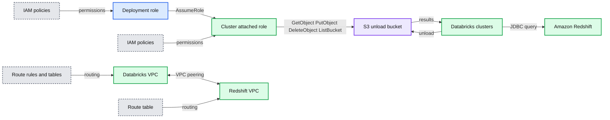
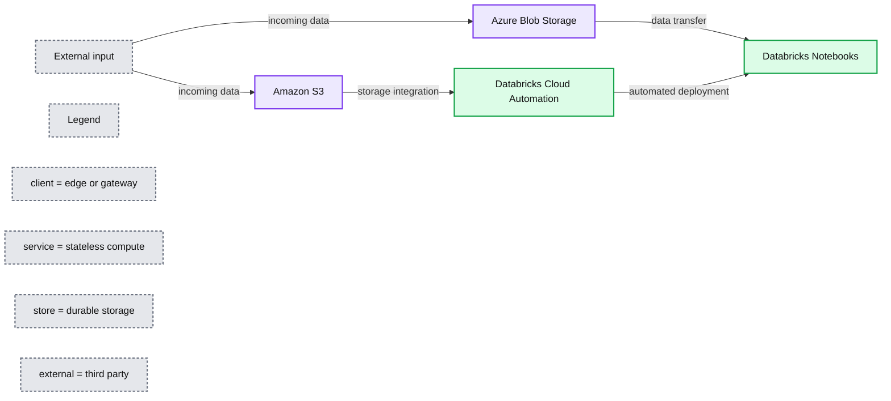
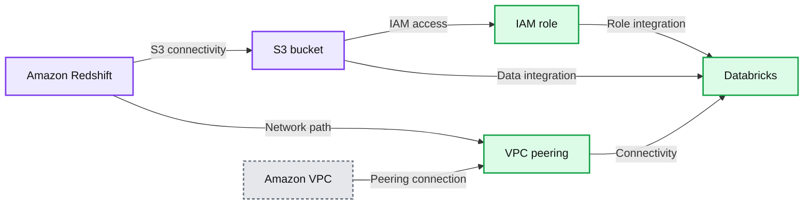
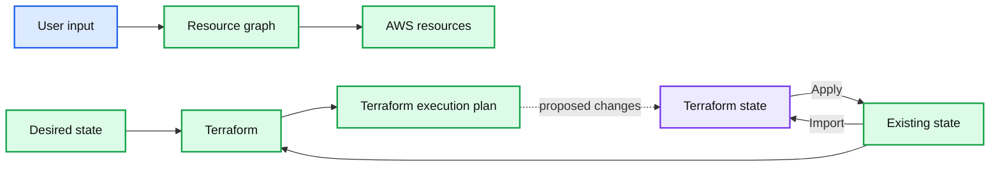
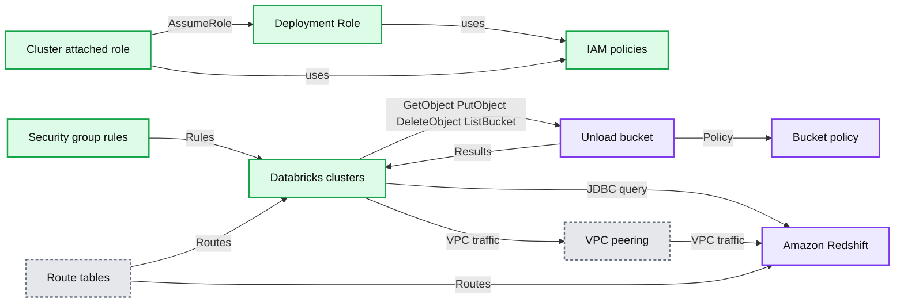

# Efficient Databricks Deployment Automation with Terraform

- Source: https://www.databricks.com/blog/2019/05/07/efficient-databricks-deployment-automation-with-terraform.html
- Published: 2019-05-07
- Authors: Dillon Bostwick, Brenner Heintz
- Categories: platform, solutions, engineering, company, news, customers
- Images: 7 total, 5 extracted as architecture

Managing cloud infrastructure and provisioning resources can be a headache that DevOps engineers are all too familiar with. Even the most capable cloud admins can get bogged down with managing a bewildering number of interconnected cloud resources - including data streams, storage, compute power, and analytics tools.

Take, for example, the following scenario: a customer has completed creating a Databricks workspace, and they want to connect a Databricks cluster to a Redshift cluster in AWS. The diagram below demonstrates the resulting state if all of these steps are completed correctly, as well as how data flows between each resource.

**Summary:** The diagram shows Databricks clusters in a customer AWS VPC accessing an Amazon Redshift cluster through VPC peering and exchanging data through an S3 unload bucket.

**Components:**

- Customer AWS account
- Customer Databricks VPC
- Unmanaged Databricks security group
- Databricks VPC subnets
- Databricks clusters
- Deployment IAM role
- Cluster-attached IAM role
- IAM policies
- S3 unload bucket
- S3 bucket policy
- Amazon Redshift cluster
- Redshift VPC and subnet
- VPC peering connection
- VPC route rules and route tables

**Flows:**

- Deployment role -> IAM policy: policy access
- Deployment role -> Cluster-attached role: AssumeRole
- Cluster-attached role -> S3 bucket: GetObject, PutObject, DeleteObject, ListBucket
- S3 bucket -> Databricks clusters: results
- Databricks clusters -> S3 bucket: unload
- Databricks clusters -> Amazon Redshift: JDBC query
- Databricks VPC -> Redshift VPC: VPC peering traffic
- Route rules -> Route tables: network routing configuration

**Numbers:**

- 172.16.0.0
- 172.16.1.0
- 172.16.2.0
- 172.16.0.0
- 172.16.1.0
- 172.16.2.0
- 172.16.0.0
- 172.16.1.0
- 172.16.2.0

source image: https://www.databricks.com/wp-content/uploads/2019/05/1-cloud-infrastructure-diagram.png

Achieving this state can be a lengthy process, and each configuration step involves significant substeps. For example, configuring the IAM roles to access S3 from Databricks alone requires a [7 step process](https://docs.databricks.com/administration-guide/cloud-configurations/aws/assume-role.html).

Complex as this setup may be, it is by no means uncommon. Many customers have looked to cloud automation processes to simplify and speed the deployment of cloud resources, but these processes can pose challenges of their own. In general, we’ve found that many of the challenges in cloud automation include:

- **Scalability**- Adding new resources to an existing cloud deployment can become exponentially more difficult and cumbersome due to resolving dependencies between cloud resources.
- **Modularity** - Many deployment processes are repeatable and inter-dependent (for example, deploying to Redshift also requires a connection to S3 for staging the results).
- **Consistency** - Tracking a deployment state may simplify remediation and reduces risk, but it is difficult to maintain and resolve.
- **Lifecycle management** - Even if you can audit changes to some cloud resources, it may be unclear what actions are necessary to update an entire end-to-end state (such as the infrastructure state demonstrated in the above diagram).

To address these issues for our customers, **Databricks is introducing a solution to automate your cloud infrastructure. Databricks Cloud Automation leverages the power of [Terraform](https://www.terraform.io/), an open source tool for building, changing, and versioning cloud infrastructure safely and efficiently. It offers an intuitive graphical user interface along with pre-built, “batteries included” Terraform modules that make it easier to connect common cloud resources to Databricks. **

>  Keep in mind that many of these setup tasks such as VPC Peering and S3 authentication are specific to AWS. In Azure Databricks, for example, a connection to an Azure SQL Data Warehouse is [simply a matter of authenticating with AAD](https://docs.microsoft.com/en-us/azure/databricks/scenarios/databricks-extract-load-sql-data-warehouse), as the network connectivity is self-managed.

**

**Summary:** Databricks Unified Analytics Platform connects Azure Blob Storage and Amazon S3 to Databricks Cloud Automation and Databricks Notebooks.

**Components:**

- Azure Blob Storage: Azure cloud object storage
- Amazon S3: Amazon cloud object storage
- Databricks Cloud Automation: Databricks deployment automation
- Databricks Notebooks: Databricks notebook environment
- Databricks Unified Analytics Platform: enclosing platform boundary

**Flows:**

- External input -> Azure Blob Storage: incoming data
- External input -> Amazon S3: incoming data
- Azure Blob Storage -> Databricks Notebooks: data transfer
- Amazon S3 -> Databricks Cloud Automation: storage integration
- Databricks Cloud Automation -> Databricks Notebooks: automated deployment

**Numbers:** 10, 01

source image: https://www.databricks.com/wp-content/uploads/2019/05/2-Workflow-Diagram.png

**

**In developing Databricks Cloud Automation, we aim to: **

- **Accelerate the deployment process through automation.**
- **Democratize the cloud infrastructure deployment process to non-DevOps/cloud specialists.**
- **Reduce risk by maintaining a replicable state of your infrastructure.**
- **Provide a universal, “cloud-agnostic” solution.**

**With this new tool, connecting your cloud resources to Databricks is faster and simpler than ever. Let’s take a look at some of the reasons our customers are using Databricks Cloud Automation. **

## **A graphical user interface to democratize Databricks cloud deployments**

****Databricks democratizes the deployment process by presenting a streamlined user interface that is easy and accessible, so you can be comfortable deploying cloud resources on Databricks without any DevOps experience.** This high-level user interface allows us to manage cloud configurations behind the scenes, prompting you only for essential information. **

**

**Summary:** Databricks Cloud Automation presents Terraform modules for connecting Databricks with S3 through IAM, Redshift through S3 and networking, and another VPC through VPC peering.

**Components:**

- AWS cloud
- S3 bucket
- IAM role
- Databricks
- VPC
- Amazon Redshift
- VPC peering

**Flows:**

- S3 bucket -> IAM role: IAM authentication access
- IAM role -> Databricks: IAM role integration
- Amazon Redshift -> S3 bucket: S3 connectivity
- S3 bucket -> Databricks: Data integration
- Amazon Redshift -> VPC peering: VPC networking
- VPC peering -> Databricks: Network connectivity
- Amazon VPC -> VPC peering: VPC peering connection
- VPC peering -> Databricks: VPC peering connection

**Numbers:** none

source image: https://www.databricks.com/wp-content/uploads/2019/05/3-databricks-cloud-automation.png

**

## **An elegant solution for tracking infrastructure state**

**Aside from the simple setup, the tool’s most powerful feature is its ability to locally track and maintain the current and prior state of each cloud resource. As many DevOps engineers are aware, cloud resources often form a complex web of dependencies, each resource relying on others to function properly. **

**For example, a seemingly simple change to a single ACL entry can cause a cascade of errors downstream (and migraines for DevOps engineers). In the past, each of those dependent resources would need to be manually identified and to perform troubleshooting. **

****Terraform makes life easier by maintaining a “diff” between the desired state of resources and their current state.** When it identifies a change, Terraform updates its internal “resource graph” and creates an ordered execution plan, automating the resolution of all cascading changes that would typically be necessary to keep these connections functioning. **

## **A modular framework for your cloud infrastructure**

**For companies looking to dramatically scale their cloud infrastructure - now or in the future - Databricks Cloud Automation provides a simple interface to connect resources to Databricks using Terraform’s powerful infrastructure management capabilities. While casual users appreciate the graphical user interface and quick setup time, more experienced users appreciate the modular, extensible design principles that the tool embodies - allowing companies to rapidly grow their Databricks infrastructure without the hassle of complicated and easily-broken manual configurations and the risk of developing a monolithic architecture. **

**Terraform employs a high-level, declarative syntax known as [HCL](https://www.terraform.io/language), allowing users to concisely define the end state of the resources that they intend to connect to Databricks. **Many users prefer this style of quick, high-level resource declaration, which allows them to connect resources to Databricks right out of the box, **while still giving them the flexibility to manually configure resources to their hearts’ content. **

**When a new resource is added, Terraform updates its internal resource graph, automatically resolves dependencies between resources and creates a new execution plan to seamlessly integrate the new resource into the existing infrastructure. Users can then view a summary of the changes Terraform will make before committing, by calling `terraform` plan. **

**

**Summary:** The diagram shows Terraform comparing desired and existing infrastructure states to generate an execution plan and apply changes through Terraform state.

**Components:**

- User input
- Desired state
- Resource graph
- AWS resources
- Existing state
- Terraform
- Terraform state
- Terraform execution plan

**Flows:**

- User input -> Resource graph: desired infrastructure configuration
- Resource graph -> AWS resources: resolved resource dependencies
- Desired state -> Terraform: target infrastructure definition
- Existing state -> Terraform: current infrastructure state
- Existing state -> Terraform state: Import
- Terraform state -> Existing state: Apply
- Terraform -> Terraform execution plan: planned infrastructure changes
- Terraform execution plan -> Terraform state: proposed changes for apply

**Numbers:** none

source image: https://www.databricks.com/wp-content/uploads/2019/05/4-databricks-cloud-automation-2.png

**

## **Modules that can be shared, versioned and reused**

**One of the tool’s top features is the ability to create and save custom configurations as modules that can be reused or called by other modules. As a loose analogy, imagine using modules like a software engineer might use a class - to recreate an object, or to create a subclass that inherits properties from a superclass. For example, an S3 bucket configuration can be reused when creating a Redshift cluster, or a user can copy the configuration for a development environment directly to a production environment to ensure that they match. **

****This emphasis on repeatable, scriptable modules and “infrastructure as code” make it incredibly easy and efficient to scale up your cloud infrastructure. **Modules can be shared amongst team members, edited, reviewed and even versioned as code - allowing DevOps engineers to make quick, iterative changes on the fly without fear of breaking their systems. This approach cuts the time-to-launch for new resource deployments by orders of magnitude and fits in nicely with many of the project management methodologies used today. **

## **Connect to any IaaS provider**

****Terraform is “cloud agnostic” - **it can be used to connect to any cloud provider or other systems - so DevOps engineers aren’t locked into a single ecosystem, and can connect resources between different providers easily. **

**They can also have confidence that they will not have to raze and rebuild their cloud infrastructure from the ground up if they decide to choose a new cloud vendor or connect a new system. In fact, there is a robust online [community](https://registry.terraform.io/) devoted to publishing robust modules and [providers](https://www.terraform.io/language/providers) for nearly every cloud resource and use case. **

## **Example: Connecting an S3 bucket to Databricks using the GUI**

**Let’s take a look at an example of how easy it is to set up and maintain your cloud infrastructure using Terraform with Databricks, by connecting an existing S3 bucket to Databricks using IAM roles (see [here](https://docs.databricks.com/administration-guide/cloud-configurations/aws/instance-profiles.html) for the manual instructions). You will need: **

- ****A previously created S3 bucket.** Make note of the name and region. For a list of region identifiers, click [here](https://docs.aws.amazon.com/general/latest/gr/rande.html).**
- ****AWS access key and secret key** - to find or create your credentials, from the AWS console, navigate to IAM → Users → Security Credentials. If the S3 bucket was created by a different user, you’ll need the access key and secret key for their account, too.**
- ****Name of the IAM role you used** to connect Databricks to AWS. You can find that [here](https://console.aws.amazon.com/iam/home?#/roles).**

**First, using the command line, let’s download and install the Databricks Cloud Automation package, which includes Terraform: **

**To launch the web-based GUI, enter `databricks-cloud-manager` in the command line, then navigate to the following address in a web browser: **

**Here you’ll find examples of cloud infrastructure that you can add to Databricks using Terraform. Follow these instructions to get your S3 bucket connected: **

1. **Click **Select** under **s3_to_databricks_via_iam**.**
2. **Enter the credentials for the S3 bucket we’re connecting to. Under **aws_region**, enter the region that you use to connect to AWS. In our case, since we’re using US West (Oregon), we enter region code **us-west-2**.**
3. **Under **databricks_deployment_role**, enter the name of the IAM role you used to allow Databricks to access clusters on AWS. In our case, we enter the role name databricks.**
4. **Under **custom_iam_name_role**, enter a brand new name for an IAM role that we’ll create in order to access the S3 bucket.**
5. **Under **aws_foreign_acct_access_key, aws_foreign_acct_secret_key**, and **aws_foreign_acct_region**, leave these blank if your S3 bucket is under the same AWS account as the account you use to connect to Databricks. If you’ve got access to an S3 bucket owned by a different AWS user, enter those keys here.**

**

**

1. **Submit the form. You’ll see a summary of the plan, including resources that will be added, changed, or deleted. Review the list of proposed changes thoroughly, and select **Apply changes to infrastructure**. If you’ve entered valid credentials, you’ll get a page indicating that you successfully applied all changes, along with a list of everything that was changed. (Note that this added new resources, but it also updated some existing resources - for example, it might have added a line to an IAM policy that already existed). Scroll to the bottom of the success page and copy the **s3_role_instance_profile** written under the **Output** section, as seen below.**

**

**

1. **Sign in to your Databricks deployment. Click the **Account** icon in the upper right, and select **Admin Console**. Navigate to the **IAM Roles** tab, paste the role you copied in the previous step, and click **Add**, as shown below.**

**https://www.youtube.com/watch?v=BPIzuYiszDc **

****Congratulations! You’ve set up your first piece of cloud infrastructure, and managing it is now easier than ever.** You can now launch clusters with your new IAM role, and connect S3 to the Databricks file system (DBFS) to access your data using the following command in a Databricks notebook cell: **

**Terraform is now tracking the state of our newly created infrastructure, and we can view the state by entering `terraform show` in the command line. If our resource has changed in any way, we can run `terraform apply` to repair it and any dependent cloud resources. **

## **Connecting an S3 bucket to Databricks using the Command Line**

**If you prefer to use the command line to execute tasks, you can still get Databricks connected to an S3 bucket using Terraform using the [Terraform CLI](https://www.terraform.io/cli/commands) directly. This will allow you to leverage Terraform’s advanced features that are not easily accessible via the GUI, such as [terraform import](https://www.terraform.io/cli/import). To access the modules directly, run the following at a command prompt to install directly from the source: **

**Once you have installed from source, simply navigate to the **modules** folder, and cd into the folder for a module (**s3_to_databricks_via_iam**, for the sake of our example). From there, run `terraform init` to initialize Terraform, then run `terraform apply` to enter your AWS credentials in the prompts that follow. **

**https://www.youtube.com/watch?v=FSQYJ3zmQ2k **

***(Note: You can apply with the **-var-file** flag to specify input variables in a separate JSON or HCL file)* **

**When you’re all done, copy the Instance Profile ARN provided, and paste it into Databricks via the Admin Console as we did in step 7 above. Voilà - you’ve connected Databricks to S3! Using the IAM role you’ve set up, you’ll be able to read and write data back and forth between Databricks and your S3 bucket seamlessly. **

## **Connecting a Redshift Cluster to Databricks**

**Let’s revisit the example we proposed at the introduction of this blog - the most complex of our examples so far - to see how much easier the setup can be. **

**Imagine that you’ve just gotten started with Databricks, and you want to connect your company’s existing AWS Redshift cluster and S3 buckets so that you can get started. **Normally, this would involve a time-consuming, procedural approach, requiring writing down various IDs and ARNs, and the following steps:** **

1. **VPC Peering to the VPC containing the Redshift cluster, including adding new security group rules and route table entries**
2. **Create a new IAM role and attach it to the Databricks cluster**
3. **Create an S3 bucket with a policy that references the new IAM role**
4. **Grant AssumeRole permissions between the Databricks EC2 instance policy and the new role**

**The diagram below illustrates the complexity of setting up this architecture. Tedious as it may be, this is a real-life example that many of our customers face - and one that we can make significantly easier by using Databricks Cloud Automation. **

**

**Summary:** The diagram shows Databricks clusters in a customer AWS VPC accessing Amazon Redshift and an S3 unload bucket through IAM roles, policies, VPC peering, and routing.

**Components:**

- Customer AWS Account using AWS
- Customer Databricks VPC using Amazon VPC
- Unmanaged Databricks Security Group
- VPC subnets containing Databricks clusters
- Deployment Role using AWS IAM
- Cluster attached role using AWS IAM
- IAM policies
- Unload bucket using Amazon S3
- Bucket policy using AWS IAM
- Amazon Redshift cluster
- VPC peering connection
- Security group rules
- Route tables

**Flows:**

- Deployment Role -> Policy: policy association
- Cluster attached role -> Policy: policy association
- Cluster attached role -> Deployment Role: AssumeRole request
- Databricks cluster -> Unload bucket: GetObject, PutObject, DeleteObject, ListBucket
- Unload bucket -> Databricks cluster: results
- Databricks cluster -> Amazon Redshift: JDBC query
- Customer Databricks VPC -> Customer AWS VPC: VPC peering traffic
- Security group rules -> Databricks cluster: network access rules
- Route table -> Databricks cluster: routed traffic
- Route table -> Amazon Redshift: routed traffic

**Numbers:** 172.16.0.0, 172.16.1.0, 172.16.2.0

source image: https://www.databricks.com/wp-content/uploads/2019/05/1-cloud-infrastructure-diagram.png

**

**Notice that in this example, in addition to connecting to a Redshift cluster, we are also connecting to an S3 bucket, just like we’ve done in the last two examples. **Here is where the beauty of Terraform’s modular, “infrastructure as code” approach comes into play - since the S3 bucket module has already been built, there’s no need to “reinvent the wheel” and build a new S3 connection from scratch. Instead, we can call upon that already-built module, and add it like an interlocking puzzle piece that fits nicely into our existing resource graph.** Likewise, we are also calling a separate “VPC peering” module which can even be refitted to set up VPC peering to resources other than just Redshift. **

**Just as before, we can use the Databricks Cloud Automation GUI to simplify and expedite this process. After calling databricks-cloud-manager from the command line, we then visit `127.0.0.1:5000/` in our browser and select **redshift_to_databricks**. In addition to the credentials needed to set up the S3 bucket, we will also need: **

- ****Redshift cluster ID****
- ****Databricks VPC ID****
- ****Enterprise workspace ID** (leave this blank if you are using a multi-tenant deployment; otherwise, contact Databricks to determine your Workspace ID.)**

**Once the proper credentials are entered, the Databricks Cloud Manager will configure all of the resource dependencies automatically, and let you know if there are any action steps you need to take. This process, though naturally still requiring you to find credentials for your resources, can be orders of magnitude faster than the alternative. **

## **Summary**

**Whether you’re connecting to a single cloud resource or scaling your company’s infrastructure to meet your users’ growing demands, the Databricks Cloud Manager can dramatically reduce the time it takes to get you up and running. It’s popular among our customers due to its easy to use yet powerful features, including: **

- **A graphical user interface for quickly deploying your cloud resources without deep DevOps expertise.**
- **A high-level, declarative style that automates dependency and configuration management, allowing you to skip to an end result that simply works.**
- **“Infrastructure as code” paradigm, allowing you to reuse and modify modules to quickly scale your deployment without increasing the complexity.**
- **“Cloud agnostic” architecture, allowing you to connect to resources from different providers and systems, seamlessly.**

**Connecting your resources to Databricks is easier than ever, and with the power of the [Databricks Unified Analytics Platform](https://www.databricks.com/product/data-lakehouse), harnessing the power of the cloud to find insights in your data is just a click away. If you’d like more information about this project, [contact us](https://www.databricks.com/company/contact), or talk to your Databricks representative.**
