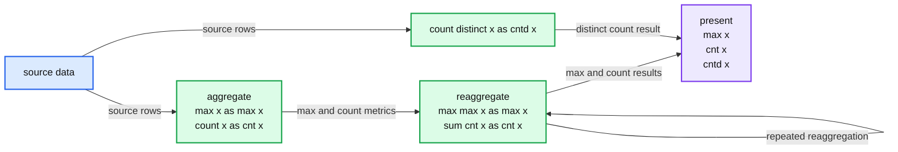

# Advanced Analytics with HyperLogLog Functions in Apache Spark

- Source: https://www.databricks.com/blog/2019/05/08/advanced-analytics-with-apache-spark.html
- Published: 2019-05-08
- Authors: Sim Simeonov
- Categories: engineering, solutions, open-source
- Images: 2 total, 2 extracted as architecture

[Read Rise of the Data Lakehouse](https://www.databricks.com/resources/ebook/rise-data-lakehouse?itm_data=advancedanalyticshyperloglogapachespark-blog-riselakehousebook) to explore why lakehouses are the data architecture of the future with the father of the data warehouse, Bill Inmon.

---

*This is a community guest blog from [Sim Simeonov](https://www.linkedin.com/in/simeons/), the founder & CTO of [Swoop](https://www.swoop.com/) and [IPM.ai](https://www.ipm.ai).*

Pre-aggregation is a common technique in the high-performance analytics toolbox. For example, 10 billion rows of website visitation data per hour may be reducible to 10 million rows of visit counts, aggregated by the superset of dimensions used in common queries, a 1000x reduction in data processing volume with a corresponding decrease in processing costs and waiting time to see the result of any query. Further improvements could come from computing higher-level aggregates, e.g., by day in the time dimension or by the site as opposed to by URL.

In this blog, we introduce the advanced HyperLogLog functionality of the open-source library [spark-alchemy](https://github.com/swoop-inc/spark-alchemy) and explore how it addresses data aggregation challenges at scale. But first, let’s explore some of the challenges.

## The Challenges of Reaggregation

Pre-aggregation is a powerful analytics technique… as long as the measures being computed are *reaggregable*. In the dictionary, aggregate has aggregable, so it's a small stretch to invent reaggregable as having the property that aggregates may be further reaggregated. Counts reaggregate with SUM, minimums with MIN, maximums with MAX, etc. The odd one out is distinct counts, which are not reaggregable. For example, the sum of the distinct count of visitors by site will typically not be equal to the distinct count of visitors across all sites because of double counting: the same visitor may visit multiple sites.

The non-reaggregability of distinct counts has far-reaching implications. The system computing distinct counts must have access to the most granular level of data. Further, queries that return distinct counts have to touch every row of granular data.

**Summary:** The diagram shows aggregate metrics being reaggregated and presented, while distinct counts must flow directly from source data to presentation.

**Components:**

- source data - Apache Spark input data
- aggregate - Apache Spark max and count aggregation
- reaggregate - Apache Spark max and sum reaggregation
- count distinct - Apache Spark distinct-count aggregation
- present - Apache Spark output metrics

**Flows:**

- source data -> aggregate: source rows
- aggregate -> reaggregate: max and count metrics
- reaggregate -> reaggregate: repeated reaggregation
- reaggregate -> present: max and count results
- source data -> count distinct: source rows
- count distinct -> present: distinct-count result

**Numbers:** none

source image: https://www.databricks.com/wp-content/uploads/2019/05/standard-workflow.png

When it comes to big data, distinct counts pose an additional challenge: during computation, they require memory proportional to the size of all distinct values being counted. In recent years, big data systems such as Apache Spark and analytics-oriented databases such as Amazon Redshift have introduced functionality for approximate distinct counting, a.k.a., cardinality estimation, using the HyperLogLog (HLL) probabilistic data structure. To use approximate distinct counts in Spark, replace `COUNT(DISTINCT x)` with `approx_count_distinct(x [, rsd])`. The optional rsd argument is the maximum estimation error allowed. The default is 5%. HLL performance analysis by Databricks indicates that Spark's approximate distinct counting may enable aggregations to run 2-8x faster compared to when precise counts are used, as long as the maximum estimation error is 1% or higher. However, if we require a lower estimation error, approximate distinct counts may actually take longer to compute than precise distinct counts.

A 2-8x reduction in query execution time is a solid improvement on its own, but it comes at the cost of an estimation error of 1% or more, which may not be acceptable in some situations. Further, 2-8x reduction gains for distinct counts pale in comparison to the 1000x gains available through pre-aggregation. What can we do about this?

## Revisiting HyperLogLog

The answer lies in the guts of the HyperLogLog algorithm. In the partitioned MapReduce pseudocode, the way Spark processes, HLL looks like this:

1. Map (for each partition)
  - Initialize an HLL data structure, called an HLL sketch
  - Add each input to the sketch
  - Emit the sketch
2. Reduce
  - Merge all sketches into an "aggregate" sketch
3. Finalize
  - Compute approximate distinct count from the aggregate sketch

Note that HLL sketches are reaggregable: when they are merged in the reduce operation, the result is an HLL sketch. If we serialize sketches as data, we can persist them in pre-aggregations and compute the approximate distinct counts at a later time, unlocking 1000x gains. This is huge!

There is another, subtler, but no less important, benefit: we are no longer bound by the practical requirement to have estimation errors of 1% or more. When pre-aggregation allows 1000x gains, we can easily build HLL sketches with very, very small estimation errors. It's rarely a problem for a pre-aggregation job to run 2-5x slower if there are 1000x gains at query time. This is the closest to a free lunch we can get in the big data business: significant cost/performance improvements without a negative trade-off from a business standpoint for most use cases.

## Introducing Spark-Alchemy: HLL Native Functions

Since Spark does not provide this functionality, [Swoop](https://www.swoop.com/) open-sourced a rich suite of native (high-performance) HLL functions as part of the [spark-alchemy](https://github.com/swoop-inc/spark-alchemy) library. Take a look at the [HLL docs](https://github.com/swoop-inc/spark-alchemy/wiki/Spark-HyperLogLog-Functions), which have lots of examples. To the best of our knowledge, this is the richest set of big data HyperLogLog processing capabilities, exceeding even [BigQuery's HLL support](https://cloud.google.com/bigquery/docs/reference/standard-sql/functions-and-operators#hyperloglog-functions).

The following diagram demonstrates how spark-alchemy handles initial aggregation (via `hll_init_agg`), reaggregation (via `hll_merge`) and presentation (via `hll_cardinality`).

**Summary:** The diagram shows HyperLogLog data processing through aggregation, reaggregation, and final cardinality presentation.

**Components:**

- source data: input records
- aggregate: Apache Spark with spark-alchemy HLL initialization
- reaggregate: Apache Spark with HLL merge operations
- present: Apache Spark with HLL cardinality estimation

**Flows:**

- source data -> aggregate: source records
- aggregate -> reaggregate: aggregated HLL sketches
- aggregate -> reaggregate: HLL sketches supplied for merging
- reaggregate -> present: merged HLL sketch

**Numbers:** none

source image: https://www.databricks.com/wp-content/uploads/2019/05/workflow-with-hll-functions.png

```mermaid
%% HyperLogLog aggregation, reaggregation, and presentation flow
flowchart LR
    A[source data]
    B[aggregate<br/>max x as max x<br/>count x as cnt x<br/>hll init agg as hll x]
    C[reaggregate<br/>max max x as max x<br/>count cnt x as cnt x<br/>hll merge hll x as hll x]
    D[present<br/>max x<br/>cnt x<br/>hll cardinality hll x as cntd x]

    A -->|source records| B
    B -->|aggregated HLL sketches| C
    B -->|HLL sketches| C
    C -->|merged HLL sketch| D

    classDef client fill:#dbeafe,stroke:#2563eb,stroke-width:2px,color:#111
    classDef service fill:#dcfce7,stroke:#16a34a,stroke-width:2px,color:#111
    classDef store fill:#ede9fe,stroke:#7c3aed,stroke-width:2px,color:#111
    classDef cache fill:#fef3c7,stroke:#d97706,stroke-width:2px,color:#111
    classDef queue fill:#cffafe,stroke:#0891b2,stroke-width:2px,color:#111
    classDef critical fill:#fee2e2,stroke:#dc2626,stroke-width:4px,color:#111
    classDef external fill:#e5e7eb,stroke:#6b7280,stroke-width:2px,color:#111,stroke-dasharray:4 3
    classDef decision fill:#fce7f3,stroke:#db2777,stroke-width:2px,color:#111

    class A external
    class B,C,D service
```

If you are wondering about the storage cost of HLL sketches, the simple rule of thumb is that a 2x increase in HLL cardinality estimation precision requires a 4x increase in the size of HLL sketches. In most applications, the reduction in the number of rows far outweighs the increase in storage due to the HLL sketches.

| error | sketch_size_in_bytes |
|---|---|
| 0.005 | 43702 |
| 0.01 | 10933 |
| 0.02 | 2741 |
| 0.03 | 1377 |
| 0.04 | 693 |
| 0.05 | 353 |
| 0.06 | 353 |
| 0.07 | 181 |
| 0.08 | 181 |
| 0.09 | 181 |
| 0.1 | 96 |

## HyperLogLog Interoperability

The switch from precise to approximate distinct counts and the ability to save HLL sketches as a column of data has eliminated the need to process every row of granular data at final query time, but we are still left with the implicit requirement that the system working with HLL data has to have access to all granular data. The reason is that there is no industry-standard representation for HLL data structure serialization. Most implementations, such as BigQuery's, use undocumented opaque binary data, which cannot be shared across systems. This interoperability challenge significantly increases the cost and complexity of interactive analytics systems.

A key requirement for interactive analytics systems is very fast query response times. This is not a core design goal for big data systems such as Spark or BigQuery, which is why interactive analytics queries are typically executed by some relational or, in some cases, NoSQL database. Without HLL sketch interoperability at the data level, we'd be back to square one.

To address this issue, when implementing the HLL capabilities in spark-alchemy, we purposefully chose an HLL implementation with a published [storage specification](https://github.com/aggregateknowledge/hll-storage-spec) and [built-in support for Postgres-compatible databases](https://github.com/citusdata/postgresql-hll) and even [JavaScript](https://github.com/aggregateknowledge/js-hll). This allows Spark to serve as a universal data pre-processing platform for systems that require fast query turnaround times, such as portals & dashboards. The benefits of this architecture are significant:

- 99+% of the data is managed via Spark only, with no duplication
- 99+% of processing happens through Spark, during pre-aggregation
- Interactive queries run much, much faster and require far fewer resources

## Summary

In summary, we have shown how the commonly-used technique of pre-aggregation can be efficiently extended to distinct counts using HyperLogLog data structures, which not only unlocks potential 1000x gains in processing speed but also gives us interoperability between Apache Spark, RDBMSs and even JavaScript. It's hard to believe, but we may have gotten very close to two free lunches in one big data blog post, all because of the power of HLL sketches and Spark's powerful extensibility.

Advanced HLL processing is just one of the goodies in [spark-alchemy](https://github.com/swoop-inc/spark-alchemy). Check out [what's coming](https://github.com/swoop-inc/spark-alchemy#whats-coming) and [let us know](mailto:spark-interest@swoop.com) which items on the list are important to you and what else you'd like to see there.

Last but most definitely not least, the data engineering and data science teams at Swoop would like to thank the engineering and support teams at Databricks for partnering with us to redefine what is possible with Apache Spark. You rock!
