# How Tilting Point Does Streaming Ingestion into Delta Lake

- Source: https://www.databricks.com/blog/2019/05/10/how-tilting-point-does-streaming-ingestion-into-delta-lake.html
- Published: 2019-05-10
- Authors: Diego Link, Vini Jaiswal
- Categories: company, product, data-streaming
- Images: 1 total, 1 extracted as architecture

[Get an early preview of O'Reilly's new ebook](https://www.databricks.com/resources/ebook/delta-lake-running-oreilly?itm_data=tiltingpointstreamingingestiondeltalake-blog-oreillydlupandrunning) for the step-by-step guidance you need to start using Delta Lake.

---

*Diego Link is VP of Engineering at Tilting Point*

Tilting Point is a new-generation games partner that provides top development studios with expert resources, services, and operational support to optimize high quality live games for success. Through its user acquisition fund and its world-class technology platform, Tilting Point funds and runs performance marketing management and live games operations to help developers achieve profitable scale.

At Tilting Point, we were running daily / hourly batch jobs for reporting on game analytics. We wanted to make our reporting near real-time and make sure that we get insights in 5 to 10 mins. We also wanted to make our in-game live-ops decisions based on real-time player behavior for giving real time data to a bundles and offer system, provide up-to-the-minute alerting on LiveOPs changes that actually might have unforeseen detrimental effects and even alert on service interruptions in game operations. Additionally, we had to store encrypted Personally Identifiable Information (PII) data separately for GDPR purposes.

## How data flows and associated challenges

We have a proprietary SDK that developers integrate with to send data from game servers to an ingest server hosted in AWS. This service removes all PII data and then sends the raw data to an Amazon Firehose endpoint. Firehose then dumps the data in JSON format continuously to S3.

To clean up the raw data and make it available quickly for analytics, we considered pushing the continuous data from Firehose to a message bus (e.g. Kafka, Kinesis) and then use [Apache Spark’s Structured Streaming](https://spark.apache.org/docs/latest/structured-streaming-programming-guide.html) to continuously process data and write to Delta Lake tables. While that architecture sounds ideal for low latency requirements of processing data in seconds, we didn’t have such low latency needs for our ingestion pipeline. We wanted to make the data available for analytics in a few minutes, not seconds. Hence we decided to simplify our architecture by eliminating a message bus and instead using S3 as a continuous source for our structured streaming job. But the key challenge in using S3 as a continuous source is identifying files that changed recently.

Listing all files every few minutes has 2 major issues:

- Higher latency: Listing all files in a directory with a large number of files has high overhead and increases processing time.
- Higher cost: Listing lot of files every few minutes can quickly add to the S3 cost.

## Leveraging Structured Streaming with Blob Store as Source and Delta Lake Tables as Sink

To continuously stream data from cloud blob storage like S3, we use [Databricks’ S3-SQS source.](https://docs.databricks.com/spark/latest/structured-streaming/sqs.html#optimized-s3-file-source-with-sqs) The S3-SQS source provides an easy way for us to incrementally stream data from S3 without the need to write any state management code on what files were recently processed. This is how our ingestion pipeline looks:

- [Configure Amazon S3 event notifications](https://docs.aws.amazon.com/AmazonS3/latest/userguide/NotificationHowTo.html) to send new file arrival information to SQS via SNS.
- We use the S3-SQS source to read the new data arriving in S3. The S3-SQS source reads the new file names that arrived in S3 from SQS and uses that information to read the actual file contents in S3. An example code below:

- Our structured streaming job then cleans up and transforms the data. Based on the game data, the streaming job uses the foreachBatch API of Spark streaming and writes to 30 different Delta Lake tables.
- The streaming job produces lot of small files. This affects performance of downstream consumers. So, an optimize job runs daily to compact small files in the table and store them as right file sizes so that consumers of the data have good performance while reading the data from Delta Lake tables. We also run a weekly optimize job for a second round of compaction.

**Summary:** The diagram shows continuous and batch data ingestion from callback sources into Delta Lake tables, with encrypted PII routed separately.

**Components:**

- Batch Jobs ETL using Airflow
- Raw Data using Amazon S3
- Long Term Storage using Glacier
- Game events using Kinesis Firehose
- Messaging using Amazon SNS and SQS
- PII events using encrypted Kinesis Firehose
- Ingestion compute using an EC2 Ingest Server
- Callback sources using Adjust, AppsFlyer, and TP_EVENTS SDK
- Structured Streaming Realtime Data using Apache Spark
- Delta Lake Tables
- Player Warehouse Encrypted PII using Delta Lake

**Flows:**

- Batch Jobs ETL -> Raw Data: batch raw data writes
- Raw Data -> Glacier: long term storage
- Raw Data -> Delta Lake Tables: daily batch
- Game Kinesis Firehose -> Raw Data: game event data
- Raw Data -> SNS: event notification
- SNS -> SQS: queued event message
- SQS -> Structured Streaming Realtime Data: streaming event delivery
- Callback Event Data Sources -> EC2 Ingest Server: realtime callbacks
- EC2 Ingest Server -> Game Kinesis Firehose: game event ingestion
- EC2 Ingest Server -> PII Encrypt: callback data for encryption decision
- PII Encrypt -> PII Kinesis Firehose: encrypted PII events
- PII Kinesis Firehose -> S3 Event Trigger SNS: PII object event
- S3 Event Trigger SNS -> PII SQS: queued PII notification
- PII SQS -> Structured Streaming Realtime Data: PII streaming delivery
- Structured Streaming Realtime Data -> Delta Lake Tables: structured realtime data
- Structured Streaming Realtime Data -> Player Warehouse Encrypted PII: encrypted PII data

**Numbers:** S3, EC2, S3 Event Trigger

```mermaid
%% Continuous and batch ingestion into Delta Lake with separate encrypted PII flow
flowchart LR
    C[Callback Event Data Sources]
    A[Airflow Batch Jobs]
    I[EC2 Ingest Server]
    K[Game Kinesis Firehose]
    R[Raw Data S3]
    G[Glacier Long Term Storage]
    N[SNS Notifications]
    Q[SQS Event Queue]
    P[PII Encrypt]
    PK[PII Kinesis Firehose]
    PN[SNS S3 Event Trigger]
    PQ[SQS PII Queue]
    S[Apache Spark Structured Streaming]
    D[Delta Lake Tables]
    W[Player Warehouse Encrypted PII]

    C -->|realtime callbacks| I
    A -->|batch writes| R
    I -->|game events| K
    K -->|raw game data| R
    R -->|long term storage| G
    R -->|event notification| N
    N -->|queued message| Q
    Q -->|streaming data| S
    I -->|PII callback data| P
    P -->|encrypted PII| PK
    PK -->|S3 event| PN
    PN -->|queued PII message| PQ
    PQ -->|PII streaming data| S
    R -->|daily batch| D
    S -->|structured realtime data| D
    S -->|encrypted PII data| W

    classDef client   fill:#dbeafe,stroke:#2563eb,stroke-width:2px,color:#111
    classDef service  fill:#dcfce7,stroke:#16a34a,stroke-width:2px,color:#111
    classDef store    fill:#ede9fe,stroke:#7c3aed,stroke-width:2px,color:#111
    classDef cache    fill:#fef3c7,stroke:#d97706,stroke-width:2px,color:#111
    classDef queue    fill:#cffafe,stroke:#0891b2,stroke-width:2px,color:#111
    classDef critical fill:#fee2e2,stroke:#dc2626,stroke-width:4px,color:#111
    classDef external fill:#e5e7eb,stroke:#6b7280,stroke-width:2px,color:#111,stroke-dasharray:4 3
    classDef decision fill:#fce7f3,stroke:#db2777,stroke-width:2px,color:#111

    class C external
    class A,I,K,PK,S service
    class R,G,D,W store
    class N,PN queue
    class Q,PQ queue
    class P decision
```

source image: https://www.databricks.com/wp-content/uploads/2019/05/Arch-DeltaLakes-Tables.png

Architecture showing continuous data ingest into Delta Lake Tables

 

 

 

The above Delta Lake ingestion architecture helps in the following ways:

- Incremental loading: The S3-SQS source incrementally loads the new files in S3. This helps quickly process the new files without too much overhead in listing files.
- No explicit file state management: There is no explicit file state management needed to look for recent files.
- Lower operational burden: Since we use S3 as a checkpoint between Firehose and structured streaming jobs, the operational burden to stop streams and re-process data is relatively low.
- Reliable ingestion: Delta Lake uses [optimistic concurrency control](https://docs.databricks.com/delta/optimizations/isolation-level.html) to offer ACID transactional guarantees. This helps with reliable data ingestion.
- File compaction: One of the major problems with streaming ingestion is tables ending up with a large number of small files that can affect read performance. Before Delta Lake, we had to setup a different table to write the compacted data. With Delta Lake, thanks to ACID transactions, we can compact the files and rewrite the data back to the same table safely.
- Snapshot isolation: Delta Lake’s snapshot isolation allows us to expose the ingestion tables to downstream consumers while data is being appended by a streaming job and modified during compaction.
- Rollbacks: In case of bad writes, [Delta Lake's Time Travel](https://www.databricks.com/blog/2019/02/04/introducing-delta-time-travel-for-large-scale-data-lakes.html) helps us rollback to a previous version of the table.

## Conclusion

In this blog, we walked through our use cases and how we do streaming ingestion using Databricks’ S3-SQS source into Delta Lake tables efficiently without too much operational overhead to make good quality data readily available for analytics.
  

**Interested in the open source Delta Lake?**
[Visit the Delta Lake online hub](https://delta.io?utm_source=delta-blog) to learn more, download the latest code and join the Delta Lake community.
