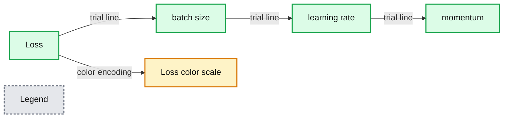

# Hyperparameter Tuning with MLflow, Apache Spark MLlib and Hyperopt

- Source: https://www.databricks.com/blog/2019/06/07/hyperparameter-tuning-with-mlflow-apache-spark-mllib-and-hyperopt.html
- Published: 2019-06-07
- Authors: Joseph Bradley, Cyrielle Simeone
- Categories: solutions, engineering, open-source, data-science-machine-learning
- Images: 1 total, 1 extracted as architecture

Hyperparameter tuning is a common technique to optimize machine learning models based on hyperparameters, or configurations that are not learned during model training.  Tuning these configurations can dramatically improve model performance. However, hyperparameter tuning can be computationally expensive, slow, and unintuitive even for experts.

Databricks Runtime 5.4 and 5.4 ML ([Azure](https://docs.microsoft.com/en-us/azure/databricks/release-notes/runtime/5.4ml) | [AWS](https://docs.databricks.com/release-notes/runtime/5.4ml.html)) introduce new features which help to scale and simplify hyperparameter tuning. These features support tuning for ML in Python, with an emphasis on scalability via Apache Spark and automated tracking via MLflow.

## MLflow: tracking tuning workflows

Hyperparameter tuning creates complex workflows involving testing many hyperparameter settings, generating lots of models, and iterating on an ML pipeline.  To simplify tracking and reproducibility for tuning workflows, we use [MLflow](https://mlflow.org/), an open source platform to help manage the complete machine learning lifecycle.  Learn more about MLflow in the [MLflow docs](https://mlflow.org/docs/latest/index.html) and the recent [Spark+AI Summit 2019 talks on MLflow](https://www.databricks.com/blog/2019/04/18/a-guide-to-mlflow-talks-at-spark-ai-summit-2019.html).

Our integrations encourage some best practices for organizing runs and tracking for hyperparameter tuning.  At a high level, we organize runs as follows, matching the structure used by tuning itself:

| **Tuning** | **MLflow runs** | **MLflow logging** |
|---|---|---|
| Hyperparameter tuning algorithm | Parent run | Metadata, e.g., numFolds for `CrossValidator` |
| Fit & evaluate model with hyperparameter setting #1 | Child run 1 | Hyperparameters #1, evaluation metric #1 |
| Fit & evaluate model with hyperparameter setting #2 | Child run 2 | Hyperparameters #2, evaluation metric #2 |
| ... | ... | ... |

To learn more, check out this talk on “[Best Practices for Hyperparameter Tuning with MLflow](https://www.databricks.com/session/best-practices-for-hyperparameter-tuning-with-mlflow)” from the Spark+AI Summit 2019.

Managed MLflow is now [generally available on Databricks](https://www.databricks.com/blog/2019/04/25/announcing-general-availability-of-managed-mlflow-on-databricks.html), and the two integrations we discuss next leverage managed MLflow by default when the MLflow library is installed on the cluster.

## Apache Spark MLlib + MLflow integration

Apache Spark MLlib users often tune hyperparameters using MLlib’s built-in tools `CrossValidator` and `TrainValidationSplit`.  These use grid search to try out a user-specified set of hyperparameter values; see the [Spark docs on tuning](https://spark.apache.org/docs/latest/ml-tuning.html) for more info.

Databricks Runtime 5.3 and 5.3 ML and above support automatic MLflow tracking for MLlib tuning in Python.

With this feature, [PySpark](https://www.databricks.com/glossary/pyspark) `CrossValidator` and `TrainValidationSplit` will automatically log to MLflow, organizing runs in a hierarchy and logging hyperparameters and the evaluation metric.  For example, calling `CrossValidator.fit()` will log one parent run.  Under this run, `CrossValidator` will log one child run for each hyperparameter setting, and each of those child runs will include the hyperparameter setting and the evaluation metric.  Comparing these runs in the MLflow UI helps with visualizing the effect of tuning each hyperparameter.

https://www.youtube.com/watch?v=DFn3hS-s7OA

In Databricks Runtime 5.3 and 5.3 ML, automatic tracking is not enabled by default. To turn automatic tracking on, set the Spark Configuration `spark.databricks.mlflow.trackMLlib.enabled` to “true”.  With the 5.4 releases, automatic tracking is enabled by default.

Check out the docs ([AWS](https://docs.databricks.com/applications/machine-learning/automl-hyperparam-tuning/mllib-mlflow-integration.html) | [Azure](https://docs.microsoft.com/en-us/azure/databricks/applications/machine-learning/automl-hyperparam-tuning/mllib-mlflow-integration)) to get started!

## Distributed Hyperopt + MLflow integration

Hyperopt is a popular open-source hyperparameter tuning library with strong community support (600,000+ PyPI downloads, 3300+ stars on Github as of May 2019). Data scientists use Hyperopt for its simplicity and effectiveness. Hyperopt offers two tuning algorithms: Random Search and the Bayesian method Tree of Parzen Estimators, which offers improved compute efficiency compared to a brute force approach such as grid search. However, *distributing* Hyperopt previously did not work out of the box and required manual setup.

In Databricks Runtime 5.4 ML, we introduce an implementation of Hyperopt powered by Apache Spark. Using a new `Trials` class `SparkTrials`, you can easily distribute a Hyperopt run without making any changes to the current Hyperopt APIs. You simply need to pass in the `SparkTrials` class when applying the `hyperopt.fmin()` function (see the example code below). In addition, all tuning experiments, along with their hyperparameters and evaluation metrics, are automatically logged to MLflow in Databricks. With this feature, we aim to improve efficiency, scalability, and simplicity for hyperparameter tuning workflows.

Check out the docs ([Azure](https://docs.microsoft.com/en-us/azure/databricks/applications/machine-learning/automl-hyperparam-tuning/hyperopt-spark-mlflow-integration) | [AWS](https://docs.databricks.com/applications/machine-learning/automl-hyperparam-tuning/hyperopt-spark-mlflow-integration.html)) to get started!

The results can be visualized using tools such as parallel coordinates plots.  In the plot below, we can see that the Deep Learning models with the best (lowest) losses were trained using medium to large batch sizes, small to medium learning rates, and a variety of momentum settings. Note that this plot was made by hand via `plotly`, but MLflow will provide native support for parallel coordinates plots in the near future.

**Summary:** Parallel coordinates plot showing deep learning loss across batch size, learning rate, and momentum hyperparameters.

**Components:**

- Loss axis
- batch_size axis
- learning_rate axis
- momentum axis
- Color scale for loss

**Flows:**

- Loss -> batch_size: parallel coordinate trial lines
- batch_size -> learning_rate: parallel coordinate trial lines
- learning_rate -> momentum: parallel coordinate trial lines
- Loss -> Color scale: loss-based color encoding

**Numbers:**

- Loss: 2.3120548725128174, 2.0, 1.5, 1.0, 0.5, 24.58660863339901m
- batch_size: 196.42973338802618, 150, 100, 50, 18.367875211752462
- learning_rate: 749.6944623912922m, 700m, 600m, 500m, 400m, 300m, 200m, 135.797404499941m
- momentum: 481.5899866576422m, 450m, 400m, 350m, 300m, 250m, 200m, 153.83715211451647m
- Color scale: -1000, -2000, -3000, -4000

source image: https://www.databricks.com/wp-content/uploads/2019/06/image1-1.png

At Databricks, we embrace open source communities and APIs. We are working with the Hyperopt community to contribute this Spark-powered implementation to open source Hyperopt. Stay tuned.

## Get started!

To learn more about hyperparameter tuning in general:

- Don’t miss our upcoming webinar [Automated Hyperparameter Tuning, Scaling, and Tracking on Databricks](https://pages.databricks.com/201906-WB-AutomatedHyperparameterTuning_Reg.html) for a deeper dive and live demos – on Thursday June 20th.
- Check out these talks from the Spark+AI Summit 2019:
  - [“Best Practices for Hyperparameter Tuning with MLflow”](https://www.databricks.com/session/best-practices-for-hyperparameter-tuning-with-mlflow) by Joseph Bradley
  - [“Advanced Hyperparameter Optimization for Deep Learning with MLflow”](https://www.databricks.com/session/advanced-hyperparameter-optimization-for-deep-learning-with-mlflow) by Maneesh Bhide

To learn more about MLflow, check out these resources:

- [MLflow website](https://mlflow.org/)
- [MLflow documentation](https://mlflow.org/docs/latest/index.html)
- [Spark+AI Summit 2019 talks on MLflow](https://www.databricks.com/blog/2019/04/18/a-guide-to-mlflow-talks-at-spark-ai-summit-2019.html), including the [MLflow keynote](https://youtu.be/QJW_kkRWAUs)

To start using these specific features, check out the following doc pages and their embedded example notebooks.  Try them out with the new Databricks Runtime 5.4 ML release.

- For MLlib use cases, look at the MLlib + Automated MLflow Tracking docs ([AWS](https://docs.databricks.com/applications/machine-learning/automl-hyperparam-tuning/mllib-mlflow-integration.html) | [Azure](https://docs.microsoft.com/en-us/azure/databricks/applications/machine-learning/automl-hyperparam-tuning/mllib-mlflow-integration)).
- For single-machine Python ML use cases (e.g., scikit-learn, single-machine TensorFlow), look at the Distributed Hyperopt + Automated MLflow Tracking docs ([Azure](https://docs.microsoft.com/en-us/azure/databricks/applications/machine-learning/automl-hyperparam-tuning/hyperopt-spark-mlflow-integration) | [AWS](https://docs.databricks.com/applications/machine-learning/automl-hyperparam-tuning/hyperopt-spark-mlflow-integration.html)).
- For non-MLlib distributed ML use cases (e.g., HorovodRunner), look at [MLflow’s examples](https://github.com/mlflow/mlflow/tree/82c309994d1c77bca540d4baa31c155f3a6113de/examples/hyperparam) on adding tracking to Hyperopt and other tools.
