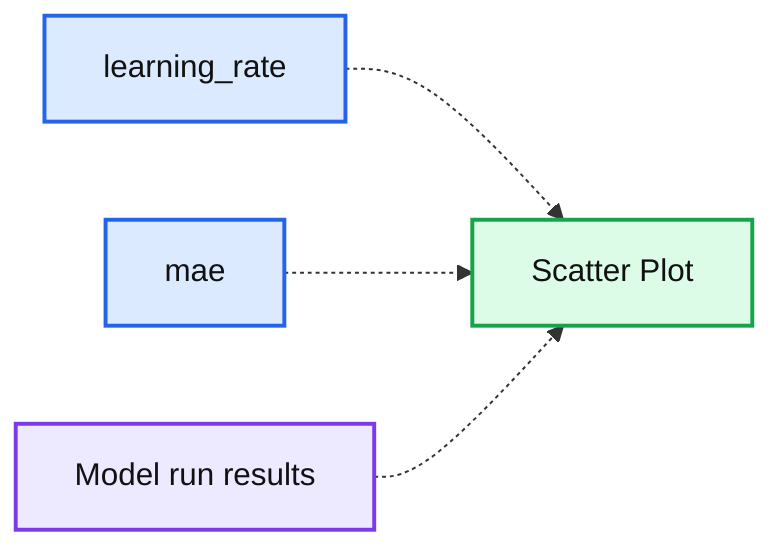
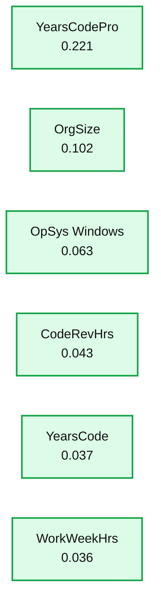
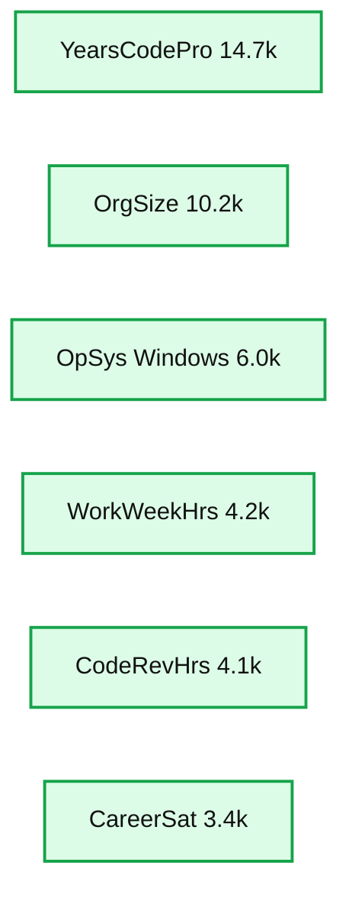
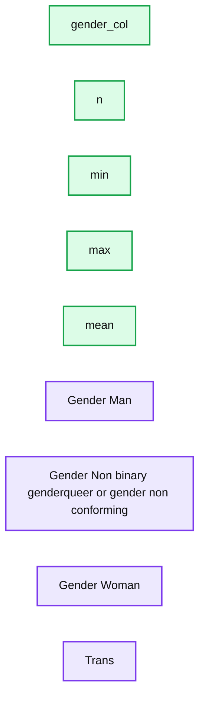
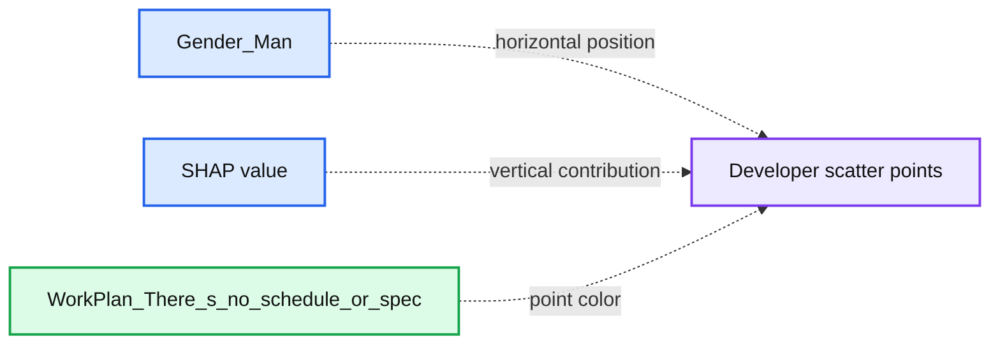
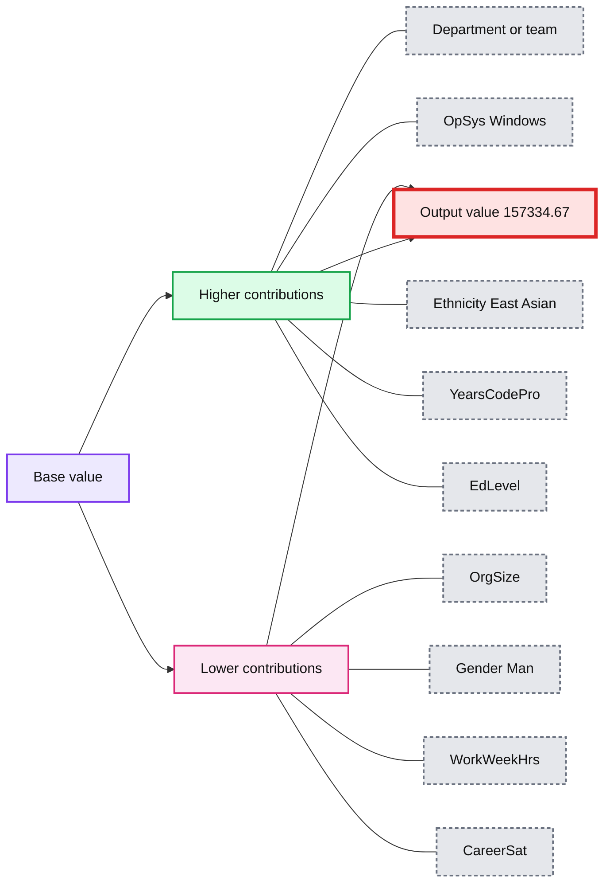
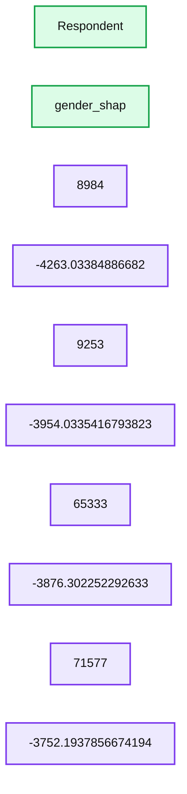
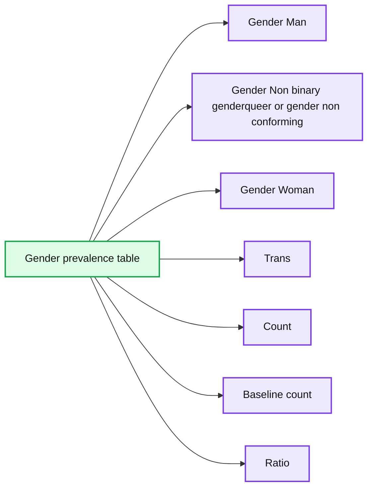

# Detecting Data Bias Using SHAP and Machine Learning

*What Machine Learning and SHAP Can Tell Us about the Relationship between Developer Salaries and the Gender Pay Gap*

- Source: https://www.databricks.com/blog/2019/06/17/detecting-bias-with-shap.html
- Published: 2019-06-17
- Authors: Sean Owen
- Categories: engineering, open-source, data-science-machine-learning, news
- Images: 8 total, 8 extracted as architecture

>  [Try the Detecting Data Bias Using SHAP notebook](https://pages.databricks.com/rs/094-YMS-629/images/so_dev_survey_2019.html) to reproduce the steps outlined below and [watch our on-demand webinar](https://www.databricks.com/discover/detecting-bias-with-shap) to learn more.

[StackOverflow's annual developer survey](https://insights.stackoverflow.com/survey/2019) concluded earlier this year, and they have graciously published the (anonymized) 2019 results for analysis. They're a rich view into the experience of software developers around the world -- what's their favorite editor? how many years of experience? [tabs or spaces](https://stackoverflow.blog/2017/06/15/developers-use-spaces-make-money-use-tabs/)? and crucially, salary. Software engineers' salaries are good, and sometimes both eye-watering and news-worthy.

The tech industry is also painfully aware that it does not always live up to its purported meritocratic ideals. Pay isn't a pure function of merit, and story after story tells us that factors like name-brand school, age, race, and gender have an effect on outcomes like salary.

Can machine learning do more than predict things? Can it explain salaries and so highlight cases where these factors might be undesirably causing pay differences? This example will sketch how standard models can be augmented with [SHAP (SHapley Additive exPlanations)](https://arxiv.org/abs/1705.07874) to detect individual instances whose predictions may be concerning, and then dig deeper into the specific reasons the data leads to those predictions.

## Model Bias or Data (about) Bias?

While this topic is often characterized as detecting "model bias", a model is merely a mirror of the data it was trained on. If the model is 'biased' then it learned that from the historical facts of the data. Models are not the problem per se; they are an opportunity to analyze data for evidence of bias.

Explaining models isn't new, and most libraries can assess the relative importance of the inputs to a model. These are aggregate views of inputs' effects. However, the output of some machine learning models has highly individual effects: is your loan approved? will you receive financial aid? are you a suspicious traveller?

Indeed, StackOverflow offers a handy calculator to estimate one's expected salary, based on its survey. We can only speculate about how accurate the predictions are overall, but all that a developer particularly cares about is his or her own prospects.

The right question may not be, does the data suggest bias overall? but rather, does the data show individual instances of bias?

## Assessing the StackOverflow Survey Data

The 2019 data is, thankfully, clean and free of data problems. It contains responses to 85 questions from about 88,000 developers.

This example focuses only on full-time developers. The data set contains plenty of relevant information, like years of experience, education, role, and demographic information. Notably, this data set doesn't contain information about bonuses and equity, just salary.

It also has responses to wide-ranging questions about attitudes on blockchain, fizz buzz, and the survey itself. These are excluded here as unlikely to reflect the experience and skills that presumably *should* determine compensation. Likewise, for simplicity, it will also only focus on US-based developers.

The data needs a little more transformation before modeling. Several questions allow multiple responses, like *"What are your greatest challenges to productivity as a developer?"* These single questions yield multiple yes/no responses and need to be broken out into multiple yes/no features.

Some multiple-choice questions like *"Approximately how many people are employed by the company or organization you work for?"* afford responses like *"2-9 employees"*. These are effectively binned continuous values, and it may be useful to map them back to inferred continuous values like "2" so that the model may consider their order and relative magnitude. This translation is unfortunately manual and entails some judgment calls.

The [Apache Spark](https://www.databricks.com/spark/about) code that can accomplish this is in the [accompanying notebook](https://pages.databricks.com/rs/094-YMS-629/images/so_dev_survey_2019.html), for the interested.

## Model Selection with Apache Spark

With the data in a more machine-learning-friendly form, the next step is to fit a regression model that predicts salary from these features. The data set itself, after filtering and transformation with Spark, is a mere 4MB, containing 206 features from about 12,600 developers, and could easily fit in memory as a [DataFrame on your wristwatch, let alone a server.](https://www.databricks.com/glossary/pandas-dataframe)

[`xgboost`](https://xgboost.readthedocs.io/en/latest/), a popular gradient-boosted trees package, can fit a model to this data in minutes on a single machine, without Spark. `xgboost` offers many tunable "hyperparameters" that affect the quality of the model: maximum depth, learning rate, regularization, and so on. Rather than guess, simple standard practice is to try lots of settings of these values and pick the combination that results in the most accurate model.

Fortunately, this is where Spark comes back in. It can build hundreds of these models in parallel and collect the results of each. Because the data set is small, it's simple to broadcast it to the workers, create a bunch of combinations of those hyperparameters to try, and use Spark to apply the same simple non-distributed `xgboost` code that could build a model locally to the data with each combination.

That will create a lot of models. To track and evaluate the results, [mlflow](https://mlflow.org) can log each one with its metrics and hyperparameters, and view them in the notebook's Experiment. Here, one hyperparameter over many runs is compared to the resulting accuracy (mean absolute error):

**Summary:** Scatter plot showing mean absolute error against learning rate across multiple MLflow model runs.

**Components:**

- Scatter Plot: MLflow visualization
- X-axis: learning_rate hyperparameter
- Y-axis: mae metric
- Data points: model-run results

**Flows:**

- none

**Numbers:** 0.02, 0.04, 0.06, 0.08, 0.1, 28k, 28.2k, 28.4k, 28.6k, 28.8k, 29k, 29.2k, 29.4k

source image: https://www.databricks.com/wp-content/uploads/2019/06/Figure-1.png

The single model that showed the lowest error on the held-out validation data set is of interest. It yielded a mean absolute error of about $28,000 on salaries that average about $119,000. Not terrible, although we should realize the model can only explain *most* of the variation in salary.

## Interpreting the xgboost Model

Although the model can be used to predict future salaries, instead, the question is what the model says about the data. What features seem to matter most when predicting salary accurately? The `xgboost` model itself computes a notion of feature importance:

**Summary:** Feature importance ranking for an XGBoost salary prediction model.

**Components:**

- YearsCodePro feature, importance about 0.22
- OrgSize feature, importance about 0.10
- OpSys Windows feature, importance about 0.06
- CodeRevHrs feature, importance about 0.04
- YearsCode feature, importance about 0.04
- WorkWeekHrs feature, importance about 0.04

**Flows:**

- none

**Numbers:** 0.00, 0.02, 0.04, 0.06, 0.08, 0.10, 0.12, 0.14, 0.16, 0.18, 0.20, 0.22, 0.24, approximately 0.221, 0.102, 0.063, 0.043, 0.037, 0.036

source image: https://www.databricks.com/wp-content/uploads/2019/06/Figure-2.png

Factors like years of coding professionally, organization size, and using Windows are most "important". This is interesting, but hard to interpret. The values reflect relative and not absolute importance. That is, the effect isn't measured in dollars. The definition of importance here (total gain) is also specific to how decision trees are built and are hard to map to an intuitive interpretation. The important features don’t even necessarily correlate positively with salary, either.

More importantly, this is a 'global' view of how much features matter in aggregate. Factors like gender and ethnicity don't show up on this list until farther along. This doesn't mean these factors aren’t still significant. For one, features can be correlated, or interact. It's possible that factors like gender correlate with other features that the trees selected instead, and this to some degree masks their effect.

The more interesting question is not so much whether these factors matter overall -- it’s possible that their average effect is relatively small -- but, whether they have a significant effect in some individual cases. These are the instances where the model is telling us something important about individuals’ experience, and to those individuals, that experience is what matters.

## Applying the Package SHAP for Developer-Level Explanations

Fortunately, a set of techniques for more theoretically sound model interpretation at the individual prediction level has emerged over the past five years or so. They are collectively "**Sh**apley **A**dditive Ex**p**lanations", and conveniently, are implemented in the Python package [shap](https://github.com/slundberg/shap).

Given any model, this library computes "SHAP values" from the model. These values are readily interpretable, as each value is a feature's effect on the prediction, in its units. A SHAP value of 1000 here means "explained +$1,000 of predicted salary". SHAP values are computed in a way that attempts to isolate away of correlation and interaction, as well.

SHAP values are also computed for every input, not the model as a whole, so these explanations are available for each input individually. It can also estimate the effect of feature interactions separately from the main effect of each feature, for each prediction.

## Explainable AI: Uncovering the Features’ Effects Overall

Developer-level explanations can aggregate into explanations of the features' effects on salary over the whole data set by simply averaging their absolute values. SHAP's assessment of the overall most important features is similar:

**Summary:** Bar chart showing mean absolute SHAP feature importance for predicted salary.

**Components:**

- YearsCodePro feature
- OrgSize feature
- OpSys Windows feature
- WorkWeekHrs feature
- CodeRevHrs feature
- CareerSat feature
- Mean absolute SHAP value axis

**Flows:**

- none

**Numbers:**

- 0.00
- 2.0k
- 4.0k
- 6.0k
- 8.0k
- 10k
- 12k
- 14k
- 16k
- YearsCodePro approximately 14.7k
- OrgSize approximately 10.2k
- OpSys Windows approximately 6.0k
- WorkWeekHrs approximately 4.2k
- CodeRevHrs approximately 4.1k
- CareerSat approximately 3.4k

source image: https://www.databricks.com/wp-content/uploads/2019/06/Figure-3.png

The SHAP values tell a similar story. First, SHAP is able to quantify the effect on salary in dollars, which greatly improves the interpretation of the results. Above is a plot the *absolute* effect of each feature on predicted salary, averaged across developers. Years of professional coding experience still dominates, explaining on average almost $15,000 of effect on salary.

## Examining the Effects of Gender with SHAP Values

We came to look specifically at the effects of gender, race, and other factors that presumably should not be predictive per se of salary at all. This example will examine the effect of gender, though this by no means suggests that it's the only or most important, type of bias to look for.

Gender is not binary, and the survey recognizes responses of "Man", "Woman", and "Non-binary, genderqueer, or gender non-conforming" as well as "Trans" separately. (Note that while the survey also separately records responses about sexuality, these are not considered here.) SHAP computes the effect on predicted salary for each of these. For a male developer (identifying only as male), the effect of gender is not just the effect of being male, but of not identifying as female, transgender, and so on.

SHAP values let us read off the sum of these effects for developers identifying as each of the four categories:

**Summary:** The table shows SHAP value statistics for predicted salary grouped by gender category.

**Components:**

- gender_col: categorical gender feature
- n: observation count
- min: minimum SHAP value
- max: maximum SHAP value
- mean: average SHAP value
- Gender Man: gender category
- Gender Non binary genderqueer or gender non conforming: gender category
- Gender Woman: gender category
- Trans: gender category

**Flows:**

- none

**Numbers:**

- Gender Man: n 10964, min -229.62548828125, max 893.8035888671875, mean 225.00830078125
- Gender Non binary genderqueer or gender non conforming: n 215, min -3265.29443359375, max 694.3992919921875, mean -1265.9705810546875
- Gender Woman: n 1321, min -4263.03369140625, max 694.3992919921875, mean -1320.6708984375
- Trans: n 178, min -2968.949462890625, max 391.37298583984375, mean -1245.6309814453125

source image: https://www.databricks.com/wp-content/uploads/2019/06/Figure-4.png

While male developers' gender explains about a modest -$230 to +$890 with mean about $225, for females, the range is wider, from about -$4,260 to -$690 with mean -$1,320. The results for transgender and non-binary developers is similar, though slightly less negative.

When evaluating what this means below, it's important to recall the limitations of the data and model here:

- Correlation isn't causation; 'explaining' predicted salary is suggestive, but doesn't prove, that a feature directly caused salary to be higher or lower
- The model isn't perfectly accurate
- This is just 1 year of data, and only from US developers
- This reflects only base salary, not bonuses or stock, which can vary more widely

## Using SHAP to Vizualize Features that Interact with Gender

The SHAP library offers interesting visualizations that leverage its ability to isolate the effect of feature interactions. For example, the values above suggest that developers who identify as male are predicted to earn a slightly higher salary than others, but is there more to it? A dependence plot like this one can help:

**Summary:** SHAP dependence scatter plot showing how `Gender_Man` relates to predicted salary, colored by `WorkPlan_There_s_no_schedule_or_spec`.

**Components:**

- `Gender_Man` x-axis feature
- `SHAP value` y-axis contribution to predicted salary
- `WorkPlan_There_s_no_schedule_or_spec` color feature
- Scatter points representing developers

**Flows:**

- none

**Numbers:** x-axis: -0.50, -0.25, 0.00, 0.25, 0.50, 0.75, 1.00, 1.25, 1.50. y-axis: -4000, -3000, -2000, -1000, 0, 1000. Color scale: 0.0, 0.5, 1.0.

source image: https://www.databricks.com/wp-content/uploads/2019/06/Figure-5.png

Dots are developers. Developers at the left are those that don't identify as male, and at the right, those that do, which are predominantly those identifying as only male. (The points are randomly spread horizontally for clarity.) The y-axis is SHAP value, or what identifying as male or not explains about predicted salary for each developer. As above, those not identifying as male show overall negative SHAP values, and one that varies widely, while others consistently show a small positive SHAP value.

What’s behind that variance? SHAP can select a second feature whose effect varies most given the value of, here, identifying as male or not.  It selects the answer "I work on what seems most important or urgent" to the question "How structured or planned is your work?"  Among developers identifying as male, those who answered this way (red points) appear to have slightly higher SHAP values. Among the rest, the effect is more mixed but seems to have generally lower SHAP values.

Interpretation is left to the reader, but perhaps: are male developers who feel empowered in this sense also enjoying slightly higher salaries, while other developers enjoy this where it goes hand in hand with lower-paying roles?

## Exploring Instances with Outsized Gender Effects

What about investigating the developer whose salary is most negatively affected? Just as it’s possible to look at the effect of gender-related features overall, it’s possible to search for the developer whose gender-related features had the *largest* impact on predicted salary. This person is female, and the effect is negative. According to the model, she is predicted to earn about $4,260 less per year because of her gender:

**Summary:** SHAP force plot showing how feature contributions raise or lower a developer’s predicted salary from the base value to an output value of 157,334.67.

**Components:**

- Base value
- Positive feature contributions: department or team, OpSys_Windows, Ethnicity_East_Asian, YearsCodePro, EdLevel
- Negative feature contributions: OrgSize, Gender_Man, WorkWeekHrs, CareerSat
- Output value

**Flows:**

- Base value -> Positive feature contributions: higher salary contributions
- Positive feature contributions -> Output value: cumulative increase
- Base value -> Negative feature contributions: lower salary contributions
- Negative feature contributions -> Output value: cumulative decrease

**Numbers:** 51e+4, -1,507, 1.849e+04, 3.849e+04, 5.849e+04, 7.849e+04, 9.849e+04, 1.185e+05, 1.385e+05, 157,334.67, 1.785e+05, 1.985e+05, 2.185e+05, 2.385e+05, 2.585

source image: https://www.databricks.com/wp-content/uploads/2019/06/Figure-6.png

The predicted salary, just over $157,000, accurate in this case, as her actual reported salary is $150,000.

The three most positive and negative features influencing predicted salary are that she:

- Has a college degree (only) (+$18,200)
- Has 10 years professional experience (+$9,400)
- Identifies as East Asian (+$9,100)
- ...
- Works 40 hours per week (-$4,000)
- **Does not identify as male (-$4,250)**
- Works at a medium-sized org of 100-499 employees (-$9,700)

Given the magnitude of the effect on the predicted salary of not identifying as male, we might stop here and investigate the details of this case offline to gain a better understanding of the context around this developer and whether her experience, or salary, or both, need a change.

## Explaining Interactions Using SHAP Values

There is more detail available within that -$4,260. SHAP can break down the effects of these features into interactions. The total effect of identifying as female on the prediction can be broken down into the effect of identifying as female *and* being an engineering manager, *and* working with Windows, etc.

The effect on predicted salary explained by the gender factors per se only adds up to about -$630. Rather, SHAP assigns most of the effects of gender to interactions with other features:

Identifying as female and working with PostgreSQL affects predicted salary slightly positively, whereas also identifying as East Asian predicted salary more negatively. Interpreting these values at this level of granularity is difficult in this context, but, this additional level of explanation is available.

## Applying SHAP with Apache Spark

SHAP values are computed independently for each row, given the model, and so this could have also been done in parallel with Spark. The following example computes SHAP values in parallel and similarly locates developers with outsized gender-related SHAP values:

**Summary:** Table of respondents and their gender-related SHAP values.

**Components:**

- Respondent column
- gender_shap column
- Respondent values 8984, 9253, 65333, 71577
- gender_shap values -4263.03384886682, -3954.0335416793823, -3876.302252292633, -3752.1937856674194

**Flows:**

- none

**Numbers:** 8984, 9253, 65333, 71577, -4263.03384886682, -3954.0335416793823, -3876.302252292633, -3752.1937856674194

source image: https://www.databricks.com/wp-content/uploads/2019/06/Figure-7.png

## Clustering SHAP values

Applying Spark is advantageous when there are a large number of predictions to assess with SHAP. Given that output, it's also possible to use Spark to cluster the results with, for example, [bisecting k-means](https://spark.apache.org/docs/latest/ml-clustering.html#bisecting-k-means):

The cluster whose total gender-related SHAP effects are most negative might bear some further investigation. What are the SHAP values of those respondents in the cluster? What do the members of the cluster look like with respect to the overall developer population?

**Summary:** Table showing relative prevalence of gender identities in the cluster with the most-negative gender-related SHAP values.

**Components:**

- Gender Man column
- Gender Non binary genderqueer or gender non conforming column
- Gender Woman column
- Trans column
- Count column
- Count baseline column
- Ratio column

**Flows:**

- none

**Numbers:**

- Counts: 448, 4, 15, 2, 5, 6, 2, 175
- Baseline counts: 10900, 75, 235, 30, 64, 62, 16, 1189
- Ratios: 0.7904888777177328, 1.0257534246575344, 1.227630428446517, 1.2821917808219179, 1.5025684931506849, 1.861246133451171, 2.404109589041096, 2.8307429980298857

source image: https://www.databricks.com/wp-content/uploads/2019/06/Figure-8.png

Developers identifying as female (only) are represented in this cluster at almost 2.8x the rate of the overall developer population, for example. This isn't surprising given the earlier analysis. This cluster could be further investigated to assess other factors specific to this group that contribute to overall lower predicted salary.

## Conclusion

This type of analysis with SHAP can be run for any model, and at scale too. As an analytical tool, it turns models into data detectives, to surface individual instances whose predictions suggest that they deserve more examination. The output of SHAP is easily interpretable and yields intuitive plots, that can be assessed case-by-case by business users.

Of course, this analysis isn't limited to examining questions of gender, age or race bias. More prosaically, it could be applied to customer churn models. There, the question is not just "will this customer churn?" but "why is the customer churning?" A customer who is canceling due to price may be offered a discount, while one canceling due to limited usage might need an upsell.

Finally, this analysis can be run as part of a validation process, bringing greater transparency to the machine learning model overall. Model validation often focuses on the overall accuracy of a model. It should also focus on the model's 'reasoning', or what features contributed most to the predictions. With SHAP, it can also help detect when too many individual *predictions'* explanations are at odds with overall feature importance.
