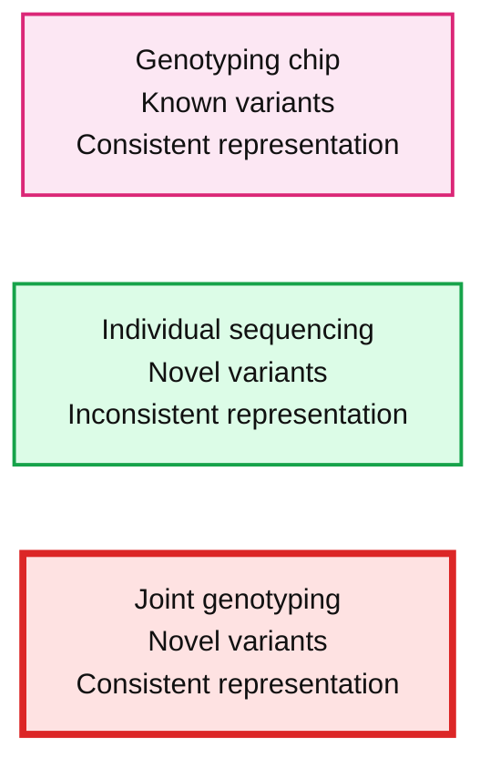
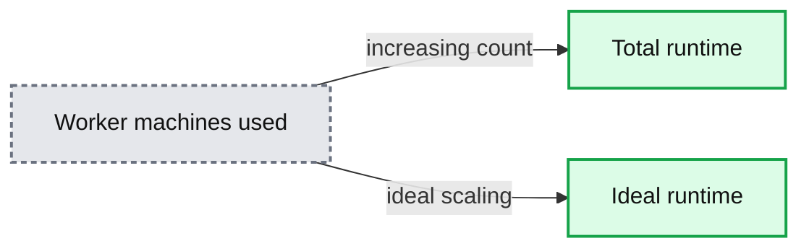
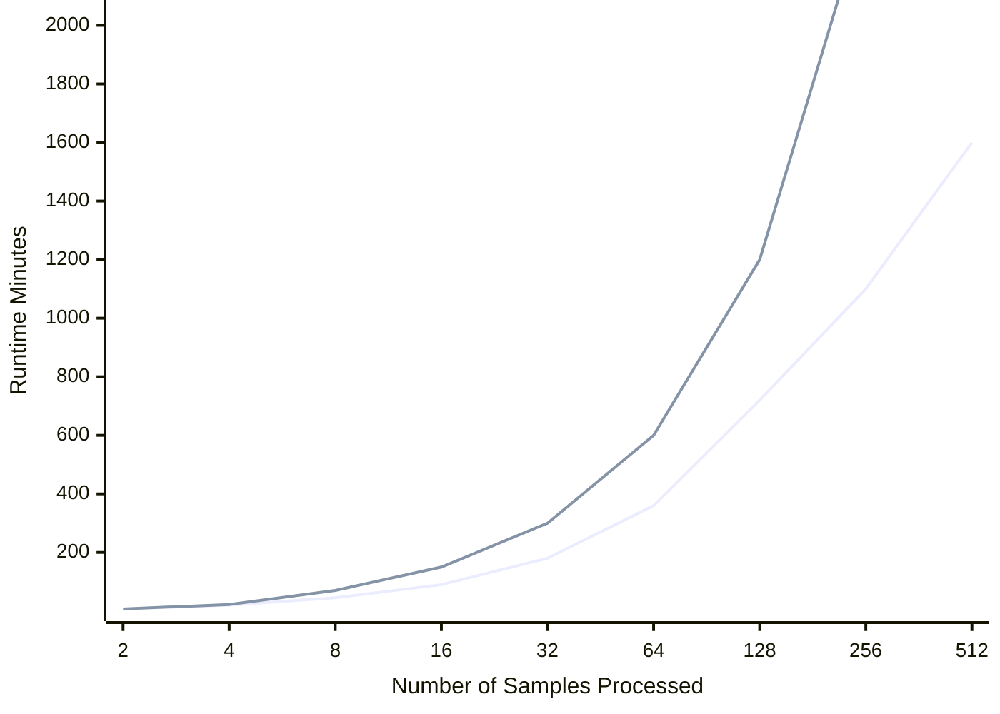

# Accurately Building Genomic Cohorts at Scale with Delta Lake and Spark SQL

- Source: https://www.databricks.com/blog/2019/06/19/accurately-building-genomic-cohorts-at-scale-with-delta-lake-and-spark-sql.html
- Published: 2019-06-19
- Authors: Frank Austin Nothaft, Karen Feng
- Categories: solutions, engineering, open-source
- Images: 4 total, 4 extracted as architecture

[Get an early preview of O'Reilly's new ebook](https://www.databricks.com/resources/ebook/delta-lake-running-oreilly?itm_data=buildinggenomiccohortsdeltalakesparksql-blog-oreillydlupandrunning) for the step-by-step guidance you need to start using Delta Lake.

---

*This is the second post in our “Genomic Analysis at Scale”  series.  In our [first post](https://www.databricks.com/blog/2019/03/07/simplifying-genomics-pipelines-at-scale-with-databricks-delta.html), we explored a simple problem: how to provide real-time aggregates when sequencing large volumes of genomes. We solved this problem by using Delta Lake and a streaming pipeline built using Spark SQL. In this blog, we focus on the more advanced process of joint genotyping, which involves merging variant calls from many individuals into a single view of a population. This is one of the most common and complex problems in genomics.*

---

At Databricks we have leveraged innovations in distributed computation, storage, and cloud infrastructure and applied them to genomics to help solve problems that have hindered the ability for organizations to perform joint-genotyping, the “N + 1” problem, and the challenge of scaling to population-level cohorts. Our [Unified Analytics Platform for Genomics](https://www.databricks.com/product/genomics) provides an optimized pipeline that scales to massive clusters and thousands of samples with a single click. In this blog, we explore how to apply those innovations to joint genotyping.

Before we dive into joint genotyping, first let’s discuss why people do large scale sequencing. Most people are familiar with the genetic data produced by 23andMe or AncestryDNA. These tests use genotyping arrays, which read a fixed number of variants in the genome, typically ~1,000,000 well-known variants which occur commonly in the normal human population. With sequencing, we get an unbiased picture of all the variants an individual has, whether they are variants we’ve seen many times before in healthy humans or variants that we’ve never seen before that contribute to or protect against diseases. Figure 1 demonstrates the difference between these two approaches.

 

**Summary:** The figure compares genotype arrays, individual sequencing, and individual sequencing with joint genotyping.

**Components:**

- Genotyping chip: fixed known variants with consistent representation
- Individual sequencing: discovers novel variants with inconsistent representation
- Joint genotyping: combines sequencing results to retain consistent representation

**Flows:**

- None visible

**Numbers:** Patient 1, Patient 2, Patient 3; genomic positions 20, 10050, 11351, 13071, 15201, 17113, 19236, 21243, 22922, 23677, 26117; genotype values 0, 1, 2; variant notations A -> C, G -> C, C -> A, C -> G, T -> A, T -> G, C -> CA, GA -> G

source image: https://www.databricks.com/wp-content/uploads/2019/06/joint-genotyping_figure-1.png

>  Figure 1: This diagram illustrates the difference between variation data produced by genotype arrays (left) and by sequencing (middle) followed by joint genotyping (right). Genotyping arrays are restricted to “read” a fixed number of known variants, but guarantee a genotype for every sample at every variant. In sequencing, we are able to discover variants that are so rare that they only exist in a single individual, but determining if a novel variant is truly unique in this person or just hard to detect with current technology is a non-trivial problem.

While sequencing provides much higher resolution, we encounter a problem when trying to examine the effect of a genetic variant across many patients. Since a genotyping array measures the same variants across all samples, looking across many individuals is a straightforward proposition: all variants have been measured across all individuals. When working with sequencing data, we have a trickier proposition: if we saw a variant in patient 1, but didn’t see that variant in patient 2, what does that tell us? Did patient 2 not have an allele of that variant? Alternatively, when we sequenced patient 2, did an error occur that caused the sequencer to not read the variant we are interested in?

Joint genotyping addresses this problem in three separate ways:

1. Combining evidence from multiple samples enables us to rescue variants which do not meet strict statistical significance to be detected accurately in a single sample
2. As the accuracy of your predictions at each site in the human genome increases, you are better able to model sequencing errors and filter spurious variants
3. Joint genotyping provides a common variant representation across all samples that simplifies asking whether a variant in individual X is also present in individual Y

## Accurately Identifying Genetic Variants at Scale with Joint Genotyping

Joint genotyping works by pooling data together from all of the individuals in our study when computing the likelihood for each individual’s genotype. This provides us a uniform representation of how many copies of each variant are present in each individual, a key stepping stone for looking at the link between a genetic variant and disease. When we compute these new likelihoods, we are also able to compute a prior probability distribution for a given variant appearing in a population, which we can use to disambiguate borderline variant calls.

For a more concrete example, table 1 shows the precision and recall statistics for indel (insertions/deletions) and single-nucleotide variants (SNVs) for the sample HG002 called via the GATK variant calling pipeline compared to the Genome-in-a-Bottle (GIAB) high-confidence variant calls in high-confidence regions.

#### **Table 1: Variant calling accuracy for HG002, processed as a single sample**

|  | Recall | Precision |
|---|---|---|
| **Indel** | 96.25% | 98.32% |
| **SNV** | 99.72% | 99.40% |

As a contrast, table 2 shows improvement for indel precision and recall and SNV recall when we jointly call variants across HG002 and two relatives (HG003 and HG004). The halving of this error rate is significant, especially for clinical applications.

#### **Table 2: Variant calling accuracy for HG002 following joint genotyping with HG003 and HG004**

|  | Recall | Precision |
|---|---|---|
| **Indel** | 98.21% | 98.98% |
| **SNV** | 99.78% | 99.34% |

Originally, joint genotyping was performed directly from the raw sequencing data for all individuals, but as studies have grown to petabytes in size, this approach has become impractical. Modern approaches start from a genome variant call file (gVCF), a tab-delimited file containing all variants seen in a single sample, and information about the quality of the sequencing data at every position where no variant was seen. While the gVCF-based approach touches less data than looking at the sequences, a moderately sized project can still have tens of terabytes of gVCF data. This gVCF-based approach eliminates the need to go back to the raw reads but still requires all N+1 gVCFs to be reprocessed when jointly calling variants with a new sample added to the cohort. Our approach uses Delta Lakes to enable incrementally squaring-off the N+1 samples in the cohort, while parallelizing regenotyping using Apache SparkTM.

## Challenges Calling Variants at a Population level

Despite the importance of joint variant calling, bioinformatics teams often defer this step because the existing infrastructure around GATK4 makes these workloads hard to run and even harder to scale. The default implementation of the GATK4’s joint genotyping algorithm is single threaded, and scaling this implementation relies on manually parallelizing the joint genotyping kernel using a workflow language and runners like WDL and Cromwell. While GATK4 has support for a Spark-based HaplotypeCaller, it does not support running GenotypeGVCFs parallelized using Spark. Additionally, for scalability, the GATK4 best practice joint genotyping workflow relies on storing data in GenomicsDB. Unfortunately, GenomicsDB has limited support for cloud storage systems like AWS S3 or Azure Blob Storage, and [studies have demonstrated](https://www.biorxiv.org/content/10.1101/343970v1.abstract) that the new GenomicsDB workflow is slower than the old CombineGVCFs/GenotypeGVCFs workflow on some large datasets.

## Our Solution

The Unified Analytics Platform for Genomics' Joint Genotyping Pipeline ([Azure](https://docs.microsoft.com/en-us/azure/databricks/applications/genomics/tertiary/azure/databricks/applications/genomics/joint-genotyping/joint-genotyping-pipeline.html#joint-genotyping-pipeline) | [AWS](https://docs.databricks.com/applications/genomics/joint-genotyping/joint-genotyping-pipeline.html)) provides a solution for these common needs. Figure 2 shows the computational architecture of the joint genotyping pipeline. This pipeline is provided as a notebook ([Azure](https://docs.microsoft.com/en-us/azure/databricks/applications/genomics/tertiary/azure/databricks/applications/genomics/joint-genotyping/joint-genotyping-pipeline.html#genomics-joint-genotyping-pipeline) | [AWS](https://docs.databricks.com/applications/genomics/joint-genotyping/joint-genotyping-pipeline.html#genomics-joint-genotyping-pipeline)) that can be called as a Databricks job, the joint variant calling pipeline is simple to run: the user simply needs to provide their input files and output directory. When the pipeline runs, it starts by appending the input gVCF data via our VCF reader Azure | [AWS](https://glow.readthedocs.io/en/latest/etl/variant-data.html#vcf)) to [Delta Lake](https://www.databricks.com/blog/2019/03/19/efficient-upserts-into-data-lakes-databricks-delta.html). Delta Lake provides inexpensive incremental updates, which makes it cheap to add an N+1th sample into an existing cohort. When the pipeline runs, it uses Spark SQL to bin the variant calls. The joint variant calling algorithm then runs in parallel over each bin, scaling linearly with the number of variants.

**Summary:** The diagram shows a two-stage genomic cohort pipeline that ingests gVCF rows into partitioned Delta Lake storage and regenerates pVCF rows through parallel joint genotyping.

**Components:**

- gVCF files
- Delta Lake source store
- gVCF rows with linear runtime
- Partitioned genomic bins using `partitionBy`
- Incrementally updated Delta Lake table
- gVCF rows for stage 2
- Joint genotyping algorithm using `mapPartition` and GATK GenotypeGVCFs
- pVCF rows
- Delta Lake output store
- pVCF file output
- Stage 1 ingest
- Stage 2 regenotype
- Algorithm-aware fine-grained parallelism
- Fine-grained parallelism
- Samples added incrementally
- Fast querying

**Flows:**

- gVCF files -> gVCF rows: gVCF records
- Delta Lake source store -> gVCF rows: stored source data
- gVCF rows -> Chromosome bins: partitioned variant rows
- Chromosome bins -> Incremental Delta Lake table: incrementally written samples
- Incremental Delta Lake table -> Stage 2 gVCF rows: loaded variants and reference models
- Stage 2 gVCF rows -> Joint genotyping algorithm: partitioned genomic data
- Joint genotyping algorithm -> pVCF rows: regenerated variant rows
- pVCF rows -> Delta Lake output store: persisted pVCF data
- pVCF rows -> pVCF file output: pVCF records

**Numbers:** 1, 1, 22, 49000, 1, 2

```mermaid
%% Genomic cohort ingestion and regenotyping flow
flowchart LR
    GVCF[gVCF files] -->|gVCF records| ROWS[gVCF rows]
    SRC[(Delta Lake source)] -->|stored source data| ROWS
    ROWS -->|partitionBy genomic bins| BINS[Chromosome bins]
    BINS -->|samples added incrementally| INC[(Delta Lake table)]
    INC -->|load variants and reference models| INPUT[gVCF rows]
    INPUT -->|mapPartition genomic data| ALGO[Joint genotyping algorithm]
    ALGO -->|regenerated variants| PVCF[pVCF rows]
    PVCF -->|persist pVCF data| OUT[(Delta Lake output)]
    PVCF -->|pVCF records| FILE[pVCF file]

    class GVCF,FILE external
    class ROWS,INPUT service
    class BINS decision
    class ALGO critical
    class SRC,INC,OUT store
    class PVCF service

    classDef client   fill:#dbeafe,stroke:#2563eb,stroke-width:2px,color:#111
    classDef service  fill:#dcfce7,stroke:#16a34a,stroke-width:2px,color:#111
    classDef store  fill:#ede9fe,stroke:#7c3aed,stroke-width:2px,color:#111
    classDef cache  fill:#fef3c7,stroke:#d97706,stroke-width:2px,color:#111
    classDef queue  fill:#cffafe,stroke:#0891b2,stroke-width:2px,color:#111
    classDef critical fill:#fee2e2,stroke:#dc2626,stroke-width:4px,color:#111
    classDef external fill:#e5e7eb,stroke:#6b7280,stroke-width:2px,color:#111,stroke-dasharray:4 3
    classDef decision fill:#fce7f3,stroke:#db2777,stroke-width:2px,color:#111
```

source image: https://www.databricks.com/wp-content/uploads/2019/06/Genotype-Framework.png

>  Figure 2: The computational flow of the Databricks joint genotyping pipeline. In stage 1, the gVCF data is ingested into a Delta Lake columnar store in a scheme partitioned by a genomic bin. This Delta Lake table can be incrementally updated as new samples arrive. In stage 2, we then load the variants and reference models from the Delta Lake tables and directly run the core re-genotyping algorithm from the GATK4’s GenotypeGVCFs tool. The final squared off genotype matrix is saved to Delta Lake by default, but can also be written out as VCF.

The parallel joint variant calling step is implemented through Spark SQL, using a similar [architecture to our DNASeq and TNSeq pipelines](https://www.databricks.com/blog/2018/09/10/building-the-fastest-dnaseq-pipeline-at-scale.html). Specifically, we bin all of the input genotypes/reference models from the gVCF files into contiguous regions of the reference genome. Within each bin, we then sort the data by reference position and sample ID. We then directly invoke the joint genotyping algorithm from the GATK4’s GenotypeGVCFs tool over the sorted iterator for the genomic bin. We then save this data out to a Delta table, and optionally as a VCF file. For more detail on the technical implementation, see our [Spark Summit 2019 talk](https://www.databricks.com/session/from-genomics-to-medicine-advancing-healthcare-at-scale).

## Benchmarking

To benchmark our approach, we used the low-coverage WGS data from the [1000 Genomes](https://www.internationalgenome.org/) project for scale testing, and data from the Genome-in-a-Bottle consortium for accuracy benchmarking. To generate input gVCF files, we aligned and called variants using our [DNASeq pipeline](https://docs.databricks.com/applications/genomics/secondary/dnaseq-pipeline.html). Figure 3 demonstrates that our approach is efficiently scalable with both dataset and cluster size. With this architecture, we are able to jointly call variants across the 2,504 sample whole genome sequencing data from the 1000 Genomes Project in 79 hours on 13 c5.9xlarge machines. To date, we have worked with customers to scale this pipeline across projects with more than 3,000 whole genome samples.

**Summary:** The chart compares total runtime with ideal runtime as the number of AWS c5.9xlarge worker machines increases.

**Components:**

- Worker Machines Used, measured as AWS c5.9xlarge instances
- Total Runtime, measured in hours
- Ideal Runtime, measured in hours

**Flows:**

- Worker Machines Used -> Total Runtime: increasing worker count corresponds to decreasing runtime
- Worker Machines Used -> Ideal Runtime: ideal scaling predicts decreasing runtime

**Numbers:** 2, 4, 8, 16, 32 worker machines; 8, 16, 32, 64, 128 runtime hours; c5.9xlarge; runtime measured in hours

source image: https://www.databricks.com/wp-content/uploads/2019/06/joint-genotyping_figure-3a.png

**Summary:** Benchmark chart comparing total runtime with ideal runtime as the number of processed samples increases.

**Components:**

- Total Runtime: measured runtime series, technology not specified
- Ideal Runtime: reference scaling line, technology not specified
- Number of Samples Processed: horizontal scale
- Runtime in Minutes: logarithmic vertical scale

**Flows:**

- none

**Numbers:** 2, 4, 8, 16, 32, 64, 128, 256, 512, 1,024, 2,048

source image: https://www.databricks.com/wp-content/uploads/2019/06/joint-genotyping_figure-3b.png

>  Figure 3: Strong scaling (left) was evaluated by holding the input data constant at 10 samples and increasing the number of executors. Weak scaling (right) was evaluated by holding the cluster size fixed at 13 i3.8xlarge workers and increasing the number of gVCFs processed.

Running with default settings, the pipeline is highly concordant with the GATK4 joint variant calling pipeline on the HG002, HG003 and HG004 trio. Table 3 describes concordance at the variant and genotype level when comparing our pipeline against the “ground truth” of the GATK4 WDL workflow for joint genotyping. Variant concordance implies that the same variant was called across both tools; a variant called by our joint genotyper only is a false positive, while a variant called only by the GATK GenotypeGVCFs workflow is a false negative. Genotype concordance is computed across all variants that were called by both tools. A genotype call is treated as a false positive relative to the GATK if the count of called alternate alleles increased in our pipeline, and as a false negative if the count of called alternate alleles decreased.

#### Table 3: Concordance Statistics Comparing Open-source GATK4  vs. Databricks for Joint Genotyping Workflows

|  | Precision | Recall |
|---|---|---|
| **Variant** | 99.9985% | 99.9982% |
| **Genotype** | 99.9988% | 99.9992% |

The discordant calls generally occur at locations in the genome that have a high number of observed alleles in the input gVCF files. At these sites, the GATK discards some alternate alleles to reduce the cost of re-genotyping. However, the alleles eliminated in this process depends on the sequence that variants are read. Our approach is to list the alternate alleles in the lexicographical order of the sample names prior to pruning. This approach ensures that the output variant calls are consistent given the same sample names and variant sites, regardless of how the computation is parallelized.

Of additional note, our joint genotyping implementation exposes a configuration option ([Azure](https://docs.microsoft.com/en-us/azure/databricks/applications/genomics/tertiary/azure/databricks/applications/genomics/joint-genotyping/joint-genotyping-pipeline.html#parameters) | [AWS](https://docs.databricks.com/applications/genomics/joint-genotyping/joint-genotyping-pipeline.html#parameters)) which “squares off” and re-genotypes the input data without adjusting the genotypes by a prior probability which is computed from the data. This feature was requested by customers who are concerned about the deflation of rare variants caused by the prior probability model used in the GATK4.

## Try it!

- Using Delta Lake and Spark SQL, we have been able to develop an easy-to-use, fast, and scalable joint variant calling framework on Databricks. Read our technical docs to learn how to get started ([Azure](https://docs.microsoft.com/en-us/azure/databricks/applications/genomics/tertiary/azure/databricks/applications/genomics/joint-genotyping/joint-genotyping-pipeline.html#joint-genotyping-pipeline) | [AWS](https://docs.databricks.com/applications/genomics/joint-genotyping/joint-genotyping-pipeline.html#joint-genotyping-pipeline)).
- Learn more about our [Databricks Unified Analytics Platform for Genomics](https://www.databricks.com/product/genomics) and [try out a preview today](https://pages.databricks.com/genomics-preview.html).
