# Scaling Genomic Workflows with Spark SQL BGEN and VCF Readers

- Source: https://www.databricks.com/blog/2019/06/26/scaling-genomic-workflows-with-spark-sql-bgen-and-vcf-readers.html
- Published: 2019-06-26
- Authors: Henry Davidge
- Categories: solutions, announcements, engineering, open-source
- Images: 6 total, 1 extracted as architecture

[Read Rise of the Data Lakehouse](https://www.databricks.com/resources/ebook/rise-data-lakehouse?itm_data=scalinggenomicworkflowssparksqlbgenvcf-blog-riselakehousebook) to explore why lakehouses are the data architecture of the future with the father of the data warehouse, Bill Inmon.

---

**Summary:** Unified genomics analytics platform showing genomic files flowing through rapid pipelines, Databricks Notebooks, Delta Lake, and downstream analytics.

**Components:**

- Genomic files: BAM, VCF, CRAM, and FASTQ
- Rapid Pipelines: genomic workflow processing
- Databricks Notebooks: GATK4, DNA, RNA, cancer sequencing, custom pipelines, joint genotyping, legacy tool parallelization, and GWAS
- Delta Lake: scalable data storage and tertiary analytics
- Analytics: real-time visualizations, dashboards, machine learning, and accelerated time to impact

**Flows:**

- Genomic Files -> Rapid Pipelines: BAM, VCF, CRAM, and FASTQ data
- Rapid Pipelines -> Databricks Notebooks: processed genomic workflows
- Databricks Notebooks -> Delta Lake: genomic data writes
- Delta Lake -> Analytics: scalable tertiary analytics
- Databricks Notebooks -> Analytics: joint genotyping, legacy tool parallelization, and GWAS outputs

**Numbers:** none

```mermaid
%% Shows genomic data flowing through pipelines, notebooks, storage, and analytics
flowchart LR
    A[Genomic Files] -->|BAM VCF CRAM FASTQ data| B[Rapid Pipelines]
    B -->|Processed workflows| C[Databricks Notebooks]
    C -->|Genomic data writes| D[Delta Lake]
    D -->|Scalable tertiary analytics| E[Analytics]
    C -->|Genotyping GWAS and parallel tools| E

    %% Legend
    classDef client fill:#dbeafe,stroke:#2563eb,stroke-width:2px,color:#111
    classDef service fill:#dcfce7,stroke:#16a34a,stroke-width:2px,color:#111
    classDef store fill:#ede9fe,stroke:#7c3aed,stroke-width:2px,color:#111
    classDef cache fill:#fef3c7,stroke:#d97706,stroke-width:2px,color:#111
    classDef queue fill:#cffafe,stroke:#0891b2,stroke-width:2px,color:#111
    classDef critical fill:#fee2e2,stroke:#dc2626,stroke-width:4px,color:#111
    classDef external fill:#e5e7eb,stroke:#6b7280,stroke-width:2px,color:#111,stroke-dasharray:4 3
    classDef decision fill:#fce7f3,stroke:#db2777,stroke-width:2px,color:#111

    class A external
    class B,C service
    class D store
    class E client
```

source image: https://www.databricks.com/wp-content/uploads/2019/06/genomics-reader-writer_image3.png

In the past decade, the amount of available genomic data has exploded as the price of genome sequencing has dropped. Researchers are now able to scan for associations between genetic variation and diseases across cohorts of hundreds of thousands of individuals from projects such as the [UK Biobank](https://www.ukbiobank.ac.uk/). These analyses will lead to a deeper understanding of the root causes of disease that will lead to treatments for some of today’s most important health problems. However, the tools to analyze these data sets have not kept pace with the growth in data.

Many users are accustomed to using command line tools like [plink](https://www.cog-genomics.org/plink2) or single-node Python and R scripts to work with genomic data. However, single node tools will not suffice at terabyte scale and beyond. The [Hail](https://github.com/hail-is/hail) project from the Broad Institute builds on top of Spark to distribute computation to multiple nodes, but it requires users to learn a new API in addition to Spark and encourages that data to be stored in a Hail-specific file format. Since genomic data holds value not in isolation but as one input to analyses that combine disparate sources such as medical records, insurance claims, and medical images, a separate system can cause serious complications.

We believe that Spark SQL, which has become the de facto standard for working with massive datasets of all different flavors, represents the most direct path to simple, scalable genomic workflows. Spark SQL is used for extracting, transforming, and loading (ETL) big data in a distributed fashion. ETL is 90% of the effort involved in [bioinformatics](https://www.databricks.com/glossary/bioinformatics), from extracting mutations, annotating them with external data sources, to preparing them for downstream statistical and machine learning analysis. Spark SQL contains high-level APIs in languages such as Python or R that are simple to learn and result in code that is easier to read and maintain than more traditional bioinformatics approaches. In this post, we will introduce the readers and writers that provide a robust, flexible connection between genomic data and Spark SQL.

## Reading data

Our readers are implemented as [Spark SQL data sources](https://docs.databricks.com/data/data-sources/index.html), so VCF and BGEN can be read into a Spark DataFrame as simply as any other file type. In Python, reading a directory of VCF files looks like this:

The data types defined in the VCF header are translated to a schema for the output DataFrame. The VCF files in this example contain a number of annotations that become queryable fields:

>  The contents of a VCF file in a Spark SQL DataFrame

Fields that apply to each sample in a cohort—like the called genotype—are stored in an array, which enables fast aggregation for all samples at each site.

>  The array of per-sample genotype fields

As those who work with VCF files know all too well, the VCF specification leaves room for ambiguity in data formatting that can cause tools to fail in unexpected ways. We aimed to create a robust solution that was by default accepting of malformed records and then allow our users to choose filtering criteria. For instance, one of our customers used our reader to ingest problematic files where some probability values were stored as “nan” instead of “NaN”, which most Java-based tools require. Handling these simple issues automatically allows our users to focus on understanding what their data mean, not whether they are properly formatted. To verify the robustness of our reader, we have tested it against VCF files generated by common tools such as GATK and Edico Genomics as well as files from data sharing initiatives.

 

BGEN files such as those distributed by the UK Biobank initiative can be handled similarly. The code to read a BGEN file looks nearly identical to our VCF example:

These file readers produce compatible schemas that allow users to write pipelines that work for different sources of variation data and enable merging of different genomic datasets. For instance, the VCF reader can take a directory of files with differing INFO fields and return a single DataFrame that contains the common fields. The following commands read in data from BGEN and VCF files and merge them to create a single dataset:

Since our file readers return vanilla Spark SQL DataFrames, you can ingest variant data using any of the programming languages supported by Spark, like Python, R, Scala, Java, or pure SQL. Specialized frontend APIs such as [Koalas](https://github.com/databricks/koalas), which implements the [pandas dataframe](https://www.databricks.com/glossary/pandas-dataframe) API on Apache Spark, and [sparklyr](https://spark.rstudio.com/) work seamlessly as well.

## Manipulating genomic data

Since each variant-level annotation (the INFO fields in a VCF) corresponds to a DataFrame column, queries can easily access these values. For example, we can count the number of biallelic variants with minor allele frequency less than 0.05:

Spark 2.4 introduced [higher-order functions](https://www.databricks.com/blog/2018/11/16/introducing-new-built-in-functions-and-higher-order-functions-for-complex-data-types-in-apache-spark.html) that simplify queries over array data. We can take advantage of this feature to manipulate the array of genotypes. To filter the genotypes array so that it only contains samples with at least one variant allele, we can write a query like this:

>  Manipulating the genotypes array with higher order functions

 

If you have tabix indexes for your VCF files, our data source will push filters on genomic locus to the index and minimize I/O costs. Even as datasets grow beyond the size that a single machine can support, simple queries still complete at interactive speeds.

As we mentioned when we discussed ingesting variation data, any language that Spark supports can be used to write queries. The above statements can be combined into a single SQL query:

>  Querying a VCF file with SQL

 

## Exporting data

We believe that in the near future, organizations will store and manage their genomic data just as they do with other data types, using technologies like [Delta Lake](https://www.databricks.com/blog/2019/04/24/open-sourcing-delta-lake.html). However, we understand that it’s important to have backward compatibility with familiar file formats for sharing with collaborators or working with legacy tools.

We can build on our filtering example to create a block gzipped VCF file that contains all variants with allele frequency less than 5%:

## What’s next

Ingesting data into Spark is the first step of most big data pipelines, but it’s hardly the end of the journey. In the next few weeks, we’ll have more blog posts that demonstrate how features built on top of these readers and writers can scale and simplify genomic workloads. Stay tuned!

## Try it!

Our Spark SQL readers make it easy to ingest large variation datasets with a small amount of code Azure | [AWS](https://glow.readthedocs.io/en/latest/etl/variant-data.html)). Learn more about our genomics solutions in the [Databricks Unified Analytics for Genomics](https://www.databricks.com/product/genomics) and [try out a preview today](https://pages.databricks.com/genomics-preview.html).
