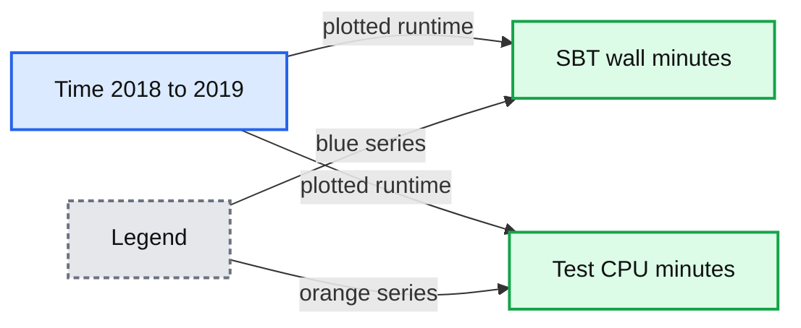
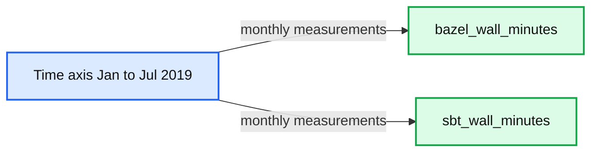
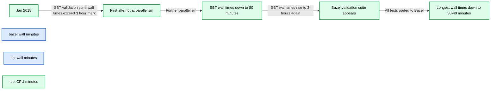

# Fast Parallel Testing at Databricks with Bazel

- Source: https://www.databricks.com/blog/2019/07/23/fast-parallel-testing-at-databricks-with-bazel.html
- Published: 2019-07-23
- Authors: Li Haoyi
- Categories: engineering, platform
- Images: 4 total, 4 extracted as architecture

The Databricks Developer Tools team recently completed a project to greatly speed up the pull-request (PR) validation workflows for many of our engineers: by massively parallelizing our tests, validation runs that previously took ~3 hours now complete in ~40 minutes. This blog post will dive into how we leveraged the Bazel build tool to achieve such a drastic speed up of the workflows many of our engineers go through day-to-day.

### Backstory

The Databricks codebase is split roughly into two large codebases:

- The *Runtime* codebase: our cloud optimized compute engine based on Apache Spark and Delta Lake, with additional scalability, reliability, and performance enhancements.
- The *Universe* codebase, which contains all our services, UI, deployment config, automation: everything necessary to turn the core compute engine into a Unified Analytics Platform.

For historical reasons, the two codebases were very different: different build tools, different test infrastructure, different engineers working on each. While they both started off as mostly
 Scala built using SBT, that too has diverged:

- Universe [swapped over to using Bazel back in 2016](https://youtu.be/wCkqtM44BvU?t=748), removing the SBT build entirely
- Runtime remained a mix of SBT and some peripheral tools (written in Python) to support testing the non-Scala portions of the codebase

From 2016 to 2019, the time taken to run the Runtime validation suite has hovered around the 2-3 hour mark. At Databricks we have all our historical CI data in a [Delta Lake](https://delta.io/), making it very easy to analyze this data using Databricks notebooks:

**Summary:** The chart compares SBT wall-clock runtime with test CPU runtime over time from 2018 through 2019.

**Components:**

- sbt_wall_minutes, measuring SBT wall-clock minutes
- test_cpu_minutes, measuring test CPU minutes
- Time axis, spanning 2018 to 2019

**Flows:**

- Time -> sbt_wall_minutes: plotted wall-clock runtime
- Time -> test_cpu_minutes: plotted test CPU runtime

**Numbers:** 200, 400, 600, 800 minutes; 2018; 2019; Jan, Apr, Jul, Oct, Jan, Apr



<sub>source image: https://www.databricks.com/wp-content/uploads/2019/07/SbtTimingRatio-1.png</sub>

As you can see, we managed to hold the total time taken for a validation run (`build_duration` , blue) to around 2-3 hours, even as the total time taken to run the tests themselves (`test_duration` , orange) had grown. This discrepancy is from running multiple suites in parallel, which means each validation run takes only 1/4 as long as it would have if we had run the tests serially.

In comparison, the Universe codebase built and tested using Bazel, of comparable size and complexity, has its validation suite run in the 30-60 minute range. The glacial slowness of the Runtime validation suite has been a constant thorn in the side of Databricks' engineers. It came up repeatedly in our regular developer productivity surveys, year after year after year:

Waiting for Jenkins to test Runtime PR takes a long time. It would be great if this could be at least partially parallelizable.

- 2017

Testing PRs, the tests don't run in parallel, and it's very slow.

- 2018

It sucks having to wait 3 hours for Jenkins to test my PR to runtime, only for a flaky test to ruin things in the end.

- 2019

In that 24 month period, at least a solid 6 months of engineer-time by a variety of individuals had been spent just holding the line. We were by this point running tests around 3-4 ways parallel, stopping the PR validation runs from ballooning to 10+ hours, but nevertheless were unable to make much headway against the 3-hour-long waits.

### Problems Parallelizing Runtime Tests

The fundamental reason we couldn't make more progress was the lack of test isolation. Many of the tests were written at a time where the test suite was run serially, and made assumptions that made them difficult to run in parallel:

- Accidental interference: some tests shared caches or scratch-folders.
 When run in parallel they would conflict with each other, messing with
 each others files.
- Accidental dependencies: Some tests implicitly relied on other tests
 having left caches or scratch-folders on disk. When run in the wrong
 order the pre-requisite files would be missing.

We had existing efforts to mitigate these problems - forking separate processes, running suites in separate working directories and assigning them separate scratch folders - but the non-deterministic nature of the failures made tracking them down and fixing them impossible.

We had made some attempts to configure the SBT build tool to run tests inside containers, but the SBT internals are complex and did not seem amenable to such a change.

### Bazel

While the Runtime validation suite was giving us issues, we had long ago moved the Universe codebase and validation suite over from SBT to Bazel, and were very happy with it. Bazel basically gives you three main things:

- Parallelism: any build steps that do not depend on each other are performed in parallel
- Caching: if the inputs to a build step do not change, the output is re-used. This cache can even be [shared across machines](https://docs.bazel.build/versions/main/remote-caching.html)
- Isolation: each build step is run in an isolated "[Sandbox](https://blog.bazel.build/2015/09/11/sandboxing.html)" environment by default, with access only to the files you explicitly give it

These three benefits apply equally to compiling your code and running tests. While the first two properties had given us [very fast build times](https://www.databricks.com/blog/2019/02/27/speedy-scala-builds-with-bazel-at-databricks.html) in the Universe codebase, the last property was just as important:

- Tests that accidentally shared the working directory would be given separate folders to work within, would no longer conflict, and succeed
- Tests that accidentally shared other filesystem contents - things outside their working directory - would fail reliably 100% of the time

Effectively, Bazel turns these build-related non-deterministic failures into either guaranteed successes or guaranteed failures. Both of these are a lot easier to deal with than nondeterministic heisenbugs!

### Bazelifying Runtime

We decided to set up a Bazel build for the Runtime codebase and migrate our test suites over to it.

As this took some amount of time, we kept the Bazel test suites live side-by-side with theexisting SBT test suites. We moved tests from the SBT suite to the Bazel suite one-by-one as the completeness of the Bazel build increased. Tweaking SBT to skip the tests that Bazel knew about was just a matter of shelling out to `bazel query` .

All the machinery for compiling/running/testing Scala code, dealing with Protobuf, JVM classpaths, etc. was all inherited directly from our Universe's Bazel configuration.

The first ~1200/1800 test suites we ported to Bazel passed out of the box. This left a long tail of 600 various failures. The major themes were:

- Broken tests, which were passing entirely-by-accident due to some property of the SBT build (e.g. one test only passed when run in the Pacific timezone, another test failed if the working directory path had too few characters)
- Different resolution of third-party dependencies from Maven Central between Bazel and SBT, resulting in different jars on the classpath
- Implicit file dependencies: Bazel's isolation means you have to give it an exhaustive list of any-and-all files that your test requires, and won't let you reach all over the filesystem to grab things unless you declare them in advance
- Conflicts over shared folders like the `~/.ivy2/cache`
- Bugs in our Bazel config: sometimes we simply got the list of inter-module dependencies wrong, missed environment variables, JVM flags, etc.
- Bugs in Bazel itself: it turns out Bazel very much does not like you calling a folder `external`/ , but that was easily solved by renaming it to something else!

Some of these issues were tricky to debug, causing mysterious failures deep inside unfamiliar parts of a massive codebase. But the fact that the failures were reproducible meant fixing them was actually possible! It was just a matter of putting in the time.

Here's the graph showing the number of tests in each of the old/SBT and new/Bazel PRvalidation suites, where we can clearly see the tests being moved from one to the other:

**Summary:** Line chart showing tests moving from the SBT suite to the Bazel suite between January and July 2019.

**Components:**

- bazel_num_tests: Bazel test suite
- sbt_num_tests: SBT test suite
- Time axis: January to July 2019
- Test-count axis: Counts in hundreds and thousands

**Flows:**

- SBT suite -> Bazel suite: Tests are transferred from SBT validation to Bazel validation

**Numbers:** 2019, 1.5k, 1k, 500, January, February, March, April, May, June, July

```text
%% mermaid failed to render; kept as text
%% Shows tests moving from the SBT suite to the Bazel suite over time
xychart-beta
    title "Bazel and SBT test counts"
    x-axis ["Jan 2019", "Feb", "Mar", "Apr", "May", "Jun", "Jul"]
    y-axis "Number of tests" 0 --> 2000
    line "bazel_num_tests" [none, none, none, none, 1300, 1200, 1800]
    line "sbt_num_tests" [1850, 1200, 1550, 1600, 1700, 250, 220]
```

<sub>source image: https://www.databricks.com/wp-content/uploads/2019/07/BazelSbtCount-1.png</sub>

All in all, it took about 2 months to burn down the 600 failures.

### Performance Numbers

As we moved tests from SBT to Bazel we could we could see SBT test time drop and Bazel test time grow. Here's those numbers in a Databricks notebook:

**Summary:** The chart compares Bazel and SBT wall-clock test times from January through July 2019 as tests moved between build systems.

**Components:**

- `bazel_wall_minutes` - Bazel test suite wall time
- `sbt_wall_minutes` - SBT test suite wall time
- Time axis - Monthly timeline from January to July 2019

**Flows:**

- Time axis -> `bazel_wall_minutes`: monthly measured wall time
- Time axis -> `sbt_wall_minutes`: monthly measured wall time

**Numbers:** 150, 100, 50, 2019



<sub>source image: https://www.databricks.com/wp-content/uploads/2019/07/BazelSbtTiming.png</sub>

Overall, SBT validation suite times dropped from ~180 minutes to ~30 minutes over the course of the project: after transferring all the tests, the only things left in that build were a full compile, and some miscellaneous lint rules that happen to be tied to the SBT build tool.

At the same time, we saw the Bazel build grow from 0 to end up taking about 40 minutes. Given that the first ~10 or so minutes is just compilation (which didn't change between Bazel and SBT), we're looking at about a 6x increase in parallelism, with ~150 minutes worth of SBT testing being compressed into ~20 minutes worth of testing under Bazel.

In order to best make use of Bazel's increased ability for parallelism, we run the Bazel test suites on powerful 96-core machines on EC2 ( `m5.24xlarge` ). While these machines areexpensive to keep running all the time (~40,000US$ a year, each!), the 40 minute duration of each test run gives us a per-run cost of 2-3$ each: a pretty reasonable monetary cost!

### Conclusion

The last two years of Runtime validation suite performance can be visualized via the following (somewhat long) Spark SQL query:

 

**Summary:** The chart shows Runtime validation suite performance over time, comparing Bazel wall minutes, SBT wall minutes, and test CPU minutes alongside parallelism milestones.

**Components:**

- bazel_wall_minutes
- sbt_wall_minutes
- test_cpu_minutes
- SBT validation suite
- Further parallelism
- Bazel validation suite
- All tests ported to Bazel

**Flows:**

- None visible.

**Numbers:**

- 200, 400, 600, 800
- Jan 2018
- Apr 2018
- Jul 2018
- Oct 2018
- Jan 2019
- Apr 2019
- Jul 2019
- 3 hour
- 80 minutes
- 3 hours
- 30-40 minutes



<sub>source image: https://www.databricks.com/wp-content/uploads/2019/07/CombinedAnnotated-1.png</sub>

Moving our Runtime validation suite from SBT to Bazel was a huge performance win. While previously an engineer would have to wait hours to see if their pull request was green (and even longer if it had a flaky failure!) now they only wait tens of minutes.

After spending literally years fighting SBT test performance, with only limited success, the dramatic improvement in the last 2 months makes us confident that Bazel will give us a stronger foundation to build upon in future. While the Bazel validation suite will inevitably grow in duration and need to be sped up, it should be much easier than trying to speed up the old SBT suites.

The Runtime Bazel build is also significantly more ergonomic than the old SBT + Pythonscripts setup: manual workflows no longer take more than a single step, e.g. `sbt package` needing to be run every time before `bin/shell` , or "Install R packages" before you run `R/run-tests` . With Bazel, you just run the command you want, and everything that needs to happen will happen automatically.

There's also the benefit of homogenizing our tooling:

- Engineers working on the two different codebases no longer have two different sets of build tools, local workflows, etc.
- Runtime engineers get to enjoy all the features and polish that the Universe engineers have had for a while: both Bazel features (Parallel builds, local caching, strong isolation) as well as Databricks-specific niceties (IDE integration, remote caching, selective testing, etc.)
- Any improvements our DevTools team makes to the Bazel build system now benefit twice as many engineers. For example, Bazel has support for running tests on a distributed execution cluster rather than a single machine, and this will let us take advantage of that in both our repositories.

If you're interested in working with these best-in-class developer tools, or want to join Databricks' DevTools team in pushing the frontiers of developer experience forward, [we are hiring](https://www.databricks.com/company/careers/open-positions)!
